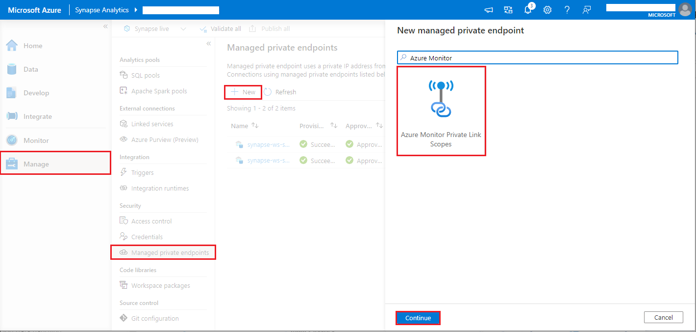
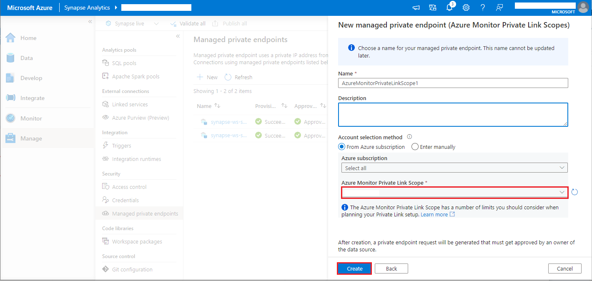

# Collect logs and metrics with Azure Log Analytics

This article describes how to use the Azure Log Analytics destination for Apache Spark diagnostics in Azure Synapse Analytics by using the Log Ingestion API.

Azure Synapse Apache Spark diagnostic emission provides a unified configuration model for collecting Spark diagnostics across supported destinations. For Azure Log Analytics, the Log Ingestion API is the recommended ingestion mechanism.

This article explains how to configure emitter properties, route Apache Spark logs, event logs, and metrics to Log Analytics, and query the ingested data for monitoring and troubleshooting purposes.

## Migrate from the Data Collector API

If you are currently using the HTTP Data Collector API in **Azure Synapse Analytics**, migrate to the **Log Ingestion API** to align with the latest Azure Monitor ingestion architecture and best practices.

Key changes in the new model:

- Schema definitions are explicitly defined through **Data Collection Rules (DCRs)**, providing predictable schema validation and more consistent query results compared to the previous free-form payload approach.
- Ingestion flow is routed through **Data Collection Endpoints (DCEs)** and DCR mappings, offering a more controlled and reliable ingestion path than posting data directly to the Data Collector API endpoint.
- Authentication supports both service principal with **client secret** and **certificate-based authentication**.
- The emitter type changes from ```AzureLogAnalytics``` to ```AzureLogIngestion```.
- Migration typically involves creating DCR and DCE resources, updating **Azure Synapse Apache Spark pool configurations** (for example, Spark configuration or diagnostic settings), and validating that data is successfully ingested into custom tables in **Azure Log Analytics**.

## Log Ingestion API overview

For Apache Spark diagnostics in **Azure Synapse Analytics**, the Log Ingestion API provides a structured ingestion model for authentication, schema definition, routing, and data delivery into **Azure Log Analytics**.

**Key components**

| Component | Purpose |
| --- | --- |
| App registration credentials | Provides Microsoft Entra app identity used to authenticate Log Ingestion API requests with either a client secret or certificate. |
| Log Analytics table | Provides the target custom table where ingested Spark diagnostics are stored for querying and monitoring. |
| Data Collection Rule (DCR) | Defines input streams, schema mapping, and optional transformations for ingestion. |
| Data Collection Endpoint (DCE) | Provides the ingestion endpoint URI (`dceUri`) used by clients to send data through DCR-based routing. |

Only user-created DCRs configured for Log Ingestion API can be used for programmatic ingestion.

## Step-by-step configuration

### Step 1. Prepare Log Analytics workspace

A Log Analytics workspace is required to receive Spark diagnostics. It's the basic storage and query unit for [Azure Monitor Logs](/azure/azure-monitor/logs/log-analytics-workspace-overview).

If you don't have one, [create a Log Analytics workspace in the Azure portal](https://portal.azure.com/#blade/Microsoft_OperationsManagementSuite_Workspace/CreateWorkspaceBladeV2).

> [!IMPORTANT]
> As you complete the following steps, create the Data Collection Endpoint (DCE) and Data Collection Rule (DCR) resources in the same region as the Log Analytics workspace.

### Step 2. Create a Data Collection Endpoint (DCE)

Create a Data Collection Endpoint (DCE) in the Azure portal. The DCE provides the endpoint URI that you configure in Spark properties for Log Ingestion API. The region of the DCE must be the same as the region of your Log Analytics workspace.

1. In the [**Azure portal**](https://portal.azure.com/#home), go to **Monitor** in the left navigation pane.
1. Under **Settings**, select **Data collection endpoints**, and then select **Create**.

   :::image type="content" source="media\data-collector-to-log-ingestion\create-a-data-collection-endpoint.png" alt-text="Screenshot showing create a data collection endpoint." lightbox="media\data-collector-to-log-ingestion\create-a-data-collection-endpoint.png":::

1. Create the endpoint, then note the DCE name (for example, `DCEdemo`).

### Step 3. Prepare sample JSON schema

When creating custom log tables, you must configure a Data Collection Rule (DCR). Based on the data stream definitions specified in the DCR, the system automatically generates the corresponding table schema in your Log Analytics workspace.

The following predefined JSON schema samples each map to a specific data type. Download the sample that fits your scenario, and upload it when you create the associated custom table and DCR.

- Spark event logs - [Event table JSON schema sample](https://tridentvscodeextension.z13.web.core.windows.net/diagnostics/SparkDiagnosticSampleConfig/synapse-sample-table-event-schema.json)
- Spark driver and executor logs - [Log table JSON schema sample](https://tridentvscodeextension.z13.web.core.windows.net/diagnostics/SparkDiagnosticSampleConfig/synapse-sample-table-log-schema.json)
- Spark metrics - [Metric table JSON schema sample](https://tridentvscodeextension.z13.web.core.windows.net/diagnostics/SparkDiagnosticSampleConfig/synapse-sample-table-metric-schema.json)

Here's an example log table JSON schema sample for Spark driver and executor logs in Azure Log Analytics. Use this schema as a reference when creating your custom tables and DCRs for log ingestion.


```json
[
  {
    "applicationId_s": "<APPLICATION_ID>",
    "applicationName_s": "<SPARK_APPLICATION_NAME>",

    "artifactType_s": "SynapseSparkJob",
    "sparkPoolName_s": "<SPARK_POOL_NAME>",
    "workspaceName_s": "<WORKSPACE_NAME>",

    "executorId_s": "driver",
    "executorMax_s": 9,
    "executorMin_s": 1,

    "category_s": "Log",

    "level_s": "INFO",
    "logger_name_s": "org.apache.spark.scheduler.ExecutorAllocationManager",
    "thread_name_s": "spark-listener-group-executorManagement",

    "message_s": "Executor 1 is removed.",

    "timeGenerated": "<TIME_GENERATED>",

    "jobId_s": "<JOB_ID>",
    "sessionId_s": "<SESSION_ID>",
    "userId_s": "<USER_ID>",

    "extraFields": {
      "category": "Log",
      "jobId": "<JOB_ID>"
    }
  }
]
```

### Step 4. Create custom table (Direct Ingest)

Create a custom table in your Log Analytics workspace with the Log Ingestion API option, and upload the JSON schema sample to the associated DCR. This step is required to set up the destination for Spark diagnostics and ensure that the ingested data conforms to the expected schema. The region of the Log Analytics workspace, DCE, and DCR must be the same for successful ingestion.

1. In the [**Azure portal**](https://portal.azure.com/#home), open your Log Analytics workspace (for example, *loganalyticsworkspacedemo*).
1. Select **Tables** > **Create** > **New custom log (Direct Ingest)**.

    :::image type="content" source="media\data-collector-to-log-ingestion\create-custom-table-direct-ingest.png" alt-text="Screenshot showing create custom table direct ingest." lightbox="media\data-collector-to-log-ingestion\create-custom-table-direct-ingest.png":::

1. Enter the table settings:
   - **Table name**: For example, SparkLogTest (suffix "_CL" is auto-added).
   - **Table Plan**: Analytics
   - **Data Collection Rule**: Create a new DCR (for example, *SparkLogTestrule*).
   - **Data Collection Endpoint**: Select the DCE from the [Create a Data Collection Endpoint (DCE) step](#step-2-create-a-data-collection-endpoint-dce) (for example, *DCEdemo*).

    :::image type="content" source="media\data-collector-to-log-ingestion\create-custom-table-direct-ingest-fill-in.png" alt-text="Screenshot showing create custom table direct ingest configure." lightbox="media\data-collector-to-log-ingestion\create-custom-table-direct-ingest-fill-in.png":::

1. Select **Next**.
1. In **Schema and Transformation**, upload [the JSON schema sample](#step-3-prepare-sample-json-schema). You don't need to configure DCR transformation because the schema is fully stabilized on the client side.

### Step 5. Prepare service principal for authentication

1. Register an app in **Microsoft Entra ID**.

   :::image type="content" source="media\data-collector-to-log-ingestion\tenant-client.png" alt-text="Screenshot showing tenantId and clientId." lightbox="media\data-collector-to-log-ingestion\tenant-client.png":::

1. Record the **TenantId**, **ClientId**, and **ClientSecret** (if you use client secret authentication). You use these values in the Spark configuration in Step 6.
1. Grant the app the [**Monitoring Metrics Publisher**](/azure/role-based-access-control/built-in-roles/monitor#monitoring-metrics-publisher) role on each table's DCR resource. For role assignment steps, see [Assign Azure roles using the Azure portal](/azure/role-based-access-control/role-assignments-portal).

   :::image type="content" source="media\data-collector-to-log-ingestion\monitoring-metrics-publisher-role.png" alt-text="Screenshot showing the Monitoring Metrics Publisher role assignment." lightbox="media\data-collector-to-log-ingestion\monitoring-metrics-publisher-role.png":::

### Step 6. Configure Spark properties

To configure Spark, create an Apache Spark Configuration in Azure Synapse Analytics and choose one of the following authentication options. Use only one option for a given emitter.

An Apache Spark Configuration in Azure Synapse Analytics stores Spark settings and libraries that notebooks and Spark job definitions use at runtime. For steps to create one, see [Manage Apache Spark configuration](./apache-spark-azure-create-spark-configuration.md).

- Choose Option 1 if you want a simpler setup by using a client secret.
- Choose Option 2 if your organization requires certificate-based authentication and centralized certificate management in Azure Key Vault.
- Choose Option 3 if you use certificate-based authentication and want to retrieve the certificate from Azure Key Vault through a Synapse linked service (workspace MSI accesses Key Vault).

In both options, you can select Add from .yml in the environment to import a .yml configuration file.

#### Option 1: Configure with service principal and client secret

Use this option for quick setup with service principal credentials and a client secret.

1. Create an Apache Spark configuration.

1. Add the following **Spark properties** with the appropriate values to the environment artifact, or select **Import** in the ribbon to download the [sample yaml file](), which already containing the required properties.

   ```properties
   spark.synapse.diagnostic.emitters: <EMITTER_NAME>
   spark.synapse.diagnostic.emitter.<EMITTER_NAME>.type: AzureLogIngestion
   spark.synapse.diagnostic.emitter.<EMITTER_NAME>.categories: DriverLog,ExecutorLog,EventLog,Metrics
   spark.synapse.diagnostic.emitter.<EMITTER_NAME>.dceUri: https://<DCE_NAME>.<REGION>.ingest.monitor.azure.com
   spark.synapse.diagnostic.emitter.<EMITTER_NAME>.logDcr: <LOG_DCR_ID>
   spark.synapse.diagnostic.emitter.<EMITTER_NAME>.logStream: <LOG_STREAM_NAME>
   spark.synapse.diagnostic.emitter.<EMITTER_NAME>.eventDcr: <EVENT_DCR_ID>
   spark.synapse.diagnostic.emitter.<EMITTER_NAME>.eventStream: <EVENT_STREAM_NAME>
   spark.synapse.diagnostic.emitter.<EMITTER_NAME>.metricDcr: <METRIC_DCR_ID>
   spark.synapse.diagnostic.emitter.<EMITTER_NAME>.metricStream: <METRIC_STREAM_NAME>
   spark.synapse.diagnostic.emitter.<EMITTER_NAME>.tenantId: <SP_TENANT_ID>
   spark.synapse.diagnostic.emitter.<EMITTER_NAME>.clientId: <SP_CLIENT_ID>
   spark.synapse.diagnostic.emitter.<EMITTER_NAME>.secret: <SP_CLIENT_SECRET>
   ```
1. Save and publish the changes.

#### Option 2: Configure with service principal certificate authentication

Use this option when your organization requires certificate-based authentication.

Before you start, ensure that your service principal is created with a certificate. For more information, see [Create a service principal containing a certificate using Azure CLI](/cli/azure/azure-cli-sp-tutorial-3).

1. Create an Apache Spark configuration.
1. Add the following **Spark properties** with the appropriate values to the environment artifact, or select **Import** in the ribbon to download the [sample yaml file](), which already containing the required properties.

   ```properties
   spark.synapse.diagnostic.emitters: "<EMITTER_NAME>"
   spark.synapse.diagnostic.emitter.<EMITTER_NAME>.type: "AzureLogIngestion"
   spark.synapse.diagnostic.emitter.<EMITTER_NAME>.categories: "DriverLog,ExecutorLog,EventLog,Metrics"
   spark.synapse.diagnostic.emitter.<EMITTER_NAME>.dceUri: "https://<DCE_NAME>.<REGION>.ingest.monitor.azure.com"
   spark.synapse.diagnostic.emitter.<EMITTER_NAME>.logDcr: "<LOG_DCR_ID>"
   spark.synapse.diagnostic.emitter.<EMITTER_NAME>.logStream: "<LOG_STREAM_NAME>"
   spark.synapse.diagnostic.emitter.<EMITTER_NAME>.eventDcr: "<EVENT_DCR_ID>"
   spark.synapse.diagnostic.emitter.<EMITTER_NAME>.eventStream: "<EVENT_STREAM_NAME>"
   spark.synapse.diagnostic.emitter.<EMITTER_NAME>.metricDcr: "<METRIC_DCR_ID>"
   spark.synapse.diagnostic.emitter.<EMITTER_NAME>.metricStream: "<METRIC_STREAM_NAME>"
   spark.synapse.diagnostic.emitter.<EMITTER_NAME>.tenantId: "<SP_TENANT_ID>"
   spark.synapse.diagnostic.emitter.<EMITTER_NAME>.clientId: "<SP_CLIENT_ID>"
   spark.synapse.diagnostic.emitter.<EMITTER_NAME>.certificate.keyVault: "https://<KEYVAULT_NAME>.vault.azure.net/"
   spark.synapse.diagnostic.emitter.<EMITTER_NAME>.certificate.keyVault.certificateName: "<SP_CERT_NAME>"
   ```
1. Save and publish changes.

#### Option 3: Configure with a linked service

> [!NOTE]
> In this option, you need to grant read secret permission to workspace managed identity. For more information, see [Provide access to Key Vault keys, certificates, and secrets with an Azure role-based access control](/azure/key-vault/general/rbac-guide).

To configure a Key Vault linked service in Synapse Studio to store the workspace key, follow these steps:

1. Follow all the steps in the preceding section, "Option 2."
1. Create a Key Vault linked service in Synapse Studio:

    a. Go to **Synapse Studio** > **Manage** > **Linked services**, and then select **New**.

    b. In the search box, search for **Azure Key Vault**.

    c. Enter a name for the linked service.

    d. Choose your key vault, and select **Create**.

1. Add a `spark.synapse.logAnalytics.keyVault.linkedServiceName` item to the Apache Spark configuration.
1. Add the following **Spark properties** with the appropriate values to the environment artifact, or select **Import** in the ribbon to download the [sample yaml file](), which already containing the required properties.

```properties
   spark.synapse.diagnostic.emitters: <EMITTER_NAME>
   spark.synapse.diagnostic.emitter.<EMITTER_NAME>.type: AzureLogIngestion
   spark.synapse.diagnostic.emitter.<EMITTER_NAME>.categories: DriverLog,ExecutorLog,EventLog,Metrics
   spark.synapse.diagnostic.emitter.<EMITTER_NAME>.dceUri: https://<DCE_NAME>.<REGION>.ingest.monitor.azure.com
   spark.synapse.diagnostic.emitter.<EMITTER_NAME>.logDcr: <LOG_DCR_ID>
   spark.synapse.diagnostic.emitter.<EMITTER_NAME>.logStream: <LOG_STREAM_NAME>
   spark.synapse.diagnostic.emitter.<EMITTER_NAME>.eventDcr: <EVENT_DCR_ID>
   spark.synapse.diagnostic.emitter.<EMITTER_NAME>.eventStream: <EVENT_STREAM_NAME>
   spark.synapse.diagnostic.emitter.<EMITTER_NAME>.metricDcr: <METRIC_DCR_ID>
   spark.synapse.diagnostic.emitter.<EMITTER_NAME>.metricStream: <METRIC_STREAM_NAME>
   spark.synapse.diagnostic.emitter.<EMITTER_NAME>.tenantId: <SP_TENANT_ID>
   spark.synapse.diagnostic.emitter.<EMITTER_NAME>.clientId: <SP_CLIENT_ID>
   spark.synapse.diagnostic.emitter.<EMITTER_NAME>.certificate.keyVault: https://<KEYVAULT_NAME>.vault.azure.net/
   spark.synapse.diagnostic.emitter.<EMITTER_NAME>.certificate.keyVault.certificateName: <SP_CERT_NAME>
   spark.synapse.diagnostic.emitter.<EMITTER_NAME>.certificate.keyVault.linkedService: <AZURE_KEY_VAULT_LINKED_SERVICE>
```

Alternatively, use the following properties:

```properties
spark.synapse.diagnostic.emitters LA
spark.synapse.diagnostic.emitter.LA.type: "AzureLogAnalytics"
spark.synapse.diagnostic.emitter.LA.categories: "Log,EventLog,Metrics"
spark.synapse.diagnostic.emitter.LA.workspaceId: <LOG_ANALYTICS_WORKSPACE_ID>
spark.synapse.diagnostic.emitter.LA.secret.keyVault: <AZURE_KEY_VAULT_NAME>
spark.synapse.diagnostic.emitter.LA.secret.keyVault.secretName: <AZURE_KEY_VAULT_SECRET_KEY_NAME>
spark.synapse.diagnostic.emitter.LA.secret.keyVault.linkedService: <AZURE_KEY_VAULT_LINKED_SERVICE>
```

For a list of Apache Spark configurations, see [Available Apache Spark configurations](../monitor-synapse-analytics-reference.md#available-apache-spark-configurations)


### Step 7. Attach the Apache Spark configuration to notebooks or Spark job definitions, or set it as the workspace default

Use one of the following approaches based on your scope:

- Attach the Apache Spark configuration to specific notebooks or Spark job definitions when you want targeted rollout, testing, or per-item control.
- Set the Apache Spark configuration as the workspace default when you want consistent Spark diagnostics settings applied across the workspace.

To apply the configuration to notebooks or Spark job definition:
1. Navigate to your notebook or Spark job definition in Azure Synapse Analytics Studio.
1. Select or configure the target Apache Spark pool associated with the notebook or Spark job definition.
1. Ensure the required Spark configurations (for example, Log Ingestion settings) are applied to the Apache Spark pool or session.
1. Start or run the Spark session for the configuration to take effect.


To configure the settings at the workspace or Apache Spark pool level:

1. Navigate to Manage in Azure Synapse Studio.
1. Go to Apache Spark pools and select the target Apache Spark pool.
1. Configure the required Spark settings (for example, diagnostics or log ingestion-related properties).
1. Save the configuration. The settings will apply to all new Spark sessions created in this pool.

### Step 8. Submit an Apache Spark application and view the logs and metrics

Here's how:

1. Submit an Apache Spark application to the Apache Spark pool configured in the previous step. You can use any of the following ways to do so:

   - Run a notebook in Synapse Studio.
   - In Synapse Studio, submit an Apache Spark batch job through an Apache Spark job definition.
   - Run a pipeline that contains Apache Spark activity.

1. Go to the specified Log Analytics workspace, and then view the application metrics and logs when the Apache Spark application starts to run.

## Write custom application logs

You can use the Apache Log4j library to write custom logs.

Example for Scala:

```scala
%%spark
val logger = org.apache.log4j.LogManager.getLogger("com.contoso.LoggerExample")
logger.info("info message")
logger.warn("warn message")
logger.error("error message")
//log exception
try {
      1/0
 } catch {
      case e:Exception =>logger.warn("Exception", e)
}
// run job for task level metrics
val data = sc.parallelize(Seq(1,2,3,4)).toDF().count()
```

Example for PySpark:

```python
%%pyspark
logger = sc._jvm.org.apache.log4j.LogManager.getLogger("com.contoso.PythonLoggerExample")
logger.info("info message")
logger.warn("warn message")
logger.error("error message")
```

## Query data with Kusto

The following is an example of querying Apache Spark events:

```kusto
SparkEventTest_CL
| where fabricWorkspaceId_g == "{FabricWorkspaceId}" and artifactId_g == "{ArtifactId}" and fabricLivyId_g == "{LivyId}"
| order by TimeGenerated desc
| limit 100
```

Here's an example of querying the Apache Spark application driver and executors logs:

```kusto
SparkLogTest_CL
| where fabricWorkspaceId_g == "{FabricWorkspaceId}" and artifactId_g == "{ArtifactId}" and fabricLivyId_g == "{LivyId}"
| order by TimeGenerated desc
| limit 100
```

And here's an example of querying Apache Spark metrics:

```kusto
SparkMetricsTest_CL
| where fabricWorkspaceId_g == "{FabricWorkspaceId}" and artifactId_g == "{ArtifactId}" and fabricLivyId_g == "{LivyId}"
| where name_s endswith "jvm.total.used"
| summarize max(value_d) by bin(TimeGenerated, 30s), executorId_s
| order by TimeGenerated asc
```

## Create and manage alerts

Users can query to evaluate metrics and logs at a set frequency, and fire an alert based on the results. For more information, see [Create, view, and manage log alerts by using Azure Monitor](/azure/azure-monitor/alerts/alerts-log).

## Synapse workspace with data exfiltration protection enabled

After the Synapse workspace is created with [data exfiltration protection](../security/workspace-data-exfiltration-protection.md) enabled.

When you want to enable this feature, you need to create managed private endpoint connection requests to [Azure Monitor private link scopes (AMPLS)](/azure/azure-monitor/logs/private-link-security) in the workspace’s approved Microsoft Entra tenants.

You can follow below steps to create a managed private endpoint connection to Azure Monitor private link scopes (AMPLS):

1. If there's no existing AMPLS, you can follow [Azure Monitor Private Link connection setup](/azure/azure-monitor/logs/private-link-security) to create one.
1. Navigate to your AMPLS in Azure portal, on the **Azure Monitor Resources** page, select **Add** to add connection to your Azure Log Analytics workspace.
1. Navigate to **Synapse Studio > Manage > Managed private endpoints**, select **New** button, select **Azure Monitor Private Link Scopes**, and **continue**.
   > [!div class="mx-imgBorder"]
   > 
1. Choose your Azure Monitor Private Link Scope you created, and select **Create** button.
   > [!div class="mx-imgBorder"]
   > 
1. Wait a few minutes for private endpoint provisioning.
1. Navigate to your AMPLS in Azure portal again, on the **Private Endpoint connections** page, select the connection provisioned and **Approve**.

> [!NOTE]
>  - The AMPLS object has many limits you should consider when planning your Private Link setup. See [AMPLS limits](/azure/azure-monitor/logs/private-link-security) for a deeper review of these limits. 
>  - Check if you have [right permission](../security/synapse-workspace-access-control-overview.md) to create managed private endpoint.

## Available configurations

| Configuration | Description |
|---|---|
| `spark.synapse.diagnostic.emitters` | The comma-separated destination names of diagnostic emitters. For example, `MyDest1,MyDest2`. |
| `spark.synapse.diagnostic.emitter.<EMITTER_NAME>.type` | Built-in destination type. To enable Azure Log Analytics via Log Ingestion API, set this value to `AzureLogIngestion`. |
| `spark.synapse.diagnostic.emitter.<EMITTER_NAME>.categories` | The comma-separated selected log categories. Available values include `DriverLog`, `ExecutorLog`, `EventLog`, `Metrics`. If not set, the default value is all categories. |
| `spark.synapse.diagnostic.emitter.<EMITTER_NAME>.dceUri` | The Data Collection Endpoint (DCE) URI used for ingestion when routing data via Data Collection Rules (DCRs). |
| `spark.synapse.diagnostic.emitter.<EMITTER_NAME>.logDcr` | The Data Collection Rule (DCR) resource ID used to route Spark logs to the destination. |
| `spark.synapse.diagnostic.emitter.<EMITTER_NAME>.logStream` | The stream name defined in the Data Collection Rule (DCR) for Spark logs. |
| `spark.synapse.diagnostic.emitter.<EMITTER_NAME>.eventDcr` | The Data Collection Rule (DCR) resource ID used to route Spark event logs. |
| `spark.synapse.diagnostic.emitter.<EMITTER_NAME>.eventStream` | The stream name defined in the Data Collection Rule (DCR) for Spark event logs. |
| `spark.synapse.diagnostic.emitter.<EMITTER_NAME>.metricDcr` | The Data Collection Rule (DCR) resource ID used to route Spark metrics. |
| `spark.synapse.diagnostic.emitter.<EMITTER_NAME>.metricStream` | The stream name defined in the Data Collection Rule (DCR) for Spark metrics. |
| `spark.synapse.diagnostic.emitter.<EMITTER_NAME>.tenantId` | The Microsoft Entra tenant ID used for authentication. |
| `spark.synapse.diagnostic.emitter.<EMITTER_NAME>.clientId` | The client (application) ID registered in Microsoft Entra ID. |
| `spark.synapse.diagnostic.emitter.<EMITTER_NAME>.secret` | The client secret associated with the Microsoft Entra ID application, used together with the tenant ID and client ID to authenticate the emitter when sending diagnostic data. This setting is mutually exclusive with certificate-based authentication—configure either the client secret or the certificate, but not both. |
| `spark.synapse.diagnostic.emitter.<EMITTER_NAME>.certificate.keyVault` | The Azure Key Vault URI that stores the authentication certificate. |
| `spark.synapse.diagnostic.emitter.<EMITTER_NAME>.certificate.keyVault.certificateName` | The name of the certificate stored in Azure Key Vault, used for authentication. |
| `spark.synapse.diagnostic.emitter.<EMITTER_NAME>.certificate.keyVault.linkedService` | The Azure Key Vault linked service name in Synapse. When specified, the workspace managed identity uses this linked service to retrieve the certificate from Azure Key Vault. |
| `spark.synapse.diagnostic.emitter.<EMITTER_NAME>.filter.eventName.match` | The comma-separated Spark listener event names; you can specify which events to collect. For example, `SparkListenerApplicationStart,SparkListenerApplicationEnd`. |
| `spark.synapse.diagnostic.emitter.<EMITTER_NAME>.filter.loggerName.match` | The comma-separated Log4j logger names; you can specify which logs to collect. For example, `org.apache.spark.SparkContext,org.example.Logger`. |
| `spark.synapse.diagnostic.emitter.<EMITTER_NAME>.filter.metricName.match` | The comma-separated Spark metric name suffixes; you can specify which metrics to collect. For example, `jvm.heap.used`. |

> [!NOTE]
> Authentication is mutually exclusive: configure **one** of `secret` (plain text) or `certificate.keyVault` + `certificate.keyVault.certificateName` (optionally with `certificate.keyVault.linkedService`).
> Retrieving the client `secret` from Azure Key Vault (with or without a linked service) is **not supported** by the Log Ingestion destination. If you need to keep credentials in Key Vault, use the certificate-based path.

## Related content

- [Legacy HTTP Data Collector API path for Azure Log Analytics](./apache-spark-azure-log-analytics.md)
- [Run a Spark application in notebook](./apache-spark-development-using-notebooks.md).
- [Collect Apache Spark applications logs and metrics with Azure Storage account](./azure-synapse-diagnostic-emitters-azure-storage.md).
- [Collect Apache Spark applications logs and metrics with Azure Event Hubs](./azure-synapse-diagnostic-emitters-azure-eventhub.md).
