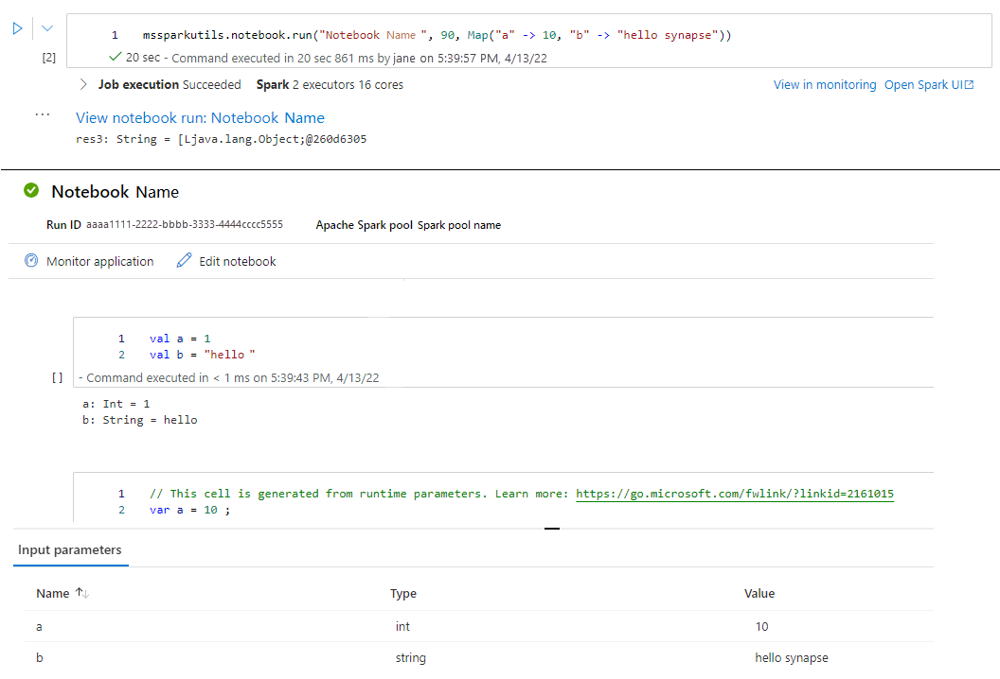

# Introduction to Microsoft Spark Utilities

Microsoft Spark Utilities (MSSparkUtils) is a builtin package to help you easily perform common tasks. You can use MSSparkUtils to work with file systems, to get environment variables, to chain notebooks together, and to work with secrets. MSSparkUtils are available in `PySpark (Python)`, `Scala`, `.NET Spark (C#)`, and `R (Preview)` notebooks and Synapse pipelines.

## Pre-requisites

### Configure access to Azure Data Lake Storage Gen2

Synapse notebooks use Microsoft Entra pass-through to access the ADLS Gen2 accounts. You need to be a **Storage Blob Data Contributor** to access the ADLS Gen2 account (or folder).

Synapse pipelines use workspace's Managed Service Identity (MSI) to access the storage accounts. To use MSSparkUtils in your pipeline activities, your workspace identity needs to be **Storage Blob Data Contributor** to access the ADLS Gen2 account (or folder).

Follow these steps to make sure your Microsoft Entra ID and workspace MSI have access to the ADLS Gen2 account:

1. Open the [Azure portal](https://portal.azure.com/) and the storage account you want to access. You can navigate to the specific container you want to access.

1. Select the **Access control (IAM)** from the left panel.

1. Select **Add** > **Add role assignment** to open the Add role assignment page.

1. Assign the following role. For detailed steps, see [Assign Azure roles using the Azure portal](../../role-based-access-control/role-assignments-portal.md).

    | Setting | Value |
    | --- | --- |
    | Role | Storage Blob Data Contributor |
    | Assign access to | USER and MANAGEDIDENTITY |
    | Members | your Microsoft Entra account and your workspace identity |

    > [!NOTE]
    > The managed identity name is also the workspace name.

    

1. Select **Save**.

You can access data on ADLS Gen2 with Synapse Spark via the following URL:

`abfss://<container_name>@<storage_account_name>.dfs.core.windows.net/<path>`

### Configure access to Azure Blob Storage

Synapse uses [**Shared access signature (SAS)**](../../storage/common/storage-sas-overview.md) to access Azure Blob Storage. To avoid exposing SAS keys in the code, we recommend creating a new linked service in Synapse workspace to the Azure Blob Storage account you want to access.

Follow these steps to add a new linked service for an Azure Blob Storage account:

1. Open the [Azure Synapse Studio](https://web.azuresynapse.net/).
2. Select **Manage** from the left panel and select **Linked services** under the **External connections**.
3. Search **Azure Blob Storage** in the **New linked Service** panel on the right.
4. Select **Continue**.
5. Select the Azure Blob Storage Account to access and configure the linked service name. Suggest using **Account key** for the **Authentication method**.
6. Select **Test connection** to validate the settings are correct.
7. Select **Create** first and click **Publish all** to save your changes.

You can access data on Azure Blob Storage with Synapse Spark via following URL:

`wasb[s]://<container_name>@<storage_account_name>.blob.core.windows.net/<path>`

Here is a code example:

:::zone pivot = "programming-language-python"

```python
from pyspark.sql import SparkSession

# Azure storage access info
blob_account_name = 'Your account name' # replace with your blob name
blob_container_name = 'Your container name' # replace with your container name
blob_relative_path = 'Your path' # replace with your relative folder path
linked_service_name = 'Your linked service name' # replace with your linked service name

blob_sas_token = mssparkutils.credentials.getConnectionStringOrCreds(linked_service_name)

# Allow SPARK to access from Blob remotely

wasb_path = 'wasbs://%s@%s.blob.core.windows.net/%s' % (blob_container_name, blob_account_name, blob_relative_path)

spark.conf.set('fs.azure.sas.%s.%s.blob.core.windows.net' % (blob_container_name, blob_account_name), blob_sas_token)
print('Remote blob path: ' + wasb_path)
```

::: zone-end

:::zone pivot = "programming-language-scala"

```scala
val blob_account_name = "" // replace with your blob name
val blob_container_name = "" //replace with your container name
val blob_relative_path = "/" //replace with your relative folder path
val linked_service_name = "" //replace with your linked service name


val blob_sas_token = mssparkutils.credentials.getConnectionStringOrCreds(linked_service_name)

val wasbs_path = f"wasbs://$blob_container_name@$blob_account_name.blob.core.windows.net/$blob_relative_path"
spark.conf.set(f"fs.azure.sas.$blob_container_name.$blob_account_name.blob.core.windows.net",blob_sas_token)

```

::: zone-end

:::zone pivot = "programming-language-csharp"

```csharp
var blob_account_name = "";  // replace with your blob name
var blob_container_name = "";     // replace with your container name
var blob_relative_path = "";  // replace with your relative folder path
var linked_service_name = "";    // replace with your linked service name
var blob_sas_token = Credentials.GetConnectionStringOrCreds(linked_service_name);

spark.Conf().Set($"fs.azure.sas.{blob_container_name}.{blob_account_name}.blob.core.windows.net", blob_sas_token);

var wasbs_path = $"wasbs://{blob_container_name}@{blob_account_name}.blob.core.windows.net/{blob_relative_path}";

Console.WriteLine(wasbs_path);

```

::: zone-end

:::zone pivot = "programming-language-r"

```r
# Azure storage access info
blob_account_name <- 'Your account name' # replace with your blob name
blob_container_name <- 'Your container name' # replace with your container name
blob_relative_path <- 'Your path' # replace with your relative folder path
linked_service_name <- 'Your linked service name' # replace with your linked service name

blob_sas_token <- mssparkutils.credentials.getConnectionStringOrCreds(linked_service_name)

# Allow SPARK to access from Blob remotely
sparkR.session()
wasb_path <- sprintf('wasbs://%s@%s.blob.core.windows.net/%s',blob_container_name, blob_account_name, blob_relative_path)
sparkR.session(sprintf('fs.azure.sas.%s.%s.blob.core.windows.net',blob_container_name, blob_account_name), blob_sas_token)

print( paste('Remote blob path: ',wasb_path))
```

::: zone-end

### Configure access to Azure Key Vault

You can add an Azure Key Vault as a linked service to manage your credentials in Synapse.
Follow these steps to add an Azure Key Vault as a Synapse linked service:

1. Open the [Azure Synapse Studio](https://web.azuresynapse.net/).

2. Select **Manage** from the left panel and select **Linked services** under the **External connections**.

3. Search **Azure Key Vault** in the **New linked Service** panel on the right.

4. Select the Azure Key Vault Account to access and configure the linked service name.

5. Select **Test connection** to validate the settings are correct.

6. Select **Create** first and click **Publish all** to save your change.

Synapse notebooks use Microsoft Entra pass-through to access Azure Key Vault. Synapse pipelines use workspace identity(MSI) to access Azure Key Vault. To make sure your code work both in notebook and in Synapse pipeline, we recommend granting secret access permission for both your Microsoft Entra account and workspace identity.

Follow these steps to grant secret access to your workspace identity:
1. Open the [Azure portal](https://portal.azure.com/) and the Azure Key Vault you want to access.
2. Select the **Access policies** from the left panel.
3. Select **Add Access Policy**:
    - Choose **Key, Secret, & Certificate Management** as config template.
    - Select **your Microsoft Entra account** and **your workspace identity** (same as your workspace name) in the select principal or make sure it is already assigned.
4. Select **Select** and **Add**.
5. Select the **Save** button to commit changes.

## File system utilities

`mssparkutils.fs` provides utilities for working with various file systems, including Azure Data Lake Storage Gen2 (ADLS Gen2) and Azure Blob Storage. Make sure you configure access to [Azure Data Lake Storage Gen2](#configure-access-to-azure-data-lake-storage-gen2) and [Azure Blob Storage](#configure-access-to-azure-blob-storage) appropriately.

Run the following commands for an overview of the available methods:

:::zone pivot = "programming-language-python"

```python
from notebookutils import mssparkutils
mssparkutils.fs.help()
```

::: zone-end

:::zone pivot = "programming-language-scala"

```scala
mssparkutils.fs.help()
```

::: zone-end

:::zone pivot = "programming-language-csharp"

```csharp
using Microsoft.Spark.Extensions.Azure.Synapse.Analytics.Notebook.MSSparkUtils;
FS.Help()
```

::: zone-end

:::zone pivot = "programming-language-r"

```r
library(notebookutils)
mssparkutils.fs.help()
```

::: zone-end

Results in:
```

mssparkutils.fs provides utilities for working with various FileSystems.

Below is overview about the available methods:

cp(from: String, to: String, recurse: Boolean = false): Boolean -> Copies a file or directory, possibly across FileSystems
mv(from: String, to: String, recurse: Boolean = false): Boolean -> Moves a file or directory, possibly across FileSystems
ls(dir: String): Array -> Lists the contents of a directory
mkdirs(dir: String): Boolean -> Creates the given directory if it does not exist, also creating any necessary parent directories
put(file: String, contents: String, overwrite: Boolean = false): Boolean -> Writes the given String out to a file, encoded in UTF-8
head(file: String, maxBytes: int = 1024 * 100): String -> Returns up to the first 'maxBytes' bytes of the given file as a String encoded in UTF-8
append(file: String, content: String, createFileIfNotExists: Boolean): Boolean -> Append the content to a file
rm(dir: String, recurse: Boolean = false): Boolean -> Removes a file or directory

Use mssparkutils.fs.help("methodName") for more info about a method.

```

### List files

List the content of a directory.


:::zone pivot = "programming-language-python"

```python
mssparkutils.fs.ls('Your directory path')
```

::: zone-end

:::zone pivot = "programming-language-scala"

```scala
mssparkutils.fs.ls("Your directory path")
```
::: zone-end

:::zone pivot = "programming-language-csharp"

```csharp
FS.Ls("Your directory path")
```

::: zone-end

:::zone pivot = "programming-language-r"

```r
mssparkutils.fs.ls("Your directory path")
```

::: zone-end


### View file properties

Returns file properties including file name, file path, file size, file modification time, and whether it is a directory and a file.

:::zone pivot = "programming-language-python"

```python
files = mssparkutils.fs.ls('Your directory path')
for file in files:
    print(file.name, file.isDir, file.isFile, file.path, file.size, file.modifyTime)
```
::: zone-end

:::zone pivot = "programming-language-scala"

```scala
val files = mssparkutils.fs.ls("/")
files.foreach{
    file => println(file.name,file.isDir,file.isFile,file.size,file.modifyTime)
}
```

::: zone-end

:::zone pivot = "programming-language-csharp"

```csharp
var Files = FS.Ls("/");
foreach(var File in Files) {
    Console.WriteLine(File.Name+" "+File.IsDir+" "+File.IsFile+" "+File.Size);
}
```

::: zone-end

:::zone pivot = "programming-language-r"

```r
files <- mssparkutils.fs.ls("/")
for (file in files) {
    writeLines(paste(file$name, file$isDir, file$isFile, file$size, file$modifyTime))
}
```

::: zone-end

### Create new directory

Creates the given directory if it does not exist and any necessary parent directories.

:::zone pivot = "programming-language-python"

```python
mssparkutils.fs.mkdirs('new directory name')
```
::: zone-end

:::zone pivot = "programming-language-scala"

```scala
mssparkutils.fs.mkdirs("new directory name")
```

::: zone-end

:::zone pivot = "programming-language-csharp"

```csharp
FS.Mkdirs("new directory name")
```

::: zone-end

:::zone pivot = "programming-language-r"

```r
mssparkutils.fs.mkdirs("new directory name")
```

::: zone-end

### Copy file

Copies a file or directory. Supports copy across file systems.

:::zone pivot = "programming-language-python"

```python
mssparkutils.fs.cp('source file or directory', 'destination file or directory', True)# Set the third parameter as True to copy all files and directories recursively
```
::: zone-end

:::zone pivot = "programming-language-scala"

```scala
mssparkutils.fs.cp("source file or directory", "destination file or directory", true) // Set the third parameter as True to copy all files and directories recursively
```
::: zone-end

:::zone pivot = "programming-language-csharp"

```csharp
FS.Cp("source file or directory", "destination file or directory", true) // Set the third parameter as True to copy all files and directories recursively
```
::: zone-end

:::zone pivot = "programming-language-r"

```r
mssparkutils.fs.cp('source file or directory', 'destination file or directory', True)
```
::: zone-end

### Preview file content

Returns up to the first 'maxBytes' bytes of the given file as a String encoded in UTF-8.

:::zone pivot = "programming-language-python"

```python
mssparkutils.fs.head('file path', maxBytes to read)
```
::: zone-end

:::zone pivot = "programming-language-scala"

```scala
mssparkutils.fs.head("file path", maxBytes to read)
```

::: zone-end

:::zone pivot = "programming-language-csharp"

```csharp
FS.Head("file path", maxBytes to read)
```

::: zone-end

:::zone pivot = "programming-language-r"

```r
mssparkutils.fs.head('file path', maxBytes to read)
```
::: zone-end

### Move file

Moves a file or directory. Supports move across file systems.

:::zone pivot = "programming-language-python"

```python
mssparkutils.fs.mv('source file or directory', 'destination directory', True) # Set the last parameter as True to firstly create the parent directory if it does not exist
```
::: zone-end

:::zone pivot = "programming-language-scala"

```scala
mssparkutils.fs.mv("source file or directory", "destination directory", true) // Set the last parameter as True to firstly create the parent directory if it does not exist
```

::: zone-end

:::zone pivot = "programming-language-csharp"

```csharp
FS.Mv("source file or directory", "destination directory", true)
```

::: zone-end

:::zone pivot = "programming-language-r"

```r
mssparkutils.fs.mv('source file or directory', 'destination directory', True) # Set the last parameter as True to firstly create the parent directory if it does not exist
```
::: zone-end

### Write file

Writes the given string out to a file, encoded in UTF-8.

:::zone pivot = "programming-language-python"

```python
mssparkutils.fs.put("file path", "content to write", True) # Set the last parameter as True to overwrite the file if it existed already
```
::: zone-end

:::zone pivot = "programming-language-scala"

```scala
mssparkutils.fs.put("file path", "content to write", true) // Set the last parameter as True to overwrite the file if it existed already
```

::: zone-end

:::zone pivot = "programming-language-csharp"

```csharp
FS.Put("file path", "content to write", true) // Set the last parameter as True to overwrite the file if it existed already
```

::: zone-end

:::zone pivot = "programming-language-r"

```r
mssparkutils.fs.put("file path", "content to write", True) # Set the last parameter as True to overwrite the file if it existed already
```
::: zone-end

### Append content to a file

Appends the given string to a file, encoded in UTF-8.

:::zone pivot = "programming-language-python"

```python
mssparkutils.fs.append("file path", "content to append", True) # Set the last parameter as True to create the file if it does not exist
```
::: zone-end

:::zone pivot = "programming-language-scala"

```scala
mssparkutils.fs.append("file path","content to append",true) // Set the last parameter as True to create the file if it does not exist
```

::: zone-end

:::zone pivot = "programming-language-csharp"

```csharp
FS.Append("file path", "content to append", true) // Set the last parameter as True to create the file if it does not exist
```

::: zone-end

:::zone pivot = "programming-language-r"

```r
mssparkutils.fs.append("file path", "content to append", True) # Set the last parameter as True to create the file if it does not exist
```
::: zone-end

### Delete file or directory

Removes a file or a directory.

:::zone pivot = "programming-language-python"

```python
mssparkutils.fs.rm('file path', True) # Set the last parameter as True to remove all files and directories recursively
```
::: zone-end

:::zone pivot = "programming-language-scala"

```scala
mssparkutils.fs.rm("file path", true) // Set the last parameter as True to remove all files and directories recursively
```

::: zone-end

:::zone pivot = "programming-language-csharp"

```csharp
FS.Rm("file path", true) // Set the last parameter as True to remove all files and directories recursively
```

::: zone-end

:::zone pivot = "programming-language-r"

```r
mssparkutils.fs.rm('file path', True) # Set the last parameter as True to remove all files and directories recursively
```
::: zone-end

## Notebook utilities

:::zone pivot = "programming-language-csharp"

Not supported.

::: zone-end

:::zone pivot = "programming-language-python"

You can use the MSSparkUtils Notebook Utilities to run a notebook or exit a notebook with a value.
Run the following command to get an overview of the available methods:

```python
mssparkutils.notebook.help()
```

Get results:
```
The notebook module.

exit(value: String): void -> This method lets you exit a notebook with a value.
run(path: String, timeoutSeconds: int, arguments: Map): String -> This method runs a notebook and returns its exit value.

```

### Reference a notebook
Reference a notebook and returns its exit value. You can run nesting function calls in a notebook interactively or in a pipeline. The notebook being referenced will run on the Spark pool of which notebook calls this function.

```python

mssparkutils.notebook.run("notebook path", <timeoutSeconds>, <parameterMap>)

```

For example:

```python
mssparkutils.notebook.run("folder/Sample1", 90, {"input": 20 })
```

After the run finished, you will see a snapshot link named '**View notebook run: *Notebook Name***'  shown in the cell output, you can click the link to see the snapshot for this specific run.


### Exit a notebook
Exits a notebook with a value. You can run nesting function calls in a notebook interactively or in a pipeline.

- When you call an *exit()* function from a notebook interactively, Azure Synapse will throw an exception, skip running subsequence cells, and keep the Spark session alive.

- When you orchestrate a notebook that calls an `exit()` function in a Synapse pipeline, Azure Synapse will return an exit value, complete the pipeline run, and stop the Spark session.

- When you call an `exit()` function in a notebook being referenced, Azure Synapse will stop the further execution in the notebook being referenced, and continue to run next cells in the notebook that call the `run()` function. For example: Notebook1 has three cells and calls an `exit()` function in the second cell. Notebook2 has five cells and calls `run(notebook1)` in the third cell. When you run Notebook2, Notebook1 will be stopped at the second cell when hitting the `exit()` function. Notebook2 will continue to run its fourth cell and fifth cell.


```python
mssparkutils.notebook.exit("value string")
```

For example:

**Sample1** notebook locates under **folder/** with following two cells:
- cell 1 defines an **input** parameter with default value set to 10.
- cell 2 exits the notebook with **input** as exit value.


You can run the **Sample1** in another notebook with default values:

```python

exitVal = mssparkutils.notebook.run("folder/Sample1")
print (exitVal)

```
Results in:

```
Sample1 run success with input is 10
```

You can run the **Sample1** in another notebook and set the **input** value as 20:

```python
exitVal = mssparkutils.notebook.run("mssparkutils/folder/Sample1", 90, {"input": 20 })
print (exitVal)
```

Results in:

```
Sample1 run success with input is 20
```
::: zone-end

:::zone pivot = "programming-language-scala"

You can use the MSSparkUtils Notebook Utilities to run a notebook or exit a notebook with a value.
Run the following command to get an overview of the available methods:

```scala
mssparkutils.notebook.help()
```

Get results:
```
The notebook module.

exit(value: String): void -> This method lets you exit a notebook with a value.
run(path: String, timeoutSeconds: int, arguments: Map): String -> This method runs a notebook and returns its exit value.

```

### Reference a notebook
Reference a notebook and returns its exit value. You can run nesting function calls in a notebook interactively or in a pipeline. The notebook being referenced will run on the Spark pool of which notebook calls this function.

```scala

mssparkutils.notebook.run("notebook path", <timeoutSeconds>, <parameterMap>)

```

For example:

```scala
mssparkutils.notebook.run("folder/Sample1", 90, Map("input" -> 20))
```

After the run finished, you will see a snapshot link named '**View notebook run: *Notebook Name***'  shown in the cell output, you can click the link to see the snapshot for this specific run.




### Exit a notebook
Exits a notebook with a value. You can run nesting function calls in a notebook interactively or in a pipeline.

- When you call an `exit()` function a notebook interactively, Azure Synapse will throw an exception, skip running subsequence cells, and keep Spark session alive.

- When you orchestrate a notebook that calls an `exit()` function in a Synapse pipeline, Azure Synapse will return an exit value, complete the pipeline run, and stop the Spark session.

- When you call an `exit()` function in a notebook being referenced, Azure Synapse will stop the further execution in the notebook being referenced, and continue to run next cells in the notebook that call the `run()` function. For example: Notebook1 has three cells and calls an `exit()` function in the second cell. Notebook2 has five cells and calls `run(notebook1)` in the third cell. When you run Notebook2, Notebook1 will be stopped at the second cell when hitting the `exit()` function. Notebook2 will continue to run its fourth cell and fifth cell.


```python
mssparkutils.notebook.exit("value string")
```

For example:

**Sample1** notebook locates under **mssparkutils/folder/** with following two cells:
- cell 1 defines an **input** parameter with default value set to 10.
- cell 2 exits the notebook with **input** as exit value.


You can run the **Sample1** in another notebook with default values:

```scala

val exitVal = mssparkutils.notebook.run("mssparkutils/folder/Sample1")
print(exitVal)

```
Results in:

```
exitVal: String = Sample1 run success with input is 10
Sample1 run success with input is 10
```


You can run the **Sample1** in another notebook and set the **input** value as 20:

```scala
val exitVal = mssparkutils.notebook.run("mssparkutils/folder/Sample1", 90, {"input": 20 })
print(exitVal)
```

Results in:

```
exitVal: String = Sample1 run success with input is 20
Sample1 run success with input is 20
```
::: zone-end

:::zone pivot = "programming-language-r"

You can use the MSSparkUtils Notebook Utilities to run a notebook or exit a notebook with a value.
Run the following command to get an overview of the available methods:

```r
mssparkutils.notebook.help()
```

Get results:
```
The notebook module.

exit(value: String): void -> This method lets you exit a notebook with a value.
run(path: String, timeoutSeconds: int, arguments: Map): String -> This method runs a notebook and returns its exit value.

```

### Reference a notebook

Reference a notebook and returns its exit value. You can run nesting function calls in a notebook interactively or in a pipeline. The notebook being referenced will run on the Spark pool of which notebook calls this function.

```r

mssparkutils.notebook.run("notebook path", <timeoutSeconds>, <parameterMap>)

```

For example:

```r
mssparkutils.notebook.run("folder/Sample1", 90, list("input": 20))
```

After the run finished, you will see a snapshot link named '**View notebook run: *Notebook Name***'  shown in the cell output, you can click the link to see the snapshot for this specific run.


### Exit a notebook

Exits a notebook with a value. You can run nesting function calls in a notebook interactively or in a pipeline.

- When you call an `exit()` function a notebook interactively, Azure Synapse will throw an exception, skip running subsequence cells, and keep Spark session alive.

- When you orchestrate a notebook that calls an `exit()` function in a Synapse pipeline, Azure Synapse will return an exit value, complete the pipeline run, and stop the Spark session.

- When you call an `exit()` function in a notebook being referenced, Azure Synapse will stop the further execution in the notebook being referenced, and continue to run next cells in the notebook that call the `run()` function. For example: Notebook1 has three cells and calls an `exit()` function in the second cell. Notebook2 has five cells and calls `run(notebook1)` in the third cell. When you run Notebook2, Notebook1 will be stopped at the second cell when hitting the `exit()` function. Notebook2 will continue to run its fourth cell and fifth cell.

```r
mssparkutils.notebook.exit("value string")
```

For example:

**Sample1** notebook locates under **folder/** with following two cells:
- cell 1 defines an **input** parameter with default value set to 10.
- cell 2 exits the notebook with **input** as exit value.


You can run the **Sample1** in another notebook with default values:

```r

exitVal <- mssparkutils.notebook.run("folder/Sample1")
print (exitVal)

```

Results in:

```
Sample1 run success with input is 10
```

You can run the **Sample1** in another notebook and set the **input** value as 20:

```r
exitVal <- mssparkutils.notebook.run("mssparkutils/folder/Sample1", 90, list("input": 20))
print (exitVal)
```

Results in:

```
Sample1 run success with input is 20
```
::: zone-end

## Credentials utilities

You can use the MSSparkUtils Credentials Utilities to get the access tokens of linked services and manage secrets in Azure Key Vault.

Run the following command to get an overview of the available methods:

:::zone pivot = "programming-language-python"

```python
mssparkutils.credentials.help()
```
::: zone-end

:::zone pivot = "programming-language-scala"

```scala
mssparkutils.credentials.help()
```

::: zone-end
:::zone pivot = "programming-language-csharp"

```csharp
Not supported.
```

::: zone-end

:::zone pivot = "programming-language-r"

```r
mssparkutils.credentials.help()
```

::: zone-end

Get result:
:::zone pivot = "programming-language-python"

```python
getToken(audience, name): returns AAD token for a given audience, name (optional)
isValidToken(token): returns true if token hasn't expired
getConnectionStringOrCreds(linkedService): returns connection string or credentials for linked service
getFullConnectionString(linkedService): returns full connection string with credentials
getPropertiesAll(linkedService): returns all the properties of a linked servicegetSecret(akvName, secret, linkedService): returns AKV secret for a given AKV linked service, akvName, secret key
getSecret(akvName, secret): returns AKV secret for a given akvName, secret key
getSecretWithLS(linkedService, secret): returns AKV secret for a given linked service, secret key
putSecret(akvName, secretName, secretValue, linkedService): puts AKV secret for a given akvName, secretName
putSecret(akvName, secretName, secretValue): puts AKV secret for a given akvName, secretName
putSecretWithLS(linkedService, secretName, secretValue): puts AKV secret for a given linked service, secretName
```
::: zone-end

:::zone pivot = "programming-language-scala"

```scala
getToken(audience, name): returns AAD token for a given audience, name (optional)
isValidToken(token): returns true if token hasn't expired
getConnectionStringOrCreds(linkedService): returns connection string or credentials for linked service
getFullConnectionString(linkedService): returns full connection string with credentials
getPropertiesAll(linkedService): returns all the properties of a linked servicegetSecret(akvName, secret, linkedService): returns AKV secret for a given AKV linked service, akvName, secret key
getSecret(akvName, secret): returns AKV secret for a given akvName, secret key
getSecretWithLS(linkedService, secret): returns AKV secret for a given linked service, secret key
putSecret(akvName, secretName, secretValue, linkedService): puts AKV secret for a given akvName, secretName
putSecret(akvName, secretName, secretValue): puts AKV secret for a given akvName, secretName
putSecretWithLS(linkedService, secretName, secretValue): puts AKV secret for a given linked service, secretName
```

::: zone-end

:::zone pivot = "programming-language-csharp"

```csharp
getToken(audience, name): returns AAD token for a given audience, name (optional)
isValidToken(token): returns true if token hasn't expired
getConnectionStringOrCreds(linkedService): returns connection string or credentials for linked service
getFullConnectionString(linkedService): returns full connection string with credentials
getPropertiesAll(linkedService): returns all the properties of a linked servicegetSecret(akvName, secret, linkedService): returns AKV secret for a given AKV linked service, akvName, secret key
getSecret(akvName, secret): returns AKV secret for a given akvName, secret key
putSecret(akvName, secretName, secretValue, linkedService): puts AKV secret for a given akvName, secretName
putSecret(akvName, secretName, secretValue): puts AKV secret for a given akvName, secretName
putSecretWithLS(linkedService, secretName, secretValue): puts AKV secret for a given linked service, secretName
```


> [!NOTE]
> Currently getSecretWithLS(linkedService, secret) is not supported in C#.

::: zone-end

:::zone pivot = "programming-language-r"

```r
getToken(audience, name): returns AAD token for a given audience, name (optional)
isValidToken(token): returns true if token hasn't expired
getConnectionStringOrCreds(linkedService): returns connection string or credentials for linked service
getFullConnectionString(linkedService): returns full connection string with credentials
getPropertiesAll(linkedService): returns all the properties of a linked servicegetSecret(akvName, secret, linkedService): returns AKV secret for a given AKV linked service, akvName, secret key
getSecret(akvName, secret): returns AKV secret for a given akvName, secret key
getSecretWithLS(linkedService, secret): returns AKV secret for a given linked service, secret key
putSecret(akvName, secretName, secretValue, linkedService): puts AKV secret for a given akvName, secretName
putSecret(akvName, secretName, secretValue): puts AKV secret for a given akvName, secretName
putSecretWithLS(linkedService, secretName, secretValue): puts AKV secret for a given linked service, secretName
```

::: zone-end


### Get token

Returns Microsoft Entra token for a given audience, name (optional). The table below list all the available audience types:

| Audience Type                                         | String literal to be used in API call |
|-------------------------------------------------------|---------------------------------------|
| Azure Storage                                         | `Storage`                             |
| Azure Key Vault                                       | `Vault`                               |
| Azure Management                                      | `AzureManagement`                     |
| Azure SQL Data Warehouse (Dedicated and Serverless)   | `DW`                                  |
| Azure Synapse                                         | `Synapse`                             |
| Azure Data Lake Store                                 | `DataLakeStore`                       |
| Azure Data Factory                                    | `ADF`                                 |
| Azure Data Explorer                                   | `AzureDataExplorer`                   |
| Azure Database for MySQL                              | `AzureOSSDB`                          |
| Azure Database for MariaDB                            | `AzureOSSDB`                          |
| Azure Database for PostgreSQL                         | `AzureOSSDB`                          |

:::zone pivot = "programming-language-python"

```python
mssparkutils.credentials.getToken('audience Key')
```
::: zone-end

:::zone pivot = "programming-language-scala"

```scala
mssparkutils.credentials.getToken("audience Key")
```

::: zone-end

:::zone pivot = "programming-language-csharp"

```csharp
Credentials.GetToken("audience Key")
```

::: zone-end

:::zone pivot = "programming-language-r"

```r
mssparkutils.credentials.getToken('audience Key')
```

::: zone-end


### Validate token

Returns true if token hasn't expired.

:::zone pivot = "programming-language-python"

```python
mssparkutils.credentials.isValidToken('your token')
```
::: zone-end

:::zone pivot = "programming-language-scala"

```scala
mssparkutils.credentials.isValidToken("your token")
```

::: zone-end

:::zone pivot = "programming-language-csharp"

```csharp
Credentials.IsValidToken("your token")
```

::: zone-end

:::zone pivot = "programming-language-r"

```r
mssparkutils.credentials.isValidToken('your token')
```
::: zone-end


### Get connection string or credentials for linked service

Returns connection string or credentials for linked service.

:::zone pivot = "programming-language-python"

```python
mssparkutils.credentials.getConnectionStringOrCreds('linked service name')
```
::: zone-end

:::zone pivot = "programming-language-scala"

```scala
mssparkutils.credentials.getConnectionStringOrCreds("linked service name")
```

::: zone-end

:::zone pivot = "programming-language-csharp"

```csharp
Credentials.GetConnectionStringOrCreds("linked service name")
```

::: zone-end

:::zone pivot = "programming-language-r"

```r
mssparkutils.credentials.getConnectionStringOrCreds('linked service name')
```

::: zone-end

### Get secret using workspace identity

Returns Azure Key Vault secret for a given Azure Key Vault name, secret name, and linked service name using workspace identity. Make sure you configure access to [Azure Key Vault](#configure-access-to-azure-key-vault) appropriately.

:::zone pivot = "programming-language-python"

```python
mssparkutils.credentials.getSecret('azure key vault name','secret name','linked service name')
```
::: zone-end

:::zone pivot = "programming-language-scala"

```scala
mssparkutils.credentials.getSecret("azure key vault name","secret name","linked service name")
```

::: zone-end

:::zone pivot = "programming-language-csharp"

```csharp
Credentials.GetSecret("azure key vault name","secret name","linked service name")
```

::: zone-end

:::zone pivot = "programming-language-r"

```r
mssparkutils.credentials.getSecret('azure key vault name','secret name','linked service name')
```
::: zone-end


### Get secret using user credentials

Returns Azure Key Vault secret for a given Azure Key Vault name, secret name, and linked service name using user credentials.

:::zone pivot = "programming-language-python"

```python
mssparkutils.credentials.getSecret('azure key vault name','secret name')
```
::: zone-end

:::zone pivot = "programming-language-scala"

```scala
mssparkutils.credentials.getSecret("azure key vault name","secret name")
```

::: zone-end

:::zone pivot = "programming-language-csharp"

```csharp
Credentials.GetSecret("azure key vault name","secret name")
```

::: zone-end

:::zone pivot = "programming-language-r"

```r
mssparkutils.credentials.getSecret('azure key vault name','secret name')
```
::: zone-end

<!-- ### Put secret using workspace identity

Puts Azure Key Vault secret for a given Azure Key Vault name, secret name, and linked service name using workspace identity. Make sure you configure the access to [Azure Key Vault](#configure-access-to-azure-key-vault) appropriately. -->

:::zone pivot = "programming-language-python"

### Put secret using workspace identity

Puts Azure Key Vault secret for a given Azure Key Vault name, secret name, and linked service name using workspace identity. Make sure you configure the access to [Azure Key Vault](#configure-access-to-azure-key-vault) appropriately.

```python
mssparkutils.credentials.putSecret('azure key vault name','secret name','secret value','linked service name')
```
::: zone-end

:::zone pivot = "programming-language-scala"

### Put secret using workspace identity

Puts Azure Key Vault secret for a given Azure Key Vault name, secret name, and linked service name using workspace identity. Make sure you configure the access to [Azure Key Vault](#configure-access-to-azure-key-vault) appropriately.

```scala
mssparkutils.credentials.putSecret("azure key vault name","secret name","secret value","linked service name")
```

::: zone-end

:::zone pivot = "programming-language-r"

### Put secret using workspace identity

Puts Azure Key Vault secret for a given Azure Key Vault name, secret name, and linked service name using workspace identity. Make sure you configure the access to [Azure Key Vault](#configure-access-to-azure-key-vault) appropriately.

```r
mssparkutils.credentials.putSecret('azure key vault name','secret name','secret value','linked service name')
```

::: zone-end
<!-- :::zone pivot = "programming-language-csharp"

```csharp

```

::: zone-end -->


<!-- ### Put secret using user credentials

Puts Azure Key Vault secret for a given Azure Key Vault name, secret name, and linked service name using user credentials.  -->

:::zone pivot = "programming-language-python"

### Put secret using user credentials

Puts Azure Key Vault secret for a given Azure Key Vault name, secret name, and linked service name using user credentials.

```python
mssparkutils.credentials.putSecret('azure key vault name','secret name','secret value')
```
::: zone-end

:::zone pivot = "programming-language-r"

### Put secret using user credentials

Puts Azure Key Vault secret for a given Azure Key Vault name, secret name, and linked service name using user credentials.

```r
mssparkutils.credentials.putSecret('azure key vault name','secret name','secret value')
```
::: zone-end


:::zone pivot = "programming-language-scala"

### Put secret using user credentials

Puts Azure Key Vault secret for a given Azure Key Vault name, secret name, and linked service name using user credentials.

```scala
mssparkutils.credentials.putSecret("azure key vault name","secret name","secret value")
```

::: zone-end

<!-- :::zone pivot = "programming-language-csharp"

```csharp

```

::: zone-end -->


## Environment utilities

Run following commands to get an overview of the available methods:

:::zone pivot = "programming-language-python"

```python
mssparkutils.env.help()
```
::: zone-end

:::zone pivot = "programming-language-r"

```r
mssparkutils.env.help()
```
::: zone-end

:::zone pivot = "programming-language-scala"

```scala
mssparkutils.env.help()
```

::: zone-end

:::zone pivot = "programming-language-csharp"

```csharp
Env.Help()
```

::: zone-end

Get result:
```
getUserName(): returns user name
getUserId(): returns unique user id
getJobId(): returns job id
getWorkspaceName(): returns workspace name
getPoolName(): returns Spark pool name
getClusterId(): returns cluster id
```

### Get user name

Returns current user name.

:::zone pivot = "programming-language-python"

```python
mssparkutils.env.getUserName()
```
::: zone-end

:::zone pivot = "programming-language-r"

```r
mssparkutils.env.getUserName()
```
::: zone-end

:::zone pivot = "programming-language-scala"

```scala
mssparkutils.env.getUserName()
```
::: zone-end

:::zone pivot = "programming-language-csharp"

```csharp
Env.GetUserName()
```
::: zone-end

### Get user ID

Returns current user ID.

:::zone pivot = "programming-language-python"

```python
mssparkutils.env.getUserId()
```
::: zone-end

:::zone pivot = "programming-language-r"

```r
mssparkutils.env.getUserId()
```
::: zone-end

:::zone pivot = "programming-language-scala"

```scala
mssparkutils.env.getUserId()
```

::: zone-end

:::zone pivot = "programming-language-csharp"

```csharp
Env.GetUserId()
```

::: zone-end

### Get job ID

Returns job ID.

:::zone pivot = "programming-language-python"

```python
mssparkutils.env.getJobId()
```
::: zone-end

:::zone pivot = "programming-language-r"

```r
mssparkutils.env.getJobId()
```
::: zone-end

:::zone pivot = "programming-language-scala"

```scala
mssparkutils.env.getJobId()
```

::: zone-end

:::zone pivot = "programming-language-csharp"

```csharp
Env.GetJobId()
```

::: zone-end

### Get workspace name

Returns workspace name.

:::zone pivot = "programming-language-python"

```python
mssparkutils.env.getWorkspaceName()
```
::: zone-end

:::zone pivot = "programming-language-r"

```r
mssparkutils.env.getWorkspaceName()
```
::: zone-end

:::zone pivot = "programming-language-scala"

```scala
mssparkutils.env.getWorkspaceName()
```

::: zone-end

:::zone pivot = "programming-language-csharp"

```csharp
Env.GetWorkspaceName()
```

::: zone-end

### Get pool name

Returns Spark pool name.

:::zone pivot = "programming-language-python"

```python
mssparkutils.env.getPoolName()
```
::: zone-end

:::zone pivot = "programming-language-r"

```r
mssparkutils.env.getPoolName()
```
::: zone-end


:::zone pivot = "programming-language-scala"

```scala
mssparkutils.env.getPoolName()
```

::: zone-end

:::zone pivot = "programming-language-csharp"

```csharp
Env.GetPoolName()
```

::: zone-end

### Get cluster ID

Returns current cluster ID.

:::zone pivot = "programming-language-python"

```python
mssparkutils.env.getClusterId()
```
::: zone-end

:::zone pivot = "programming-language-r"

```r
mssparkutils.env.getClusterId()
```
::: zone-end

:::zone pivot = "programming-language-scala"

```scala
mssparkutils.env.getClusterId()
```

::: zone-end

:::zone pivot = "programming-language-csharp"

```csharp
Env.GetClusterId()
```

::: zone-end


## Runtime Context

Mssparkutils runtime utils exposed 3 runtime properties, you can use the mssparkutils runtime context to get the properties listed as below:
- **Notebookname** - The name of current notebook, will always return value for both interactive mode and pipeline mode.
- **Pipelinejobid** - The pipeline run ID, will return value in pipeline mode and return empty string in interactive mode.
- **Activityrunid** - The notebook activity run ID, will return value in pipeline mode and return empty string in interactive mode.

Currently runtime context support both Python and Scala.

:::zone pivot = "programming-language-python"

```python
mssparkutils.runtime.context
```
::: zone-end

:::zone pivot = "programming-language-r"

```r
ctx <- mssparkutils.runtime.context()
for (key in ls(ctx)) {
    writeLines(paste(key, ctx[[key]], sep = "\t"))
}
```
::: zone-end

:::zone pivot = "programming-language-scala"

```scala
%%spark
mssparkutils.runtime.context
```
::: zone-end

## Session management

### Stop an interactive session

Instead of manually click stop button, sometimes it's more convenient to stop an interactive session by calling an API in the code. For such cases, we provide an API `mssparkutils.session.stop()` to support stopping the interactive session via code, it's available for Scala and Python.

:::zone pivot = "programming-language-python"

```python
mssparkutils.session.stop()
```
::: zone-end

:::zone pivot = "programming-language-r"

```r
mssparkutils.session.stop()
```
::: zone-end

:::zone pivot = "programming-language-scala"

```scala
mssparkutils.session.stop()
```
::: zone-end

`mssparkutils.session.stop()` API will stop the current interactive session asynchronously in the background, it stops the Spark session and release resources occupied by the session so they are available to other sessions in the same pool.

> [!NOTE]
> We don't recommend call language built-in APIs like `sys.exit` in Scala or `sys.exit()` in Python in your code, because such APIs just
> kill the interpreter process, leaving Spark session alive and resources not released.

## Next steps

- [Check out Synapse sample notebooks](https://github.com/Azure-Samples/Synapse/tree/master/Notebooks)
- [Quickstart: Create an Apache Spark pool in Azure Synapse Analytics using web tools](../quickstart-apache-spark-notebook.md)
- [What is Apache Spark in Azure Synapse Analytics](apache-spark-overview.md)
- [Azure Synapse Analytics](../index.yml)
- [How to use file mount/unmount API in Synapse](./synapse-file-mount-api.md)
