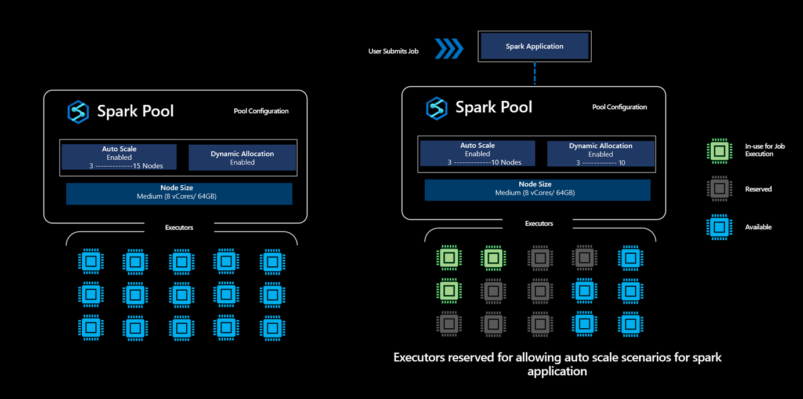
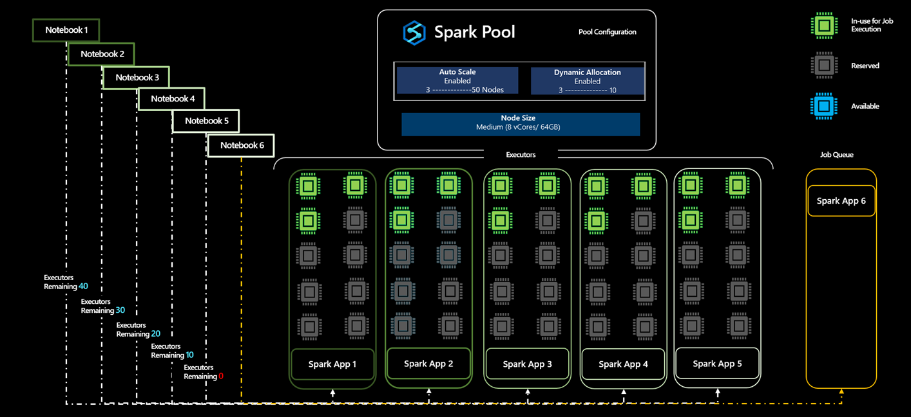

# Reservation of Executors as part of Dynamic Allocation in Synapse Spark Pools

Users create Spark pools in Azure Synapse Analytics and size them based on their analytics workload requirements. It's common among enterprise teams to use spark pools for multiple data engineering process and the usage of the pools could vary based on data ingestion rates, data volume and other factors. A spark pool could be used for compute intensive data transformation and also for carrying out data exploratory processes, and in these cases users can enable the Autoscale option and specify a minimum and maximum number of nodes and the platform handles scaling the number of active nodes within these limits based on the demand.

Going one level further by looking at application level executor requirements, users find it hard to tune the executor configurations as they're vastly different across different stages of a Spark Job Execution process, which are also dependent on the volume of data processed which changes from time to time. Users can enable Dynamic Allocation of Executors option as part of the pool configuration, which would enable automatic allocation of executors to the spark application based on the nodes available in the Spark Pool. 

When Dynamic Allocation option is enabled, for every spark application submitted, the system *reserves* executors during the job submission step based on the Max Nodes, which were specified by the user to support successful auto scale scenarios.

> [!NOTE]
> **This conservative approach allows the platform to enable scaling from say 3 to 10 Nodes without running out of capacity, thereby providing users with greater reliability for job execution.**

## What does the reservation of executors mean?

In scenarios where the Dynamic Allocation option is enabled in a Synapse Spark Pool, the platform reserves the number of executors based on the maximum limit specified by the user for any spark application submitted. A new job submitted by the user will only be accepted when there are available executors is > than the max number of reserved executors. 

> [!IMPORTANT]
> This reservation activity however does not impact the billing where the users are billed only for the cores used and not for the number of cores in the reserved state. 

## How does this dynamic allocation work when multiple jobs are submitted against a Spark Pool

Lets look at an example scenario of a single user who creates a Spark Pool A with Auto Scale enabled with minimum of 5 to maximum of 50 nodes.
Since the user isn't sure how much compute the spark job would require, the user enables Dynamic Allocation to allow the executors to scale. 
+ The user starts by submitting the application App1, which starts with three executors, and it can scale from 3 to 10 executors.
+ The maximum number of nodes that are allocated for the Spark Pool is 50. With the submission of App1 resulting in reservation of 10 executors, the number of available executors in the spark pool reduces to 40. 
+ The user submits another Spark Application App2 with the same compute configurations as that of App1 where the application starts with 3, which can scale up to 10 executors and thereby reserving 10 more executors from the total available executors in the spark pool.
+ Total number of available executors in the spark pool has reduced to 30. 
+ The user submits an application App3, App4 and App5 with the same as the other applications, for the sixth job would get queued because, as part of accepting App3, the number of available executors  reduces to 20, and similarly reduces to 10 and then to 0  when App5 is accepted as part of the reservation of 10 Executors  from the available set of executors  in the pool. 
+ Given that there are no available cores, App6 will be in the queue till these other applications complete execution and will be accepted once the available number of executors in the pool increases to 10 from 0. 

> [!NOTE]
> + Even though the reservation of executors is carried out, not all executors are being used but are reserved to support auto scale scenarios for these applications. 
> + If all the applications App1, App2, App3, App4 and App5 were able to run in minimum node capacity the executors consumed for this execution is 15 Executors in total, however the rest of the 35 executors were added as part of the reserve enable scaling out from 3 Executors to 10 Executors in any case while running these applications. 
> + Even with having the 35 executors reserved, **the user is only billed for the 15 executors used in this case and not for the 35 executors in the reserved state.**
> + **When Dynamic Allocation is Disabled**: In a scenario where the user disabled dynamic allocation, the reservation of executors will be based on the min and max number of executors specified by the user. 
> +  If user in the above example has specified number of executors to be 5, then the 5 executors will be reserved for every application submitted, and the user can submit App6 and it would not be queued.

## Scenario where concurrent jobs are submitted to Spark Pools in a Synapse Workspace

Users can create multiple Spark Pools in a Synapse Analytics workspace and size them based on their analytics workload requirements. For these spark pools created, if the users have enabled Dynamic Allocation, the total available cores for the given workspace at any point in time will be

**Total Available Cores for the Workspace =  Total Cores of all Spark Pools - Cores Reserved or Being Used for Active Jobs running in Spark Pools**

Users will get a **workspace capacity exceeded error** for jobs submitted when Total Available Cores for the Workspace is 0. 

## Dynamic Allocation and Reservation of Cores in a Multiuser Scenario

In scenarios where multiple users try to run multiple spark jobs in a given Synapse Workspace, if User1 is submitting jobs to a Spark Pool, which is enabled with Dynamic Allocation, there by taking up all the cores available in Pool. If User2 submits jobs and given that there are no Available Cores for the Spark Pool as some of them are being actively used in the execution of the jobs submitted by User1 and some are reserved for supporting the execution, User2 would experience a **workspace capacity exceeded error**. 

> [!TIP]
> Users can increase the number of cores, there by increasing the total available cores to avoid **workspace capacity exceeded errors**.

---

## Next steps
- [Quickstart: Create an Apache Spark pool in Azure Synapse Analytics using web tools](../quickstart-create-apache-spark-pool-portal.md)
- [What is Apache Spark in Azure Synapse Analytics](./apache-spark-overview.md)
- [Automatically scale Azure Synapse Analytics Apache Spark pools](./apache-spark-autoscale.md)
- [Azure Synapse Analytics](../index.yml)