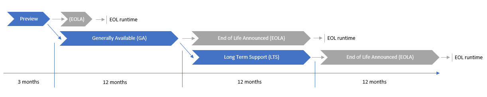

# Synapse runtime for Apache Spark lifecycle and supportability

Apache Spark pools in Azure Synapse use runtimes to tie together essential component versions such as Azure Synapse optimizations, packages, and connectors with a specific Apache Spark version. Each runtime will be upgraded periodically to include new improvements, features, and patches.

## Release cadence

The Apache Spark project usually releases minor versions about __every 6 months__. Once released, the Azure Synapse team aims to provide a __preview runtime within approximately 90 days__, if possible.

## Runtime lifecycle

The following chart captures a typical lifecycle path for a Synapse runtime for Apache Spark.

|  Runtime release stage  | Typical Lifecycle* |  Notes | 
| ----- | ----- | ----- |
| Preview | 3 months* | Microsoft Azure Preview terms apply. See here for details: [Preview Terms Of Use | Microsoft Azure](https://azure.microsoft.com/support/legal/preview-supplemental-terms/?cdn=disable) |
| Generally Available (GA) | 12 months* | Generally available (GA) runtimes are open to all eligible customers and are ready for production use.   A GA runtime may not be elected to move into an LTS stage at Microsoft discretion. |
| Long Term Support (LTS) | 12 months* | Long term support (LTS) runtimes are open to all eligible customers and are ready for production use, but customers are encouraged to expedite validation and workload migration to latest GA runtimes. |
| End of Life announced (EOLA) | 12 months* for GA or LTS runtimes. 1 month* for Preview runtimes. | Prior to the end of a given runtime's lifecycle, we aim to provide 12 months' notice by publishing the End-of-Life Announcement (EOLA) date in the [Azure Synapse Runtimes page](./apache-spark-version-support.md) and 6 months' email notice to customers as an exit ramp to migrate their workloads to a GA runtime. |
| End of Life (EOL) | - | At this stage, the runtime is retired and no longer supported. |

\* *Expected duration of a runtime in each stage. These timelines are provided as an example for a given runtime, and may vary depending on various factors. Lifecycle timelines are subject to change at Microsoft discretion.*

\** *Your use of runtimes is governed by the terms applicable to your Azure subscription.*

> [!IMPORTANT]
>
> * The above timelines are provided as examples based on current Apache Spark releases. If the Apache Spark project changes the lifecycle of a specific version affecting a Synapse runtime, changes to the stage dates will be noted on the [release notes](./apache-spark-version-support.md).
> * Both GA and LTS runtimes may be moved into EOL stage faster based on outstanding security risks and usage rates criteria at Microsoft discretion. 
> * Please refer to [Lifecycle FAQ - Microsoft Azure](/lifecycle/faq/azure) for information about Azure lifecycle policies.
>

## Release stages and support

### Preview runtimes
Azure Synapse Analytics provides previews to give you a chance to evaluate and share feedback on features before they become generally available (GA).

At the end of the Preview lifecycle for the runtime, Microsoft will assess if the runtime will move into a Generally Availability (GA) based on customer usage, security and stability criteria.

If not eligible for GA stage, the Preview runtime will move into the retirement cycle.

### Generally available runtimes
Once a runtime is Generally Available, only security fixes will be backported. In addition, new components or features will be introduced if they don't change underlying dependencies or component versions. 

At the end of the GA lifecycle for the runtime, Microsoft will assess if the runtime will have an extended lifecycle (LTS) based on customer usage, security and stability criteria.

If not eligible for LTS stage, the GA runtime will move into the retirement cycle.

### Long term support runtimes
For runtimes that are covered by Long term support (LTS) customers are encouraged to expedite validation and migration of code base and workloads to the latest GA runtimes. We recommend that customers don't onboard new workloads using an LTS runtime. Security fixes and stability improvements may be backported, but no new components or features will be introduced into the runtime at this stage.

### End of life announcement
Prior to the end of the runtime lifecycle at any stage, an end of life announcement (EOLA) is performed.

Support SLAs are applicable for EOL announced runtimes, but all customers must migrate to a GA stage runtime no later than the EOL date.

During the EOLA stage, existing Synapse Spark pools will function as expected, and new pools of the same version can be created. The runtime version will be listed on Azure Synapse Studio, Synapse API, or Azure portal. At the same time, we strongly recommend migrating your workloads to the latest General Availability (GA) runtimes.

If necessary due to outstanding security issues, runtime usage, or other factors, **Microsoft may expedite moving a runtime into the final EOL stage at any time, at Microsoft's discretion.**

### End of life date and retirement
As of the applicable EOL (End-of-Life) date, runtimes are considered retired and deprecated.
* It is not possible to create new Spark pools using the retired version through Azure Synapse Studio, the Synapse API, or the Azure portal.
* The retired runtime version will not be available in Azure Synapse Studio, the Synapse API, or the Azure portal.
* Spark Pool definitions and associated metadata will remain in the Synapse workspace for a defined period after the applicable End-of-Life (EOL) date. **However, all pipelines, jobs, and notebooks will no longer be able to execute.** 
