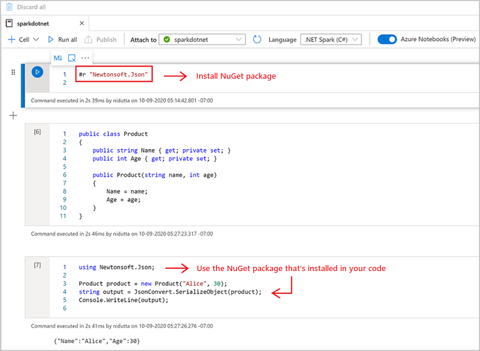

# Use .NET for Apache Spark with Azure Synapse Analytics

[.NET for Apache Spark](https://dot.net/spark) provides free, [open-source](https://github.com/dotnet/spark), and cross-platform .NET support for Spark. 

It provides .NET bindings for Spark, which allows you to access Spark APIs through C# and F#. With .NET for Apache Spark, you can also write and execute user-defined functions for Spark written in .NET. The .NET APIs for Spark enable you to access all aspects of Spark DataFrames that help you analyze your data, including Spark SQL, Delta Lake, and Structured Streaming.

You can analyze data with .NET for Apache Spark through Spark batch job definitions or with interactive Azure Synapse Analytics notebooks. In this article, you learn how to use .NET for Apache Spark with Azure Synapse using both techniques.

>[!IMPORTANT]
> The [.NET for Apache Spark](https://github.com/dotnet/spark) is an open-source project under the .NET Foundation that currently requires the .NET 3.1 library, which has reached the out-of-support status. We would like to inform users of Azure Synapse Spark of the removal of the .NET for Apache Spark library in the Azure Synapse Runtime for Apache Spark version 3.3. Users may refer to the [.NET Support Policy](https://dotnet.microsoft.com/platform/support/policy/dotnet-core) for more details on this matter.
>
> As a result, it will no longer be possible for users to utilize Apache Spark APIs via C# and F#, or execute C# code in notebooks within Synapse or through Apache Spark Job definitions in Synapse. It is important to note that this change affects only Azure Synapse Runtime for Apache Spark 3.3 and above. 
> 
> We will continue to support .NET for Apache Spark in all previous versions of the Azure Synapse Runtime according to [their lifecycle stages](runtime-for-apache-spark-lifecycle-and-supportability.md). However, we do not have plans to support .NET for Apache Spark in Azure Synapse Runtime for Apache Spark 3.3 and future versions. We recommend that users with existing workloads written in C# or F# migrate to Python or Scala. Users are advised to take note of this information and plan accordingly.

## Submit batch jobs using the Spark job definition

Visit the tutorial to learn how to use Azure Synapse Analytics to [create Apache Spark job definitions for Synapse Spark pools](apache-spark-job-definitions.md). If you haven't packaged your app to submit to Azure Synapse, complete the following steps.

1. Configure your `dotnet` application dependencies for compatibility with Synapse Spark.
The required .NET Spark version will be noted in the Synapse Studio interface under your Apache Spark Pool configuration, under the Manage toolbox.

   :::image type="content" source="./media/apache-spark-job-definitions/net-spark-workspace-compatibility.png" alt-text="Screenshot that shows properties, including the .NET Spark version.":::

   Create your project as a .NET console application that outputs an Ubuntu x86 executable.
  
   ```
   <Project Sdk="Microsoft.NET.Sdk">
 
     <PropertyGroup>
       <OutputType>Exe</OutputType>
       <TargetFramework>netcoreapp3.1</TargetFramework>
     </PropertyGroup>
 
     <ItemGroup>
       <PackageReference Include="Microsoft.Spark" Version="2.1.0" />
     </ItemGroup>
 
   </Project>
   ```

2. Run the following commands to publish your app. Be sure to replace *mySparkApp* with the path to your app.
   
   ```dotnetcli
   cd mySparkApp
   dotnet publish -c Release -f netcoreapp3.1 -r ubuntu.18.04-x64
   ```

3. Zip the contents of the publish folder, `publish.zip` for example, that was created as a result of Step 1. All the assemblies should be in the root of the ZIP file and there should be no intermediate folder layer. This means when you unzip `publish.zip`, all assemblies are extracted into your current working directory. 

    **On Windows:**

    Using Windows PowerShell or PowerShell 7, create a .zip from the contents of your publish directory.
    ```PowerShell
    Compress-Archive publish/* publish.zip -Update
    ```

    **On Linux:**

    Open a bash shell and cd into the bin directory with all the published binaries and run the following command.

    ```bash
    zip -r publish.zip
    ```

## .NET for Apache Spark in Azure Synapse Analytics notebooks 

Notebooks are a great option for prototyping your .NET for Apache Spark pipelines and scenarios. You can start working with, understanding, filtering, displaying, and visualizing your data quickly and efficiently. 

Data engineers, data scientists, business analysts, and machine learning engineers are all able to collaborate over a shared, interactive document. You see immediate results from data exploration, and can visualize your data in the same notebook.

### How to use .NET for Apache Spark notebooks

When you create a new notebook, you choose a language kernel that you wish to express your business logic. Kernel support is available for several languages, including C#.

To use .NET for Apache Spark in your Azure Synapse Analytics notebook, select **.NET Spark (C#)** as your kernel and attach the notebook to an existing serverless Apache Spark pool.

The .NET Spark notebook is based on the [.NET interactive](https://github.com/dotnet/interactive) experiences and provides interactive C# experiences with the ability to use .NET for Spark out of the box with the Spark session variable `spark` already predefined.

### Install NuGet packages in notebooks

You can install NuGet packages of your choice into your notebook by using the `#r nuget` magic command before the name of the NuGet package. The following diagram shows an example:



To learn more about how to work with NuGet packages in notebooks, see the [.NET Interactive Documentation](https://github.com/dotnet/interactive/blob/main/docs/nuget-overview.md).

### .NET for Apache Spark C# kernel features

The following features are available when you use .NET for Apache Spark in the Azure Synapse Analytics notebook:

* Declarative HTML: Generate output from your cells using HTML-syntax, such as headers, bulleted lists, and even displaying images.
* Simple C# statements (such as assignments, printing to console, throwing exceptions, and so on).
* Multi-line C# code blocks (such as if statements, foreach loops, class definitions, and so on).
* Access to the standard C# library (such as System, LINQ, Enumerables, and so on).
* Support for C# 8.0 language features.
* `spark` as a pre-defined variable to give you access to your Apache Spark session.
* Support for defining [.NET user-defined functions that can run within Apache Spark](/dotnet/spark/how-to-guides/udf-guide). We recommend [Write and call UDFs in .NET for Apache Spark Interactive environments](/dotnet/spark/how-to-guides/dotnet-interactive-udf-issue) for learning how to use UDFs in .NET for Apache Spark Interactive experiences.
* Support for visualizing output from your Spark jobs using different charts (such as line, bar, or histogram) and layouts (such as single, overlaid, and so on) using the `XPlot.Plotly` library.
* Ability to include NuGet packages into your C# notebook.
## Troubleshooting

### `DotNetRunner: null` / `Futures timeout` in Synapse Spark Job Definition Run
Synapse Spark Job Definitions on Spark Pools using Spark 2.4 require `Microsoft.Spark` 1.0.0. Clear your `bin` and `obj` directories, and publish the project using 1.0.0.
### OutOfMemoryError: java heap space at org.apache.spark...
Dotnet Spark 1.0.0 uses a different debug architecture than 1.1.1+. You will have to use 1.0.0 for your published version and 1.1.1+ for local debugging.

## Next steps

* [.NET for Apache Spark documentation](/dotnet/spark/)
* [.NET for Apache Spark Interactive guides](/dotnet/spark/how-to-guides/dotnet-interactive-udf-issue)
* [Azure Synapse Analytics](https://azure.microsoft.com/services/synapse-analytics/)
* [.NET Interactive](https://devblogs.microsoft.com/dotnet/creating-interactive-net-documentation/)
