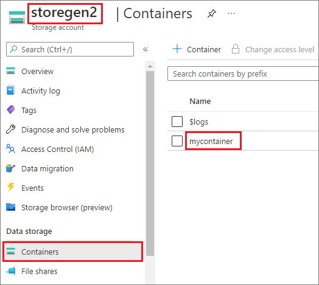
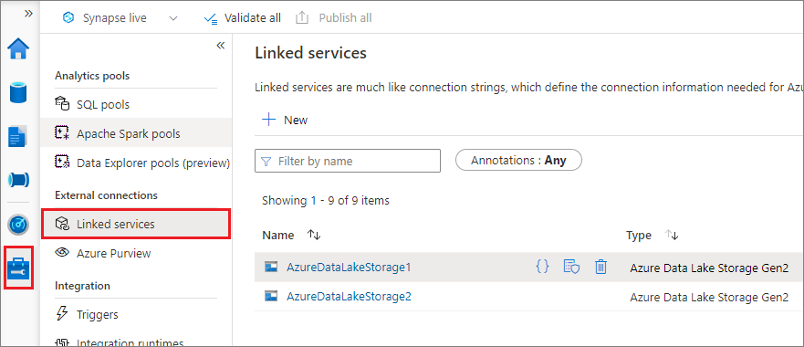
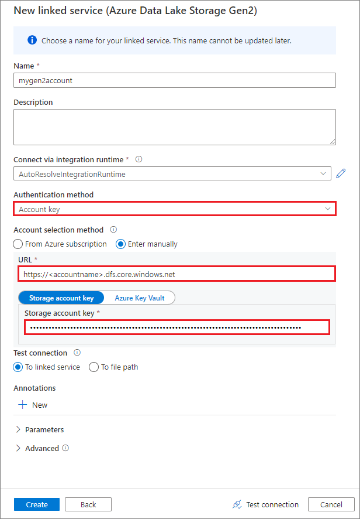
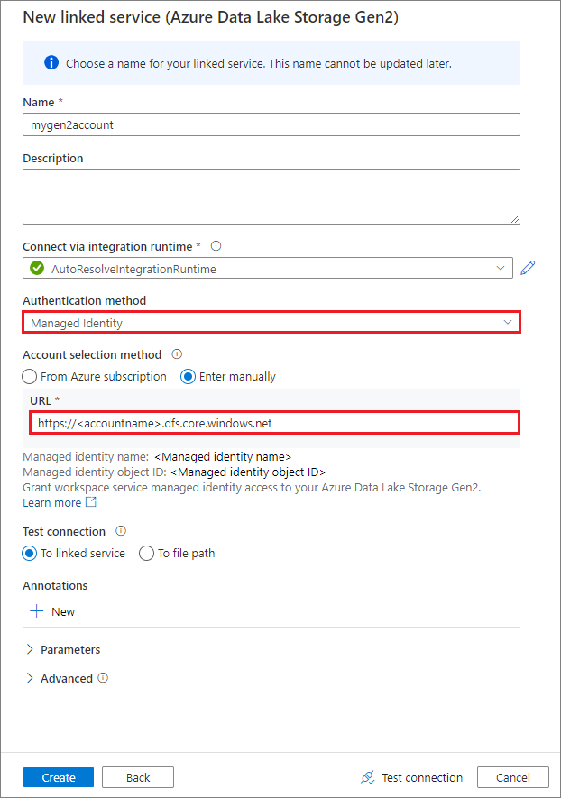
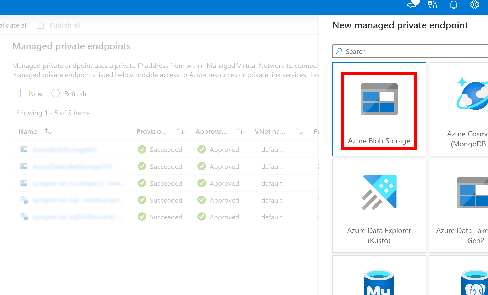
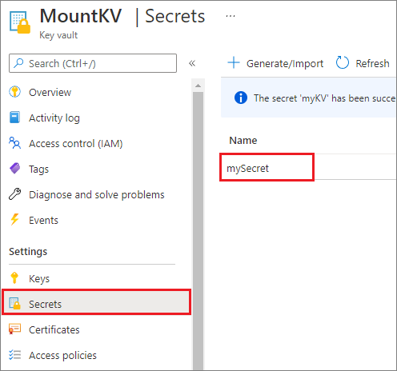
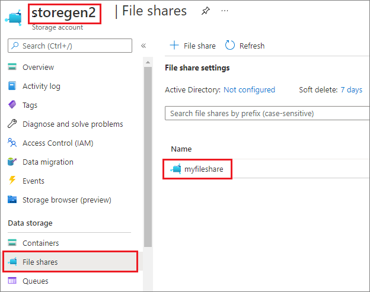

# Introduction to file mount/unmount APIs in Azure Synapse Analytics 

The Azure Synapse Studio team built two new mount/unmount APIs in the Microsoft Spark Utilities (`mssparkutils`) package. You can use these APIs to attach remote storage (Azure Blob Storage or Azure Data Lake Storage Gen2) to all working nodes (driver node and worker nodes). After the storage is in place, you can use the local file API to access data as if it's stored in the local file system. For more information, see [Introduction to Microsoft Spark Utilities](microsoft-spark-utilities.md).

The article shows you how to use mount/unmount APIs in your workspace. You'll learn: 

+ How to mount Data Lake Storage Gen2 or Blob Storage.
+ How to access files under the mount point via the local file system API. 
+ How to access files under the mount point by using the `mssparktuils fs` API. 
+ How to access files under the mount point by using the Spark read API.
+ How to unmount the mount point.
 
> [!WARNING]
> Azure file-share mounting is temporarily disabled. You can use Data Lake Storage Gen2 or Azure Blob Storage mounting instead, as described in the next section.
>
> Azure Data Lake Storage Gen1 storage is not supported. You can migrate to Data Lake Storage Gen2 by following the [Azure Data Lake Storage Gen1 to Gen2 migration guidance](../../storage/blobs/data-lake-storage-migrate-gen1-to-gen2-azure-portal.md) before using the mount APIs.


<a id="How-to-mount-Gen2/blob-Storage"></a>
## Mount storage

This section illustrates how to mount Data Lake Storage Gen2 step by step as an example. Mounting Blob Storage works similarly. 

The example assumes that you have one Data Lake Storage Gen2 account named `storegen2`. The account has one container named `mycontainer` that you want to mount to `/test` in your Spark pool. 



To mount the container called `mycontainer`, `mssparkutils` first needs to check whether you have the permission to access the container. Currently, Azure Synapse Analytics supports three authentication methods for the trigger mount operation: `LinkedService`, `accountKey`, and `sastoken`. 

### Mount by using a linked service (recommended)

We recommend a trigger mount via linked service. This method avoids security leaks, because `mssparkutils` doesn't store any secret or authentication values itself. Instead, `mssparkutils` always fetches authentication values from the linked service to request blob data from remote storage. 



You can create a linked service for Data Lake Storage Gen2 or Blob Storage. Currently, Azure Synapse Analytics supports two authentication methods when you create a linked service: 

+ **Create a linked service by using an account key**

    

+ **Create a linked service by using a managed identity**

    

> [!IMPORTANT]
>
> - If the above created Linked Service to Azure Data Lake Storage Gen2 uses a [managed private endpoint](../security/synapse-workspace-managed-private-endpoints.md) (with a *dfs* URI) , then we need to create another secondary managed private endpoint using the Azure Blob Storage option (with a **blob** URI) to ensure that the internal [fsspec/adlfs](https://github.com/fsspec/adlfs/blob/main/adlfs/spec.py#L400) code can connect using the *BlobServiceClient* interface.
> - In case the secondary managed private endpoint is not configured correctly, then we would see an error message like *ServiceRequestError: Cannot connect to host [storageaccountname].blob.core.windows.net:443 ssl:True [Name or service not known]*
> 
> 

> [!NOTE]
> If you create a linked service by using a managed identity as the authentication method, make sure that the workspace MSI file has the Storage Blob Data Contributor role of the mounted container. 

After you create linked service successfully, you can easily mount the container to your Spark pool by using the following Python code: 

```python
mssparkutils.fs.mount( 
    "abfss://mycontainer@<accountname>.dfs.core.windows.net", 
    "/test", 
    {"LinkedService":"mygen2account"} 
) 
``` 

> [!NOTE]   
> You might need to import `mssparkutils` if it's not available: 
> ```python
> from notebookutils import mssparkutils 
> ```
> Mount parameters:
> - fileCacheTimeout: Blobs will be cached in the local temp folder for 120 seconds by default. During this time, blobfuse won't check whether the file is up to date or not. The parameter could be set to change the default timeout time. When multiple clients modify files at the same time, in order to avoid inconsistencies between local and remote files, we recommend shortening the cache time, or even changing it to 0, and always getting the latest files from the server.
> - timeout: The mount operation timeout is 120 seconds by default. The parameter could be set to change the default timeout time. When there are too many executors or when the mount times out, we recommend increasing the value.
> - scope: The scope parameter is used to specify the scope of the mount. The default value is "job." If the scope is set to "job," the mount is visible only to the current cluster. If the scope is set to "workspace," the mount is visible to all notebooks in the current workspace, and the mount point is automatically created if it doesn't exist. Add the same parameters to the unmount API to unmount the mount point. The workspace level mount is only supported for linked service authentication.
>
> You can use these parameters like this:
> ```python
> mssparkutils.fs.mount(
>    "abfss://mycontainer@<accountname>.dfs.core.windows.net",
>    "/test",
>    {"linkedService":"mygen2account", "fileCacheTimeout": 120, "timeout": 120}
> )
> ```
> 
> We don't recommend that you mount a root folder, no matter which authentication method you use.


### Mount via shared access signature token or account key  

In addition to mounting through a linked service, `mssparkutils` supports explicitly passing an account key or [shared access signature (SAS)](/samples/azure-samples/storage-dotnet-sas-getting-started/storage-dotnet-sas-getting-started/) token as a parameter to mount the target. 

For security reasons, we recommend that you store account keys or SAS tokens in Azure Key Vault (as the following example screenshot shows). You can then retrieve them by using the `mssparkutil.credentials.getSecret` API. For more information, see [Manage storage account keys with Key Vault and the Azure CLI (legacy)](../../key-vault/secrets/overview-storage-keys.md).


 
Here's the sample code: 

```python 
from notebookutils import mssparkutils  

accountKey = mssparkutils.credentials.getSecret("MountKV","mySecret")  
mssparkutils.fs.mount(  
    "abfss://mycontainer@<accountname>.dfs.core.windows.net",  
    "/test",  
    {"accountKey":accountKey}
) 
``` 

> [!NOTE]
> For security reasons, don't store credentials in code.

<!---
## Mount Azure file shares
> [!WARNING]
> File-share mounting is temporarily disabled because of technical limitations. As a workaround, use a Data Lake Storage Gen2 or Blob Storage mount by following the preceding steps.

The following example assumes that you have a Data Lake Storage Gen2 storage account named `storegen2`. The account has one file share named `myfileshare`. You want to mount `myfileshare` to `/test` for your Spark pool.


 
A mounted Azure file share supports only the account key authentication method. The following code example mounts `myfileshare` to `/test`. The example reuses the Azure Key Vault settings of `MountKV`. 

```python 
from notebookutils import mssparkutils  

accountKey = mssparkutils.credentials.getSecret("MountKV","mySecret")  
mssparkutils.fs.mount(  
    "https://myfileshare@<accountname>.file.core.windows.net",  
    "/test",  
    {"accountKey":accountKey}  
) 
``` 

The example predefines the schema format of the source URL for the file share to `https://<filesharename>@<accountname>.file.core.windows.net`. We stored the account key in Key Vault. We retrieved the account key by using the `mssparkutil.credentials.getSecret` API instead of explicitly passing it to the mount API.    

## Access files under the mount point via the local file system API

After the mount runs successfully, you can access the data via the local file system API. The mount point must always be created under the `/synfs` folder of node, and it's scoped to the job/session level. 

For example, if you mount `mycontainer` to the `/test` folder, the created local mount point is `/synfs/{jobid}/test`. If you want to access the mount point via local `fs` APIs after a successful mount, the local path should be `/synfs/{jobid}/test`. 

The following example shows how it works: 

```python 
jobId = mssparkutils.env.getJobId() 
f = open(f"/synfs/{jobId}/test/myFile.txt", "a") 
f.write("Hello world.") 
f.close() 
``` 
--->

## Access files under the mount point by using the mssparkutils fs API 

The main purpose of the mount operation is to let customers access the data stored in a remote storage account by using a local file system API. You can also access the data by using the `mssparkutils fs` API with a mounted path as a parameter. The path format used here is a little different. 

Assume that you mounted the Data Lake Storage Gen2 container `mycontainer` to `/test` by using the mount API. When you access the data by using a local file system API, the path format is like this: 

`/synfs/{jobId}/test/{filename}`

We recommend using a `mssparkutils.fs.getMountPath()` to get the accurate path:

```python
path = mssparkutils.fs.getMountPath("/test") # equals to /synfs/{jobId}/test
```

When you want to access the data by using the `mssparkutils fs` API, the path format is like this: 

`synfs:/{jobId}/test/{filename}`

You can see that `synfs` is used as the schema in this case, instead of a part of the mounted path. 

The following three examples show how to access a file with a mount point path by using `mssparkutils fs`. In the examples, `49` is a Spark job ID that we got from calling `mssparkutils.env.getJobId()`. 

+ List directories:  

    ```python 
    mssparkutils.fs.ls("synfs:/49/test") 
    ``` 

+ Read file content: 

    ```python 
    mssparkutils.fs.head("synfs:/49/test/myFile.txt") 
    ``` 

+ Create a directory: 

    ```python 
    mssparkutils.fs.mkdirs("synfs:/49/test/newdir") 
    ``` 

## Access files under the mount point by using the Spark read API 

You can provide a parameter to access the data through the Spark read API. The path format here is the same when you use the `mssparkutils fs` API: 

`synfs:/{jobId}/test/{filename}`

<a id="read-file-from-a-mounted-gen2-storage-account"></a>
### Read a file from a mounted Data Lake Storage Gen2 storage account 

The following example assumes that a Data Lake Storage Gen2 storage account was already mounted, and then you read the file by using a mount path:

```python 
%%pyspark 

df = spark.read.load("synfs:/49/test/myFile.csv", format='csv') 
df.show() 
``` 

> [!NOTE]  
> When you mount the storage using a linked service, you should always explicitly set spark linked service configuration before using synfs schema to access the data. Refer to [ADLS Gen2 storage with linked services](./apache-spark-secure-credentials-with-tokenlibrary.md#adls-gen2-storage-without-linked-services) for details. 

### Read a file from a mounted Blob Storage account 

If you mounted a Blob Storage account and want to access it by using `mssparkutils` or the Spark API, you need to explicitly configure the SAS token via Spark configuration before you try to mount the container by using the mount API: 

1. To access a Blob Storage account by using `mssparkutils` or the Spark API after a trigger mount, update the Spark configuration as shown in the following code example. You can bypass this step if you want to access the Spark configuration only by using the local file API after mounting.

    ```python 
    blob_sas_token = mssparkutils.credentials.getConnectionStringOrCreds("myblobstorageaccount") 

    spark.conf.set('fs.azure.sas.mycontainer.<blobStorageAccountName>.blob.core.windows.net', blob_sas_token) 
    ``` 

2. Create the linked service `myblobstorageaccount`, and mount the Blob Storage account by using the linked service:

    ```python 
    %%spark 
    mssparkutils.fs.mount( 
        "wasbs://mycontainer@<blobStorageAccountName>.blob.core.windows.net", 
        "/test", 
        Map("LinkedService" -> "myblobstorageaccount") 
    ) 
    ``` 

3. Mount the Blob Storage container, and then read the file by using a mount path through the local file API:

    ```python
        # mount the Blob Storage container, and then read the file by using a mount path
        with open("/synfs/64/test/myFile.txt") as f:
        print(f.read())
    ```

4. Read the data from the mounted Blob Storage container through the Spark read API:

    ```python
    %%spark
    // mount blob storage container and then read file using mount path
    val df = spark.read.text("synfs:/49/test/myFile.txt")
    df.show()
    ```

## Unmount the mount point 

Use the following code to unmount your mount point (`/test` in this example): 

```python 
mssparkutils.fs.unmount("/test") 
``` 

## Known limitations

+ The `mssparkutils fs help` function hasn't added the description about the mount/unmount part yet. 

+ The unmount mechanism is not automatic. When the application run finishes, to unmount the mount point to release the disk space, you need to explicitly call an unmount API in your code. Otherwise, the mount point will still exist in the node after the application run finishes. 

+ Mounting a Data Lake Storage Gen1 storage account is not supported for now. 

## Next steps

- [Get started with Azure Synapse Analytics](../get-started.md)
- [Monitor your Synapse workspace](../get-started-monitor.md)
- [Introduction to Microsoft Spark Utilities](microsoft-spark-utilities.md)
