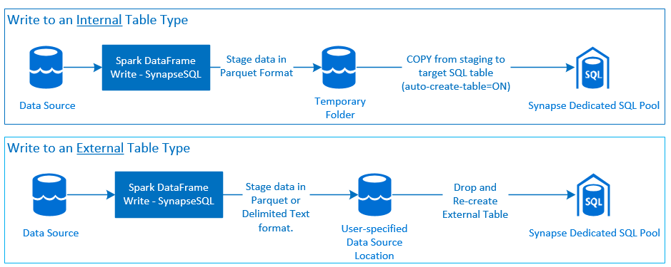

---
title: Azure Synapse Dedicated SQL Pool Connector for Apache Spark
description: Presents Azure Synapse Dedicated SQL Pool Connector for Apache Spark for moving data between Apache Spark Runtime (Serverless Spark Pool) and the Synapse Dedicated SQL Pool.
author: kalyankadiyala-Microsoft
ms.service: synapse-analytics
ms.topic: overview
ms.subservice: spark
ms.date: 03/18/2022
ms.author: kakadiya
ms.reviewer: ktuckerdavis, aniket.adnaik
--- 
# Azure Synapse Dedicated SQL Pool Connector for Apache Spark

## Introduction

The Azure Synapse Dedicated SQL Pool Connector for Apache Spark in Azure Synapse Analytics efficiently transfers large volume data sets between the [Apache Spark runtime](../../synapse-analytics/spark/apache-spark-overview.md) and the [Dedicated SQL pool](../../synapse-analytics/sql-data-warehouse/sql-data-warehouse-overview-what-is.md). The connector is implemented using `Scala` language. The connector is shipped as a default library within Azure Synapse environment - workspace Notebook and Serverless Spark Pool runtime. Using the Spark magic command `%%spark`, the Scala Connector code can be placed in any Synapse Notebook Cell regardless of the notebook language preferences.

At a high-level, the connector provides following capabilities:

* Write to Azure Synapse Dedicated SQL Pool:
  * Ingest large volume data to Internal and External table types.
  * Support for different Spark DataFrame write mode options - `Append`, `ErrorIfExists`, `Ignore` and `Overwrite`.
  * Write to External Table type supports Parquet and Delimited Text file format (example - CSV).
  * Write path implementation leverages [COPY statement](../../synapse-analytics/sql-data-warehouse/quickstart-bulk-load-copy-tsql.md) instead of CETAS/CTAS approach.
  * Enhancements to optimize end-to-end write throughput performance.
  * Introduces an optional call-back handle (a Scala function argument) that clients can use to receive post-write metrics.
    * For example - time taken to stage data, time taken to write data to target tables, number of records staged, number of records committed to target table, and failure cause (in case of a failure).
* Read from Azure Synapse Dedicated SQL Pool:
  * Export large data sets from Synapse Dedicated SQL Pool Tables (Internal and External) and Views.
  * Comprehensive push-down predicate support, where filters on DataFrame get mapped to corresponding SQL push-down predicates.
  * Support for column pruning.

## Orchestration Approach

### Write



### Read


## Pre-requisites

This section presents necessary pre-requisites that must be setup for a successful application of the Azure Synapse Dedicated SQL Pool Connector for Apache Spark.

### Azure Resources

Review and setup following dependent Azure Resources:

* [Azure Data Lake Storage](../../storage/blobs/data-lake-storage-introduction.md) - used as the primary storage account for the Azure Synapse Workspace.
* [Azure Synapse Workspace](../../synapse-analytics/get-started-create-workspace.md) - create notebooks, build and deploy DataFrame based ingress-egress workflows.
* [Dedicated SQL Pool (formerly SQL DW)](../../synapse-analytics/sql-data-warehouse/sql-data-warehouse-overview-what-is.md) - used to host and manage various data assets.
* [Azure Synapse Serverless Spark Pool](../../synapse-analytics/get-started-analyze-spark.md) - Spark runtime where the jobs are executed as Spark Applications.

#### Database Setup

Connect to the Synapse Dedicated SQL Pool database and run following setup statements:

* Create a database user that maps to the Azure Active Directory User Identity (also used to login to Azure Synapse Workspace).
  
    ```sql
    CREATE USER [username@domain.com] FROM EXTERNAL PROVIDER;      
    ```
  
  * Note:
    * This is not a required step to perform a write.
    * However, for read in order to assign the [`db_exporter`](/sql/relational-databases/security/authentication-access/database-level-roles#special-roles-for--and-azure-synapse) role the user must exist in the database.

* Create schema in which tables will be defined, such that the Connector can successfully write-to and read-from respective tables.

    ```sql
    CREATE SCHEMA [<schema_name>];
    ```

### Authentication

To avoid the complexity of passing discrete credentials and configure authentication to access each resource type, the recommended approach is to setup and leverage Azure Active Directory based authentication. All the resource types support AAD-based authentication. It requires to define a User Identity in the Azure Active Directory associated with the subscription, where the resources will be deployed and configured.

### Authorization

This section focuses on required authorization grants that must be set for the User on respective Azure Resource Types - Azure Storage and Azure Synapse Dedicated SQL Pool.

#### [Azure Data Lake Storage Gen2](../../storage/blobs/data-lake-storage-introduction.md)

There are two ways to grant access permissions to Azure Data Lake Storage Gen2 - Storage Account:

* Role based Access Control role - [Storage Blob Data Contributor role](../../role-based-access-control/built-in-roles.md#storage-blob-data-contributor)
  * Assigning the `Storage Blob Data Contributor Role` grants the User permissions to read, write and delete from the Azure Storage Blob Containers.
  * RBAC offers a coarse control approach at the container level.
* [Access Control Lists (ACL)](../../storage/blobs/data-lake-storage-access-control.md)
  * ACL approach allows for fine-grained controls over specific paths and/or files under a given folder.
  * ACL checks are not enforced if the User is already granted permissions using RBAC approach.
  * There are two broad types of ACL permissions:
    * Access Permissions (applied at a specific level or object).
    * Default Permissions (automatically applied for all child objects at the time of their creation).
  * Type of permissions include:
    * `Execute` enables ability to traverse or navigate the folder hierarchies.
    * `Read` enables ability to read.
    * `Write` enables ability to write.
  * It is important to configure ACLs such that the Connector can successfully write and read from the storage locations.

#### [Azure Synapse Dedicated SQL Pool](../../synapse-analytics/sql-data-warehouse/sql-data-warehouse-overview-what-is.md)

**Note** If the workspace User is set as an `Active Directory Admin` on the target database, this step can be skipped.

* Write Scenario
  * Connector uses the COPY command to write data from staging to the internal table's managed location.
    * Setup required permissions described [here](../../synapse-analytics/sql-data-warehouse/quickstart-bulk-load-copy-tsql.md#set-up-the-required-permissions).
    * Following is a quick access snippet of the same:

      ```sql
      --Make sure your user has the permissions to CREATE tables in the [dbo] schema
      GRANT CREATE TABLE TO [<your_domain_user>@<your_domain_name>.com];
      GRANT ALTER ON SCHEMA::<target_database_schema_name> TO [<your_domain_user>@<your_domain_name>.com];

      --Make sure your user has ADMINISTER DATABASE BULK OPERATIONS permissions
      GRANT ADMINISTER DATABASE BULK OPERATIONS TO [<your_domain_user>@<your_domain_name>.com];

      --Make sure your user has INSERT permissions on the target table
      GRANT INSERT ON <your_table> TO [<your_domain_user>@<your_domain_name>.com]
      ```

* Read Scenario
  * Data set that matches the User's read requirements i.e., table, columns and predicates is first fetched to an external staging location using external tables.
  * In order to successfully create temporary external tables over data in the staging folders, grant the `db_exporter` the system stored procedure [sp_addrolemember](/sql/relational-databases/system-stored-procedures/sp-addrolemember-transact-sql).
  * Following is a reference sample:

    ```sql
    EXEC sp_addrolemember 'db_exporter', [<your_domain_user>@<your_domain_name>.com];
    ```

## Connector API Documentation

Click [here](https://synapsesql.blob.core.windows.net/docs/2.0.0/scaladocs/com/microsoft/spark/sqlanalytics/utils/index.html) to access the latest Connector Scala API Documentation.

## Code Templates

This section provide reference code templates that describe how to use and invoke the Azure Synapse Dedicated SQL Pool Connector for Apache Spark.

### Write Scenario

#### `synapsesql` Write Method Signature

The method signature for the Connector version built for Spark 2.4.8 has one less argument, than that applied to the Spark 3.1.2 version. Following are the two method signatures:

* Spark Pool Version 2.4.8

```Scala
synapsesql(tableName:String, 
           tableType:String = Constants.INTERNAL, 
           location:Option[String] = None)
```

* Spark Pool Version 3.1.2

```Scala
synapsesql(tableName:String, 
           tableType:String = Constants.INTERNAL, 
           location:Option[String] = None,
           callBackHandle=Option[(Map[String, Any], Option[Throwable])=>Unit])
```

#### Write Code Template

```Scala
//Add required imports
import org.apache.spark.sql.DataFrame
import org.apache.spark.sql.SaveMode
import com.microsoft.spark.sqlanalytics.utils.Constants
import org.apache.spark.sql.SqlAnalyticsConnector._

//Define read options for example, if reading from CSV source, configure header and delimiter options.
val pathToInputSource="abfss://<storage_container_name>@<storage_account_name>.dfs.core.windows.net/<some_folder>/<some_dataset>.csv"

//Define read configuration for the input CSV
val dfReadOptions:Map[String, String] = Map("header" -> "true", "delimiter" -> ",")

//Initialize DataFrame that reads CSV data from a given source 
val readDF:DataFrame=spark.
            read.
            options(dfReadOptions).
            csv(pathToInputSource).
            limit(1000) //Reads first 1000 rows from the source CSV input.

//Setup and trigger the read DataFrame for write to Synapse Dedicated SQL Pool.
//Fully qualified SQL Server DNS name can be obtained using one of the following methods:
//    1. Synapse Workspace - Manage Pane - SQL Pools - <Properties view of the corresponding Dedicated SQL Pool>
//    2. From Azure Portal, follow the bread-crumbs for <Portal_Home> -> <Resource_Group> -> <Dedicated SQL Pool> and then go to Connection Strings/JDBC tab. 
val writeOptions:Map[String, String] = Map(Constants.SERVER -> "<dedicated-pool-sql-server-name>.sql.azuresynapse.net", 
                                            Constants.TEMP_FOLDER -> "abfss://<storage_container_name>@<storage_account_name>.dfs.core.windows.net/<some_temp_folder>")

//Setup optional callback/feedback function that can receive post write metrics of the job performed.
val callBackFunctionToReceivePostWriteMetrics: (Map[String, Any], Option[Throwable]) => Unit =
    (feedback: Map[String, Any], errorState: Option[Throwable]) => {
     if(errorState.isDefined){
         println(errorState.getOrElse("<No errors spotted.>"))
     }
     println(s"Feedback map - ${feedback.map{case(key, value) => s"$key -> $value"}.mkString("{",",\n","}")}")
}

//Configure and trigger write to Synapse Dedicated SQL Pool (note - default SaveMode is set to ErrorIfExists)
readDF.
    write.
    options(writeOptions).
    mode(SaveMode.Overwrite).
    synapsesql(tableName = "<database_name>.<schema_name>.<table_name>", 
                tableType = Constants.INTERNAL, //For external table type value is Constants.EXTERNAL
                location = None, //Not required for writing to internal table
                callBackHandle = Some(callBackFunctionToReceivePostWriteMetrics))
    
```

#### About the `callBackHandle` optional argument

The new write path API changes introduced an experimental feature to provide the client with a key->value map of post-write metrics. These metrics provide information such as number of records staged, to number of records written to SQL table, time spent in staging and executing the SQL statements to write data to the Synapse Dedicated SQL Pool. String values for each Metric key is defined and accessible from the new Object reference - `Constants.FeedbackConstants`. These metrics are by default written to the Spark Driver logs. One can also fetch these by passing a call-back handle (a `Scala Function`). Following is the signature of this function:

```Scala
//Function signature is expected to have two arguments - a `scala.collection.immutable.Map[String, Any]` and an Option[Throwable]
//Post-write if there's a reference of this handle passed to the `synapsesql` signature, it will be invoked by the closing process.
//These arguments will have valid objects in either Success or Failure case. In case of Failure the second argument will be a Some(Throwable) i.e., some error reference.
(Map[String, Any], Option[Throwable]) => Unit
```

Following is a list of some notable metric constants, with values described using Camel-case format:

* WRITE_FAILURE_CAUSE -> "WriteFailureCause"
* TIME_INMILLIS_TO_COMPLETE_DATA_STAGING -> "DataStagingSparkJobDurationInMilliseconds"
* NUMBER_OF_RECORDS_STAGED_FOR_SQL_COMMIT -> "NumberOfRecordsStagedForSQLCommit"
* TIME_INMILLIS_TO_EXECUTE_COMMIT_SQLS -> "SQLStatementExecutionDurationInMilliseconds"
* COPY_INTO_COMMAND_PROCESSED_ROW_COUNT -> "rows_processed" ()
* ROW_COUNT_POST_WRITE_ACTION (applied for scenario where table type is external)

Following is a sample JSON string with post-write metrics:

   ```doc
   {
    SparkApplicationId -> <spark_yarn_application_id>,
    SQLStatementExecutionDurationInMilliseconds -> 10113,
    WriteRequestReceivedAtEPOCH -> 1647523790633,
    WriteRequestProcessedAtEPOCH -> 1647523808379,
    StagingDataFileSystemCheckDurationInMilliseconds -> 60,
    command -> "COPY INTO [schema_name].[table_name] ...",
    NumberOfRecordsStagedForSQLCommit -> 100,
    DataStagingSparkJobEndedAtEPOCH -> 1647523797245,
    SchemaInferenceAssertionCompletedAtEPOCH -> 1647523790920,
    DataStagingSparkJobDurationInMilliseconds -> 5252,
    rows_processed -> 100,
    SaveModeApplied -> TRUNCATE_COPY,
    DurationInMillisecondsToValidateFileFormat -> 75,
    status -> Completed,
    SparkApplicationName -> <spark_application_name>,
    ThreePartFullyQualifiedTargetTableName -> <database_name>.<schema_name>.<table_name>,
    request_id -> <query_id_as_retrieved_from_synapse_dedicated_sql_db_query_reference>,
    StagingFolderConfigurationCheckDurationInMilliseconds -> 2,
    JDBCConfigurationsSetupAtEPOCH -> 193,
    StagingFolderConfigurationCheckCompletedAtEPOCH -> 1647523791012,
    FileFormatValidationsCompletedAtEPOCHTime -> 1647523790995,
    SchemaInferenceCheckDurationInMilliseconds -> 91,
    SaveModeRequested -> Overwrite,
    DataStagingSparkJobStartedAtEPOCH -> 1647523791993,
    DurationInMillisecondsTakenToGenerateWriteSQLStatements -> 4
   }
   ```

### Read Scenario

#### `synapsesql` Read Method Signature

Following is the signature to leverage `synapsesql` (applies to both Spark 2.4.8 and Spark 3.1.2 Connector versions):

```Scala
synapsesql(tableName:String) => org.apache.spark.sql.DataFrame
```

#### Read Code Template

```Scala
//Use case is to read data from an internal table in Synapse Dedicated SQL Pool DB
//Azure Active Directory based authentication approach is preferred here.
import org.apache.spark.sql.DataFrame
import com.microsoft.spark.sqlanalytics.utils.Constants
import org.apache.spark.sql.SqlAnalyticsConnector._

//Read from existing internal table
val dfToReadFromTable:DataFrame = spark.read.
    option(Constants.SERVER, "<sql-server-name>.sql.azuresynapse.net").
    option(Constants.TEMP_FOLDER, "abfss://<container_name>@<storage_account_name>.dfs.core.windows.net/<some_base_path_for_temporary_staging_folders>").
    synapsesql("<database_name>.<schema_name>.<table_name>").
    select("<some_column_1>", "<some_column_5>", "<some_column_n>"). //Column-pruning i.e., query select column values
    filter(col("Title").startsWith("E")). //Push-down filter criteria that gets translated to SQL Push-down Predicates
    limit(10) //Fetch a sample of 10 records

//Show contents of the dataframe
dfToReadFromTable.show()
```

### Additional Code Samples

#### Using Connector with PySpark

```Python
%%spark

import org.apache.spark.sql.DataFrame
import com.microsoft.spark.sqlanalytics.utils.Constants
import org.apache.spark.sql.SqlAnalyticsConnector._

//Code for either writing or reading from Azure Synapse Dedicated SQL Pool (similar to afore-mentioned code templates)

```

### Things to Note

The Connector leverages the capabilities of dependent resources (Azure Storage and Synapse Dedicated SQL Pool) to achieve efficient data transfers. Following are few important aspects must be taken into consideration when tuning for optimized (note, doesn't necessarily mean speed; this also relates to predictable outcomes) performance:

* The `Performance Level` setting in Synapse Dedicated SQL Pool will drive write throughput, in terms of maximum achievable concurrency, data distribution and threshold cap for max rows per transaction.
  * Review the [transaction size](../../synapse-analytics/sql-data-warehouse/sql-data-warehouse-develop-transactions.md#transaction-size) limitation when selecting the `Performance Level` of the Synapse Dedicated SQL Pool.
  * `Performance Level` can be adjusted using the [Scale](../../synapse-analytics/sql-data-warehouse/quickstart-scale-compute-portal.md) feature.
* Initial parallelism for a write scenario is heavily dependent on the number of partitions the job would identify. Partition count can be adjusted using the Spark configuration setting `spark.sql.files.maxPartitionBytes` to better re-group the source data during file scans. Besides, one can try DataFrame's repartition method.
* Besides factoring in the data characteristics also derive optimal Executor node count and choice (for example, small vs medium sizes that drive CPU & Memory resource allocations).
* When tuning for write or read performance, recommend to factor in the dominating pattern - I/O intensive or CPU intensive, and adjust your choices for Spark Pool capacities. Leverage auto-scale.
* Review the data orchestration illustrations to see where your job's performance can suffer (for example, a read lag can be optimized by adding appropriate predicates to optimize volume of data that is transported in a read scenario; like-wise, review source file formats and volumetric data to tune the Spark job performance).

## Additional Reading

* [Runtime library versions](../../synapse-analytics/spark/apache-spark-3-runtime.md)
* [Azure Storage](../../storage/blobs/data-lake-storage-introduction.md)
* [Dedicated SQL pool](../../synapse-analytics/sql-data-warehouse/sql-data-warehouse-overview-what-is.md)
