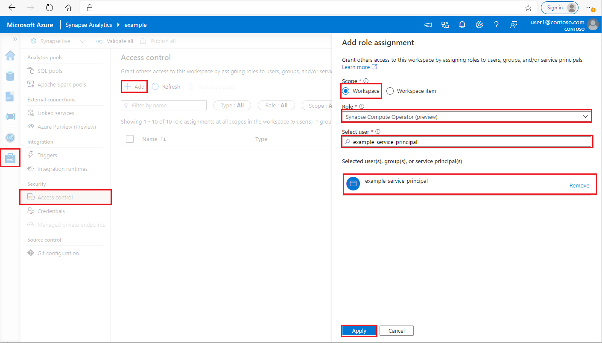
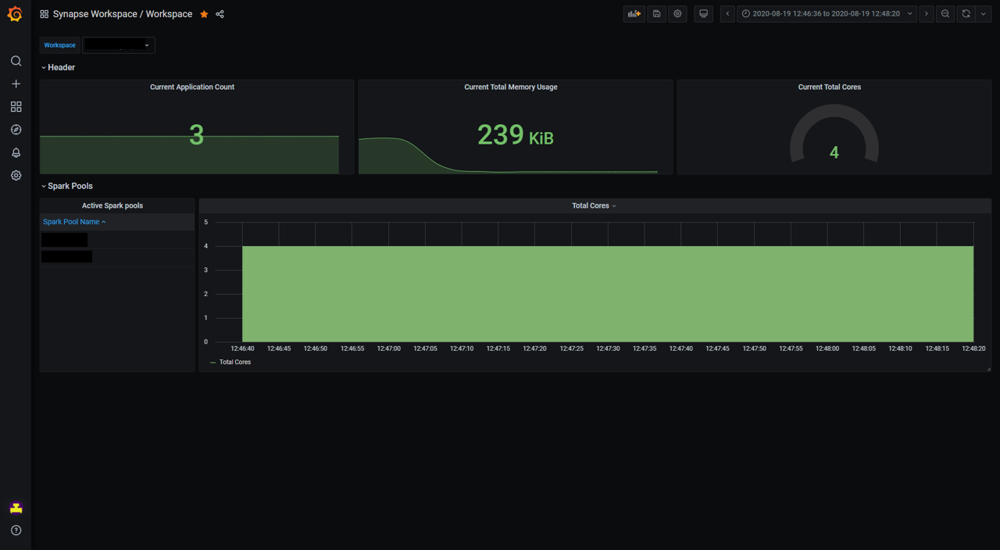
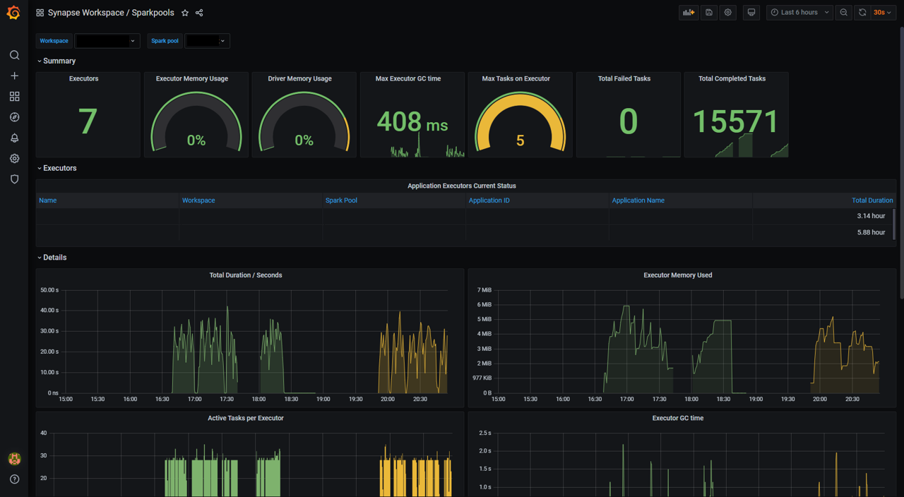
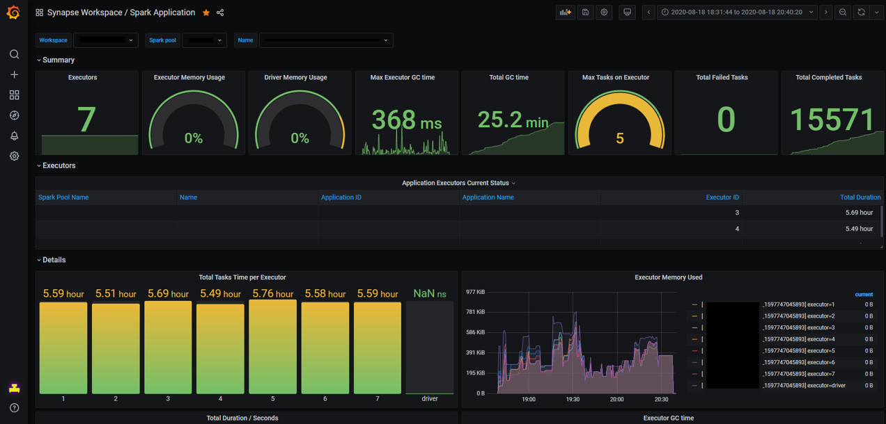

# Monitor Apache Spark Applications metrics with Prometheus and Grafana

## Overview

In this tutorial, you will learn how to deploy the Apache Spark application metrics solution to an Azure Kubernetes Service (AKS) cluster and learn how to integrate the Grafana dashboards.

You can use this solution to collect and query the Apache Spark metrics data near real time. The integrated Grafana dashboards allow you to diagnose and monitor your Apache Spark application. The source code and the configurations have been open-sourced on GitHub.

## Prerequisites

1.	[Azure CLI](/cli/azure/install-azure-cli)
2.	[Helm client 3.30+](https://github.com/helm/helm/releases)
3.	[kubectl](https://kubernetes.io/docs/tasks/tools/install-kubectl/)
4.	[Azure Kubernetes Service (AKS)](https://azure.microsoft.com/services/kubernetes-service/)

Or use the [Azure Cloud Shell](https://shell.azure.com/), which already includes the Azure CLI, Helm client and kubectl out of the box.

## Log in to Azure

```azurecli
az login
az account set --subscription "<subscription_id>"
```

## Create an Azure Kubernetes service instance (AKS)

Use the Azure CLI command to create a Kubernetes cluster in your subscription.

```
az aks create --name <kubernetes_name> --resource-group <kubernetes_resource_group> --location <location> --node-vm-size Standard_D2s_v3
az aks get-credentials --name <kubernetes_name> --resource-group <kubernetes_resource_group>
```

Note: This step can be skipped if you already have an AKS cluster.

## Create a service principal and grant permission to Synapse workspace

```azurecli
az ad sp create-for-rbac --name <service_principal_name> --role Contributor --scopes /subscriptions/<subscription_id>
```

The result should look like:

```json
{
  "appId": "abcdef...",
  "displayName": "<service_principal_name>",
  "name": "http://<service_principal_name>",
  "password": "abc....",
  "tenant": "<tenant_id>"
}
```

Note down the appId, password, and tenantID.

[](./media/monitor-azure-synapse-spark-application-level-metrics/screenshot-grant-permission-srbac-new.png#lightbox)

1. Log in to your [Azure Synapse Analytics workspace](https://web.azuresynapse.net/) as Synapse Administrator

2. In Synapse Studio, on the left-side pane, select **Manage > Access control**

3. Click the Add button on the upper left to **add a role assignment**

4. For Scope, choose **Workspace**

5. For Role, choose **Synapse Compute Operator**

6. For Select user, input your **<service_principal_name>** and click your service principal

7. Click **Apply** (Wait 3 minutes for permission to take effect.)

> [!NOTE]
> Please make sure your service principal is at least "Reader" role in your Synapse workspace. Go to Access Control (IAM) tab of the Azure portal and check the permission settings.

## Install connector, Prometheus server, Grafana dashboard

1. Add synapse-charts repo to Helm client.

```bash
helm repo add synapse-charts https://github.com/microsoft/azure-synapse-spark-metrics/releases/download/helm-chart
```

2.	Install components through Helm client:

```bash
helm install spo synapse-charts/synapse-prometheus-operator --create-namespace --namespace spo \
    --set synapse.workspaces[0].workspace_name="<workspace_name>" \
    --set synapse.workspaces[0].tenant_id="<tenant_id>" \
    --set synapse.workspaces[0].service_principal_name="<service_principal_app_id>" \
    --set synapse.workspaces[0].service_principal_password="<service_principal_password>" \
    --set synapse.workspaces[0].subscription_id="<subscription_id>" \
    --set synapse.workspaces[0].resource_group="<workspace_resource_group_name>"
```

 - workspace_name: Synapse workspace name.
 - subscription_id: Synapse workspace subscription ID.
 - workspace_resource_group_name: Synapse workspace resource group name.
 - tenant_id: Synapse workspace tenant ID.
 - service_principal_app_id: The service principal "appId"
 - service_principal_password: The service principal password you created.

## Log in to Grafana

Get the default password and address of Grafana. You may change the password in the Grafana settings.

```bash
kubectl get secret --namespace spo spo-grafana -o jsonpath="{.data.admin-password}" | base64 --decode ; echo
kubectl -n spo get svc spo-grafana
```

Get service ip, copy & paste the external ip to browser, and login with username "admin" and the password.

## Use Grafana Dashboards

Find Synapse Dashboard on the upper left corner of the Grafana page (Home -> Synapse Workspace / Synapse Application), try to run an example code in Synapse Studio and wait a few seconds for the metrics pulling.

Also, you can use the "Synapse Workspace / Workspace" and "Synapse Workspace / Apache Spark pools" dashboards to get an overview of your workspace and your Apache Spark pools.

## Uninstall

Remove the components by Helm command as follows.

```bash
helm delete <release_name> -n <namespace>
```

Delete the AKS cluster.

```azurecli
az aks delete --name <kubernetes_cluster_name> --resource-group <kubernetes_cluster_rg>
```

## Components introduction

Azure Synapse Analytics provides a [Helm chart](https://github.com/microsoft/azure-synapse-spark-metrics/tree/main/helm) based on Prometheus Operator and Synapse Prometheus Connector. The Helm chart includes Prometheus server, Grafana server, and Grafana dashboards for Apache Spark application-level metrics. You can use [Prometheus](https://prometheus.io/), a popular open-source monitoring system, to collect these metrics in near real-time and use [Grafana](https://github.com/grafana/grafana) for visualization.

### Synapse Prometheus Connector

Synapse Prometheus Connector helps to connect Azure Synapse Apache Spark pool and your Prometheus server. It implements:

1.	Authentication: It is AAD-based authentication and can automatically refresh the AAD token of the service principal for application discovery, metrics ingestion and other functions.
2.	Apache Spark application discovery: When you submit applications in the target workspace, Synapse Prometheus Connector can automatically discover these applications.
3.	Apache Spark application metadata: It collects basic application information and exports the data to Prometheus.

Synapse Prometheus Connector is released as a docker image hosted on [Microsoft Container Registry](https://github.com/microsoft/containerregistry). It is open-source and is located in [Azure Synapse Apache Spark application metrics](https://github.com/microsoft/azure-synapse-spark-metrics).

### Prometheus server

Prometheus is an open-source monitoring and alerting toolkit. Prometheus graduated from the Cloud Native Computing Foundation (CNCF) and became the de facto standard for cloud-native monitoring. Prometheus can help us collect, query, and store massive amounts of time series data, and it can be easily integrated with Grafana. In this solution, we deploy the Prometheus component based on the helm chart.

### Grafana and dashboards

Grafana is open-source visualization and analytics software. It allows you to query, visualize, alert on, and explore your metrics. Azure Synapse Analytics provides a set of default Grafana dashboards to visualize Apache Spark application-level metrics.

The "Synapse Workspace / Workspace" dashboard provides a workspace level view of all the Apache Spark pools, application counts, cpu cores, etc.

[](./media/monitor-azure-synapse-spark-application-level-metrics/screenshot-dashboard-workspace.png#lightbox)

The "Synapse Workspace / Apache Spark pools" dashboard contains the metrics of Apache Spark applications running in the selected Apache Spark pool during the time period.

[](./media/monitor-azure-synapse-spark-application-level-metrics/screenshot-dashboard-sparkpool.png#lightbox)

The "Synapse Workspace / Apache Spark Application" dashboard contains the selected Apache Spark application.

[](./media/monitor-azure-synapse-spark-application-level-metrics/screenshot-dashboard-application.png#lightbox)

The above dashboard templates have been open-sourced in [Azure Synapse Apache Spark application metrics](https://github.com/microsoft/azure-synapse-spark-metrics/tree/main/helm/synapse-prometheus-operator/grafana_dashboards).
