# Tutorial: Create an Apache Spark applications with VSCode using a Synapse workspace

Learn how to use Apache Spark & Hive Tools for Visual Studio Code. Use the tools to create and submit Apache Hive batch jobs, interactive Hive queries, and PySpark scripts for Apache Spark. First we'll describe how to install Spark & Hive Tools in Visual Studio Code. Then we'll walk through how to submit jobs to Spark & Hive Tools.

Spark & Hive Tools can be installed on platforms that are supported by Visual Studio Code. Note the following prerequisites for different platforms.

## Prerequisites

The following items are required for completing the steps in this article:

- A serverless Apache Spark pool. To create a serverless Apache Spark pool, see [Create Apache Spark pool using Azure portal](../../synapse-analytics/quickstart-create-apache-spark-pool-portal.md).
- [Visual Studio Code](https://code.visualstudio.com/).
- [Mono](https://www.mono-project.com/docs/getting-started/install/). Mono is required only for Linux and macOS.
- [A PySpark interactive environment for Visual Studio Code](../../hdinsight/set-up-pyspark-interactive-environment.md).
- A local directory. This article uses  **C:\HD\Synaseexample**.

## Install Spark & Hive Tools

After you meet the prerequisites, you can install Spark & Hive Tools for Visual Studio Code by following these steps:

1. Open Visual Studio Code.

2. From the menu bar, navigate to **View** > **Extensions**.

3. In the search box, enter **Spark & Hive**.

4. Select **Spark & Hive Tools** from the search results, and then select **Install**:

     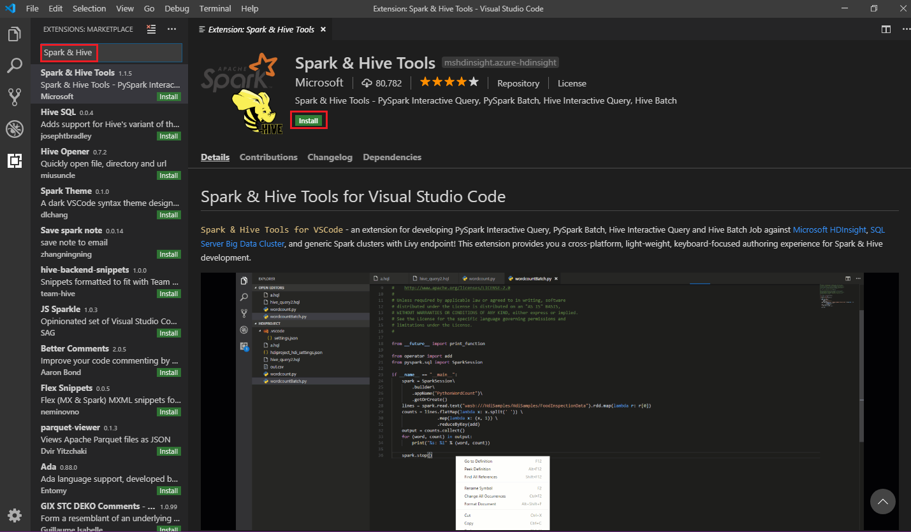

5. Select **Reload** when necessary.

## Open a work folder

To open a work folder and to create a file in Visual Studio Code, follow these steps:

1. From the menu bar, navigate to **File** > **Open Folder...** > **C:\HD\Synaseexample**, and then select the **Select Folder** button. The folder appears in the **Explorer** view on the left.

2. In **Explorer** view, select the **Synaseexample** folder, and then select the **New File** icon next to the work folder:

     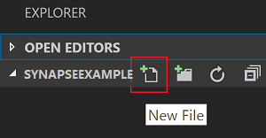

3. Name the new file by using the `.py` (Spark script) file extension. This example uses **HelloWorld.py**.

## Connect to your Spark pools

Sign in to Azure subscription to connect to your Spark pools.

### Sign in to your Azure subscription

Follow these steps to connect to Azure:

1. From the menu bar, navigate to **View** > **Command Palette...**, and enter **Azure: Sign In**:

     

2. Follow the sign-in instructions to sign in to Azure. After you're connected, your Azure account name shows on the status bar at the bottom of the Visual Studio Code window.

## Set the default Spark pool

1. Reopen the **Synaseexample** folder that was discussed [earlier](#open-a-work-folder), if closed.  

2. Select the **HelloWorld.py** file that was created [earlier](#open-a-work-folder). It opens in the script editor.

3. Right-click the script editor, and then select **Synapse: Set default Spark pool**.  

4. [Connect](#connect-to-your-spark-pools) to your Azure account if you haven't yet done so.

5. Select a Spark pool as the default Spark pool for the current script file. The tools automatically update the **.VSCode\settings.json** configuration file:

     

## Submit interactive Synapse PySpark queries to Spark pool

Users can perform Synapse PySpark interactive on Spark pool in the following ways:

### Using the Synapse PySpark interactive command in PY file
Using the PySpark interactive command to submit the queries, follow these steps:

1. Reopen the **Synaseexample** folder that was discussed [earlier](#open-a-work-folder), if closed.  

2. Create a new **HelloWorld.py** file, following the [earlier](#open-a-work-folder) steps.

3. Copy and paste the following code into the script file:

```python
import sys
from operator import add
from pyspark.sql import SparkSession, Row
 
spark = SparkSession\
 .builder\
 .appName("PythonWordCount")\
 .getOrCreate()
 
data = [Row(col1='pyspark and spark', col2=1), Row(col1='pyspark', col2=2), Row(col1='spark vs hadoop', col2=2), Row(col1='spark', col2=2), Row(col1='hadoop', col2=2)]
df = spark.createDataFrame(data)
lines = df.rdd.map(lambda r: r[0])
 
counters = lines.flatMap(lambda x: x.split(' ')) \
 .map(lambda x: (x, 1)) \
 .reduceByKey(add)
 
output = counters.collect()
sortedCollection = sorted(output, key = lambda r: r[1], reverse = True)
 
for (word, count) in sortedCollection:
 print("%s: %i" % (word, count))
```

4. The prompt to install PySpark/Synapse Pyspark kernel is displayed in the lower right corner of the window. You can click on **Install** button to proceed for the PySpark/Synapse Pyspark installations; or click on **Skip** button to skip this step.

     

5. If you need to install it later, you can navigate to **File** > **Preference** > **Settings**, then uncheck **Hdinsight: Enable Skip Pyspark Installation** in the settings. 
    
     

6. If the installation is successful in step 4, the "PySpark/Synapse Pyspark installed successfully" message box is displayed in the lower right corner of the window. Click on **Reload** button to reload the window.

     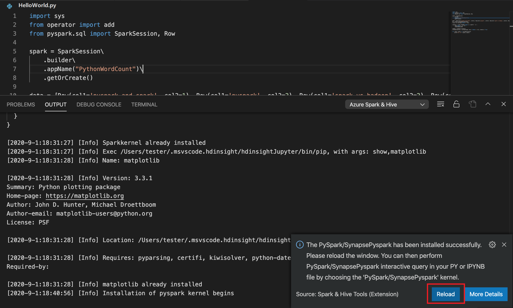

7. From the menu bar, navigate to **View** > **Command Palette...** or use the **Shift + Ctrl + P** keyboard shortcut, and enter **Python: Select Interpreter to start Jupyter Server**.

     

8. Select the python option below.

     
    
9. From the menu bar, navigate to **View** > **Command Palette...** or use the **Shift + Ctrl + P** keyboard shortcut, and enter **Developer: Reload Window**.

     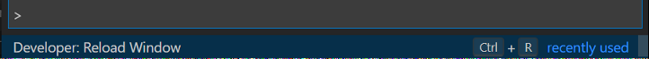

10. [Connect](#connect-to-your-spark-pools) to your Azure account if you haven't yet done so.

11. Select all the code, right-click the script editor, and select **Synapse: Pyspark Interactive** to submit the query. 

     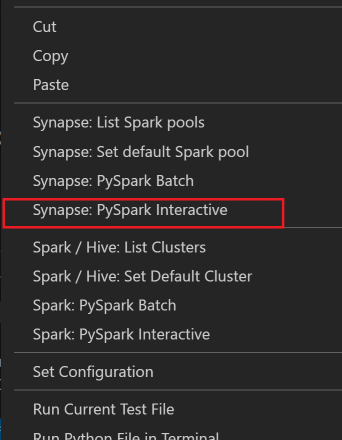

12. Select the Spark pool, if you haven't specified a default Spark pool. After a few moments, the **Python Interactive** results appear in a new tab. Click on PySpark to switch the kernel to **Synapse PySpark**, then, submit the selected code again, and the code will run successfully. The tools also let you submit a block of code instead of the whole script file by using the context menu:

     

### Perform interactive query in PY file using a #%% comment

1. Add **#%%** before the code to get notebook experience.

     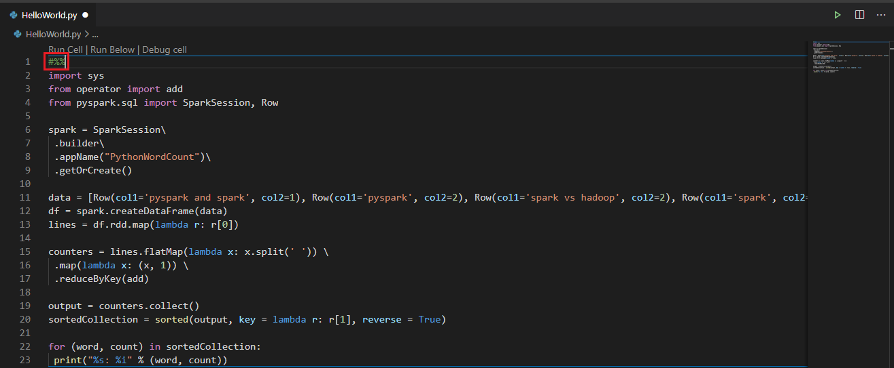

2. Click on **Run Cell**. After a few moments, the Python Interactive results appear in a new tab. Click on PySpark to switch the kernel to **Synapse PySpark**, then, click on **Run Cell** again, and the code will run successfully. 

     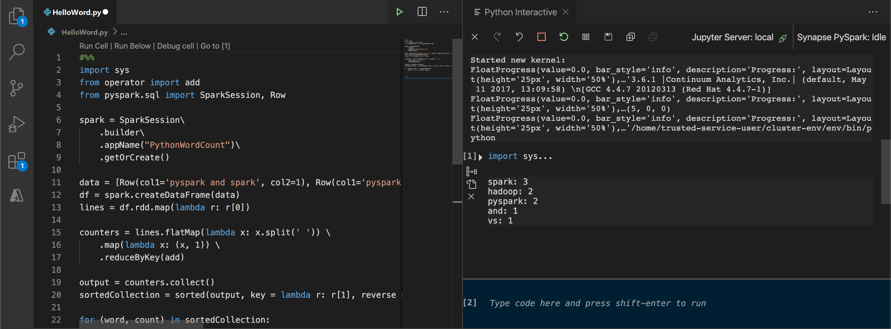

## Leverage IPYNB support from Python extension

1. You can create a Jupyter Notebook by command from the Command Palette or by creating a new .ipynb file in your workspace. For more information, see [Working with Jupyter Notebooks in Visual Studio Code](https://code.visualstudio.com/docs/python/jupyter-support)

2. Click on **Run cell** button, follow the prompts to **Set the default spark pool** (strongly encourage to set default cluster/pool every time before opening a notebook) and then, **Reload** window.

     

3. Click on PySpark to switch kernel to **Synapse Pyspark**, and then click on **Run Cell**, after a while, the result will be displayed.

     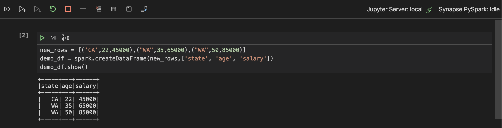


> [!NOTE]
>
>1. Ms-python >=2020.5.78807 version is not supported on this extention  is a [known issue](#known-issues).
>  
>2. Switch to Synapse Pyspark kernel, disabling auto-settings in Azure Portal is encouraged. Otherwise it may take a long while to wake up the cluster and set synapse kernel for the first time use. 
>
>    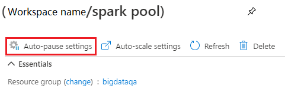

## Submit PySpark batch job to Spark pool

1. Reopen the **Synaseexample** folder that you discussed [earlier](#open-a-work-folder), if closed.  

2. Create a new **BatchFile.py** file by following the [earlier](#open-a-work-folder) steps.

3. Copy and paste the following code into the script file:

    ```python
    from __future__ import print_function
    import sys
    from operator import add
    from pyspark.sql import SparkSession
    if __name__ == "__main__":
        spark = SparkSession\
            .builder\
            .appName("PythonWordCount")\
            .getOrCreate()
    
        lines = spark.read.text('/HdiSamples/HdiSamples/SensorSampleData/hvac/HVAC.csv').rdd.map(lambda r: r[0])
        counts = lines.flatMap(lambda x: x.split(' '))\
                    .map(lambda x: (x, 1))\
                    .reduceByKey(add)
        output = counts.collect()
        for (word, count) in output:
            print("%s: %i" % (word, count))
        spark.stop()
    ```

4. [Connect](#connect-to-your-spark-pools) to your Azure account if you haven't yet done so.

5. Right-click the script editor, and then select **Synapse: PySpark Batch**.

6. Select a Spark pool to submit your PySpark job to:

     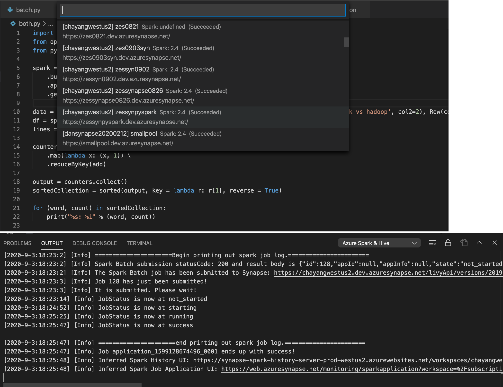

After you submit a batch job to spark pool, submission logs appear in the **OUTPUT** window in Visual Studio Code. The **Spark UI** URL and **Spark Job Application UI** URL are also shown. You can open the URL in a web browser to track the job status.

## Access and manage Synapse Workspace

You can perform different operations in Azure Explorer within Spark & Hive tools for VSCode. From the Azure Explorer.


### Launch workspace

1. From Azure Explorer, navigate to **SYNAPSE**, expand it, and display the Synapse Subscription list.

     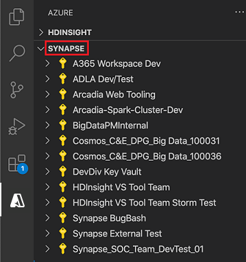

2. Click on Subscription of Synapse workspace, expand it, and display the workspace list.

3. Right-click a workspace, then select **View Apache Spark applications**, the Apache Spark application page in the Synapse Studio website will be opened.

     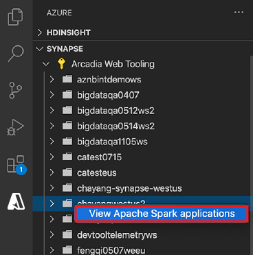

     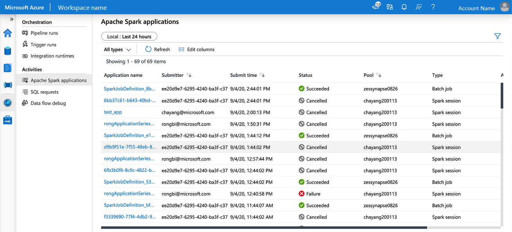

4. Expand a workspace, **Default Storage** and **Spark Pools** are displayed.

5. Right-click on **Default Storage**, the **Copy Full Path** and **Open in Synapse Studio** are displayed. 

     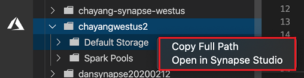

     - Click on **Copy Full Path**, the Primary ADLS Gen2 account URL will be copied, you can paste it where you need。

     - Click on **Open in Synapse Studio**, the Primary Storage Account will be opened in Synapse Studio.

     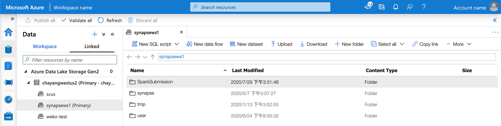

6. Expand the **Default Storage**, the Primary Storage Account is displayed.

7. Expand the **Spark Pools**, all spark pools in the workspace are displayed.

     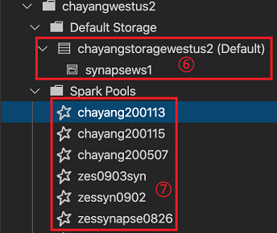


## Known issues

### ms-python >=2020.5.78807 version is not supported on this extention 

"Failed to connect to Jupyter notebook." is a known issue for python version >=2020.5.78807. It is recommended that users use the **[2020.4.76186](https://github.com/microsoft/vscode-python/releases/download/2020.4.76186/ms-python-release.vsix)** version of ms-python to avoid this issue.

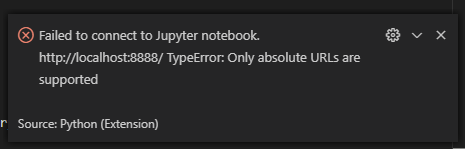


## Next steps

- [Azure Synapse Analytics](../overview-what-is.md)
- [Create a new Apache Spark pool for an Azure Synapse Analytics workspace](../../synapse-analytics/quickstart-create-apache-spark-pool-studio.md)
