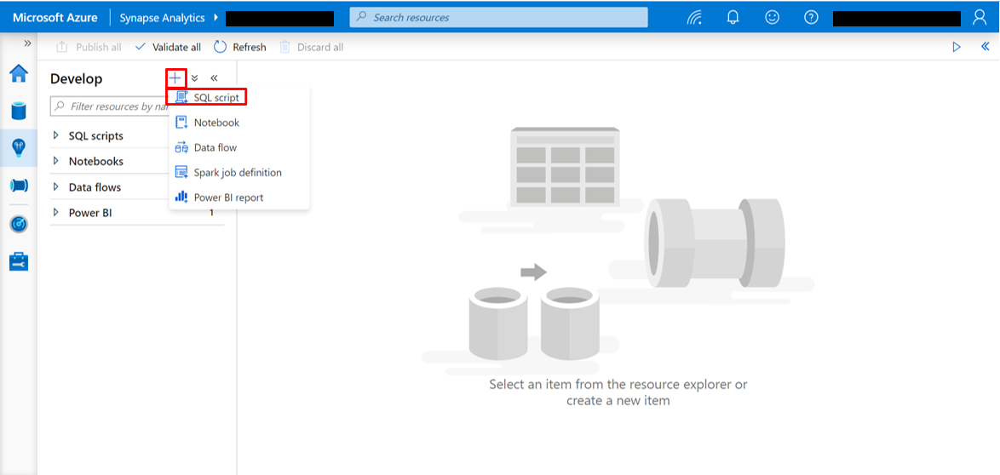
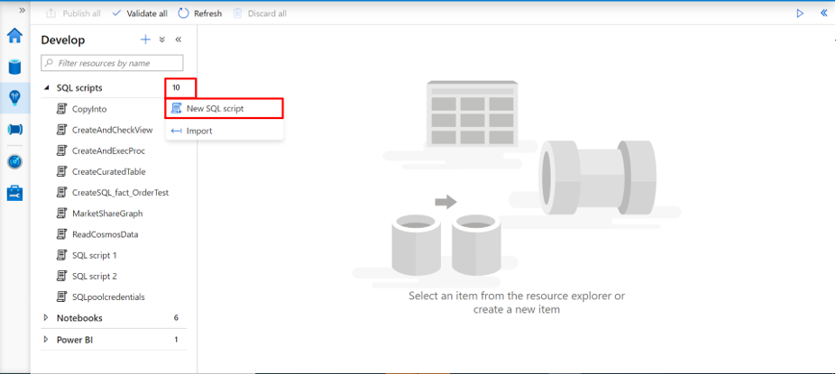
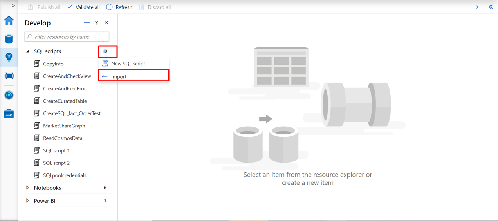
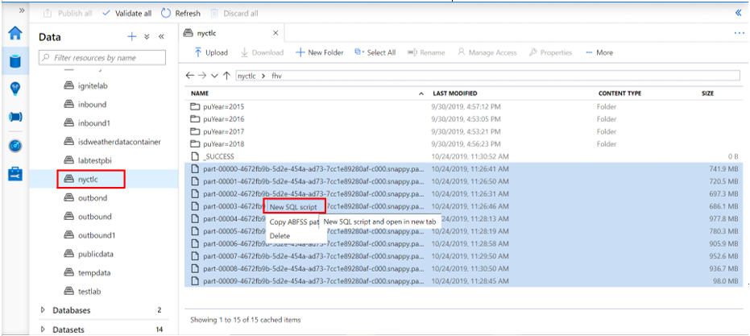
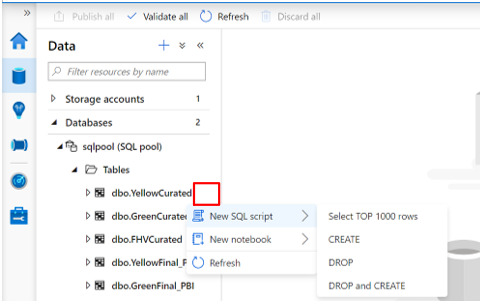
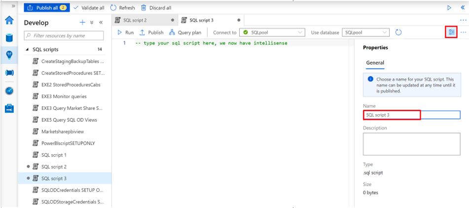
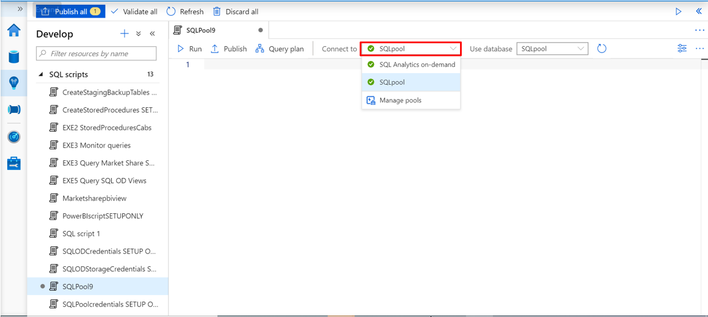
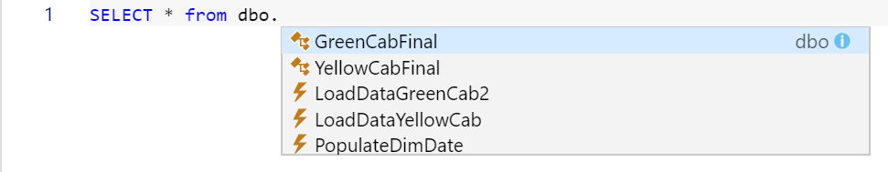
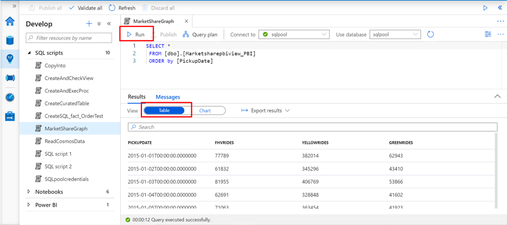
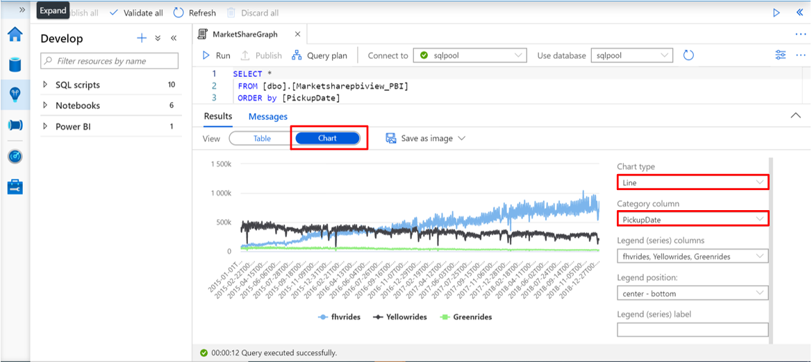

# Using SQL script in Azure Synapse Studio

Azure Synapse Studio provides a SQL script web interface for you to author SQL queries connecting to SQL pool and SQL on-demand. There are several ways to start the authoring experience with SQL script. You can:
1. create a new SQL script from 

## Create a SQL script and author its content

There are a few ways to start the authoring experience in SQL script. You can create a new SQL script:

## Add new resource by selecting the "+" icon and choose "SQL script" 
> [!div class="mx-imgBorder"] 
>

## Choose "New SQL script" from the "Actions" menu under Develop SQL scripts. 

> [!div class="mx-imgBorder"] 
> 

## Choose "Import" from the "Actions" menu under Develop SQL scripts and select an existing SQL script from your local storage. Then continue the authoring process following the instructions from step 1.a

> [!div class="mx-imgBorder"] 
> 

## Exploring Data from Storage accounts and Database using "SQL script"
a. Parquet file using SQL analytics on-demand: You can explore Parquet files in a Storage Account using SQL script to preview the file content 

> [!div class="mx-imgBorder"] 
> 

## SQL Tables, external tables, views: by clicking on the "Actions" menu under Data you can perform several actions like: "New SQL script" "Select TOP 1000 rows", "CREATE", "DROP and CREATE". Explore the available gesture by clicking on the right nodes of SQL Pool and SQL analytics on-demand 

> [!div class="mx-imgBorder"] 
> 

## Create your SQL script

1. Choose a name for your SQL script by clicking on the "Property" button   and replace the default name assigned to the SQL script
> [!div class="mx-imgBorder"] 
> 

1. Choose the specific SQL Pool or the SQL On-Demand from the "Connect to" drop-down menu and if necessary choose the database from "Use database"

> [!div class="mx-imgBorder"] 
> 

1. Start authoring your SQL script and leverage the intellisense feature

> [!div class="mx-imgBorder"] 
> 

## Run your SQL script
Click the "Run" button to execute your SQL script. The results are displayed by default in a table 

> [!div class="mx-imgBorder"] 
> 

## Export your results
You can export the results to your local storage in different formats (including CSV, Excel, JSON, XML) by clicking "Export results" and choose the extension. 
You can also visualize the SQL script results in a chart by clicking on the "Chart" button. Select the "Chart type" and "Category column". You can finally export the chart into a picture by clicking on "Save as image". 

> [!div class="mx-imgBorder"] 
> 

## Next steps

For more information about authoring a SQL script, see:
[Azure Synapse Analytics](https://docs.microsoft.com/azure/synapse-analytics)