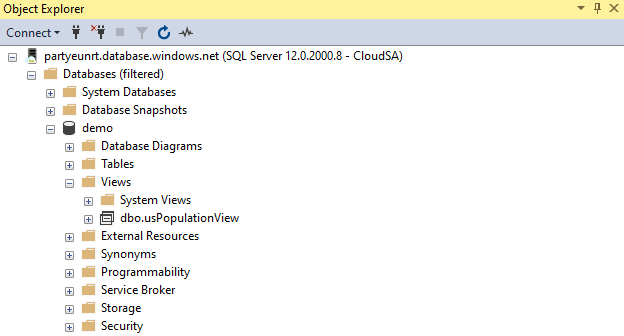
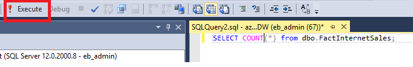
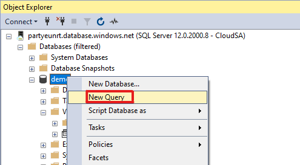

# Connect to SQL Analytics with SQL Server Management Studio (SSMS)
> [!div class="op_single_selector"]
> * [Azure Data Studio](get-started-azure-data-studio.md)
> * [Power BI](get-started-power-bi-professional.md)
> * [Visual Studio](../../sql-data-warehouse/sql-data-warehouse-query-visual-studio.md)
> * [sqlcmd](get-started-connect-sqlcmd.md)
> * [SSMS](get-started-ssms.md)
> 
> 

You can use SQL Server Management Studio (SSMS) to connect to and query SQL Analytics through either the SQL on-demand or SQL pool resources. 

## Supported tools for SQL on-demand
Azure Data Studio is a fully supported tool. SSMS is supported partially from version 18.5 and with limited features such as connecting and querying. 

## Prerequisites
Before you begin, make sure you've completed the following prerequisites:  

* For SQL Pool, you need an existing data warehouse. To create one, see [Create a data warehouse](https://docs.microsoft.com/azure/sql-data-warehouse/create-data-warehouse-portal#create-a-data-warehouse). For SQL on-demand, one is already provisioned in your workspace at creation time.  
* Install SQL Server Management Studio (SSMS). You can [install SSMS](https://docs.microsoft.com/sql/ssms/download-sql-server-management-studio-ssms?view=sql-server-ver15) for free if you don't already have it.
* Have the fully qualified SQL server name. To find this, see [Connect to SQL Analytics](connect-overview.md).

## 1. Connect to SQL Analytics


### SQL pool
1. Open SSMS.
2. Open Object Explorer. To do this, select **File** > **Connect Object Explorer**.
   
    
3. Fill in the fields in the Connect to Server window.
   
    
   
   * **Server name**: Enter the **server name** previously identified.
   * **Authentication**: Select **SQL Server Authentication** or **Active Directory Integrated Authentication**.
   * **User Name** and **Password**: Enter your user name and password if SQL Server Authentication was selected above.
   * Click **Connect**.
4. To explore, expand your Azure SQL server. You can view the databases associated with the server. Expand AdventureWorksDW to see the tables in your sample database.
   
    

### SQL on-demand
1. Open SSMS.
2. Open the Object Explorer. To do this, select **File** > **Connect Object Explorer**.
   
    
3. Fill in the fields in the Connect to Server window.
   
    
   
   * **Server name**: Enter the **server name** previously identified.
   * **Authentication**: Select **SQL Server Authentication** or **Active Directory Integrated Authentication**:
   * **User Name** and **Password**: Enter your user name and password if SQL Server Authentication was selected above.
   * Click **Connect**.

4. To explore, expand your Azure SQL server. You can view the databases associated with the server. Expand *demo* to see the content in your sample database.
   
    


## 2. Run a sample query

### SQL pool
Now that a database connection has been established, you'll write a query.

1. Right-click your database in SQL Server Object Explorer.
2. Select **New Query**. A new query window opens.
   
    
3. Copy this T-SQL query into the query window:
   
    ```sql
    SELECT COUNT(*) FROM dbo.FactInternetSales;
    ```
4. Run the query. To do this, click `Execute` or use the following shortcut: `F5`.
   
    
5. Look at the query results. In this example, the FactInternetSales table has 60398 rows.
   
    

### SQL on-demand

Now that you've established a database connection, you'll write a query.

1. Right-click your database in SQL Server Object Explorer.
2. Select **New Query**. A new query window opens.
   
    
3. Copy the following T-SQL query into the query window:
   
    ```sql
    SELECT COUNT(*) FROM demo.dbo.usPopulationView
    ```
4. Run the query. To do this, click `Execute` or use the following shortcut: `F5`.
   
    
5. Look at the query results. In this example, the usPopulationView view has 3664512 rows.
   
    

## Next steps
Now that you can connect and query, try [visualizing the data with Power BI](get-started-power-bi-professional.md).

To configure your environment for Azure Active Directory authentication, see [Authenticate to SQL Analytics](../../sql-data-warehouse/sql-data-warehouse-authentication.md).

