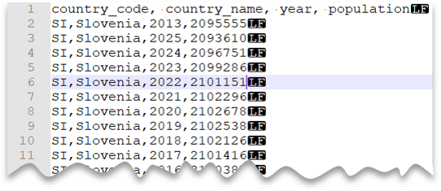

# Quickstart: Querying single CSV file

In this article, you will learn how to query single CSV file with SQL On-demand. 
CSV files may have different formats: 

- With and without header row
- Comma and tab-delimited values
- Windows and Unix style line endings
- Non-quoted and quoted values, and escaping characters

In this article, we will cover all these variations.


## Prerequisites

Before reading rest of the article, make sure to check following articles:
- [First-time setup](query-data-storage.md#first-time-setup)
- [Prerequisites](query-data-storage.md#prerequisites)


## Read CSV file - no header row, Windows style new line

Following query shows how to read CSV file without header row, with Windows-style new line and comma-delimited columns.

File preview:


```sql
SELECT * 
FROM OPENROWSET(
		BULK 'https://sqlondemandstorage.blob.core.windows.net/csv/population/population.csv',
 		FORMAT = 'CSV', 
		FIELDTERMINATOR =',', 
		ROWTERMINATOR = '\n'
	)
WITH (
	[country_code] VARCHAR (5) COLLATE Latin1_General_BIN2,
	[country_name] VARCHAR (100) COLLATE Latin1_General_BIN2,
	[year] smallint,
	[population] bigint
) AS [r]
WHERE 
	country_name = 'Luxembourg' 
	AND year = 2017
```

## Read CSV file - no header row, Unix-style new line

Following query shows how to read file without header row, with Unix-style new line and comma-delimited columns. Note different location of file comparing to other examples.

File preview:


```sql
SELECT * 
FROM OPENROWSET(
		BULK 'https://sqlondemandstorage.blob.core.windows.net/csv/population-unix/population.csv', 
		FORMAT = 'CSV', 
		FIELDTERMINATOR =',', 
		ROWTERMINATOR = '0x0a'
	)
WITH (
	[country_code] VARCHAR (5) COLLATE Latin1_General_BIN2,
	[country_name] VARCHAR (100) COLLATE Latin1_General_BIN2,
	[year] smallint,
	[population] bigint
) AS [r]
WHERE 
	country_name = 'Luxembourg' 
	AND year = 2017
```


## Read CSV file - header row, Unix-style new line

Following query shows how to read file with header row, with Unix-style new line and comma-delimited columns. Note different location of file comparing to other examples.

File preview:




```sql
SELECT * 
FROM OPENROWSET(
		BULK 'https://sqlondemandstorage.blob.core.windows.net/csv/population-unix-hdr/population.csv',
		FORMAT = 'CSV', 
		FIELDTERMINATOR =',', 
		ROWTERMINATOR = '0x0a', 
		FIRSTROW = 2
	)
    WITH (
        [country_code] VARCHAR (5) COLLATE Latin1_General_BIN2,
        [country_name] VARCHAR (100) COLLATE Latin1_General_BIN2,
        [year] smallint,
        [population] bigint
    ) AS [r]
WHERE 
	country_name = 'Luxembourg' 
	AND year = 2017
```


## Read CSV file - header row, Unix-style new line, quoted

Following query shows how to read file with header row, with Unix-style new line, comma-delimited columns and quoted values. Note different location of file comparing to other examples.

File preview:


```sql
SELECT * 
FROM OPENROWSET(
		BULK 'https://sqlondemandstorage.blob.core.windows.net/csv/population-unix-hdr-quoted/population.csv',
		FORMAT = 'CSV', 
		FIELDTERMINATOR =',', 
		ROWTERMINATOR = '0x0a', 
		FIRSTROW = 2,
		FIELDQUOTE = '"'
	)
    WITH (
        [country_code] VARCHAR (5) COLLATE Latin1_General_BIN2,
        [country_name] VARCHAR (100) COLLATE Latin1_General_BIN2,
        [year] smallint,
        [population] bigint
    ) AS [r]
WHERE 
	country_name = 'Luxembourg' 
	AND year = 2017
```

> [!NOTE]
> Note that this query would return same results if we omit FIELDQUOTE parameter since default value for FIELDQUOTE is double-quote.


## Read CSV file - header row, Unix-style new line, escape

Following query shows how to read file with header row, with Unix-style new line, comma-delimited columns and escape char used for field delimiter (comma) within values. Note different location of file comparing to other examples.

File preview:


```sql
SELECT * 
FROM OPENROWSET(
		BULK 'https://sqlondemandstorage.blob.core.windows.net/csv/population-unix-hdr-escape/population.csv',
		FORMAT = 'CSV', 
		FIELDTERMINATOR =',', 
		ROWTERMINATOR = '0x0a', 
		FIRSTROW = 2,
		ESCAPECHAR = '\\'
	)
    WITH (
        [country_code] VARCHAR (5) COLLATE Latin1_General_BIN2,
        [country_name] VARCHAR (100) COLLATE Latin1_General_BIN2,
        [year] smallint,
        [population] bigint
    ) AS [r]
WHERE 
	country_name = 'Slov,enia' 
```

> [!NOTE]
> Note that this query would fail if ESCAPECHAR is not specified, since comma in "Slov,enia" would be treated as field delimiter instead of part of country name. "Slov,enia" would be treated as two columns, therefore particular row would have one column more than other rows and one column more than we defined in WITH clause.


## Read CSV file - header row, Unix-style new line, tab-delimited

Following query shows how to read file with header row, with Unix-style new line and tab-delimited columns. Note different location of file comparing to other examples.

File preview:


```sql
SELECT * 
FROM OPENROWSET(
		BULK 'https://sqlondemandstorage.blob.core.windows.net/csv/population-unix-hdr-tsv/population.csv',
		FORMAT = 'CSV', 
		FIELDTERMINATOR ='\t', 
		ROWTERMINATOR = '0x0a', 
		FIRSTROW = 2
	)
	WITH (
		[country_code] VARCHAR (5) COLLATE Latin1_General_BIN2,
		[country_name] VARCHAR (100) COLLATE Latin1_General_BIN2,
		[year] smallint,
		[population] bigint
	) AS [r]
WHERE 
	country_name = 'Luxembourg' 
	AND year = 2017
```


## Read CSV file - without specifying all columns

So far, we specified CSV file schema using WITH and listing all columns. You can specify only columns you actually need in your query by specifying ordinal number for each column you are interested in while omitting columns of no interest.

Following query returns number of distinct country names in file, specifying only columns that are needed:

> [!NOTE]
> Take a look at WITH clause in query below and note that there is "2" (without quotes) at the end of row where we define *[country_name]* column. It means that *[country_name]* column is second column in the file. Query will ignore all columns in file except the second one.

```sql
SELECT 
	COUNT(DISTINCT country_name) AS countries
FROM OPENROWSET(
		BULK 'https://sqlondemandstorage.blob.core.windows.net/csv/population/population.csv',
 		FORMAT = 'CSV', 
		FIELDTERMINATOR =',', 
		ROWTERMINATOR = '\n'
	)
WITH (
	--[country_code] VARCHAR (5) COLLATE Latin1_General_BIN2,
	[country_name] VARCHAR (100) COLLATE Latin1_General_BIN2 2
	--[year] smallint,
	--[population] bigint
) AS [r]
```


## Next steps

You can see more in [Querying folders and multiple CSV files](query-folders-multiple-csv-files.md).


Advance to the next article to learn how query folders and multiple CSV files.
> [!div class="nextstepaction"]
> [Querying folders and multiple CSV files](query-folders-multiple-csv-files.md)
