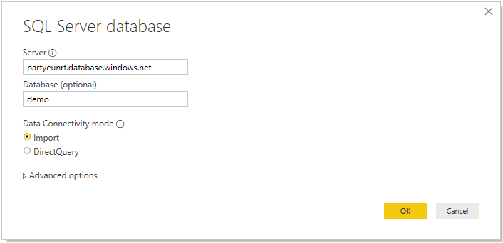

# Tutorial: BI Professional 

In this tutorial, we will go through steps how to connect SQL on-demand with Power BI desktop.


## Prerequisites

Tool to issue queries:

- SQL client of your choice:
    - Azure Data Studio
    - SQL Server Management Studio

- Power BI desktop installed

Parameters:

| Parameter                                 | Description                                                   |
| ----------------------------------------- | ------------------------------------------------------------- |
| SQL on-demand service endpoint address    | Will be used as server name                                   |
| SQL on-demand service endpoint region     | Will be used to determine what storage will we use in samples |
| Username and password for endpoint access | Will be used to access endpoint                               |
| Database you will use to create views     | This database will be used as starting point in samples       |

## First time setup

There are two steps prior to using samples:

- Create database for your views
- Create credentials to be used by SQL on-demand to access files in storage

### Create database

Since you will use demo environment, you should create your own database for demo purposes. Database is needed to create views in it. You will use this database in some of sample queries in this documentation. 

> Please note that databases are used only for view metadata, not for actual data.
>
> Please write down database name you use. you will need it later on.

```sql
DROP DATABASE IF EXISTS demo
```


### Create credentials

We need to create credential before you can run queries. This credential will be used by SQL on-demand service to access files in storage.

> Please note that you need to create credential for storage account that is located in your endpoint region. Although SQL on-demand can access storages from different regions, having storage and endpoint in same region will provide better performance experience.

**Code snippet on how to create credentials for Census data containers**, run:

```sql
IF EXISTS (SELECT * FROM sys.credentials WHERE name = 'https://azureopendatastorage.blob.core.windows.net/censusdatacontainer')
DROP CREDENTIAL [https://azureopendatastorage.blob.core.windows.net/censusdatacontainer]
Go

-- Create credentials for Census Data container which resides in a azure open data storage account
-- There is no secret. We are using public storage account which doesn't need secret
CREATE CREDENTIAL [https://azureopendatastorage.blob.core.windows.net/censusdatacontainer]  
WITH IDENTITY='SHARED ACCESS SIGNATURE',  
SECRET = ''
Go
```

## Provided demo data

Demo data contains following data sets:

- US population by gender and race for each US county sourced from 2000 and 2010 Decennial Census.
  - Parquet format

| Folder path                                                  | Description                                                  |
| ------------------------------------------------------------ | ------------------------------------------------------------ |
| /release/                                                    | Parent folder for data in demo storage account               |
| /release/us_population_county/                               | US population data files in Parquet format, partitioned by year using Hive/Hadoop partitioning scheme. |


## Preparing View for Power BI Desktop

It is required to expose data as views or external tables for Power BI to consume it.
Following query is going to create a view called "usPopulationView" inside a database with name "demo".

```sql
DROP VIEW IF EXISTS usPopulationView
GO

CREATE VIEW usPopulationView AS
SELECT 
    *
FROM  
	OPENROWSET(
        BULK 'https://azureopendatastorage.blob.core.windows.net/censusdatacontainer/release/us_population_county/year=20*/*.parquet', 
		FORMAT='PARQUET'
	) AS uspv
```

## Creating Power BI desktop report
Open Power BI desktop application and select "Get data" option.


### Step 1 - Select data source
Select "Azure" in the menu and then "Azure SQL Database".


### Step 2 - Select database
Write URL for the database and name of the database where view is residing.


### Step 3 - Select view
Select view "usPopulationView"


### Step 4 - Apply changes
After few seconds popup will show, click "Apply changes".


### Step 5 - Wait for a query to finish
After clicking "Apply changes", we should wait for a query to finish.


### Step 6 - Select columns of interest
After loading finishes, we should select following columns (with this order):

1. countyName
2. population
3. stateName


## Clean up resources

If you're not going to continue to use this report, delete resources with the following steps:

1. Delete credential for storage account

```sql
DROP CREDENTIAL [https://azureopendatastorage.blob.core.windows.net/censusdatacontainer]
```

2. Delete view

```sql
DROP VIEW usPopulationView
```
