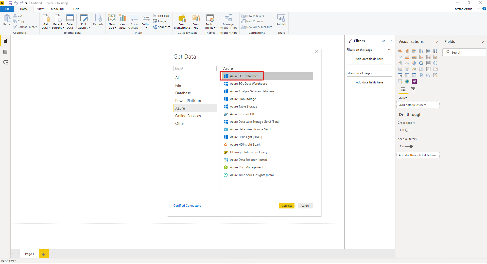
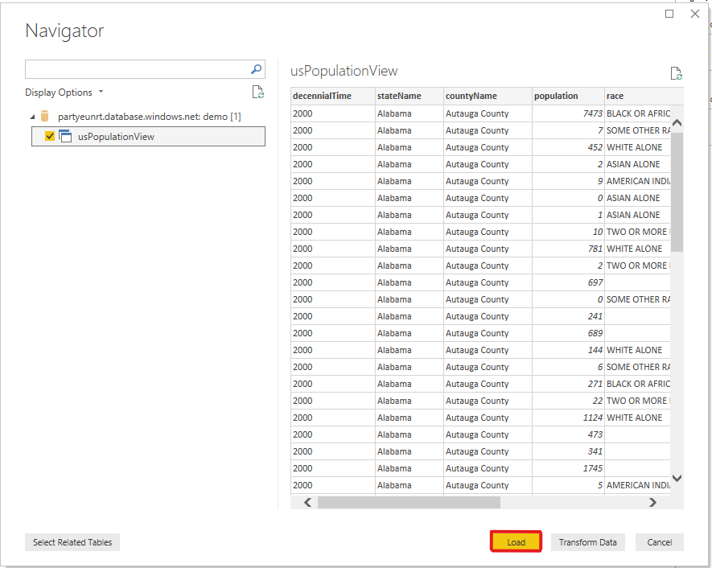
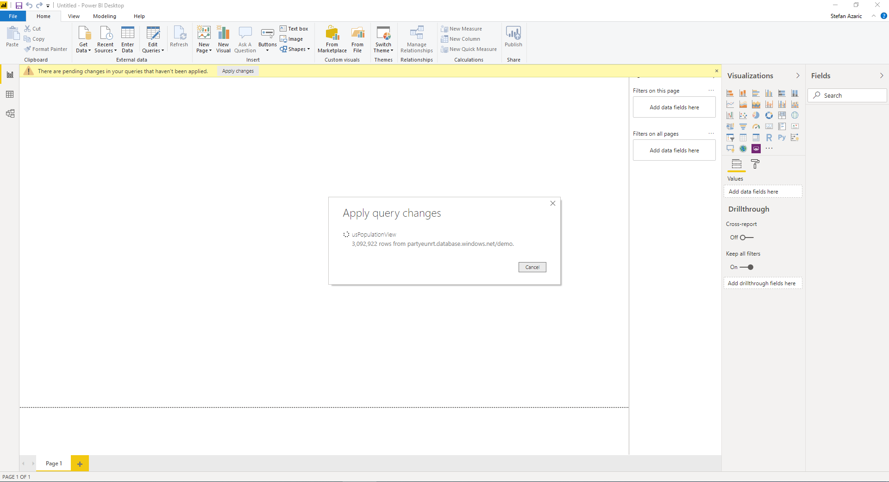

# Tutorial: Connect SQL on-demand to Power BI Desktop & create report

In this tutorial, you learn how to:

> [!div class="checklist"]
> - Create demo database 
> - Create view used for report 
> - Connect to Power BI Desktop
> - Create report based on view


## Prerequisites

To complete this tutorial, you need: 

- A SQL query tool, such as [Azure Data Studio](/sql/azure-data-studio/download-azure-data-studio), or [SQL Server Management Studio (SSMS)](/sql/ssms/download-sql-server-management-studio-ssms). 
- [Power BI Desktop](https://powerbi.microsoft.com/en-us/downloads/). 

Parameters:

| Parameter                                 | Description                                                   |
| ----------------------------------------- | ------------------------------------------------------------- |
| SQL on-demand service endpoint address    | Will be used as server name                                   |
| SQL on-demand service endpoint region     | Will be used to determine what storage will we use in samples |
| Username and password for endpoint access | Will be used to access endpoint                               |
| Database you will use to create views     | This database will be used as starting point in samples       |


## 1 - Create database

Since this is a demo environment, create your own database for demo purposes. This database is used to view metadata, and not actual data. 

To create the demo database, run the following Transact-SQL (T-SQL) code: 

```sql
-- Drop database if it exists
IF EXISTS (SELECT * FROM sys.sysdatabases WHERE name = 'Demo')
BEGIN
    DROP DATABASE Demo
END
GO

-- Create new database
CREATE DATABASE [Demo]
GO
```

## 2 - Create credential

A credential is necessary for the SQL on-demand service to access files in storage. Create the credential for a storage account that is located in the same region as your endpoint. Although SQL on-demand can access storage accounts from different regions, having the storage and endpoint in the same region provides better performance. 

To create the credential, run the following Transact-SQL (T-SQL) code: 

```sql
IF EXISTS (SELECT * FROM sys.credentials WHERE name = 'https://azureopendatastorage.blob.core.windows.net/censusdatacontainer')
DROP CREDENTIAL [https://azureopendatastorage.blob.core.windows.net/censusdatacontainer]
Go

-- Create credentials for Census Data container which resides in a azure open data storage account
-- There is no secret. We are using public storage account which doesn't need secret
CREATE CREDENTIAL [https://azureopendatastorage.blob.core.windows.net/censusdatacontainer]  
WITH IDENTITY='SHARED ACCESS SIGNATURE',  
SECRET = ''
Go
```

## 3 - Prepare view 

In this step, create the view based on the external demo data for Power BI to consume. 

Create the view `usPopulationView` inside the database `Demo` with the following query: 

```sql
DROP VIEW IF EXISTS usPopulationView
GO

CREATE VIEW usPopulationView AS
SELECT 
    *
FROM  
	OPENROWSET(
        BULK 'https://azureopendatastorage.blob.core.windows.net/censusdatacontainer/release/us_population_county/year=20*/*.parquet', 
		FORMAT='PARQUET'
	) AS uspv
```

The demo data contains the following data sets:

US population by gender and race for each US county sourced from 2000 and 2010 Decennial Census in parquet format. 

| Folder path                                                  | Description                                                  |
| ------------------------------------------------------------ | ------------------------------------------------------------ |
| /release/                                                    | Parent folder for data in demo storage account               |
| /release/us_population_county/                               | US population data files in Parquet format, partitioned by year using Hive/Hadoop partitioning scheme. |

## 4 - Create Power BI report 

In this step, create the report for Power BI Desktop. To do so, follow these steps:

1. Open the Power BI Desktop application and select **Get data**. 

   

1. Select **Azure** > **Azure SQL database**. 

   

1. Type the name of the server where the database is located in the **Server** field, and then type `Demo` in the database name. Select the **Import** option and then select **OK**. 

   

1. Select the view `usPopulationView`, and then select **Load**. 

   

1. Wait for the operation to complete, and then a pop-up will appear stating `There are pending changes in your queries that haven't been applied`. Select **Apply changes**. 

   

1. Wait for the **Apply query changes** dialog box to disappear, which may take a few minutes. 

   

1. Once the load completes, select the following columns in this order to create the report:
   - countyName
   - population
   - stateName 

   

## Clean up resources

Once you're done using this report, delete the resources with the following steps:

1. Delete the credential for the storage account

    ```sql
    DROP CREDENTIAL [https://azureopendatastorage.blob.core.windows.net/censusdatacontainer]
    ```

2. Delete the view

    ```sql
    DROP VIEW usPopulationView
    ```

3. Drop the database

   ```sql
   DROP DATABASE Demo
   ```


## Next steps

Advance to the next article to learn how to query storage files using SQL Analytics.
> [!div class="nextstepaction"]
> [Query storage files](development-storage-files-overview.md)
