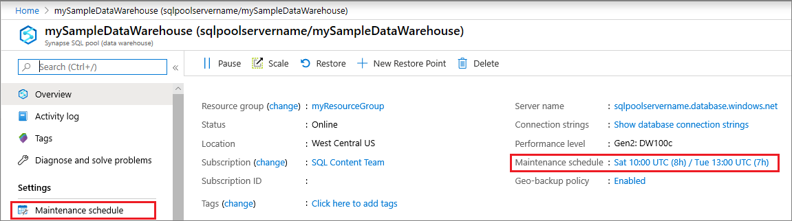
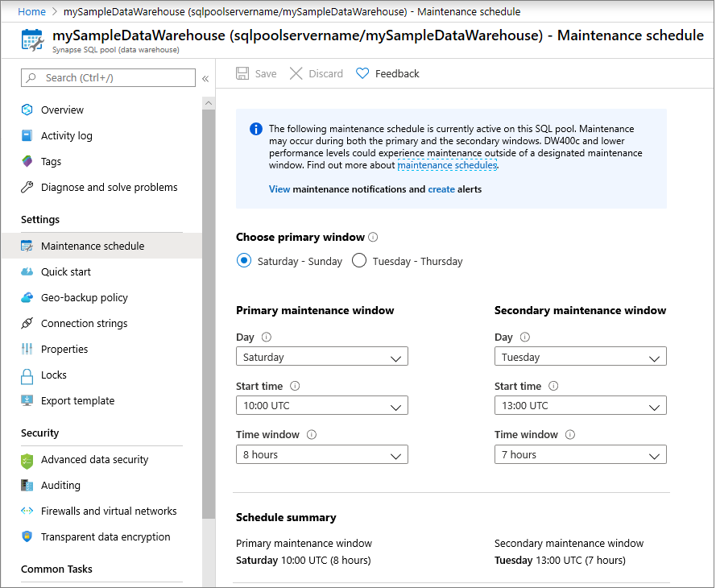
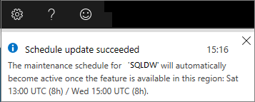

# Use maintenance schedules to manage service updates and maintenance

The maintenance schedule feature integrates the Service Health Planned Maintenance Notifications, Resource Health Check Monitor, and maintenance scheduling service for Synapse SQL pool (data warehouse) within Azure Synapse Analytics.

You should use maintenance scheduling to choose a time window when it's convenient to receive new features, upgrades, and patches. You will need to choose a primary and a secondary maintenance window within a seven-day period, each window must be within separate day ranges.

For example, you can schedule a primary window of Saturday 22:00 to Sunday 01:00, and then schedule a secondary window of Wednesday 19:00 to 22:00. If maintenance can't be performed during your primary maintenance window, it will try the maintenance again during your secondary maintenance window. Service maintenance could on occasion occur during both the primary and secondary windows. To ensure rapid completion of all maintenance operations, DW400c and lower data warehouse tiers could complete maintenance outside of a designated maintenance window.

All newly created data warehouse instances will have a system-defined maintenance schedule applied during deployment. The schedule can be edited as soon as deployment is complete.

Although a maintenance window can be between three and eight hours this does not mean the data warehouse will be offline for the duration. Maintenance can occur at any time within that window and you should expect a single disconnect during that period lasting ~5 -6 mins as the service deploys new code to your data warehouse. DW400c and lower may experience multiple brief losses in connectivity at various times during the maintenance window. When maintenance starts, all active sessions will be canceled, and non-committed transactions will be rolled back. To minimize instance downtime, make sure that your data warehouse has no long-running transactions before your chosen maintenance period.

All maintenance operations should finish within the specified maintenance windows unless we are required to deploy a time sensitive update. If your data warehouse is paused during a scheduled maintenance, it will be updated during the resume operation. You'll be notified immediately after your data warehouse maintenance is completed.

## Alerts and monitoring

Integration with Service Health notifications and the Resource Health Check Monitor allows customers to stay informed of impending maintenance activity. This automation takes advantage of Azure Monitor. You can decide how you want to be notified of impending maintenance events. Also, you can choose which automated flows will help you manage downtime and minimize operational impact.

A 24-hour advance notification precedes all maintenance events that aren't for the DWC400c and lower tiers.

> [!NOTE]
> In the event we are required to deploy a time critical update, advanced notification times may be significantly reduced.

If you received advance notification that maintenance will take place, but maintenance can't be performed during the time period in the notification, you'll receive a cancellation notification. Maintenance will then resume during the next scheduled maintenance period.

All active maintenance events appear in the **Service Health - Planned Maintenance** section. The Service Health history includes a full record of past events. You can monitor maintenance via the Azure Service Health check portal dashboard during an active event.

### Maintenance schedule availability

Even if maintenance scheduling isn't available in your selected region, you can view and edit your maintenance schedule at any time. When maintenance scheduling becomes available in your region, the identified schedule will immediately become active on your Synapse SQL pool.

## View a maintenance schedule

By default, all newly created data warehouse instances have an eight-hour primary and secondary maintenance window applied during deployment. As indicated above, you can change the windows as soon deployment is complete. No maintenance will take place outside the specified maintenance windows without prior notification.

To view the maintenance schedule that has been applied to your Synapse SQL pool, complete the following steps:

1. Sign in to the [Azure portal](https://portal.azure.com/).
2. Select the Synapse SQL pool that you want to view.
3. The selected Synapse SQL pool opens on the overview blade. The maintenance schedule that's applied to the data warehouse appears below **Maintenance schedule**.

## Change a maintenance schedule

A maintenance schedule can be updated or changed at any time. If the selected instance is going through an active maintenance cycle, the settings will be saved. They'll become active during the next identified maintenance period. [Learn more](../../service-health/resource-health-overview.md?toc=/azure/synapse-analytics/sql-data-warehouse/toc.json&bc=/azure/synapse-analytics/sql-data-warehouse/breadcrumb/toc.json) about monitoring your data warehouse during an active maintenance event.

## Identifying the primary and secondary windows

The primary and secondary windows must have separate day ranges. An example is a primary window of Tuesday–Thursday and a secondary of window of Saturday–Sunday.

To change the maintenance schedule for your Synapse SQL pool, complete the following steps:

1. Sign in to the [Azure portal](https://portal.azure.com/).
2. Select the Synapse SQL pool that you want to update. The page opens on the overview blade.
Open the page for maintenance schedule settings by selecting the **Maintenance Schedule summary** link on the overview blade. Or, select the **Maintenance Schedule** option on the left-side resource menu.

    

3. Identify the preferred day range for your primary maintenance window by using the options at the top of the page. This selection determines if your primary window will occur on a weekday or over the weekend. Your selection will update the drop-down values.
During preview, some regions might not yet support the full set of available **Day** options.

   

4. Choose your preferred primary and secondary maintenance windows by using the drop-down list boxes:
   - **Day**: Preferred day to perform maintenance during the selected window.
   - **Start time**: Preferred start time for the maintenance window.
   - **Time window**: Preferred duration of your time window.

   The **Schedule summary** area at the bottom of the blade is updated based on the values that you selected.
  
5. Select **Save**. A message appears, confirming that your new schedule is now active.

   If you're saving a schedule in a region that doesn't support maintenance scheduling, the following message appears. Your settings are saved and become active when the feature becomes available in your selected region.

   

## Next steps

- [Learn more](../../azure-monitor/platform/alerts-metric.md?toc=/azure/synapse-analytics/sql-data-warehouse/toc.json&bc=/azure/synapse-analytics/sql-data-warehouse/breadcrumb/toc.json) about creating, viewing, and managing alerts by using Azure Monitor.
- [Learn more](../..//azure-monitor/platform/alerts-log-webhook.md?toc=/azure/synapse-analytics/sql-data-warehouse/toc.json&bc=/azure/synapse-analytics/sql-data-warehouse/breadcrumb/toc.json) about webhook actions for log alert rules.
- [Learn more](../..//azure-monitor/platform/action-groups.md?toc=/azure/synapse-analytics/sql-data-warehouse/toc.json&bc=/azure/synapse-analytics/sql-data-warehouse/breadcrumb/toc.json) Creating and managing Action Groups.
- [Learn more](../../service-health/service-health-overview.md?toc=/azure/synapse-analytics/sql-data-warehouse/toc.json&bc=/azure/synapse-analytics/sql-data-warehouse/breadcrumb/toc.json) about Azure Service Health.
