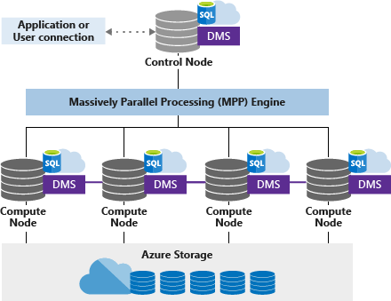
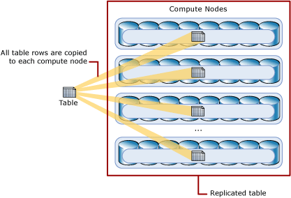

# Azure Synapse Analytics (formerly SQL DW) architecture

Azure Synapse is a limitless analytics service that brings together enterprise data warehousing and Big Data analytics. It gives you the freedom to query data on your terms, using either serverless on-demand or provisioned resources—at scale. Azure Synapse brings these two worlds together with a unified experience to ingest, prepare, manage, and serve data for immediate BI and machine learning needs.

 Azure Synapse has four components:

- Synapse SQL: Complete T-SQL based analytics

  - SQL pool (pay per DWU provisioned) – Generally Available
  - SQL on-demand (pay per TB processed) – (Preview)
- Spark: Deeply integrated Apache Spark (Preview)
- Data Integration: Hybrid data integration (Preview)
- Studio: unified user experience.  (Preview)

> [!VIDEO https://www.youtube.com/embed/PlyQ8yOb8kc]

## Synapse SQL MPP architecture components

[Synapse SQL](sql-data-warehouse-overview-what-is.md#synapse-sql-pool-in-azure-synapse) leverages a scale-out architecture to distribute computational processing of data across multiple nodes. The unit of scale is an abstraction of compute power that is known as a [data warehouse unit](what-is-a-data-warehouse-unit-dwu-cdwu.md). Compute is separate from storage, which enables you to scale compute independently of the data in your system.

Synapse SQL uses a node-based architecture. Applications connect and issue T-SQL commands to a Control node, which is the single point of entry for Synapse SQL. The Control node runs the MPP engine, which optimizes queries for parallel processing, and then passes operations to Compute nodes to do their work in parallel.

The Compute nodes store all user data in Azure Storage and run the parallel queries. The Data Movement Service (DMS) is a system-level internal service that moves data across the nodes as necessary to run queries in parallel and return accurate results.

With decoupled storage and compute, when using Synapse SQL pool one can:

- Independently size compute power irrespective of your storage needs.
- Grow or shrink compute power, within a SQL pool (data warehouse), without moving data.
- Pause compute capacity while leaving data intact, so you only pay for storage.
- Resume compute capacity during operational hours.

### Azure Storage

Synapse SQL leverages Azure Storage to keep your user data safe.  Since your data is stored and managed by Azure Storage, there is a separate charge for your storage consumption. The data is sharded into **distributions** to optimize the performance of the system. You can choose which sharding pattern to use to distribute the data when you define the table. These sharding patterns are supported:

- Hash
- Round Robin
- Replicate

### Control node

The Control node is the brain of the architecture. It is the front end that interacts with all applications and connections. The MPP engine runs on the Control node to optimize and coordinate parallel queries. When you submit a T-SQL query, the Control node transforms it into queries that run against each distribution in parallel.

### Compute nodes

The Compute nodes provide the computational power. Distributions map to Compute nodes for processing. As you pay for more compute resources, distributions are remapped to available Compute nodes. The number of compute nodes ranges from 1 to 60, and is determined by the service level for Synapse SQL.

Each Compute node has a node ID that is visible in system views. You can see the Compute node ID by looking for the node_id column in system views whose names begin with sys.pdw_nodes. For a list of these system views, see [MPP system views](/sql/relational-databases/system-catalog-views/sql-data-warehouse-and-parallel-data-warehouse-catalog-views?toc=/azure/synapse-analytics/sql-data-warehouse/toc.json&bc=/azure/synapse-analytics/sql-data-warehouse/breadcrumb/toc.json&view=azure-sqldw-latest).

### Data Movement Service

Data Movement Service (DMS) is the data transport technology that coordinates data movement between the Compute nodes. Some queries require data movement to ensure the parallel queries return accurate results. When data movement is required, DMS ensures the right data gets to the right location.

## Distributions

A distribution is the basic unit of storage and processing for parallel queries that run on distributed data. When Synapse SQL runs a query, the work is divided into 60 smaller queries that run in parallel.

Each of the 60 smaller queries runs on one of the data distributions. Each Compute node manages one or more of the 60 distributions. A SQL pool with maximum compute resources has one distribution per Compute node. A SQL pool with minimum compute resources has all the distributions on one compute node.  

## Hash-distributed tables

A hash distributed table can deliver the highest query performance for joins and aggregations on large tables.

To shard data into a hash-distributed table, a hash function is used to deterministically assign each row to one distribution. In the table definition, one of the columns is designated as the distribution column. The hash function uses the values in the distribution column to assign each row to a distribution.

The following diagram illustrates how a full (non-distributed table) gets stored as a hash-distributed table.

  

- Each row belongs to one distribution.  
- A deterministic hash algorithm assigns each row to one distribution.  
- The number of table rows per distribution varies as shown by the different sizes of tables.

There are performance considerations for the selection of a distribution column, such as distinctness, data skew, and the types of queries that run on the system.

## Round-robin distributed tables

A round-robin table is the simplest table to create and delivers fast performance when used as a staging table for loads.

A round-robin distributed table distributes data evenly across the table but without any further optimization. A distribution is first chosen at random and then buffers of rows are assigned to distributions sequentially. It is quick to load data into a round-robin table, but query performance can often be better with hash distributed tables. Joins on round-robin tables require reshuffling data, which takes additional time.

## Replicated Tables

A replicated table provides the fastest query performance for small tables.

A table that is replicated caches a full copy of the table on each compute node. Consequently, replicating a table removes the need to transfer data among compute nodes before a join or aggregation. Replicated tables are best utilized with small tables. Extra storage is required and there is additional overhead that is incurred when writing data, which make large tables impractical.  

The diagram below shows a replicated table that is cached on the first distribution on each compute node.  

## Next steps

Now that you know a bit about Azure Synapse, learn how to quickly [create a SQL pool](create-data-warehouse-portal.md) and [load sample data](load-data-from-azure-blob-storage-using-polybase.md). If you are new to Azure, you may find the [Azure glossary](../../azure-glossary-cloud-terminology.md?toc=/azure/synapse-analytics/sql-data-warehouse/toc.json&bc=/azure/synapse-analytics/sql-data-warehouse/breadcrumb/toc.json) helpful as you encounter new terminology. Or look at some of these other Azure Synapse Resources.  

- [Customer success stories](https://azure.microsoft.com/case-studies/?service=sql-data-warehouse)
- [Blogs](https://azure.microsoft.com/blog/tag/azure-sql-data-warehouse/)
- [Feature requests](https://feedback.azure.com/forums/307516-sql-data-warehouse)
- [Videos](https://azure.microsoft.com/documentation/videos/index/?services=sql-data-warehouse)
- [Create support ticket](sql-data-warehouse-get-started-create-support-ticket.md)
- [Microsoft Q&A question page](https://docs.microsoft.com/answers/topics/azure-synapse-analytics.html)
- [Stack Overflow forum](https://stackoverflow.com/questions/tagged/azure-sqldw)
- [Twitter](https://twitter.com/hashtag/SQLDW)
