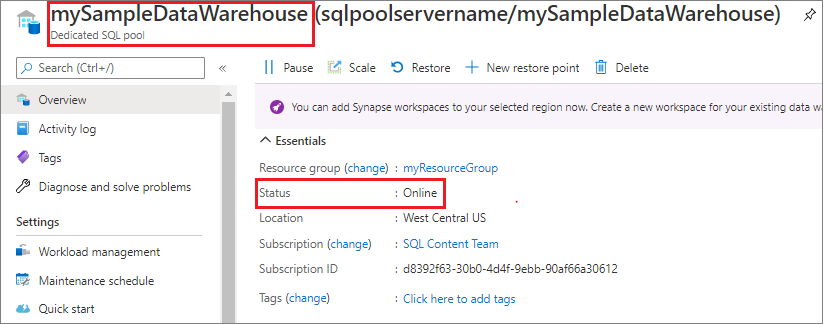
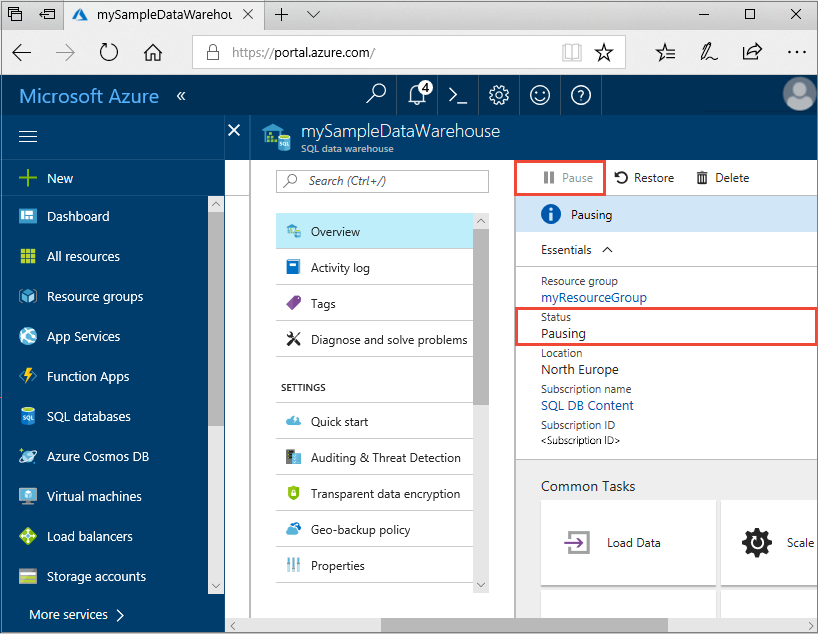
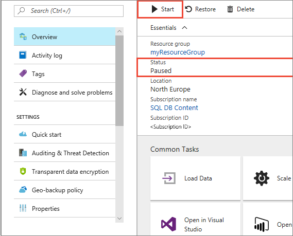
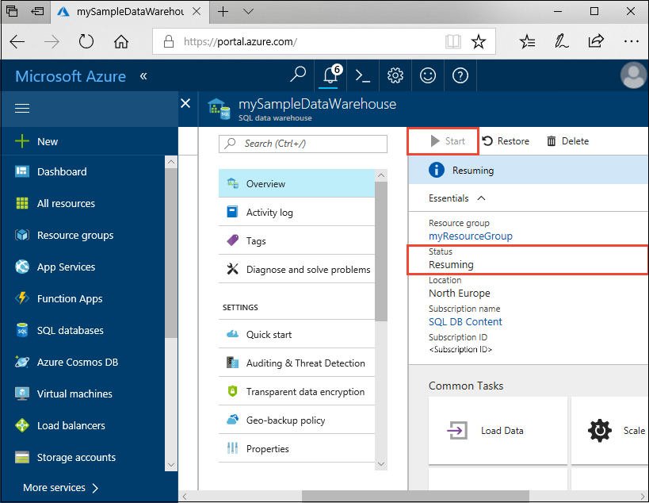
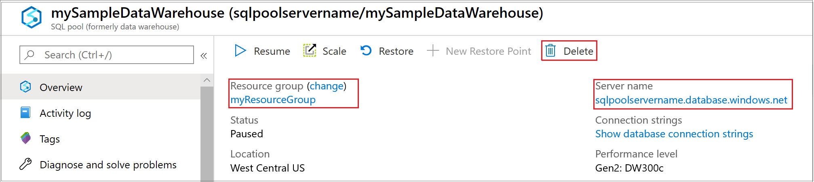

# Quickstart: Pause and resume compute in Synapse SQL pool via the Azure portal

You can use the Azure portal to pause and resume the Synapse SQL pool (data warehouse) compute resources. 
If you don't have an Azure subscription, create a [free](https://azure.microsoft.com/free/) account before you begin.

## Sign in to the Azure portal

Sign in to the [Azure portal](https://portal.azure.com/).

## Before you begin

Use [Create and Connect - portal](create-data-warehouse-portal.md) to create a SQL pool called **mySampleDataWarehouse**. 

## Pause compute

To reduce costs, you can pause and resume compute resources on-demand. For example, if you won't be using the database during the night and on weekends, you can pause it during those times, and resume it during the day. 
>[!NOTE]
>You won't be charged for compute resources while the database is paused. However, you will continue to be charged for storage. 

Follow these steps to pause a SQL pool:

1. Sign in to the [Azure portal](https://portal.azure.com/).
2. Click **Azure Synapse Analytics (formerly SQL DW)** in the left navigation page of the Azure portal.
2. Select **mySampleDataWarehouse** from the **Azure Synapse Analytics (formerly SQL DW)** page to open the SQL pool. 
3. On the **mySampleDataWarehouse** page, notice **Status** is **Online**.

    

4. To pause SQL pool, click the **Pause** button. 
5. A confirmation question appears asking if you want to continue. Click **Yes**.
6. Wait a few moments, and then notice the **Status** is **Pausing**.

    

7. When the pause operation is complete, the status is **Paused** and the option button is **Resume**.
8. The compute resources for the SQL pool are now offline. You won't be charged for compute until you resume the service.

    

## Resume compute

Follow these steps to resume SQL pool.

1. Click **Azure Synapse Analytics (formerly SQL DW)** in the left page of the Azure portal.
2. Select **mySampleDataWarehouse** from the **Azure Synapse Analytics (formerly SQL DW)** page to open  the SQL pool page. 
3. On the **mySampleDataWarehouse** page, notice **Status** is **Paused**.

    

4. To resume SQL pool, click **Resume**. 
5. A confirmation question appears asking if you want to start. Click **Yes**.
6. Notice the **Status** is **Resuming**.

    

7. When the SQL pool is back online, the status is **Online** and the option button is **Pause**.
8. The compute resources for SQL pool are now online and you can use the service. Charges for compute have resumed.

    

## Clean up resources

You are being charged for data warehouse units and the data stored in your SQL pool. These compute and storage resources are billed separately. 

- If you want to keep the data in storage, pause compute.
- If you want to remove future charges, you can delete the SQL pool. 

Follow these steps to clean up resources as you desire.

1. Sign in to the [Azure portal](https://portal.azure.com), and click on your SQL pool.

    

1. To pause compute, click the **Pause** button. 

2. To remove the SQL pool so you are not charged for compute or storage, click **Delete**.

3. To remove the SQL server you created, click **sqlpoolservername.database.windows.net**, and then click **Delete**.  

   > [!CAUTION]
   > Be careful with this deletion, since deleting the server also deletes all databases assigned to the server.

5. To remove the resource group, click **myResourceGroup**, and then click **Delete resource group**.

## Next steps

You have now paused and resumed compute for your SQL pool. Continue to the next article to learn more about how to [Load data into SQL pool](load-data-from-azure-blob-storage-using-polybase.md). For additional information about managing compute capabilities, see the [Manage compute overview](sql-data-warehouse-manage-compute-overview.md) article. 

