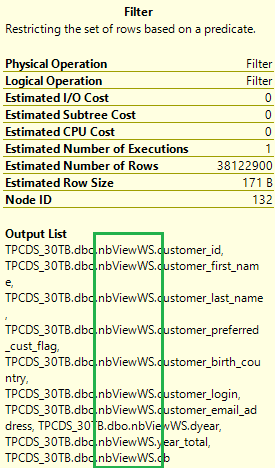

# Performance tune with materialized views

Materialized views for dedicated SQL pools in Azure Synapse provide a low maintenance method for complex analytical queries to get fast performance without any query change. This article discusses the general guidance on using materialized views.

## Materialized views vs. standard views

Dedicated SQL pool in Azure Synapse supports standard and materialized views.  Both are virtual tables created with SELECT expressions and presented to queries as logical tables.  Views encapsulate the complexity of common data computation and add an abstraction layer to computation changes so there's no need to rewrite queries.  

A standard view computes its data each time when the view is used.  There's no data stored on disk. People typically use standard views as a tool that helps organize the logical objects and queries in a dedicated SQL pool.  To use a standard view, a query needs to make direct reference to it.

A materialized view pre-computes, stores, and maintains its data in a dedicated SQL pool just like a table.  There's no recomputation needed each time a materialized view is used.  That's why queries that use all or a subset of the data in materialized views can get faster performance.  Even better, queries can use a materialized view without making direct reference to it, so there's no need to change application code.  

Most of the requirements on a standard view still apply to a materialized view. For details on the materialized view syntax and other requirements, refer to [CREATE MATERIALIZED VIEW AS SELECT](/sql/t-sql/statements/create-materialized-view-as-select-transact-sql?view=azure-sqldw-latest&preserve-view=true)

| Comparison                     | View                                         | Materialized View
|:-------------------------------|:---------------------------------------------|:--------------------------------------------------------------|
|View definition                 | Stored in dedicated SQL pool.              | Stored in dedicated SQL pool.
|View content                    | Generated each time when the view is used.   | Pre-processed and stored in dedicated SQL pool during view creation. Updated as data is added to the underlying tables.
|Data refresh                    | Always updated                               | Always updated
|Speed to retrieve view data from complex queries     | Slow                                         | Fast  
|Extra storage                   | No                                           | Yes
|Syntax                          | CREATE VIEW                                  | CREATE MATERIALIZED VIEW AS SELECT

## Benefits of using materialized views

A properly designed materialized view provides the following benefits:

- Reduce the execution time for complex queries with JOINs and aggregate functions. The more complex the query, the higher the potential for execution-time saving. The most benefit is gained when a query's computation cost is high and the resulting data set is small.  
- The optimizer in dedicated SQL pool can automatically use deployed materialized views to improve query execution plans.  This process is transparent to users providing faster query performance and doesn't require queries to make direct reference to the materialized views.
- Require low maintenance on the views.  All incremental data changes from the base tables are automatically added to the materialized views in a synchronous manner, meaning both the base tables and the materialized views are updated in the same transaction.  This design allows querying materialized views to return the same data as directly querying the base tables.  
- The data in a materialized view can be distributed differently from the base tables.  
- Data in materialized views gets the same high availability and resiliency benefits as data in regular tables.  

The materialized views implemented in dedicated SQL pool also provide the following benefits:

Compared to other data warehouse providers, the materialized views implemented in dedicated SQL pool also provide the following benefits:

- Broad aggregate function support. See [CREATE MATERIALIZED VIEW AS SELECT (Transact-SQL)](/sql/t-sql/statements/create-materialized-view-as-select-transact-sql).
- The support for query-specific materialized view recommendation.  See [EXPLAIN (Transact-SQL)](/sql/t-sql/queries/explain-transact-sql).
- Automatic and synchronous data refresh with data changes in base tables. No user action is required.
 
## Common scenarios  

Materialized views are typically used in the following scenarios:

**Need to improve the performance of complex analytical queries against large data in size**

Complex analytical queries typically use more aggregate functions and table joins, causing more compute-heavy operations such as shuffles and joins in query execution.  That's why complex analytical queries take longer to complete, especially on large tables.  

Users can create materialized views for the data returned from common computations of queries, so there's no recomputation needed when this data is needed by queries, allowing lower compute cost and faster query response.

**Need faster performance with no or minimum query changes**

Schema and query changes in dedicated SQL pools are typically kept to a minimum to support regular ETL operations and reporting.  People can use materialized views for query performance tuning, if the cost incurred by the views can be offset by the gain in query performance.

In comparison to other tuning options such as scaling and statistics management, it's a less impactful production change to create and maintain a materialized view and its potential performance gain is also higher.

- Creating or maintaining materialized views does not impact the queries running against the base tables.
- The query optimizer can automatically use the deployed materialized views without direct view reference in a query. This capability reduces the need for query change in performance tuning.

**Need different data distribution strategy for faster query performance**

Dedicated SQL pool is a distributed query processing system.  Data in a SQL table is distributed upto 60 nodes using one of three [distribution strategies](sql-data-warehouse-tables-distribute.md?toc=/azure/synapse-analytics/sql-data-warehouse/toc.json&bc=/azure/synapse-analytics/sql-data-warehouse/breadcrumb/toc.json) (hash, round_robin, or replicated).   

The data distribution is specified at the table creation time and stays unchanged until the table is dropped. Materialized view, being a virtual table on disk, supports hash and round_robin data distributions.  Users can choose a data distribution that is different from the base tables but optimal for the performance of queries that use the views.  

## Design guidance

Here is the general guidance on using materialized views to improve query performance:

**Design for your workload**

Before you begin to create materialized views, it's important to have a deep understanding of your workload in terms of query patterns, importance, frequency, and the size of resulting data.  

Users can run `EXPLAIN WITH_RECOMMENDATIONS <SQL_statement>` for the materialized views recommended by the query optimizer.  Since these recommendations are query-specific, a materialized view that benefits a single query may not be optimal for other queries in the same workload.  

Evaluate these recommendations with your workload needs in mind.  The ideal materialized views are those that benefit the workload's performance.  

**Be aware of the tradeoff between faster queries and the cost**

For each materialized view, there's a data storage cost and a cost for maintaining the view.  As data changes in base tables, the size of the materialized view increases and its physical structure also changes.  To avoid query performance degradation, each materialized view is maintained separately by the SQL engine.  

The maintenance workload gets higher when the number of materialized views and base table changes increase.   Users should check if the cost incurred from all materialized views can be offset by the query performance gain.  

You can run this query to generate a list of materialized views in a dedicated SQL pool:

```sql
SELECT V.name as materialized_view, V.object_id
FROM sys.views V
JOIN sys.indexes I ON V.object_id= I.object_id AND I.index_id < 2;
```

Options to reduce the number of materialized views:

- Identify common data sets frequently used by the complex queries in your workload.  Create materialized views to store those data sets so the optimizer can use them as building blocks when creating execution plans.  

- Drop the materialized views that have low usage or are no longer needed.  A disabled materialized view is not maintained but it still incurs storage cost.  

- Combine materialized views created on the same or similar base tables even if their data doesn't overlap.  Combining materialized views could result in a larger view in size than the sum of the separate views, however the view maintenance cost should reduce.  For example:

```sql

-- Query 1 would benefit from having a materialized view created with this SELECT statement

SELECT A, SUM(B)
FROM T
GROUP BY A

-- Query 2 would benefit from having a materialized view created with this SELECT statement

SELECT C, SUM(D)
FROM T
GROUP BY C

-- You could create a single mateiralized view of this form

SELECT A, C, SUM(B), SUM(D)
FROM T
GROUP BY A, C

```

**Not all performance tuning requires query change**

The SQL query optimizer can automatically use deployed materialized views to improve query performance.  This support is applied transparently to queries that don't reference the views and queries that use aggregates unsupported in materialized views creation.  No query change is needed. You can check a query's estimated execution plan to confirm if a materialized view is used.  

**Monitor materialized views**

A materialized view is stored in the dedicated SQL pool just like a table with a clustered columnstore index (CCI).  Reading data from a materialized view includes scanning the CCI index segments and applying any incremental changes from base tables. When the number of incremental changes is too high, resolving a query from a materialized view can take longer than directly querying the base tables.  

To avoid query performance degradation,  it's a good practice to run [DBCC PDW_SHOWMATERIALIZEDVIEWOVERHEAD](/sql/t-sql/database-console-commands/dbcc-pdw-showmaterializedviewoverhead-transact-sql?toc=/azure/synapse-analytics/sql-data-warehouse/toc.json&bc=/azure/synapse-analytics/sql-data-warehouse/breadcrumb/toc.json) to monitor the view's overhead_ratio (total_rows / max(1, base_view_row)).  Users should REBUILD the materialized view if its overhead_ratio is too high.

**Materialized view and result set caching**

These two features in dedicated SQL pool are used for query performance tuning. Result set caching is used for getting high  concurrency and fast response from repetitive queries against static data.  

To use the cached result, the form of the cache requesting query must match with the query that produced the cache.  In addition, the cached result must apply to the entire query.  

Materialized views allow data changes in the base tables.  Data in materialized views can be applied to a piece of a query.  This support allows the same materialized views to be used by different queries that share some computation for faster performance.

## Example

This example uses a TPCDS-like query that finds customers who spend more money via catalog than in stores, identify the preferred customers and their country/region of origin.   The query involves selecting TOP 100 records from the UNION of three sub-SELECT statements involving SUM() and GROUP BY.

```sql
WITH year_total AS (
SELECT c_customer_id customer_id
       ,c_first_name customer_first_name
       ,c_last_name customer_last_name
       ,c_preferred_cust_flag customer_preferred_cust_flag
       ,c_birth_country customer_birth_country
       ,c_login customer_login
       ,c_email_address customer_email_address
       ,d_year dyear
       ,sum(isnull(ss_ext_list_price-ss_ext_wholesale_cost-ss_ext_discount_amt+ss_ext_sales_price, 0)/2) year_total
       ,'s' sale_type
FROM customer
     ,store_sales
     ,date_dim
WHERE c_customer_sk = ss_customer_sk
   AND ss_sold_date_sk = d_date_sk
GROUP BY c_customer_id
         ,c_first_name
         ,c_last_name
         ,c_preferred_cust_flag
         ,c_birth_country
         ,c_login
         ,c_email_address
         ,d_year
UNION ALL
SELECT c_customer_id customer_id
       ,c_first_name customer_first_name
       ,c_last_name customer_last_name
       ,c_preferred_cust_flag customer_preferred_cust_flag
       ,c_birth_country customer_birth_country
       ,c_login customer_login
       ,c_email_address customer_email_address
       ,d_year dyear
       ,sum(isnull(cs_ext_list_price-cs_ext_wholesale_cost-cs_ext_discount_amt+cs_ext_sales_price, 0)/2) year_total
       ,'c' sale_type
FROM customer
     ,catalog_sales
     ,date_dim
WHERE c_customer_sk = cs_bill_customer_sk
   AND cs_sold_date_sk = d_date_sk
GROUP BY c_customer_id
         ,c_first_name
         ,c_last_name
         ,c_preferred_cust_flag
         ,c_birth_country
         ,c_login
         ,c_email_address
         ,d_year
UNION ALL
SELECT c_customer_id customer_id
       ,c_first_name customer_first_name
       ,c_last_name customer_last_name
       ,c_preferred_cust_flag customer_preferred_cust_flag
       ,c_birth_country customer_birth_country
       ,c_login customer_login
       ,c_email_address customer_email_address
       ,d_year dyear
       ,sum(isnull(ws_ext_list_price-ws_ext_wholesale_cost-ws_ext_discount_amt+ws_ext_sales_price, 0)/2) year_total
       ,'w' sale_type
FROM customer
     ,web_sales
     ,date_dim
WHERE c_customer_sk = ws_bill_customer_sk
   AND ws_sold_date_sk = d_date_sk
GROUP BY c_customer_id
         ,c_first_name
         ,c_last_name
         ,c_preferred_cust_flag
         ,c_birth_country
         ,c_login
         ,c_email_address
         ,d_year
         )
  SELECT TOP 100
                  t_s_secyear.customer_id
                 ,t_s_secyear.customer_first_name
                 ,t_s_secyear.customer_last_name
                 ,t_s_secyear.customer_birth_country
FROM year_total t_s_firstyear
     ,year_total t_s_secyear
     ,year_total t_c_firstyear
     ,year_total t_c_secyear
     ,year_total t_w_firstyear
     ,year_total t_w_secyear
WHERE t_s_secyear.customer_id = t_s_firstyear.customer_id
   AND t_s_firstyear.customer_id = t_c_secyear.customer_id
   AND t_s_firstyear.customer_id = t_c_firstyear.customer_id
   AND t_s_firstyear.customer_id = t_w_firstyear.customer_id
   AND t_s_firstyear.customer_id = t_w_secyear.customer_id
   AND t_s_firstyear.sale_type = 's'
   AND t_c_firstyear.sale_type = 'c'
   AND t_w_firstyear.sale_type = 'w'
   AND t_s_secyear.sale_type = 's'
   AND t_c_secyear.sale_type = 'c'
   AND t_w_secyear.sale_type = 'w'
   AND t_s_firstyear.dyear+0 =  1999
   AND t_s_secyear.dyear+0 = 1999+1
   AND t_c_firstyear.dyear+0 =  1999
   AND t_c_secyear.dyear+0 =  1999+1
   AND t_w_firstyear.dyear+0 = 1999
   AND t_w_secyear.dyear+0 = 1999+1
   AND t_s_firstyear.year_total > 0
   AND t_c_firstyear.year_total > 0
   AND t_w_firstyear.year_total > 0
   AND CASE WHEN t_c_firstyear.year_total > 0 THEN t_c_secyear.year_total / t_c_firstyear.year_total ELSE NULL END
           > CASE WHEN t_s_firstyear.year_total > 0 THEN t_s_secyear.year_total / t_s_firstyear.year_total ELSE NULL END
   AND CASE WHEN t_c_firstyear.year_total > 0 THEN t_c_secyear.year_total / t_c_firstyear.year_total ELSE NULL END
           > CASE WHEN t_w_firstyear.year_total > 0 THEN t_w_secyear.year_total / t_w_firstyear.year_total ELSE NULL END
ORDER BY t_s_secyear.customer_id
         ,t_s_secyear.customer_first_name
         ,t_s_secyear.customer_last_name
         ,t_s_secyear.customer_birth_country
OPTION ( LABEL = 'Query04-af359846-253-3');
```

Check the query's estimated execution plan.  There are 18 shuffles and 17 joins operations, which take more time to execute. Now let's create one materialized view for each of the three sub-SELECT statements.

```sql
CREATE materialized view nbViewSS WITH (DISTRIBUTION=HASH(customer_id)) AS
SELECT c_customer_id customer_id
       ,c_first_name customer_first_name
       ,c_last_name customer_last_name
       ,c_preferred_cust_flag customer_preferred_cust_flag
       ,c_birth_country customer_birth_country
       ,c_login customer_login
       ,c_email_address customer_email_address
       ,d_year dyear
       ,sum(isnull(ss_ext_list_price-ss_ext_wholesale_cost-ss_ext_discount_amt+ss_ext_sales_price, 0)/2) year_total
          , count_big(*) AS cb
FROM dbo.customer
     ,dbo.store_sales
     ,dbo.date_dim
WHERE c_customer_sk = ss_customer_sk
   AND ss_sold_date_sk = d_date_sk
GROUP BY c_customer_id
         ,c_first_name
         ,c_last_name
         ,c_preferred_cust_flag
         ,c_birth_country
         ,c_login
         ,c_email_address
         ,d_year
GO
CREATE materialized view nbViewCS WITH (DISTRIBUTION=HASH(customer_id)) AS
SELECT c_customer_id customer_id
       ,c_first_name customer_first_name
       ,c_last_name customer_last_name
       ,c_preferred_cust_flag customer_preferred_cust_flag
       ,c_birth_country customer_birth_country
       ,c_login customer_login
       ,c_email_address customer_email_address
       ,d_year dyear
       ,sum(isnull(cs_ext_list_price-cs_ext_wholesale_cost-cs_ext_discount_amt+cs_ext_sales_price, 0)/2) year_total
          , count_big(*) as cb
FROM dbo.customer
     ,dbo.catalog_sales
     ,dbo.date_dim
WHERE c_customer_sk = cs_bill_customer_sk
   AND cs_sold_date_sk = d_date_sk
GROUP BY c_customer_id
         ,c_first_name
         ,c_last_name
         ,c_preferred_cust_flag
         ,c_birth_country
         ,c_login
         ,c_email_address
         ,d_year

GO
CREATE materialized view nbViewWS WITH (DISTRIBUTION=HASH(customer_id)) AS
SELECT c_customer_id customer_id
       ,c_first_name customer_first_name
       ,c_last_name customer_last_name
       ,c_preferred_cust_flag customer_preferred_cust_flag
       ,c_birth_country customer_birth_country
       ,c_login customer_login
       ,c_email_address customer_email_address
       ,d_year dyear
       ,sum(isnull(ws_ext_list_price-ws_ext_wholesale_cost-ws_ext_discount_amt+ws_ext_sales_price, 0)/2) year_total
          , count_big(*) AS cb
FROM dbo.customer
     ,dbo.web_sales
     ,dbo.date_dim
WHERE c_customer_sk = ws_bill_customer_sk
   AND ws_sold_date_sk = d_date_sk
GROUP BY c_customer_id
         ,c_first_name
         ,c_last_name
         ,c_preferred_cust_flag
         ,c_birth_country
         ,c_login
         ,c_email_address
         ,d_year

```

Check the execution plan of the original query again.  Now the number of joins changes from 17 to 5 and there's no shuffle.  Select the Filter operation icon in the plan, its Output List shows the data is read from the materialized views instead of the base tables.  

 

With materialized views, the same query runs faster without a code change.  

## Next steps

For more development tips, see [Dedicated SQL pool development overview](sql-data-warehouse-overview-develop.md).
