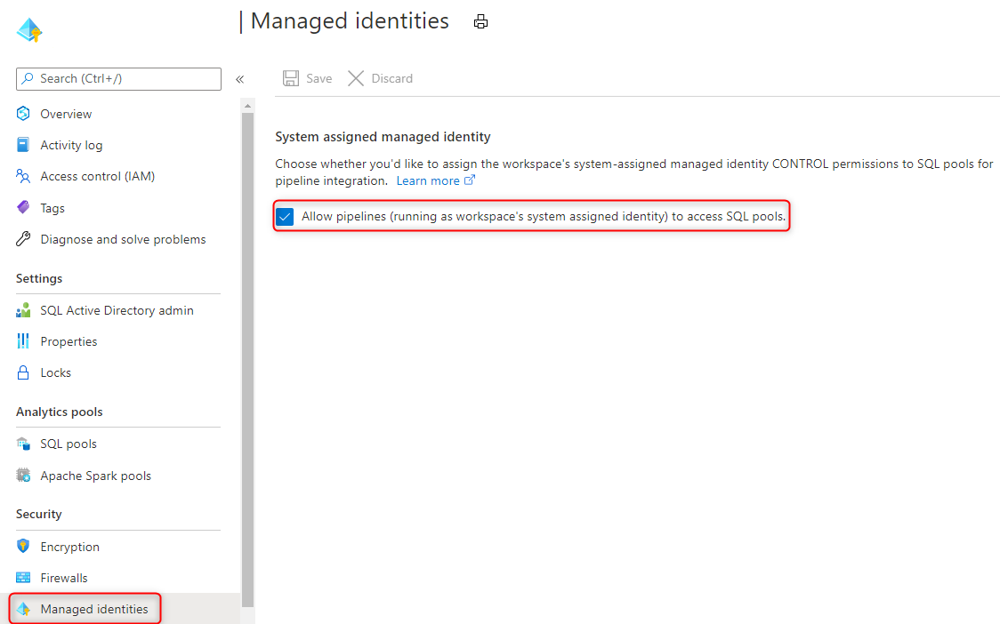
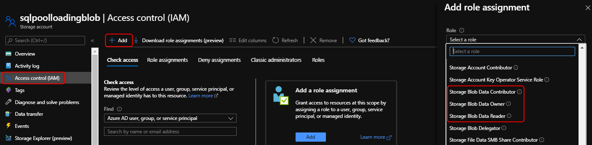

# Securely load data using Synapse SQL

This article highlights and provides examples on the secure authentication mechanisms for the [COPY statement](/sql/t-sql/statements/copy-into-transact-sql?view=azure-sqldw-latest&preserve-view=true). The COPY statement is the most flexible and secure way of bulk loading data in Synapse SQL.
## Supported authentication mechanisms

The following matrix describes the supported authentication methods for each file type and storage account. This applies to the source storage location and the error file location.

|                          |                CSV                |                      Parquet                       |                        ORC                         |
| :----------------------: | :-------------------------------: | :------------------------------------------------: | :------------------------------------------------: |
|  **Azure blob storage**  | SAS/MSI/SERVICE PRINCIPAL/KEY/AAD |                      SAS/KEY                       |                      SAS/KEY                       |
| **Azure Data Lake Gen2** | SAS/MSI/SERVICE PRINCIPAL/KEY/AAD | SAS (blob<sup>1</sup>)/MSI (dfs<sup>2</sup>)/SERVICE PRINCIPAL/KEY/AAD | SAS (blob<sup>1</sup>)/MSI (dfs<sup>2</sup>)/SERVICE PRINCIPAL/KEY/AAD |

1: The .blob endpoint (**.blob**.core.windows.net) in your external location path is required for this authentication method.

2: The .dfs endpoint (**.dfs**.core.windows.net) in your external location path is required for this authentication method.

## A. Storage account key with LF as the row terminator (Unix-style new line)


```sql
--Note when specifying the column list, input field numbers start from 1
COPY INTO target_table (Col_one default 'myStringDefault' 1, Col_two default 1 3)
FROM 'https://adlsgen2account.dfs.core.windows.net/myblobcontainer/folder1/'
WITH (
	FILE_TYPE = 'CSV'
	,CREDENTIAL=(IDENTITY= 'Storage Account Key', SECRET='<Your_Account_Key>')
	--CREDENTIAL should look something like this:
	--CREDENTIAL=(IDENTITY= 'Storage Account Key', SECRET='x6RWv4It5F2msnjelv3H4DA80n0QW0daPdw43jM0nyetx4c6CpDkdj3986DX5AHFMIf/YN4y6kkCnU8lb+Wx0Pj+6MDw=='),
	,ROWTERMINATOR='0x0A' --0x0A specifies to use the Line Feed character (Unix based systems)
)
```
> [!IMPORTANT]
>
> - Use the hexadecimal value (0x0A) to specify the Line Feed/Newline character. Note the COPY statement will interpret the '\n' string as '\r\n' (carriage return newline).

## B. Shared Access Signatures (SAS) with CRLF as the row terminator (Windows style new line)
```sql
COPY INTO target_table
FROM 'https://adlsgen2account.dfs.core.windows.net/myblobcontainer/folder1/'
WITH (
    FILE_TYPE = 'CSV'
    ,CREDENTIAL=(IDENTITY= 'Shared Access Signature', SECRET='<Your_SAS_Token>')
	--CREDENTIAL should look something like this:
    --CREDENTIAL=(IDENTITY= 'Shared Access Signature', SECRET='?sv=2018-03-28&ss=bfqt&srt=sco&sp=rl&st=2016-10-17T20%3A14%3A55Z&se=2021-10-18T20%3A19%3A00Z&sig=IEoOdmeYnE9%2FKiJDSFSYsz4AkNa%2F%2BTx61FuQ%2FfKHefqoBE%3D'),
    ,ROWTERMINATOR='\n'-- COPY command automatically prefixes the \r character when \n (newline) is specified. This results in carriage return newline (\r\n) for Windows based systems.
)
```

> [!IMPORTANT]
>
> - Do not specify the ROWTERMINATOR as '\r\n' which will be interpreted as '\r\r\n' and can result in parsing issues

## C. Managed Identity

Managed Identity authentication is required when your storage account is attached to a VNet. 

### Prerequisites

1. Install Azure PowerShell using this [guide](/powershell/azure/install-az-ps?toc=/azure/synapse-analytics/sql-data-warehouse/toc.json&bc=/azure/synapse-analytics/sql-data-warehouse/breadcrumb/toc.json).
2. If you have a general-purpose v1 or blob storage account, you must first upgrade to general-purpose v2 using this [guide](../../storage/common/storage-account-upgrade.md?toc=/azure/synapse-analytics/sql-data-warehouse/toc.json&bc=/azure/synapse-analytics/sql-data-warehouse/breadcrumb/toc.json).
3. You must have **Allow trusted Microsoft services to access this storage account** turned on under Azure Storage account **Firewalls and Virtual networks** settings menu. Refer to this [guide](../../storage/common/storage-network-security.md?toc=/azure/synapse-analytics/sql-data-warehouse/toc.json&bc=/azure/synapse-analytics/sql-data-warehouse/breadcrumb/toc.json#exceptions) for more information.

#### Steps

1. If you have a standalone dedicated SQL pool, register your SQL server with Azure Active Directory (AAD) using PowerShell: 

   ```powershell
   Connect-AzAccount
   Select-AzSubscription -SubscriptionId <subscriptionId>
   Set-AzSqlServer -ResourceGroupName your-database-server-resourceGroup -ServerName your-SQL-servername -AssignIdentity
   ```

   This step is not required for dedicated SQL pools within a Synapse workspace.

1. If you have a Synapse workspace, register your workspace's system-managed identity:

   1. Go to your Synapse workspace in the Azure portal
   2. Go to the Managed identities blade 
   3. Make sure the "Allow Pipelines" option is enabled
   
   

1. Create a **general-purpose v2 Storage Account** using this [guide](../../storage/common/storage-account-create.md).

   > [!NOTE]
   >
   > - If you have a general-purpose v1 or blob storage account, you must **first upgrade to v2** using this [guide](../../storage/common/storage-account-upgrade.md).
   > - For known issues with Azure Data Lake Storage Gen2, please refer to this [guide](../../storage/blobs/data-lake-storage-known-issues.md).

1. Under your storage account, navigate to **Access Control (IAM)**, and select **Add role assignment**. Assign **Storage Blob Data Contributor** Azure role to the server or workspace hosting your dedicated SQL pool which you've registered with Azure Active Directory (AAD).

   > [!NOTE]
   > Only members with Owner privilege can perform this step. For various Azure built-in roles, refer to this [guide](../../role-based-access-control/built-in-roles.md?toc=/azure/synapse-analytics/sql-data-warehouse/toc.json&bc=/azure/synapse-analytics/sql-data-warehouse/breadcrumb/toc.json).
   
    > [!IMPORTANT]
    > Specify the **Storage** **Blob Data** Owner, Contributor, or Reader Azure role. These roles are different than the Azure built-in roles of Owner, Contributor, and Reader. 

    

4. You can now run the COPY statement specifying "Managed Identity":

	```sql
	COPY INTO dbo.target_table
	FROM 'https://myaccount.blob.core.windows.net/myblobcontainer/folder1/*.txt'
	WITH (
	    FILE_TYPE = 'CSV',
	    CREDENTIAL = (IDENTITY = 'Managed Identity'),
	)
	```

## D. Azure Active Directory Authentication
#### Steps

1. Under your storage account, navigate to **Access Control (IAM)**, and select **Add role assignment**. Assign **Storage Blob Data Owner, Contributor, or Reader** Azure role to your Azure AD user. 

    > [!IMPORTANT]
    > Specify the **Storage** **Blob Data** Owner, Contributor, or Reader Azure role. These roles are different than the Azure built-in roles of Owner, Contributor, and Reader.

    

2. Configure Azure AD authentication by going through the following [documentation](../../azure-sql/database/authentication-aad-configure.md?tabs=azure-powershell). 

3. Connect to your SQL pool using Active Directory where you can now run the COPY statement without specifying any credentials:

	```sql
	COPY INTO dbo.target_table
	FROM 'https://myaccount.blob.core.windows.net/myblobcontainer/folder1/*.txt'
	WITH (
	    FILE_TYPE = 'CSV'
	)
	```


## E. Service Principal Authentication
#### Steps

1. [Create an Azure Active Directory application](../..//active-directory/develop/howto-create-service-principal-portal.md#register-an-application-with-azure-ad-and-create-a-service-principal)
2. [Get application ID](../..//active-directory/develop/howto-create-service-principal-portal.md#get-tenant-and-app-id-values-for-signing-in)
3. [Get the authentication key](../../active-directory/develop/howto-create-service-principal-portal.md#authentication-two-options)
4. [Get the V1 OAuth 2.0 token endpoint](../../data-lake-store/data-lake-store-service-to-service-authenticate-using-active-directory.md?bc=%2fazure%2fsynapse-analytics%2fsql-data-warehouse%2fbreadcrumb%2ftoc.json&toc=%2fazure%2fsynapse-analytics%2fsql-data-warehouse%2ftoc.json#step-4-get-the-oauth-20-token-endpoint-only-for-java-based-applications)
5. [Assign read, write, and execution permissions to your Azure AD application](../../data-lake-store/data-lake-store-service-to-service-authenticate-using-active-directory.md?bc=%2fazure%2fsynapse-analytics%2fsql-data-warehouse%2fbreadcrumb%2ftoc.json&toc=%2fazure%2fsynapse-analytics%2fsql-data-warehouse%2ftoc.json#step-3-assign-the-azure-ad-application-to-the-azure-data-lake-storage-gen1-account-file-or-folder) on your storage account
6. You can now run the COPY statement:

	```sql
	COPY INTO dbo.target_table
	FROM 'https://myaccount.blob.core.windows.net/myblobcontainer/folder0/*.txt'
	WITH (
	    FILE_TYPE = 'CSV'
	    ,CREDENTIAL=(IDENTITY= '<application_ID>@<OAuth_2.0_Token_EndPoint>' , SECRET= '<authentication_key>')
	    --CREDENTIAL should look something like this:
		--,CREDENTIAL=(IDENTITY= '92761aac-12a9-4ec3-89b8-7149aef4c35b@https://login.microsoftonline.com/72f714bf-86f1-41af-91ab-2d7cd011db47/oauth2/token', SECRET='juXi12sZ6gse]woKQNgqwSywYv]7A.M')
	)
	```

> [!IMPORTANT]
>
> - Use the **V1** version of the OAuth 2.0 token endpoint

## Next steps

- Check the [COPY statement article](/sql/t-sql/statements/copy-into-transact-sql?view=azure-sqldw-latest&preserve-view=true#syntax) article for the detailed syntax
- Check the [data loading overview](./design-elt-data-loading.md#what-is-elt) article for loading best practices
