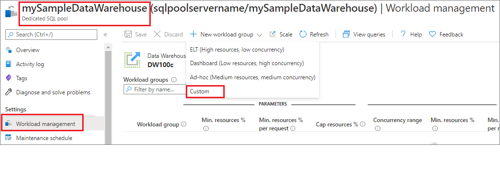
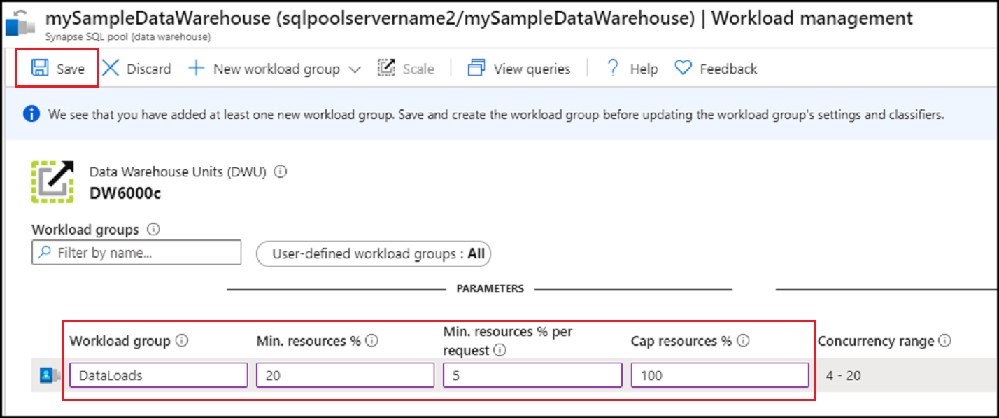
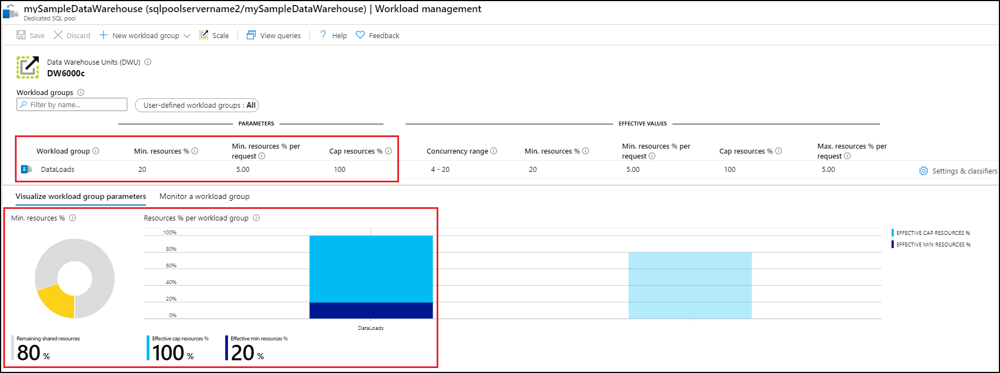
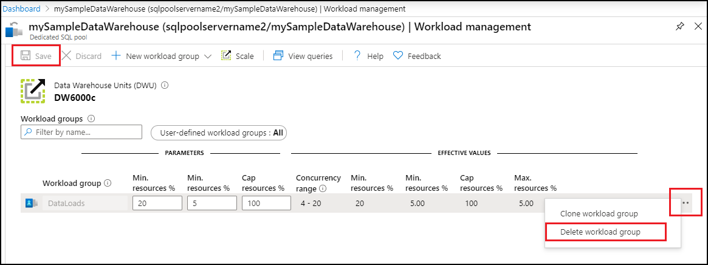

# Quickstart: Configure dedicated SQL pool workload isolation using a workload group in the Azure portal

In this quickstart, you will configure [workload isolation](sql-data-warehouse-workload-isolation.md) by creating a workload group for reserving resources.  For purposes of this tutorial, we will create the workload group for data loading called `DataLoads`. The workload group will reserve 20% of the system resources.  With 20% isolation for data loads, they are guaranteed resources that allow them to hit SLAs.  After creating the workload group, [create a workload classifier](quickstart-create-a-workload-classifier-portal.md) to assign queries to this workload group.

If you don't have an Azure subscription, create a [free](https://azure.microsoft.com/free/) account before you begin.

## Sign in to the Azure portal

Sign in to the [Azure portal](https://portal.azure.com/).

> [!NOTE]
> Creating a dedicated SQL pool instance in Azure Synapse Analytics may result in a new billable service.  For more information, see [Azure Synapse Analytics pricing](https://azure.microsoft.com/pricing/details/sql-data-warehouse/).

## Prerequisites

This quickstart assumes you already have a dedicated SQL pool instance in Synapse SQL and that you have CONTROL DATABASE permissions. If you need to create one, use [Quickstart: Create dedicated SQL pool - portal](../quickstart-create-sql-pool-portal.md) to create a data warehouse called **mySampleDataWarehouse**.

>[!IMPORTANT] 
>Your dedicated SQL pool must be online to configure workload management. 

## Configure workload isolation

Dedicated SQL pool resources can be isolated and reserved for specific workloads by creating workload groups.  See the [Workload Isolation](sql-data-warehouse-workload-isolation.md) concept documentation for more details on how workload groups help you achieve managing your workload.  The [Create and Connect - portal](create-data-warehouse-portal.md) quickstart created **mySampleDataWarehouse** and initialized it at DW100c. The following steps create a workload group in **mySampleDataWarehouse**.

To create a workload group with 20% isolation:
1.	Navigate to your **mySampleDataWarehouse** dedicated SQL pool page..
1.	Select  **Workload management**.
1.	Select **New workload group**.
1.	Select **Custom**.

    

6.	Enter `DataLoads` for the **Workload group**.
7.	Enter `20` for **Min. resources %**.
8.	Enter `5` for **Min. resources % per request**.
9.	Enter `100` for **Cap resources %**.
10. Enter **Save**.

   

A portal notification appears when the workload group is created.  The workload group resources are displayed in the charts below the configured values.

   

## Clean up resources

To delete the `DataLoads` workload group created in this tutorial:
1. Click on the **`...`** to the right of the `DataLoads` workload group.
2. Click on **Delete workload group**.
3. Click on **Yes** when prompted to confirm deletion of the workload group.
4. Click on **Save**.

   

You're being charged for data warehouse units and data stored in your data warehouse. These compute and storage resources are billed separately.

- If you want to keep the data in storage, you can pause compute when you aren't using the data warehouse. By pausing compute, you're only charged for data storage. When you're ready to work with the data, resume compute.
- If you want to remove future charges, you can delete the data warehouse.

Follow these steps to clean up resources.

1. Sign in to the [Azure portal](https://portal.azure.com), select your dedicated SQL pool.

    

2. To pause compute, select the **Pause** button. When the data warehouse is paused, you see a **Start** button.  To resume compute, select **Start**.

3. To remove the data warehouse so you're not charged for compute or storage, select **Delete**.

## Next steps

To use the `DataLoads` workload group, a [workload classifier](/sql/t-sql/statements/create-workload-classifier-transact-sql?toc=/azure/synapse-analytics/sql-data-warehouse/toc.json&bc=/azure/synapse-analytics/sql-data-warehouse/breadcrumb/toc.json&view=azure-sqldw-latest&preserve-view=true) needs to be created to route requests to the workload group.  Continue to the [create workload classifier](quickstart-create-a-workload-classifier-portal.md) tutorial to create a workload classifier for `DataLoads`.

## See also
See the how-to article [Manage and monitor Workload Management](sql-data-warehouse-how-to-manage-and-monitor-workload-importance.md) for details on how to monitor workloads for workload management.
