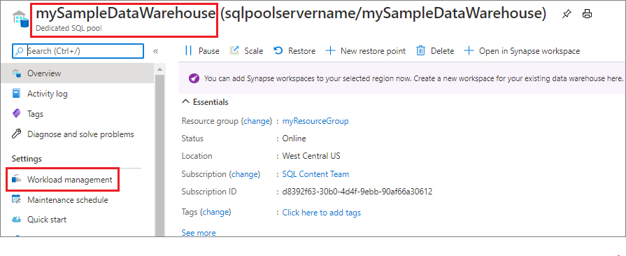
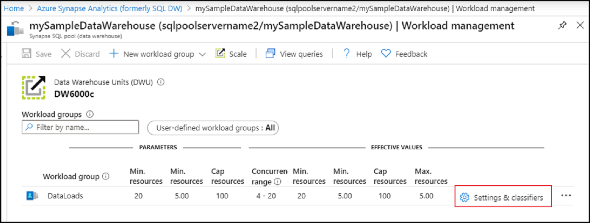
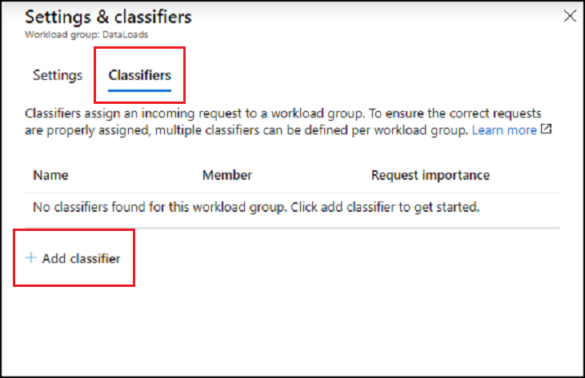
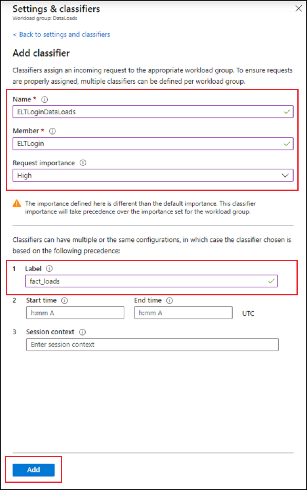
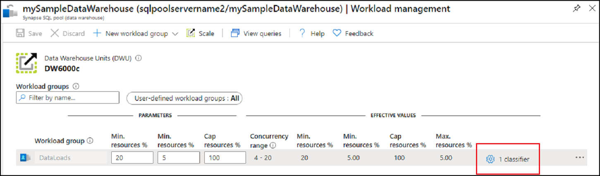
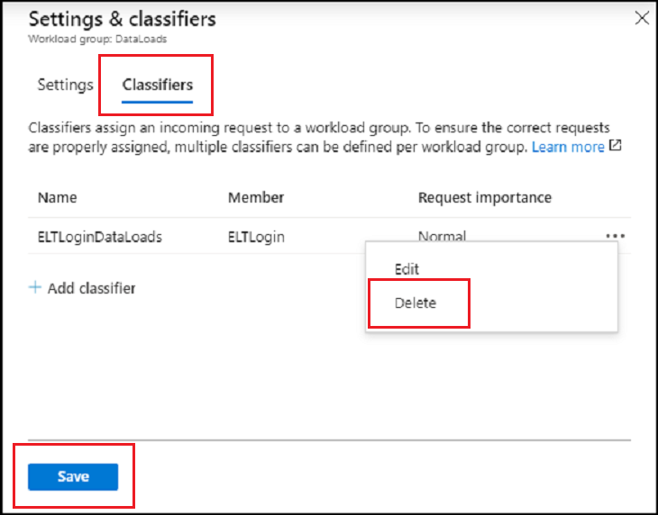
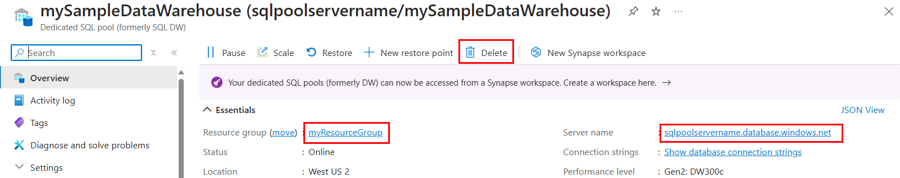

# Quickstart: Create a Synapse SQL pool workload classifier using the Azure portal

In this quickstart, you will create a [workload classifier](sql-data-warehouse-workload-classification.md) for assigning queries to a workload group.  The classifier will assign requests from the `ELTLogin` SQL user to the `DataLoads` workload group.   Follow the [Quickstart: Configure workload isolation](quickstart-configure-workload-isolation-portal.md) tutorial to create the `DataLoads` workload group.  This tutorial will create a workload classifier with the WLM_LABEL option to help further classify requests correctly.  The classifier will assign `HIGH` [workload importance](sql-data-warehouse-workload-importance.md) to these requests as well.


If you don't have an Azure subscription, create a [free](https://azure.microsoft.com/free/) account before you begin.


## Sign in to the Azure portal

Sign in to the [Azure portal](https://portal.azure.com/).

> [!NOTE]
> Creating a SQL pool instance in Azure Synapse Analytics may result in a new billable service.  For more information, see [Azure Synapse Analytics pricing](https://azure.microsoft.com/pricing/details/sql-data-warehouse/).

## Prerequisites

This quickstart assumes you already have a SQL pool instance in Synapse SQL and that you have CONTROL DATABASE permissions. If you need to create one, use [Create and Connect - portal](create-data-warehouse-portal.md) to create a data warehouse called **mySampleDataWarehouse**.
<br><br>
A workload group `DataLoads` exists.  See the [Quickstart: Configure workload isolation](quickstart-configure-workload-isolation-portal.md) tutorial to create the workload group.
<br><br>
>[!IMPORTANT] 
>Your SQL pool must be online to configure workload management. 


## Create a login for ELTLogin

Create a SQL Server authentication login in the `master` database using [CREATE LOGIN](/sql/t-sql/statements/create-login-transact-sql?toc=/azure/synapse-analytics/sql-data-warehouse/toc.json&bc=/azure/synapse-analytics/sql-data-warehouse/breadcrumb/toc.json&view=azure-sqldw-latest) for `ELTLogin`.

```sql
IF NOT EXISTS (SELECT * FROM sys.sql_logins WHERE name = 'ELTLogin')
BEGIN
CREATE LOGIN [ELTLogin] WITH PASSWORD='<strongpassword>'
END
;
```

## Create user and grant permissions

After the login is created, a user needs to be created in the database.  Use [CREATE USER](/sql/t-sql/statements/create-user-transact-sql?toc=/azure/synapse-analytics/sql-data-warehouse/toc.json&bc=/azure/synapse-analytics/sql-data-warehouse/breadcrumb/toc.json&view=azure-sqldw-latest) to create the SQL user `ELTRole` in the **mySampleDataWarehouse**.  Since we will test the classification during this tutorial, grant `ELTLogin` permissions to **mySampleDataWarehouse**. 

```sql
IF NOT EXISTS (SELECT * FROM sys.database_principals WHERE name = 'ELTLogin')
BEGIN
CREATE USER [ELTLogin] FOR LOGIN [ELTLogin]
GRANT CONTROL ON DATABASE::mySampleDataWarehouse TO ELTLogin 
END
;
```

## Configure workload classification
Classification allows you to route requests, based on a set of rules, to a workload group.  In the [Quickstart: Configure workload isolation](quickstart-configure-workload-isolation-portal.md) tutorial we created the `DataLoads` workload group.  Now you will create a workload classifier to route queries to the `DataLoads` workload group.


1.	Click **Azure Synapse Analytics (formerly SQL DW)** in the left page of the Azure portal.
2.	Select **mySampleDataWarehouse** from the **Azure Synapse Analytics (formerly SQL DW)** page. The SQL pool opens.
3.	Click **Workload management**.

    

4.	Click **Settings & classifiers** on the right-hand side of the `DataLoads` workload group.

    

5. Click on **Classifiers**.
6. Click on **Add classifier**.

    

7.	Enter `ELTLoginDataLoads` for **Name**.
8.	Enter `ELTLogin` for **Member**.
9.	Choose `High` for **Request Importance**.  *Optional*, normal importance is default.
10.	Enter `fact_loads` for **Label**.
11.	Click **Add**.
12.	Click **Save**.

    

## Verify and test classification
Check the [sys.workload_management_workload_classifiers](/sql/relational-databases/system-catalog-views/sys-workload-management-workload-classifiers-transact-sql?view=azure-sqldw-latest)
catalog view to verify existence of the `ELTLoginDataLoads` classifier.

```sql
SELECT * FROM sys.workload_management_workload_classifiers WHERE name = 'ELTLoginDataLoads'
```

Check the [sys.workload_management_workload_classifier_details](/sql/relational-databases/system-catalog-views/sys-workload-management-workload-classifier-details-transact-sql?view=azure-sqldw-latest) catalog view to verify classifier details.

```sql
SELECT c.[name], c.group_name, c.importance, cd.classifier_type, cd.classifier_value
  FROM sys.workload_management_workload_classifiers c
  JOIN sys.workload_management_workload_classifier_details cd
    ON cd.classifier_id = c.classifier_id
  WHERE c.name = 'ELTLoginDataLoads'
```

Run the following statements to test classification.  Ensure you are connected as ``ELTLogin`` and ``Label`` is used in query.
```sql
CREATE TABLE factstaging (ColA int)
INSERT INTO factstaging VALUES(0)
INSERT INTO factstaging VALUES(1)
INSERT INTO factstaging VALUES(2)
GO

CREATE TABLE testclassifierfact WITH (DISTRIBUTION = ROUND_ROBIN)
AS
SELECT * FROM factstaging
OPTION (LABEL='fact_loads')
```

Verify the `CREATE TABLE` statement classified to the `DataLoads` workload group using the `ELTLoginDataLoads` workload classifier.
```sql 
SELECT TOP 1 request_id, classifier_name, group_name, resource_allocation_percentage, submit_time, [status], [label], command 
FROM sys.dm_pdw_exec_requests 
WHERE [label] = 'fact_loads'
ORDER BY submit_time DESC
```


## Clean up resources

To delete the `ELTLoginDataLoads` workload classifier created in this tutorial:

1. Click on **1 Classifier** on the right-hand side of the `DataLoads` workload group.

    

2. Click on **Classifiers**.
3. Click on the **`...`** to the right of the `ELTLoginDataLoads` workload classifier.
4. Click on **Delete**.
5. Click on **Save**.

    

You're being charged for data warehouse units and data stored in your data warehouse. These compute and storage resources are billed separately.

- If you want to keep the data in storage, you can pause compute when you aren't using the data warehouse. By pausing compute, you're only charged for data storage. When you're ready to work with the data, resume compute.
- If you want to remove future charges, you can delete the data warehouse.

Follow these steps to clean up resources.

1. Sign in to the [Azure portal](https://portal.azure.com), select on your data warehouse.

    

2. To pause compute, select the **Pause** button. When the data warehouse is paused, you see a **Start** button.  To resume compute, select **Start**.

3. To remove the data warehouse so you're not charged for compute or storage, select **Delete**.

4. To remove the SQL server you created, select **sqlpoolservername.database.windows.net** in the previous image, and then select **Delete**.  Be careful with this deletion, since deleting the server also deletes all databases assigned to the server.

5. To remove the resource group, select **myResourceGroup**, and then select **Delete resource group**.

## Next steps

Monitor your workload using the Azure portal monitoring metrics.  See [Manage and monitor Workload Management](sql-data-warehouse-how-to-manage-and-monitor-workload-importance.md) for details.
