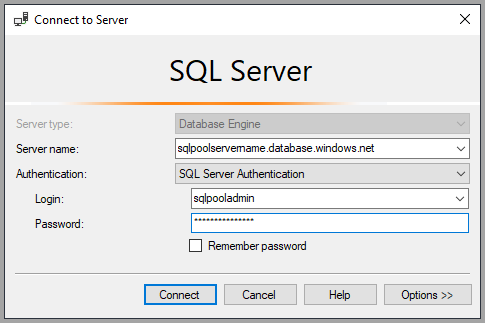
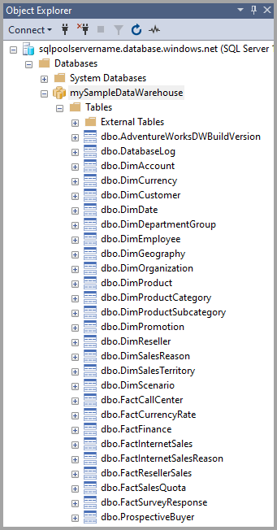
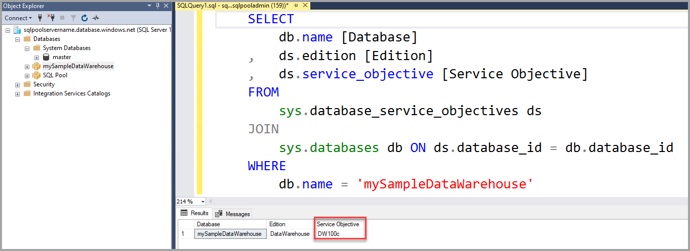
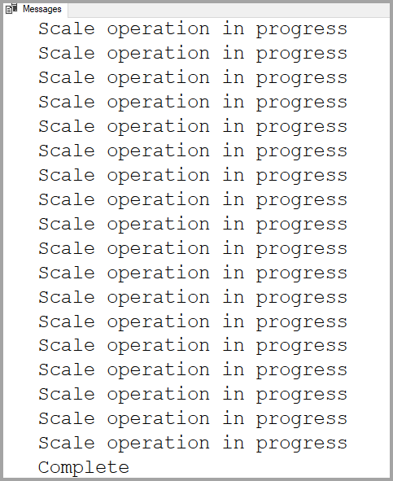

# Quickstart: Scale compute in Azure Synapse Analytics using T-SQL

Scale compute in Azure Synapse Analytics (formerly SQL DW) using T-SQL and SQL Server Management Studio (SSMS). [Scale out compute](sql-data-warehouse-manage-compute-overview.md) for better performance, or scale back compute to save costs.

If you don't have an Azure subscription, create a [free](https://azure.microsoft.com/free/) account before you begin.

## Before you begin

Download and install the newest version of [SQL Server Management Studio](/sql/ssms/download-sql-server-management-studio-ssms?toc=/azure/synapse-analytics/sql-data-warehouse/toc.json&bc=/azure/synapse-analytics/sql-data-warehouse/breadcrumb/toc.json&view=azure-sqldw-latest) (SSMS).

## Create a data warehouse

Use [Quickstart: create and Connect - portal](create-data-warehouse-portal.md) to create a data warehouse named **mySampleDataWarehouse**. Complete the quickstart to ensure you have a firewall rule and can connect to your data warehouse from within SQL Server Management Studio.

## Connect to the server as server admin

This section uses [SQL Server Management Studio](/sql/ssms/download-sql-server-management-studio-ssms?toc=/azure/synapse-analytics/sql-data-warehouse/toc.json&bc=/azure/synapse-analytics/sql-data-warehouse/breadcrumb/toc.json&view=azure-sqldw-latest) (SSMS) to establish a connection to your Azure SQL server.

1. Open SQL Server Management Studio.

2. In the **Connect to Server** dialog box, enter the following information:

   | Setting       | Suggested value | Description |
   | ------------ | ------------------ | ------------------------------------------------- |
   | Server type | Database engine | This value is required |
   | Server name | The fully qualified server name | Here's an example: **mySampleDataWarehouseservername.database.windows.net**. |
   | Authentication | SQL Server Authentication | SQL Authentication is the only authentication type that is configured in this tutorial. |
   | Login | The server admin account | The account that you specified when you created the server. |
   | Password | The password for your server admin account | The password you specified when you created the server. |

    

3. Click **Connect**. The Object Explorer window opens in SSMS.

4. In Object Explorer, expand **Databases**. Then expand **mySampleDataWarehouse** to view the objects in your new database.

    

## View service objective

The service objective setting contains the number of data warehouse units for the data warehouse.

To view the current data warehouse units for your data warehouse:

1. Under the connection to **mySampleDataWarehouseservername.database.windows.net**, expand **System Databases**.
2. Right-click **master** and select **New Query**. A new query window opens.
3. Run the following query to select from the sys.database_service_objectives dynamic management view.

    ```sql
    SELECT
        db.name [Database]
    ,    ds.edition [Edition]
    ,    ds.service_objective [Service Objective]
    FROM
         sys.database_service_objectives ds
    JOIN
        sys.databases db ON ds.database_id = db.database_id
    WHERE
        db.name = 'mySampleDataWarehouse'
    ```

4. The following results show **mySampleDataWarehouse** has a service objective of DW400.

    

## Scale compute

In Azure Synapse, you can increase or decrease compute resources by adjusting data warehouse units. The [Create and Connect - portal](create-data-warehouse-portal.md) created **mySampleDataWarehouse** and initialized it with 400 DWUs. The following steps adjust the DWUs for **mySampleDataWarehouse**.

To change data warehouse units:

1. Right-click **master** and select **New Query**.
2. Use the [ALTER DATABASE](/sql/t-sql/statements/alter-database-azure-sql-database?toc=/azure/synapse-analytics/sql-data-warehouse/toc.json&bc=/azure/synapse-analytics/sql-data-warehouse/breadcrumb/toc.json&view=azure-sqldw-latest) T-SQL statement to modify the service objective. Run the following query to change the service objective to DW300.

    ```Sql
    ALTER DATABASE mySampleDataWarehouse
    MODIFY (SERVICE_OBJECTIVE = 'DW300c');
    ```

## Monitor scale change request

To see the progress of the previous change request, you can use the `WAITFORDELAY` T-SQL syntax to poll the sys.dm_operation_status dynamic management view (DMV).

To poll for the service object change status:

1. Right-click **master** and select **New Query**.
2. Run the following query to poll the sys.dm_operation_status DMV.

    ```sql
    WHILE
    (
        SELECT TOP 1 state_desc
        FROM sys.dm_operation_status
        WHERE
            1=1
            AND resource_type_desc = 'Database'
            AND major_resource_id = 'mySampleDataWarehouse'
            AND operation = 'ALTER DATABASE'
        ORDER BY
            start_time DESC
    ) = 'IN_PROGRESS'
    BEGIN
        RAISERROR('Scale operation in progress',0,0) WITH NOWAIT;
        WAITFOR DELAY '00:00:05';
    END
    PRINT 'Complete';
    ```

3. The resulting output shows a log of the polling of the status.

    

## Check data warehouse state

When a data warehouse is paused, you can't connect to it with T-SQL. To see the current state of the data warehouse, you can use a PowerShell cmdlet. For an example, see [Check data warehouse state - Powershell](quickstart-scale-compute-powershell.md#check-data-warehouse-state).

## Check operation status

To return information about various management operations on your Azure Synapse, run the following query on the [sys.dm_operation_status](/sql/relational-databases/system-dynamic-management-views/sys-dm-operation-status-azure-sql-database?toc=/azure/synapse-analytics/sql-data-warehouse/toc.json&bc=/azure/synapse-analytics/sql-data-warehouse/breadcrumb/toc.json&view=azure-sqldw-latest) DMV. For example, it returns the operation and the  state of the operation, which is IN_PROGRESS or COMPLETED.

```sql
SELECT *
FROM
    sys.dm_operation_status
WHERE
    resource_type_desc = 'Database'
AND
    major_resource_id = 'mySampleDataWarehouse'
```

## Next steps

You've now learned how to scale compute for your data warehouse. To learn more about Azure Synapse, continue to the tutorial for loading data.

> [!div class="nextstepaction"]
>[Load data into a Azure Synapse Analytics](load-data-from-azure-blob-storage-using-polybase.md)
