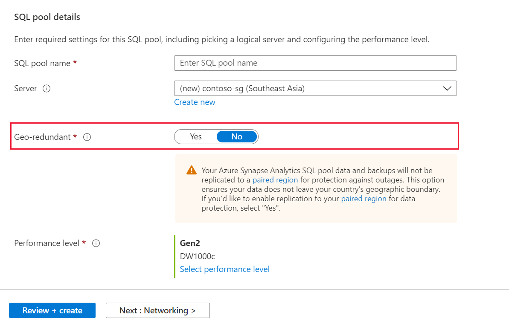
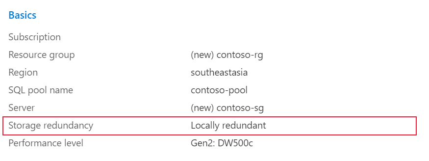
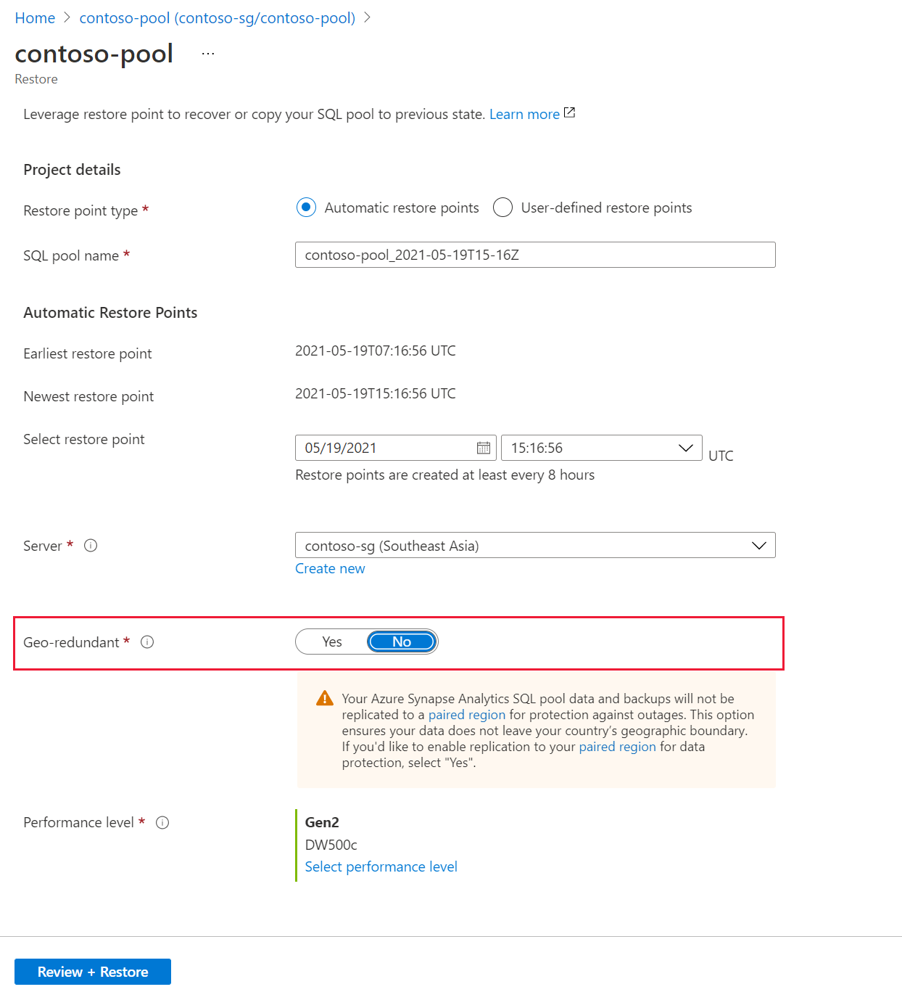

# Configure single region residency for a dedicated SQL pool (formerly SQL DW) in Azure Synapse Analytics

In this article, you will learn to provision your database on locally redundant storage to ensure that your data stays within your geographic boundary. This article is only applicable to dedicated SQL pools that reside in a region where the Azure regional pair is located outside of the country/region. Following the steps in this article will result in most data and all backups not being replicated to a [paired region](../../availability-zones/cross-region-replication-azure.md?toc=/azure/synapse-analytics/sql-data-warehouse/toc.json&bc=/azure/synapse-analytics/sql-data-warehouse/breadcrumb/toc.json). Note that some metadata such as logical server name, logical database name, resource group name is still replicated to a paired region by default and this cannot be changed. 

To achieve single region residency, provision your dedicated SQL pool (formerly SQL DW) to locally redundant storage by selecting 'No' to geo-redundant option when provisioning your SQL pool. If you have already provisioned your SQL pool and it resides on geo redundant storage, you can restore your SQL pool and select 'No' to geo-redundant storage during the restore process. Instructions for both scenarios are detailed below. 

## Provision a dedicated SQL pool (formerly SQL DW) on locally redundant storage through Azure portal

Follow these steps to provision a dedicated SQL pool (formerly SQL DW) on locally redundant storage:

1. Sign in to your [Azure portal](https://portal.azure.com/) account.
1. Search for **Dedicated SQL pools (formerly SQL DW)**.

   

1. Click add and fill out the information requested in the **Basics** tab*.

1. If your server is located in a region (such as Southeast Asia) where the regional pair is in a different geography, you will have the option to opt out of Geo-redundancy. 

   

1. Select **Next: Networking** to configure a public or private endpoint. 

1. Select **Next: Additional settings** to restore from a backup, sample or create a blank database.  

1. Select **Next: Tags** to configure tags to categorize your SQL pool. 

1. Select **Next: Review + create**. Ensure that the correct Storage redundancy has been chosen to ensure data residency. 

    

1. Select **Create**.  

## Provision a dedicated SQL pool (formerly SQL DW) on locally redundant storage through PowerShell
To create a new dedicated SQL pool through PowerShell, use the [New-AzSqlDatabase](/powershell/module/az.sql/new-azsqldatabaserestorepoint?toc=/azure/synapse-analytics/sql-data-warehouse/toc.json&bc=/azure/synapse-analytics/sql-data-warehouse/breadcrumb/toc.json) PowerShell cmdlet.

1. Before you begin, make sure to [install Azure PowerShell](/powershell/azure/?toc=/azure/synapse-analytics/sql-data-warehouse/toc.json&bc=/azure/synapse-analytics/sql-data-warehouse/breadcrumb/toc.json).
2. Open PowerShell.
3. Connect to your Azure account and list all the subscriptions associated with your account.
4. Select the subscription that contains the database to be restored.
5. Create a new database on locally redundant storage.
1. Ensure that the database has been successfully created on locally redundant storage.  

```powershell

$SubscriptionName="<YourSubscriptionName>"
$ResourceGroupName="<YourResourceGroupName>"
$ServerName="<YourServerNameWithoutURLSuffixSeeNote>"  # Without database.windows.net
$DatabaseName="<YourDatabaseName>"
$Label = "<YourRestorePointLabel>"

Connect-AzAccount
Get-AzSubscription
Select-AzSubscription -SubscriptionName $SubscriptionName
New-AzSqlDatabase -ResourceGroupName $ResourceGroupName -Edition 'DataWarehouse' -ServerName $ServerName -DatabaseName $DatabaseName -BackupStorageRedundancy 'Local'
Get-AzSqlDatabase -ResourceGroupName $ResourceGroupName -Edition 'DataWarehouse' -ServerName $ServerName -DatabaseName $DatabaseName 
```

## Restore a dedicated SQL pool (formerly SQL DW) on locally redundant storage through Azure portal
1. Sign in to the [Azure portal](https://portal.azure.com/).

1. Navigate to the dedicated  that you want to restore from.

1. At the top of the Overview blade, select **Restore**.

1. Select the restore point that you would like to restore from. 

1. For **Geo-redundant** select 'No'. 

   

## Restore a dedicated SQL pool (formerly SQL DW) on locally redundant storage through PowerShell
To create a new dedicated SQL pool through PowerShell, use the [New-AzSqlDatabase](/powershell/module/az.sql/new-azsqldatabaserestorepoint?toc=/azure/synapse-analytics/sql-data-warehouse/toc.json&bc=/azure/synapse-analytics/sql-data-warehouse/breadcrumb/toc.json) PowerShell cmdlet.

1. Before you begin, make sure to [install Azure PowerShell](/powershell/azure/?toc=/azure/synapse-analytics/sql-data-warehouse/toc.json&bc=/azure/synapse-analytics/sql-data-warehouse/breadcrumb/toc.json).
2. Open PowerShell.
3. Connect to your Azure account and list all the subscriptions associated with your account.
4. Select the subscription that contains the database to be restored.
5. List the restore points for the dedicated SQL pool (formerly SQL DW).
1. Pick the desired restore point using the RestorePointCreationDate.
1. Restore the dedicated SQL pool (formerly SQL DW) to the desired restore point using Restore-AzSqlDatabase PowerShell cmdlet specifying BackupStorageRedundnacy as 'Local'. 

```powershell

$SubscriptionName="<YourSubscriptionName>"
$ResourceGroupName="<YourResourceGroupName>"
$ServerName="<YourServerNameWithoutURLSuffixSeeNote>"  # Without database.windows.net
$DatabaseName="<YourDatabaseName>"
$NewDatabaseName="<YourDatabaseName>"

Connect-AzAccount
Get-AzSubscription
Select-AzSubscription -SubscriptionName $SubscriptionName

# Or list all restore points
Get-AzSqlDatabaseRestorePoint -ResourceGroupName $ResourceGroupName -ServerName $ServerName -DatabaseName $DatabaseName

# Get the specific database to restore
$Database = Get-AzSqlDatabase -ResourceGroupName $ResourceGroupName -ServerName $ServerName -DatabaseName $DatabaseName

# Pick desired restore point using RestorePointCreationDate "xx/xx/xxxx xx:xx:xx xx"
$PointInTime="<RestorePointCreationDate>"

# Restore database from a restore point
$RestoredDatabase = Restore-AzSqlDatabase –FromPointInTimeBackup –PointInTime $PointInTime -ResourceGroupName $Database.ResourceGroupName -ServerName $Database.ServerName -TargetDatabaseName $NewDatabaseName –ResourceId $Database.ResourceID -BackupStorageRedundancy 'Local'

# Verify the status of restored database
$RestoredDatabase.status
```


## Next steps

- [Restore an existing dedicated SQL pool (formerly SQL DW)](sql-data-warehouse-restore-active-paused-dw.md)
- [Restore a deleted dedicated SQL pool (formerly SQL DW)](sql-data-warehouse-restore-deleted-dw.md)
