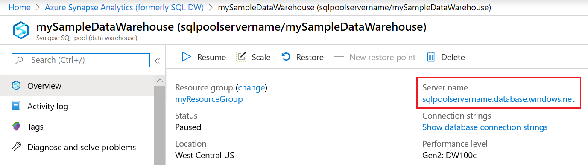

# Connect to a SQL pool in Azure Synapse

Get connected to a SQL pool in Azure Synapse.

## Find your server name

The server name in the following example is `sqlpoolservername.database.windows.net`. To find the fully qualified server name:

1. Go to the [Azure portal](https://portal.azure.com).
2. Select **Azure Synapse Analytics**.
3. Select the SQL pool you want to connect to.
4. Locate the full server name.

   

## Supported drivers and connection strings

SQL pool works with various drivers. Select any of the following drivers for the latest documentation and version information: [ADO.NET](/dotnet/framework/data/adonet?toc=/azure/synapse-analytics/sql-data-warehouse/toc.json&bc=/azure/synapse-analytics/sql-data-warehouse/breadcrumb/toc.json), [ODBC](/sql/connect/odbc/windows/microsoft-odbc-driver-for-sql-server-on-windows?toc=/azure/synapse-analytics/sql-data-warehouse/toc.json&bc=/azure/synapse-analytics/sql-data-warehouse/breadcrumb/toc.json&view=azure-sqldw-latest&preserve-view=true), [PHP](/sql/connect/php/overview-of-the-php-sql-driver?toc=/azure/synapse-analytics/sql-data-warehouse/toc.json&bc=/azure/synapse-analytics/sql-data-warehouse/breadcrumb/toc.json&view=azure-sqldw-latest&preserve-view=true), and [JDBC](/sql/connect/jdbc/microsoft-jdbc-driver-for-sql-server?toc=/azure/synapse-analytics/sql-data-warehouse/toc.json&bc=/azure/synapse-analytics/sql-data-warehouse/breadcrumb/toc.json&view=azure-sqldw-latest&preserve-view=true).

You can automatically generate a connection string for your driver. Select a driver from the previous list and then select **Show database connection strings**.

> [!NOTE]
> Consider setting the connection timeout to 300 seconds to allow your connection to survive short periods of unavailability.

Here are examples of connection strings for popular drivers:

### ADO.NET connection string example

```csharp
Server=tcp:{your_server}.database.windows.net,1433;Database={your_database};User ID={your_user_name};Password={your_password_here};Encrypt=True;TrustServerCertificate=False;Connection Timeout=30;
```

### ODBC connection string example

```csharp
Driver={SQL Server Native Client 11.0};Server=tcp:{your_server}.database.windows.net,1433;Database={your_database};Uid={your_user_name};Pwd={your_password_here};Encrypt=yes;TrustServerCertificate=no;Connection Timeout=30;
```

### PHP connection string example

```PHP
Server: {your_server}.database.windows.net,1433 \r\nSQL Database: {your_database}\r\nUser Name: {your_user_name}\r\n\r\nPHP Data Objects(PDO) Sample Code:\r\n\r\ntry {\r\n   $conn = new PDO ( \"sqlsrv:server = tcp:{your_server}.database.windows.net,1433; Database = {your_database}\", \"{your_user_name}\", \"{your_password_here}\");\r\n    $conn->setAttribute( PDO::ATTR_ERRMODE, PDO::ERRMODE_EXCEPTION );\r\n}\r\ncatch ( PDOException $e ) {\r\n   print( \"Error connecting to SQL Server.\" );\r\n   die(print_r($e));\r\n}\r\n\rSQL Server Extension Sample Code:\r\n\r\n$connectionInfo = array(\"UID\" => \"{your_user_name}\", \"pwd\" => \"{your_password_here}\", \"Database\" => \"{your_database}\", \"LoginTimeout\" => 30, \"Encrypt\" => 1, \"TrustServerCertificate\" => 0);\r\n$serverName = \"tcp:{your_server}.database.windows.net,1433\";\r\n$conn = sqlsrv_connect($serverName, $connectionInfo);
```

### JDBC connection string example

```Java
jdbc:sqlserver://yourserver.database.windows.net:1433;database=yourdatabase;user={your_user_name};password={your_password_here};encrypt=true;trustServerCertificate=false;hostNameInCertificate=*.database.windows.net;loginTimeout=30;
```

## Connection settings

SQL pool standardizes certain settings during connection and object creation. These settings cannot be overridden. They include:

| SQL pool setting | Value |
|:--- |:--- |
| [ANSI_NULLS](/sql/t-sql/statements/set-ansi-nulls-transact-sql?toc=/azure/synapse-analytics/sql-data-warehouse/toc.json&bc=/azure/synapse-analytics/sql-data-warehouse/breadcrumb/toc.json&view=azure-sqldw-latest&preserve-view=true) |ON |
| [QUOTED_IDENTIFIERS](/sql/t-sql/statements/set-quoted-identifier-transact-sql?toc=/azure/synapse-analytics/sql-data-warehouse/toc.json&bc=/azure/synapse-analytics/sql-data-warehouse/breadcrumb/toc.json&view=azure-sqldw-latest&preserve-view=true) |ON |
| [DATEFORMAT](/sql/t-sql/statements/set-dateformat-transact-sql?toc=/azure/synapse-analytics/sql-data-warehouse/toc.json&bc=/azure/synapse-analytics/sql-data-warehouse/breadcrumb/toc.json&view=azure-sqldw-latest&preserve-view=true) |mdy |
| [DATEFIRST](/sql/t-sql/statements/set-datefirst-transact-sql?toc=/azure/synapse-analytics/sql-data-warehouse/toc.json&bc=/azure/synapse-analytics/sql-data-warehouse/breadcrumb/toc.json&view=azure-sqldw-latest&preserve-view=true) |7 |

## Next steps

To connect and query with Visual Studio, see [Query with Visual Studio](sql-data-warehouse-query-visual-studio.md). To learn more about authentication options, see [Authentication to Azure Synapse Analytics](sql-data-warehouse-authentication.md).
