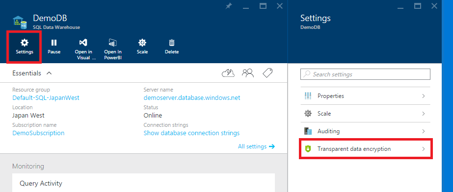
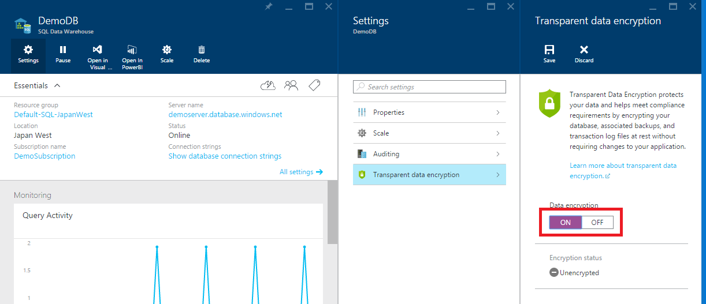
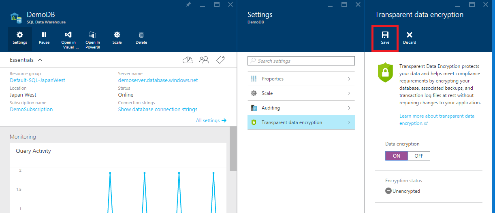
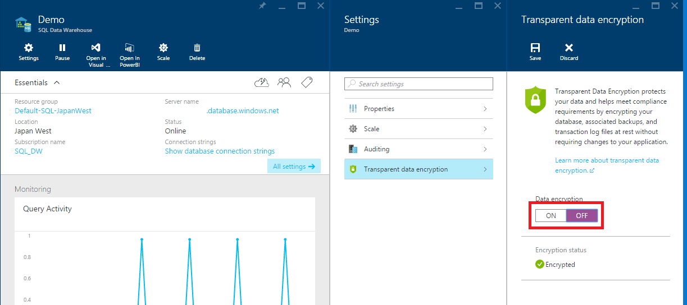
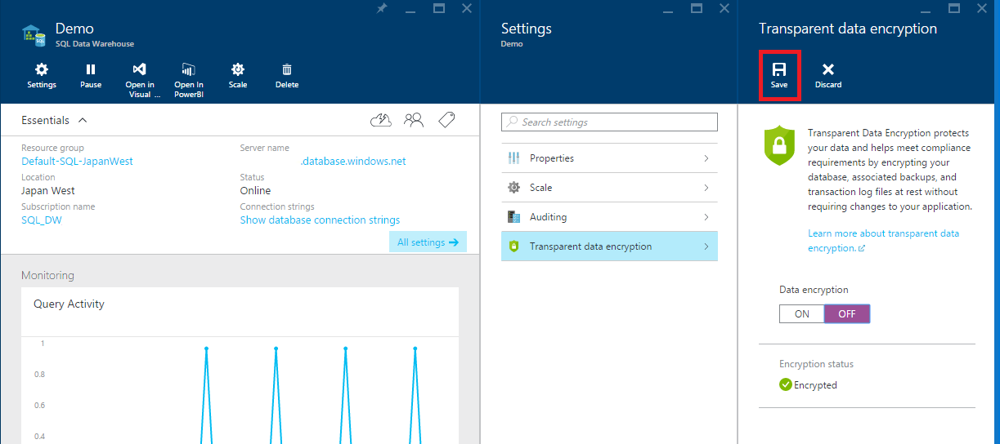

# Get started with Transparent Data Encryption (TDE) for dedicated SQL pool (formerly SQL DW) in Azure Synapse Analytics

> [!div class="op_single_selector"]
>
> * [Security Overview](sql-data-warehouse-overview-manage-security.md)
> * [Authentication](sql-data-warehouse-authentication.md)
> * [Encryption (Portal)](sql-data-warehouse-encryption-tde.md)
> * [Encryption (T-SQL)](sql-data-warehouse-encryption-tde-tsql.md)

> [!NOTE]
> This article applies to Azure SQL Database, Azure SQL Managed Instance, and Azure Synapse Analytics (dedicated SQL pools (formerly SQL DW)). For documentation on Transparent Data Encryption for dedicated SQL pools inside Synapse workspaces, see [Azure Synapse Analytics encryption](../security/workspaces-encryption.md).

## Required Permissions

To enable Transparent Data Encryption (TDE), you must be an administrator or a member of the dbmanager role.

## Enabling Encryption

To enable TDE, follow the steps below:

1. Open the database in the [Azure portal](https://portal.azure.com)
2. In the database blade, click the **Settings** button
3. Select the **Transparent data encryption** option
   
4. Select the **On** setting
   
5. Select **Save**
     

## Disabling Encryption

To disable TDE, follow the steps below:

1. Open the database in the [Azure portal](https://portal.azure.com)
2. In the database blade, click the **Settings** button
3. Select the **Transparent data encryption** option
   
4. Select the **Off** setting
   
5. Select **Save**
     

## Encryption DMVs

Encryption can be confirmed with the following DMVs:

* [sys.databases](/sql/relational-databases/system-catalog-views/sys-databases-transact-sql?toc=/azure/synapse-analytics/sql-data-warehouse/toc.json&bc=/azure/synapse-analytics/sql-data-warehouse/breadcrumb/toc.json&view=azure-sqldw-latest&preserve-view=true)
* [sys.dm_pdw_nodes_database_encryption_keys](/sql/relational-databases/system-dynamic-management-views/sys-dm-pdw-nodes-database-encryption-keys-transact-sql?toc=/azure/synapse-analytics/sql-data-warehouse/toc.json&bc=/azure/synapse-analytics/sql-data-warehouse/breadcrumb/toc.json&view=azure-sqldw-latest&preserve-view=true)
