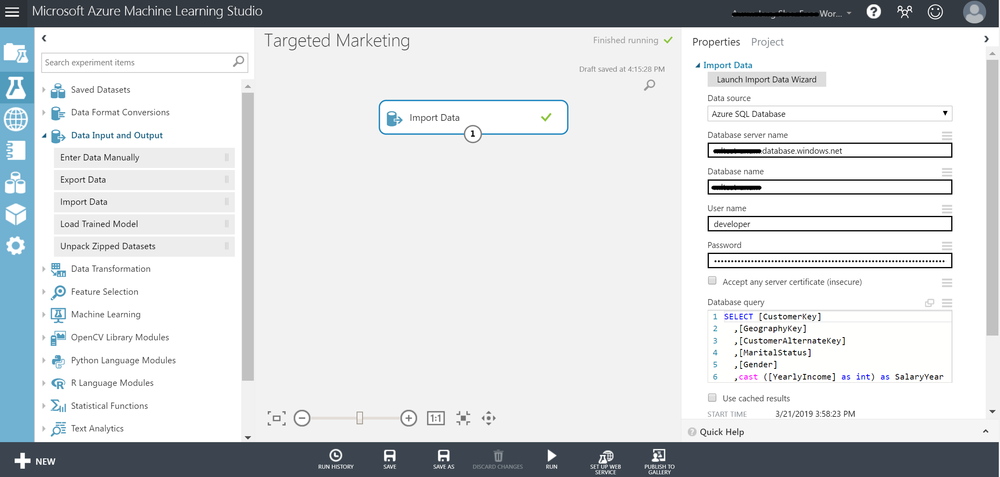
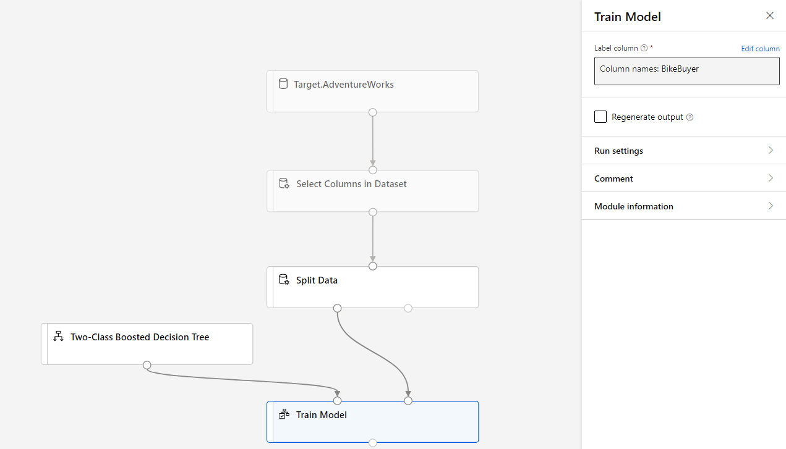
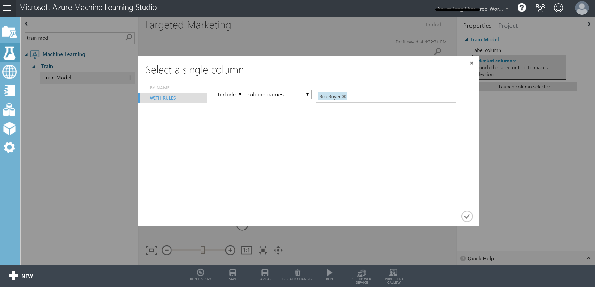
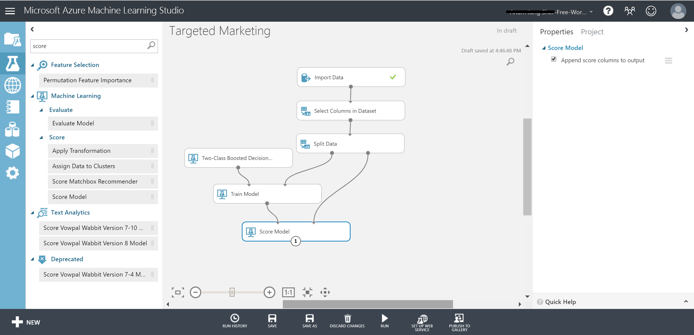

# Analyze data with Azure Machine Learning
This tutorial uses Azure Machine Learning to build a predictive machine learning model based on data stored in Azure Synapse. Specifically, this builds a targeted marketing campaign for Adventure Works, the bike shop, by predicting if a customer is likely to buy a bike or not.

## Prerequisites
To step through this tutorial, you need:

* A SQL pool pre-loaded with AdventureWorksDW sample data. To provision this, see [Create a SQL pool](create-data-warehouse-portal.md) and choose to load the sample data. If you already have a data warehouse but do not have sample data, you can [load sample data manually](load-data-from-azure-blob-storage-using-polybase.md).

## 1. Get the data
The data is in the dbo.vTargetMail view in the AdventureWorksDW database. To read this data:

1. Sign into [Azure Machine Learning studio](https://studio.azureml.net/)

**<<confirm datastore support**
1. Click on my experiments.
2. Click **+NEW** on the bottom left of the screen and select **Blank Experiment**.
3. Enter a name for your experiment: Targeted Marketing.
4. Drag the **Import data** module under **Data Input and output** from the modules pane into the canvas.
5. Specify the details of your SQL pool in the Properties pane.
6. Specify the database **query** to read the data of interest.

```sql
SELECT [CustomerKey]
  ,[GeographyKey]
  ,[CustomerAlternateKey]
  ,[MaritalStatus]
  ,[Gender]
  ,cast ([YearlyIncome] as int) as SalaryYear
  ,[TotalChildren]
  ,[NumberChildrenAtHome]
  ,[EnglishEducation]
  ,[EnglishOccupation]
  ,[HouseOwnerFlag]
  ,[NumberCarsOwned]
  ,[CommuteDistance]
  ,[Region]
  ,[Age]
  ,[BikeBuyer]
FROM [dbo].[vTargetMail]
```

Run the experiment by clicking **Run** under the experiment canvas.

**??replace this image??**


After the experiment finishes running successfully, click the output port at the bottom of the Reader module and select **Visualize** to see the imported data.

**??replace this image??**


**confirm datastore support>>**

## Configure designer experiment
1.	Click on Designer tab on the left pane.
2.	Select Easy-to-use prebuilt modules.
3.	Change the name of the pipeline.
4.	Select a target cluster for the whole experiment in settings button to a previously provisioned cluster.

## Import the data
1.	Click on Designer on the left pane.
2.	Select the **Datasets** subtab in the left pane below the search box.
3.	Drag your Dataset into the canvas.

    

## Clean the data
To clean the data, drop some columns that are not relevant for the model. To do this:

1. Select the **Modules** subtab in the left pane.
2. Drag the **Select Columns in Dataset** module under **Data Transformation < Manipulation** into the canvas. Connect this module to the **Dataset** module.
3. Click **Launch column selector** in the Properties pane to specify which columns you wish to drop.

    

1. Exclude two columns: CustomerAlternateKey and GeographyKey.

   

## Build the model
We will split the data 80-20: 80% to train a machine learning model and 20% to test the model. We will make use of the "Two-Class" algorithms for this binary classification problem.

1. Drag the **Split Data** module into the canvas.
2. In the properties pane, enter 0.8 for Fraction of rows in the first output dataset.

   

3. Drag the **Two-Class Boosted Decision Tree** module into the canvas.
4. Drag the **Train Model** module into the canvas and specify inputs by connecting it to the **Two-Class Boosted Decision Tree** (ML algorithm) and **Split Data** (data to train the algorithm on) modules. 

     

5. Then, click **Label column** in the Properties pane. Select the **BikeBuyer** column as the column to predict.

    **??replace this image??**
   

## Score the model
Now, we will test how the model performs on test data. We will compare the algorithm of our choice with a different algorithm to see which performs better.

1. Drag **Score Model** module into the canvas and connect it to **Train Model** and **Split Data** modules.

    **??replace this image??**
   

2. Drag the **Two-Class Bayes Point Machine** into the experiment canvas. We will compare how this algorithm performs in comparison to the Two-Class Boosted Decision Tree.
3. Copy and Paste the modules **Train Model** and **Score Model** in the canvas.
4. Drag the **Evaluate Model** module into the canvas to compare the two algorithms.
5. **Run** the experiment.

   
6. Click the output port at the bottom of the **Evaluate Model** module and click **Visualize**.

   

The metrics provided are the ROC curve, precision-recall diagram, and lift curve. Looking at these metrics, we can see that the first model performed better than the second one. To look at what the first model predicted, click on output port of the Score Model and click Visualize.

**??replace this image??**


You will see two more columns added to your test dataset.

* Scored Probabilities: the likelihood that a customer is a bike buyer.
* Scored Labels: the classification done by the model – bike buyer (1) or not (0). This probability threshold for labeling is set to 50% and can be adjusted.

Comparing the column BikeBuyer (actual) with the Scored Labels (prediction), you can see how well the model has performed. Next, you can use this model to make predictions for new customers and [publish this model as a web service](https://docs.microsoft.com/azure/machine-learning/tutorial-designer-automobile-price-deploy) or write results back to Azure Synapse.

## Next steps
To learn more about building predictive machine learning models, refer to [Introduction to Machine Learning on Azure](https://docs.microsoft.com/azure/machine-learning/overview-what-is-azure-ml).