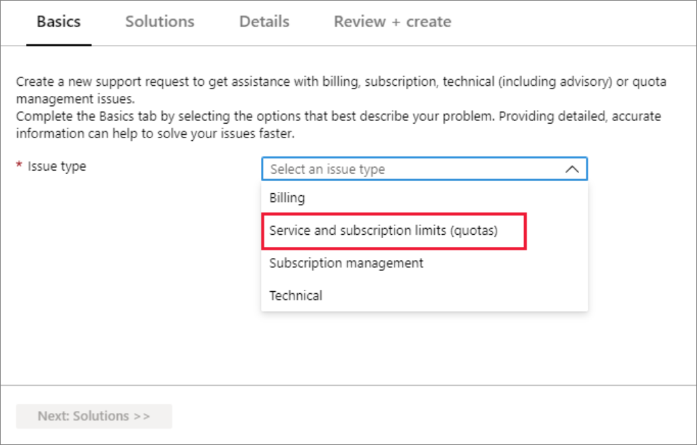
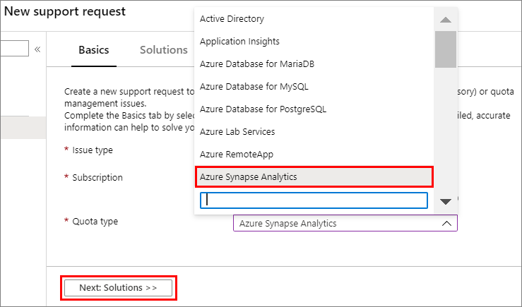
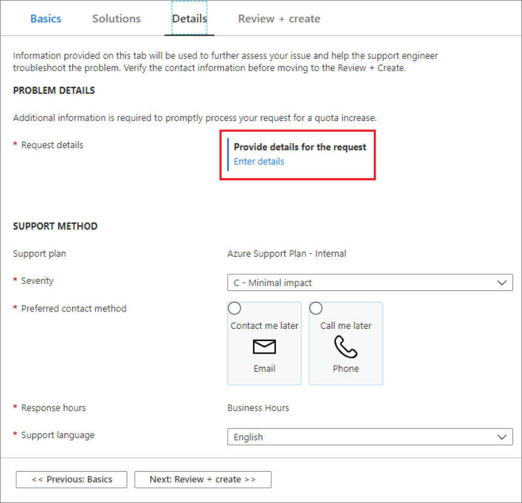
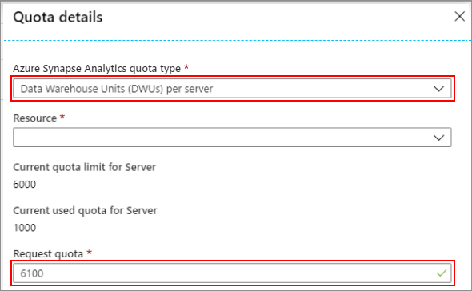
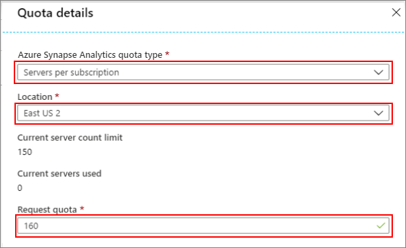
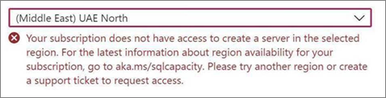
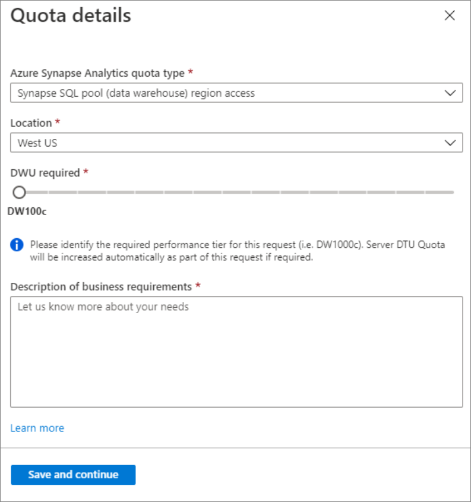
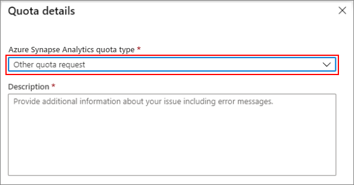
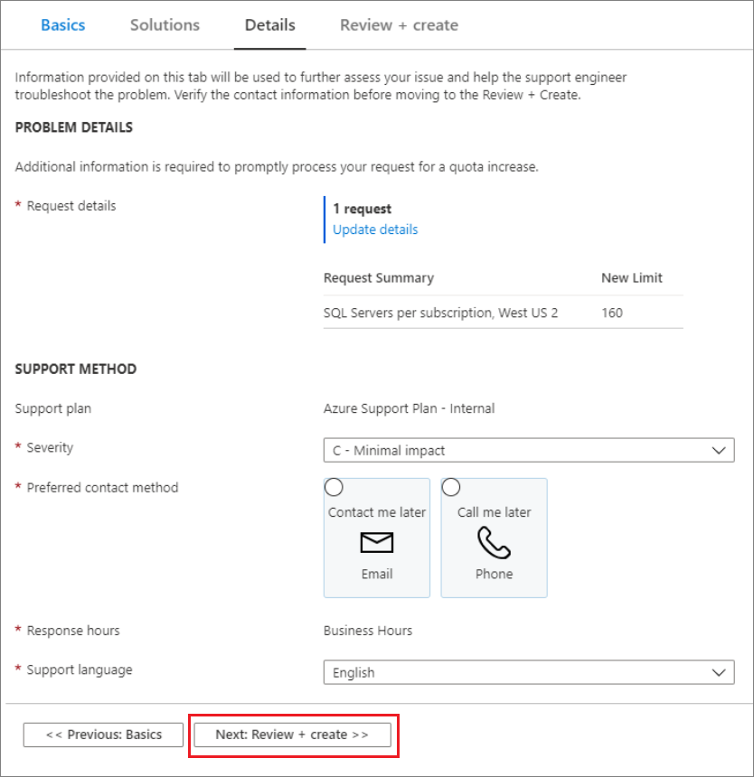
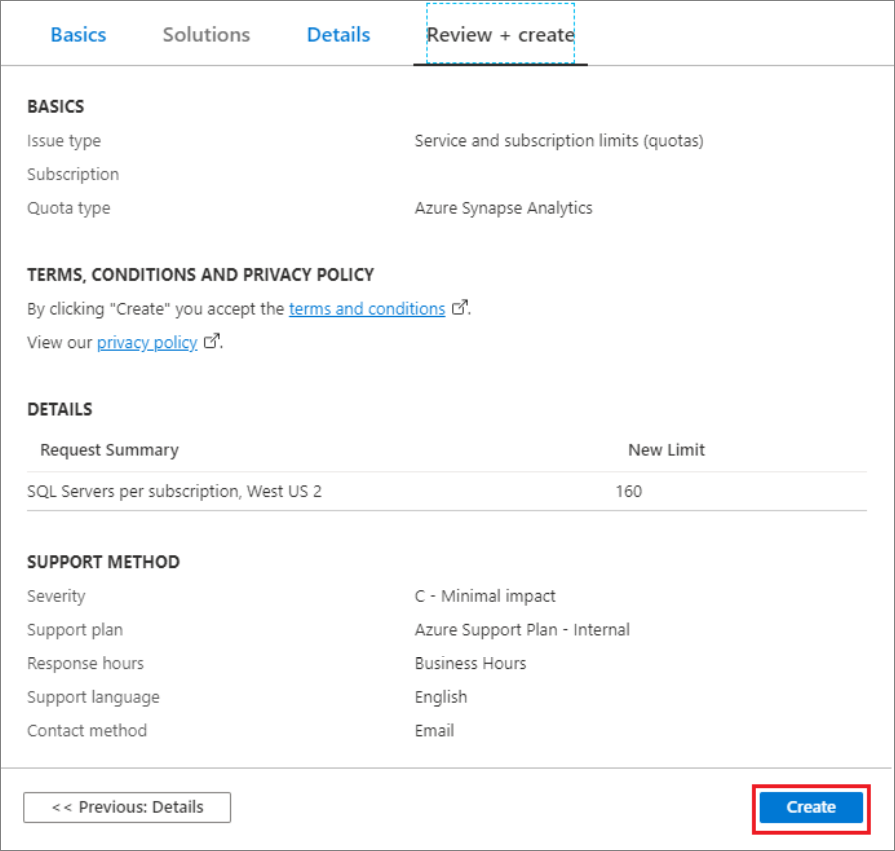

# Request quota increases and get support for Azure Synapse Analytics

This article describes how to submit a support ticket in the Azure portal for Azure Synapse Analytics. This process enables you to request a quota increase or to submit a technical support request for the engineering support team.

## Create a support ticket

Use the following steps to create a new support request from the Azure portal for Azure Synapse Analytics.

1. On  the [Azure portal](https://portal.azure.com) menu, select **Help + support**.

   

1. In **Help + support**, select **New support request**.

    

1. Review your [Azure support plan](https://azure.microsoft.com/support/plans/?WT.mc_id=Support_Plan_510979/).

   * **Billing, quota, and subscription management** support are available at all support levels.
   * **Break-fix** support is provided through [Developer](https://azure.microsoft.com/support/plans/developer/), [Standard](https://azure.microsoft.com/support/plans/standard/), [Professional Direct](https://azure.microsoft.com/support/plans/prodirect/), or [Premier](https://azure.microsoft.com/support/plans/premier/) support. Break-fix issues are problems experienced by customers while using Azure where there is a reasonable expectation that Microsoft caused the problem.
   * **Developer mentoring** and **advisory services** are available at the [Professional Direct](https://azure.microsoft.com/support/plans/prodirect/) and [Premier](https://azure.microsoft.com/support/plans/premier/) support levels.

   If you have a Premier support plan, you can also report Azure Synapse Analytics issues on the [Microsoft Premier online portal](https://premier.microsoft.com/). See [Azure support plans](https://azure.microsoft.com/support/plans/?WT.mc_id=Support_Plan_510979/) to learn more about the various support plans, including scope, response times, pricing, etc.  For frequently asked questions about Azure support, see [Azure support FAQs](https://azure.microsoft.com/support/faq/).

1. For **Issue type**, select the appropriate issue type. For break-fix problems, select **Technical**. For quota increase requests, select **Service and subscription limits (quotas)**.

     

   > [!NOTE]
   > This remainder of this article focusses on quota-increase requests. But you can also select **Technical** here for problem-resolution support requests. If you select **Technical**, you are asked to provide a summary and then identify a problem type by selecting **Select problem type**. You may see solutions to help resolve your issue. If the solutions presented do not resolve your issue, select **Next:Details** and complete the form to submit the support ticket.

1. For quota increase requests, select **Azure Synapse Analytics** for the **Quota type**. Then select **Next: Solutions >>**.

   

1. In the **Details** window, select **Enter details** to enter additional information.

   

## Quota request types

Selecting **Enter details** displays the **Quota details** window that allows you to add additional information. The following sections describe the different quota requests available for Azure Synapse Analytics.

### Synapse SQL pool Data Warehouse Units (DWUs) per server

Use the following steps to request an increase in the DWUs per server.

1. Select the **Synapse SQL pool DWUs per server** quota type.

1. Select the **Resource** you want to apply the quota increase to by using the dropdown list.

1. Enter your new quota into the **Request quota** section.

1. Select **Save and continue**.

   

### Servers per subscription

To request an increase in the number of servers per subscription, you'll need to complete the following steps:

1. Select the **SQL Servers per subscription** as the quota type.

1. In the **Location** list, select the Azure region to use. The quota is per subscription in each region.

1. In the **Request quota** field, enter your request for the maximum number of servers in that region.

   

1. Select **Save and continue**.

Some offer types aren't available in every region. You may see the following error:

### Enable subscription access to a region

To enable region access for a subscription, you'll need to complete the following steps:  

1. Select the **Synapse SQL pool (data warehouse) region access** quota type.

1. Select the region by choosing a **Location** from the dropdown list.

1. Indicate your DWU performance requirement in the **DWU required** section.

1. Enter your **Description of business requirements**. 

1. Select **Save and continue**.

### For other quota requests

Select **Other quota request** from the quota type drop-down menu for other quota request types:

## Submit your request

The final step is to fill in the remaining details of your SQL Database support request. Then select **Next: Review + create>>**.

After reviewing the request details, select **Create** to submit the request.

## Monitor a support ticket

After you've submitted the support request, the Azure support team will contact you. To check your request status and details, select **All support requests** on the dashboard.

## Other resources

You can also connect with the Azure Synapse Analytics community on [Stack Overflow](https://stackoverflow.com/questions/tagged/azure-synapse+or+azure-sql-data-warehouse) or through the [Microsoft Q&A question page for Azure Synapse Analytics](https://docs.microsoft.com/answers/topics/azure-synapse-analytics.html).

