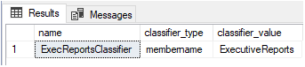

# Manage and monitor workload importance in dedicated SQL pool for Azure Synapse Analytics

Manage and monitor dedicated SQL pool request level importance in Azure Synapse using DMVs and catalog views.

## Monitor importance

Monitor importance using the new importance column in the [sys.dm_pdw_exec_requests](/sql/relational-databases/system-dynamic-management-views/sys-dm-pdw-exec-requests-transact-sql?toc=/azure/synapse-analytics/sql-data-warehouse/toc.json&bc=/azure/synapse-analytics/sql-data-warehouse/breadcrumb/toc.json&view=azure-sqldw-latest&preserve-view=true) dynamic management view.
The below monitoring query shows submit time and start time for queries. Review the submit time and start time along with importance to see how importance influenced scheduling.

```sql
SELECT s.login_name, r.status, r.importance, r.submit_time, r.start_time
  FROM sys.dm_pdw_exec_sessions s
  JOIN sys.dm_pdw_exec_requests r ON s.session_id = r.session_id
  WHERE r.resource_class is not null
ORDER BY r.start_time
```

To look further into how queries are being schedule, use the catalog views.

## Manage importance with catalog views

The sys.workload_management_workload_classifiers catalog view contains information on classifiers. To exclude the system-defined classifiers that map to resource classes execute the following code:

```sql
SELECT *
  FROM sys.workload_management_workload_classifiers
  WHERE classifier_id > 12
```

The catalog view, [sys.workload_management_workload_classifier_details](/sql/relational-databases/system-catalog-views/sys-workload-management-workload-classifier-details-transact-sql?toc=/azure/synapse-analytics/sql-data-warehouse/toc.json&bc=/azure/synapse-analytics/sql-data-warehouse/breadcrumb/toc.json&view=azure-sqldw-latest&preserve-view=true), contains information on the parameters used in creation of the classifier.  The below query shows that ExecReportsClassifier was created on the ```membername``` parameter for values with ExecutiveReports:

```sql
SELECT c.name,cd.classifier_type, classifier_value
  FROM sys.workload_management_workload_classifiers c
  JOIN sys.workload_management_workload_classifier_details cd
    ON cd.classifier_id = c.classifier_id
  WHERE c.name = 'ExecReportsClassifier'
```



To simplify troubleshooting misclassification, we recommended you remove resource class role mappings as you create workload classifiers. The code below returns existing resource class role memberships. Run sp_droprolemember for each ```membername``` returned from the corresponding resource class.
Below is an example of checking for existence before dropping a workload classifier:

```sql
IF EXISTS (SELECT 1 FROM sys.workload_management_workload_classifiers WHERE name = 'ExecReportsClassifier')
  DROP WORKLOAD CLASSIFIER ExecReportsClassifier;
GO
```

## Next steps

- For more information on Classification, see [Workload Classification](sql-data-warehouse-workload-classification.md).
- For more information on Importance, see [Workload Importance](sql-data-warehouse-workload-importance.md)

> [!div class="nextstepaction"]
> [Go to Configure Workload Importance](sql-data-warehouse-how-to-configure-workload-importance.md)
