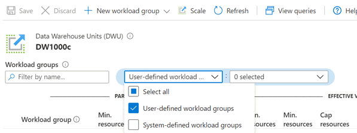
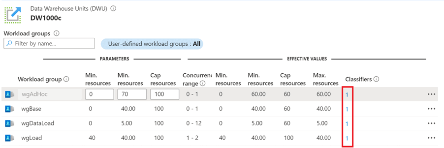
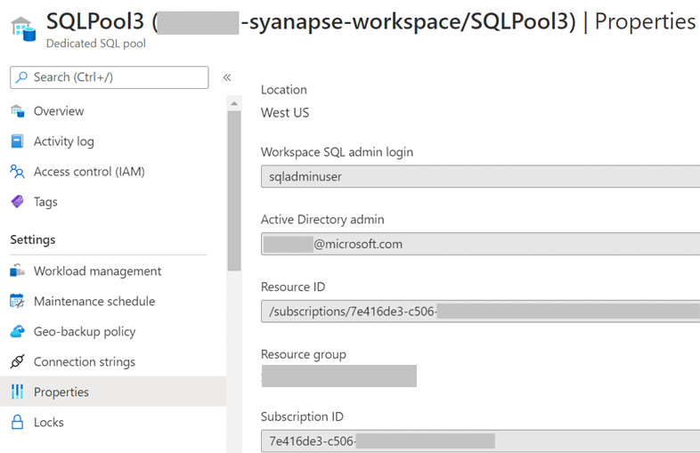

# Troubleshooting a missed classification

Guidance on how to troubleshoot a missed workload classification how to identify reason behind the classification.

Azure Synapse Analytics provides workload management capabilities like [Classifying workloads to appropriate workload groups](sql-data-warehouse-workload-classification.md), [Assigning importance](sql-data-warehouse-workload-importance.md), and [isolating resources](sql-data-warehouse-workload-isolation.md) to meet SLAs.  However, in some scenarios combination of these capabilities can lead to workload classification that doesn't reflect user intent. This article lists such common scenarios and how to troubleshoot them. Before we get into the scenarios, let us see how to get basic information for troubleshooting missed classification scenarios.

## Basic troubleshooting information

To troubleshoot a missed classification scenario following information is needed:
1)	List of all workload groups
2)	List of all workload classifiers and associated workload groups
3)	List of users and mapped workload groups (system and user defined) 
4)  Workload Group and Classifier details of a Request


### Workload Groups
To get a list of all workload groups(including system workload groups) and associated details in Azure portal  
1)	Go to Azure Synapse workspace under which the Dedicated SQL Pool of interest is created
2)	On the left side pane, select **SQL Pools** under Analytical Pools section. All SQL Pools created under the workspace are listed.
3)	Select Dedicated SQL Pool of interest.
4)	In the left side pane, select **Workload Management** under **Settings**
5)	Under **Workload Groups** section, all workloads are listed. Note, by default only **User-Defined Workload groups** are listed. To view list of all Workload groups, edit filter and **Select All**.



**Catalog views:** To view Workload groups using T-SQL, [connect to  Dedicated SQL Pool using SSMS](../sql/get-started-ssms.md) and issue following query:
 
```sql
select * FROM sys.workload_management_workload_groups
```

### Workload Classifiers

To list all Workload classifiers(including inbuilt classifiers) by workload group in Azure portal, select numbers listed in Classifiers column in Workload Group table. 


To get the list of all Workload Classifiers(including System defined) using T-SQL, use following query:

```sql
select * FROM sys.workload_management_workload_classifiers 
```

### Users and mapped Resource Classes

To get a list of system defined Resource classes and mapped users, use following query:

```sql
SELECT  r.name AS [Resource Class]
,       m.name AS membername
FROM    sys.database_role_members rm
JOIN    sys.database_principals AS r ON rm.role_principal_id = r.principal_id
JOIN    sys.database_principals AS m ON rm.member_principal_id = m.principal_id
WHERE   r.name IN ('mediumrc','largerc','xlargerc','staticrc10','staticrc20','staticrc30','staticrc40','staticrc50','staticrc60','staticrc70','staticrc80');
```

### Workload Group and Classifier details of a Request

First step in troubleshooting a missed classification problem is to identify  Workload group and workload classifier for a query. [Sys.dm_pdw_exec_requests](/sql/relational-databases/system-dynamic-management-views/sys-dm-pdw-exec-requests-transact-sql?toc=/azure/synapse-analytics/sql-data-warehouse/toc.json&bc=/azure/synapse-analytics/sql-data-warehouse/breadcrumb/toc.json&view=azure-sqldw-latest&preserve-view=true) DMV contains this information for a given query and below is a SQL to get that information:

```sql
SELECT * from sys.dm_pdw_exec_requests;
```

## List of Common scenarios of missed Classifications
List of common scenarios where unintended missed classification of workloads can happen:

### Mixed usage of Resource Classes and user-defined Workload Management

In scenarios where Resource classes and workload groups are used together, user role to resource class mappings can conflict with workload classifier rules, and lead to unintended query classification. Consider following scenario:
* A database user say DBAUser is assigned to largerc resource class role using sp_addrolemember procedure.
* DBAUser has created s new workload group and classifier using workload management.
* Newly created workload classifier maps database role DBARole (DBAUser is a member of this role) to mediumrc resource class with high importance.  
* When DBAUser runs a query, the query is expected to run on mediumrc based on workload classifier. Instead it will be assigned to largerc, as **user** mapping takes precedence over **role membership** mapping to a classifier.

It's best to avoid mixing usage of Resource Classes and Workload Management groups to do Workload management. Steps to convert Resource classes to Workloads are documented [here](sql-data-warehouse-how-to-convert-resource-classes-workload-groups.md). However, there can be situations where both Resource classes and Workload Management need to be used together. In such scenarios to simplify troubleshooting misclassification, recommendation is to remove resource class role mappings as you create workload classifiers. The code below returns existing resource class role memberships. Run [sp_droprolemember](/sql/relational-databases/system-stored-procedures/sp-droprolemember-transact-sql?toc=/azure/synapse-analytics/sql-data-warehouse/toc.json&bc=/azure/synapse-analytics/sql-data-warehouse/breadcrumb/toc.json&view=azure-sqldw-latest&preserve-view=true) for each member name returned from the corresponding resource class.

```sql
SELECT  r.name AS [Resource Class]
, m.name AS membername
FROM    sys.database_role_members rm
JOIN    sys.database_principals AS r ON rm.role_principal_id = r.principal_id
JOIN    sys.database_principals AS m ON rm.member_principal_id = m.principal_id
WHERE   r.name IN ('mediumrc','largerc','xlargerc','staticrc10','staticrc20','staticrc30','staticrc40','staticrc50','staticrc60','staticrc70','staticrc80');

--for each row returned run
sp_droprolemember '[Resource Class]', membername
```

### System Administrators and DBOs are always mapped to smallrc Workload Group
Consider a scenario where System Administrator or dbo has either created a workload classifier or added themselves to a resource class role other than smallrc. Using query mentioned in **Users and Mapped Resource Classes** section above Service Admin verified the role/member and it shows the updated workload group. But all queries executed by the user run on smallrc resource class even though user is mapped to a different resource class or workload group. 

**Recommendation**: Service Administrators can't change their default workload group as documented [here](resource-classes-for-workload-management.md#default-resource-class). Service administrator is the user or role specified during SQL Pool provisioning process, and this user can either be a Server Admin Login or Active Directory admin. To identify service administrator, go to properties section of the dedicated SQL Pool and look for **Workspace SQL Admin Login** field, as shown below:



Similarly dbo and db_owner roles are not allowed to change their default resource class. If a user is either dbo or added under db_owner role, all queries executed by the user go to smallrc by default. These roles can't be added to a resource class other than smallrc. However if a user who is part of this role would like to classify their queries to a different workload group, they can use MEMBERNAME option in [workload classifier definition](sql-data-warehouse-workload-classification.md).

### Use Workload Group Precedence for better classification

In scenarios where workload classifiers are mapped to multiple workload groups or a user is mapped to multiple resource classes, precedence order determines chosen workload group and Resource class. List of precedence rules: 

> [!NOTE]
> As mentioned in **Mixing Resource Classes and user-defined Workload Management** section, it isn't recommended to combine usage of Resource classes and user-defined Workload groups/classes.

**If Resource Classes are being used:**
In Scenarios where Resource Classes are being used it's best to create a dedicated user for each type of workload being run. However if a user is a member of multiple resource classes, then precedence rules documented in [Resource Class Precedence](resource-classes-for-workload-management.md#resource-class-precedence) take effect:
1)	Dynamic resource class takes precedence over static resource class. For example if a user is member of mediumrc(dynamic) and staticrc80(static) user queries run with mediumrc
2)	Bigger resource classes are preferred over Smaller resource classes. For example if a user is member of staticrc20 and staticrc80 then user queries will run with staticrc80.

**If Workload Management Capabilities are used:**
WLM provides capability to create multiple workload classifiers for same user or workload group. Classifier definition statement has multiple parameters based on which incoming requests are assigned to workloads. These parameters have Weight score as shown below and this score determines order of precedence: 

|Classifier Parameter |Weight   |
|---------------------|---------|
|MEMBERNAME:USER      |64       |
|MEMBERNAME:ROLE      |32       |
|WLM_LABEL            |16       |
|WLM_CONTEXT          |8        |
|START_TIME/END_TIME  |4        |

Let us see these precedence rules in action using an example.

**Example**
If a user creates two Workload Classifiers as follows:

```sql
CREATE WORKLOAD CLASSIFIER CLASSIFIER-1 WITH  
( WORKLOAD_GROUP = 'wgDataLoad'
 ,MEMBERNAME     = 'USER-1'  
 ,WLM_LABEL      = 'dimension_loads' 
 ,IMPORTANCE     = 'High');

CREATE WORKLOAD CLASSIFIER CLASSIFIER-2 WITH  
( WORKLOAD_GROUP = 'wgUserqueries'
 ,MEMBERNAME     = 'USER-1'  
 ,START_TIME     = '18:00' 
 ,END_TIME       = '07:30'
 ,IMPORTANCE     = 'Low')
```

Queries submitted by User-1 can be submitted via both classifiers. Query run by User-1 with 'dimension_loads' label between 6PM and 7AM UTC will be assigned to wgDashboards as weight score of WLM_LABEL is higher than START_TIME/END_TIME. The weighting of classifier-1 is 80 (64 for user, plus 16 for WLM_LABEL). The weighting of classifier-2 is 68 (64 for user, 4 for START_TIME/END_TIME). More details on [Classification weighting](sql-data-warehouse-workload-classification.md#classification-weighting).

### What happens if Precedence in Workload Classification leads to a tie

Even after workload classifier precedence is applied, a query getting classified to multiple workload groups is a possibility. For example consider following classifiers:

```sql
CREATE WORKLOAD CLASSIFIER CLASSIFIER-1 WITH  
( WORKLOAD_GROUP = 'wgDataLoad'
 ,MEMBERNAME     = 'USER-1'  
 ,WLM_LABEL      = 'dimension_loads' 
 ,IMPORTANCE     = 'High');

CREATE WORKLOAD CLASSIFIER CLASSIFIER-2 WITH  
( WORKLOAD_GROUP = 'wgUserqueries'
 ,MEMBERNAME     = 'USER-1'  
 ,WLM_LABEL      = 'dimension_loads' 
 ,IMPORTANCE     = 'Low');
```

If a user runs a query with Option set to Label = 'dimension_loads', it can be classified to either wgDataLoad or wgUserqueries based on precedence rules. But which workload group is chosen?

**Resolution:** 
If there was a tie in workload groups or classifiers, following precedence takes effect:
1.	The workload group with the highest resource allocation is chosen.  This behavior optimizes for performance in scenarios where logins are members of multiple resource classes. This behavior also ensures backward compatibility.  

**Example:** Let us consider following two Workload Groups and Workload Classifiers

```sql
-- Workload Groups
CREATE WORKLOAD GROUP wgDataLoad
WITH
( MIN_PERCENTAGE_RESOURCE = 26 
,REQUEST_MIN_RESOURCE_GRANT_PERCENT = 2              
,CAP_PERCENTAGE_RESOURCE = 100 )

CREATE WORKLOAD GROUP wgUserqueries
WITH
( MIN_PERCENTAGE_RESOURCE = 15
,REQUEST_MIN_RESOURCE_GRANT_PERCENT = 5               
,CAP_PERCENTAGE_RESOURCE = 50 );

--Workload Classifiers
CREATE WORKLOAD CLASSIFIER CLASSIFIER-1 WITH  
( WORKLOAD_GROUP = 'wgDataLoad'
,MEMBERNAME     = 'USER-1'  
,WLM_LABEL      = 'dimension_loads' 
,IMPORTANCE     = 'High');

CREATE WORKLOAD CLASSIFIER CLASSIFIER-2 WITH  
( WORKLOAD_GROUP = 'wgUserqueries'
,MEMBERNAME     = 'USER-1'  
,WLM_LABEL      = 'dimension_loads' 
,IMPORTANCE     = 'High');
```
              
If a user runs a query with Option set to Label = 'dimension_loads', both the classifiers have a tie as the query meets criteria for both the classifiers. However request will be routed to wgUserQueries workload group as it has higher minimum resource allocation per request.

2.	Concurrency setting and Available Concurrency for respective workload groups. Workload group with the highest available concurrency at a time when request arrived will give the query best chance of executing. 
**Example:** Let us consider following two Workload Groups and Workload Classifiers
```sql
--Workload Groups
CREATE WORKLOAD GROUP wgDataLoad
WITH
( MIN_PERCENTAGE_RESOURCE = 30              
 ,REQUEST_MIN_RESOURCE_GRANT_PERCENT = 2 (concurrency of 15)
 ,REQUEST_MIN_RESOURCE_GRANT_PERCENT = 2
 ,CAP_PERCENTAGE_RESOURCE = 100 );

CREATE WORKLOAD GROUP wgUserqueries
WITH
( MIN_PERCENTAGE_RESOURCE = 30
 ,REQUEST_MIN_RESOURCE_GRANT_PERCENT = 2 (concurrency of 15)
 ,REQUEST_MIN_RESOURCE_GRANT_PERCENT = 2
 ,CAP_PERCENTAGE_RESOURCE = 100 );

-- Workload Classifiers
CREATE WORKLOAD CLASSIFIER CLASSIFIER-1 WITH  
( WORKLOAD_GROUP = 'wgDataLoad'
 ,MEMBERNAME     = 'USER-1'  
 ,WLM_LABEL      = 'dimension_loads' 
 ,IMPORTANCE     = 'High');

CREATE WORKLOAD CLASSIFIER CLASSIFIER-2 WITH  
( WORKLOAD_GROUP = 'wgUserqueries'
 ,MEMBERNAME     = 'USER-1'  
 ,WLM_LABEL      = 'dimension_loads' 
 ,IMPORTANCE     = 'High');
```
              
If a user runs a query with Option set to Label = 'dimension_loads', both the classifiers have a tie as the query meets criteria for both. When user submits the query, assume 5 concurrent queries are getting executed in wgUserqueries group and 10 queries are getting executed in wgDataLoad group. Request will be routed to wgUserqueries group using CLASSIFIER-2 as wgUserqueries workload group has higher available concurrency at the time user submitted query.

3.	Importance setting of the classified request. If there was a tie in Workload Classification using precedence rules, Request will be routed to Workload group that has highest importance. 

4.	Creation time of the workload group. Request will be routed to the workload group that is created latest. 


## Next steps
- For more information on Classification, see [Workload Classification](sql-data-warehouse-workload-classification.md).
- For more information on Importance, see [Workload Importance](sql-data-warehouse-workload-importance.md)

> [!div class="nextstepaction"]
> [Go to Configure Workload Importance](sql-data-warehouse-how-to-configure-workload-importance.md)
 