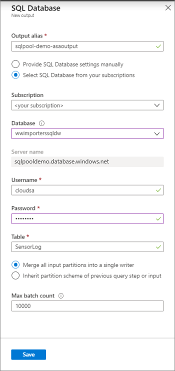
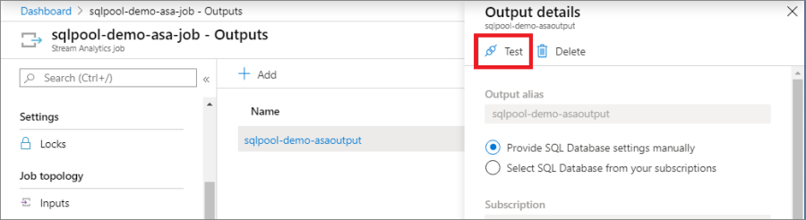
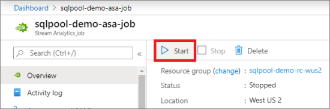
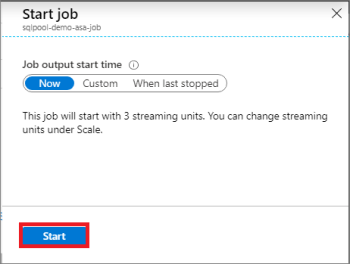

# Use Azure Stream Analytics with Azure Synapse Analytics

Azure Stream Analytics is a fully managed service providing low-latency, highly available, scalable complex event processing over streaming data in the cloud. You can learn the basics by reading [Introduction to Azure Stream Analytics](../../stream-analytics/stream-analytics-introduction.md?toc=/azure/synapse-analytics/sql-data-warehouse/toc.json&bc=/azure/synapse-analytics/sql-data-warehouse/breadcrumb/toc.json). You can then learn how to create an end-to-end solution with Stream Analytics by following the [Get started using Azure Stream Analytics](../../stream-analytics/stream-analytics-real-time-fraud-detection.md?toc=/azure/synapse-analytics/sql-data-warehouse/toc.json&bc=/azure/synapse-analytics/sql-data-warehouse/breadcrumb/toc.json) tutorial.

In this article, you will learn how to use your data warehouse as an output sink for your Azure Stream Analytics jobs.

## Prerequisites

* Azure Stream Analytics Job - To create an Azure Stream Analytics job, follow the steps in the [Get started using Azure Stream Analytics](../../stream-analytics/stream-analytics-real-time-fraud-detection.md?toc=/azure/synapse-analytics/sql-data-warehouse/toc.json&bc=/azure/synapse-analytics/sql-data-warehouse/breadcrumb/toc.json) tutorial to :  

    1. Create an Event Hub input
    2. Configure and start event generator application
    3. Provision a Stream Analytics job
    4. Specify job input and query
* Azure Synapse SQL pool data warehouse - To create a new data warehouse, follow the steps in the [Quickstart to create a new data warehouse](create-data-warehouse-portal.md).

## Specify streaming output to point to your data warehouse

### Step 1

From the Azure portal, go to your Stream Analytics job and click on **Outputs** under the **Job topology** menu.

### Step 2

Click on the **Add** button and choose **SQL Database** from the drop down menu.


### Step 3

Enter the following values:

* *Output Alias*: Enter a friendly name for this job output.
* *Subscription*:
  * If your data warehouse is in the same subscription as the Stream Analytics job, click on ***Select SQL Database from your subscriptions***.
  * If your database is in a different subscription, click on Provide SQL Database settings manually.
* *Database*: Select the destination database from the drop down list.
* *User Name*: Specify the user name of an account that has write permissions for the database.
* *Password*: Provide the password for the specified user account.
* *Table*: Specify the name of the target table in the database.
* click on the **Save** button



### Step 4

Before you can run a test, you will need to create the table in your data warehouse.  Run the following table creation script using SQL Server Management Studio (SSMS) or your choice of query tool.

```sql
CREATE TABLE SensorLog
(
    RecordType VARCHAR(2)
    , SystemIdentity VARCHAR(2)
    , FileNum INT
    , SwitchNum VARCHAR(50)
    , CallingNum VARCHAR(25)
    , CallingIMSI VARCHAR(25)
    , CalledNum VARCHAR(25)
    , CalledIMSI VARCHAR(25)
    , DateS VARCHAR(25)
    , TimeS VARCHAR(25)
    , TimeType INT
    , CallPeriod INT
    , CallingCellID VARCHAR(25)
    , CalledCellID VARCHAR(25)
    , ServiceType VARCHAR(25)
    , [Transfer] INT
    , IncomingTrunk VARCHAR(25)
    , OutgoingTrunk VARCHAR(25)
    , MSRN VARCHAR(25)
    , CalledNum2 VARCHAR(25)
    , FCIFlag VARCHAR(25)
    , callrecTime VARCHAR(50)
    , EventProcessedUtcTime VARCHAR(50)
    , PartitionId int
    , EventEnqueuedUtcTime VARCHAR(50)
    )
WITH (DISTRIBUTION = ROUND_ROBIN)
```

### Step 5

On the Azure portal for Stream Analytics job, click on your job name.  Click on the ***Test*** button in the ***Output details*** pane.


When the connection to the database succeeds, you will see a notification in the portal.

### Step 6

Click on the ***Query*** menu under ***Job topology*** and change the query to insert data into the Stream output you created.  Click on the ***Test selected query*** button to test your query.  Click ***Save Query*** button when your query test is successful.


### Step 7

Start the Azure Stream Analytics job.  Click on the ***Start*** button on the ***Overview*** menu.



Click the ***Start*** button on the start job pane.



## Next steps

For an overview of integration, see [Integrate other services](sql-data-warehouse-overview-integrate.md).
For more development tips, see [Design decisions and coding techniques for data warehouses](sql-data-warehouse-overview-develop.md).
