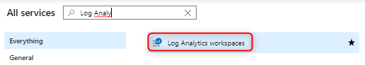
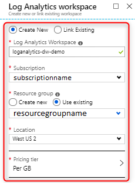
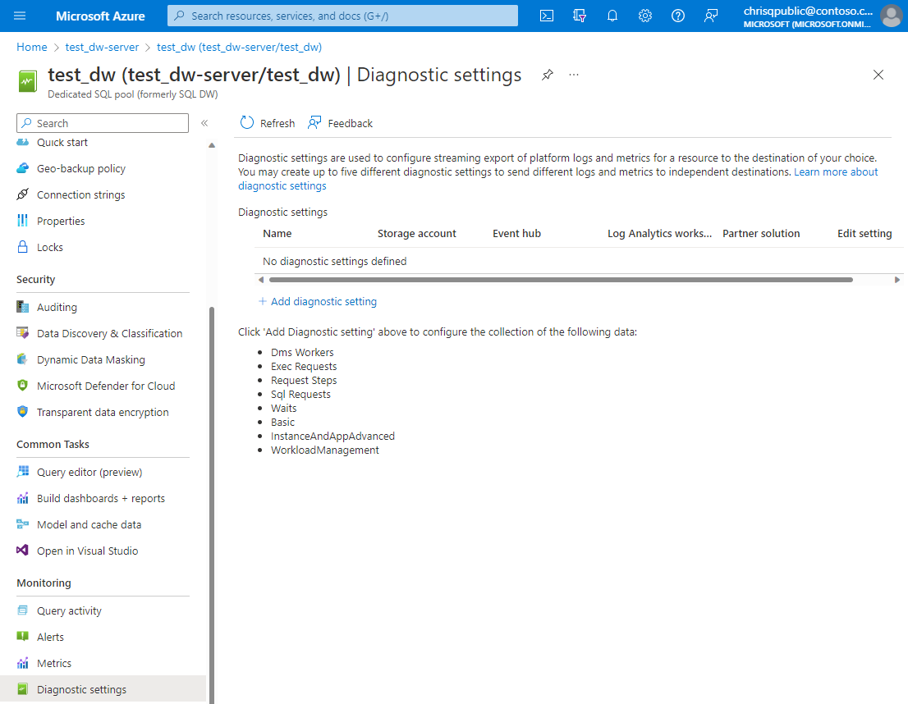
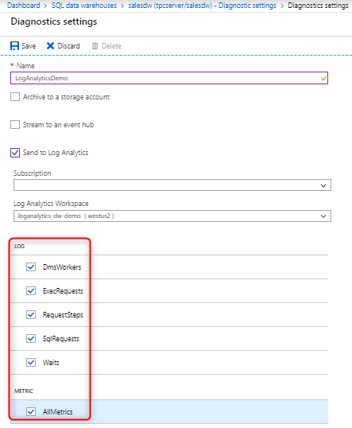
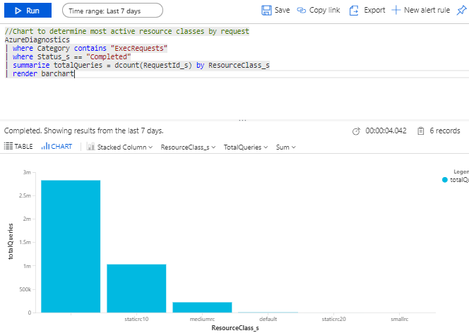

# Monitor workload - Azure portal

This article describes how to use the Azure portal to monitor your workload. This includes setting up Azure Monitor Logs to investigate query execution and workload trends using log analytics for [Synapse SQL](https://azure.microsoft.com/blog/workload-insights-with-sql-data-warehouse-delivered-through-azure-monitor-diagnostic-logs-pass/).

## Prerequisites

- Azure subscription: If you don't have an Azure subscription, create a [free account](https://azure.microsoft.com/free/) before you begin.
- SQL pool: We will be collecting logs for a SQL pool. If you don't have a SQL pool provisioned, see the instructions in [Create a SQL pool](./load-data-from-azure-blob-storage-using-copy.md).

## Create a Log Analytics workspace

Navigate to the browse blade for Log Analytics workspaces and create a workspace






For more details on workspaces, visit the following [documentation](../../azure-monitor/logs/quick-create-workspace.md?toc=/azure/synapse-analytics/sql-data-warehouse/toc.json&bc=/azure/synapse-analytics/sql-data-warehouse/breadcrumb/toc.jsond#create-a-workspace).

## Turn on Resource logs

Configure diagnostic settings to emit logs from your SQL pool. Logs consist of telemetry views equivalent to the most commonly used performance troubleshooting DMVs. Currently the following views are supported:

- [sys.dm_pdw_exec_requests](/sql/relational-databases/system-dynamic-management-views/sys-dm-pdw-exec-requests-transact-sql?toc=/azure/synapse-analytics/sql-data-warehouse/toc.json&bc=/azure/synapse-analytics/sql-data-warehouse/breadcrumb/toc.json&view=azure-sqldw-latest&preserve-view=true)
- [sys.dm_pdw_request_steps](/sql/relational-databases/system-dynamic-management-views/sys-dm-pdw-request-steps-transact-sql?toc=/azure/synapse-analytics/sql-data-warehouse/toc.json&bc=/azure/synapse-analytics/sql-data-warehouse/breadcrumb/toc.json&view=azure-sqldw-latest&preserve-view=true)
- [sys.dm_pdw_dms_workers](/sql/relational-databases/system-dynamic-management-views/sys-dm-pdw-dms-workers-transact-sql?toc=/azure/synapse-analytics/sql-data-warehouse/toc.json&bc=/azure/synapse-analytics/sql-data-warehouse/breadcrumb/toc.json&view=azure-sqldw-latest&preserve-view=true)
- [sys.dm_pdw_waits](/sql/relational-databases/system-dynamic-management-views/sys-dm-pdw-waits-transact-sql?toc=/azure/synapse-analytics/sql-data-warehouse/toc.json&bc=/azure/synapse-analytics/sql-data-warehouse/breadcrumb/toc.json&view=azure-sqldw-latest&preserve-view=true)
- [sys.dm_pdw_sql_requests](/sql/relational-databases/system-dynamic-management-views/sys-dm-pdw-sql-requests-transact-sql?toc=/azure/synapse-analytics/sql-data-warehouse/toc.json&bc=/azure/synapse-analytics/sql-data-warehouse/breadcrumb/toc.json&view=azure-sqldw-latest&preserve-view=true)



Logs can be emitted to Azure Storage, Stream Analytics, or Log Analytics. For this tutorial, select Log Analytics.



## Run queries against Log Analytics

Navigate to your Log Analytics workspace where you can do the following:

- Analyze logs using log queries and save queries for reuse
- Save queries for reuse
- Create log alerts
- Pin query results to a dashboard

For details on the capabilities of log queries, visit the following [documentation](/azure/data-explorer/kusto/query/?bc=%2fazure%2fsynapse-analytics%2fsql-data-warehouse%2fbreadcrumb%2ftoc.json&toc=%2fazure%2fsynapse-analytics%2fsql-data-warehouse%2ftoc.json).




## Sample log queries

```Kusto
//List all queries
AzureDiagnostics
| where Category contains "ExecRequests"
| project TimeGenerated, StartTime_t, EndTime_t, Status_s, Command_s, ResourceClass_s, duration=datetime_diff('millisecond',EndTime_t, StartTime_t)
```

```Kusto
//Chart the most active resource classes
AzureDiagnostics
| where Category contains "ExecRequests"
| where Status_s == "Completed"
| summarize totalQueries = dcount(RequestId_s) by ResourceClass_s
| render barchart
```

```Kusto
//Count of all queued queries
AzureDiagnostics
| where Category contains "waits"
| where Type_s == "UserConcurrencyResourceType"
| summarize totalQueuedQueries = dcount(RequestId_s)
```

## Next steps

Now that you have set up and configured Azure monitor logs, [customize Azure dashboards](../../azure-portal/azure-portal-dashboards.md?toc=/azure/synapse-analytics/sql-data-warehouse/toc.json&bc=/azure/synapse-analytics/sql-data-warehouse/breadcrumb/toc.json) to share across your team.