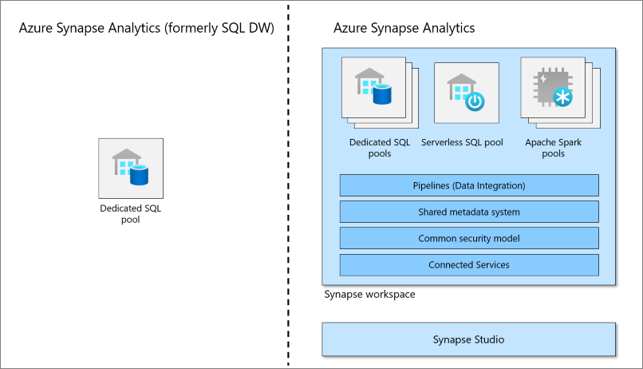
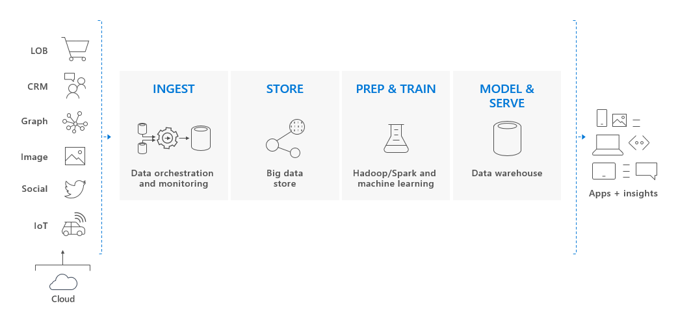

# What is dedicated SQL pool (formerly SQL DW) in Azure Synapse Analytics?

Azure Synapse Analytics is an analytics service that brings together enterprise data warehousing and Big Data analytics. Dedicated SQL pool (formerly SQL DW) refers to the enterprise data warehousing features that are available in Azure Synapse Analytics.

Dedicated SQL pool (formerly SQL DW) represents a collection of analytic resources that are provisioned when using Synapse SQL. The size of a dedicated SQL pool (formerly SQL DW) is determined by Data Warehousing Units (DWU).

Once your dedicated SQL pool is created, you can import big data with simple [PolyBase](/sql/relational-databases/polybase/polybase-guide?toc=/azure/synapse-analytics/sql-data-warehouse/toc.json&bc=/azure/synapse-analytics/sql-data-warehouse/breadcrumb/toc.json&view=azure-sqldw-latest&preserve-view=true) T-SQL queries, and then use the power of the distributed query engine to run high-performance analytics. As you integrate and analyze the data, dedicated SQL pool (formerly SQL DW) will become the single version of truth your business can count on for faster and more robust insights.

> [!NOTE]
> Not all features of the dedicated SQL pool in Azure Synapse workspaces apply to dedicated SQL pool (formerly SQL DW), and vice versa. To enable workspace features for an existing dedicated SQL pool (formerly SQL DW) refer to [How to enable a workspace for your dedicated SQL pool (formerly SQL DW)](workspace-connected-create.md). For more information, see [What's the difference between Azure Synapse dedicated SQL pools (formerly SQL DW) and dedicated SQL pools in an Azure Synapse Analytics workspace?](https://techcommunity.microsoft.com/t5/azure-synapse-analytics-blog/msft-docs-what-s-the-difference-between-synapse-formerly-sql-dw/ba-p/3597772). Explore the [Azure Synapse Analytics documentation](../overview-what-is.md) and [Get Started with Azure Synapse](../get-started.md).

## Key component of a big data solution

Data warehousing is a key component of a cloud-based, end-to-end big data solution.

In a cloud data solution, data is ingested into big data stores from a variety of sources. Once in a big data store, Hadoop, Spark, and machine learning algorithms prepare and train the data. When the data is ready for complex analysis, dedicated SQL pool uses PolyBase to query the big data stores. PolyBase uses standard T-SQL queries to bring the data into dedicated SQL pool (formerly SQL DW) tables.

Dedicated SQL pool (formerly SQL DW) stores data in relational tables with columnar storage. This format significantly reduces the data storage costs, and improves query performance. Once data is stored, you can run analytics at massive scale. Compared to traditional database systems, analysis queries finish in seconds instead of minutes, or hours instead of days.

The analysis results can go to worldwide reporting databases or applications. Business analysts can then gain insights to make well-informed business decisions.

## Next steps

- Explore [Azure Synapse architecture](massively-parallel-processing-mpp-architecture.md)
- Quickly [create a dedicated SQL pool](../quickstart-create-sql-pool-studio.md)
- [Load sample data](./load-data-from-azure-blob-storage-using-copy.md).
- Explore [Videos](https://azure.microsoft.com/documentation/videos/index/?services=sql-data-warehouse)
- [Get Started with Azure Synapse](../get-started.md)
- [What's the difference between Azure Synapse dedicated SQL pools (formerly SQL DW) and dedicated SQL pools in an Azure Synapse Analytics workspace?](https://techcommunity.microsoft.com/t5/azure-synapse-analytics-blog/msft-docs-what-s-the-difference-between-synapse-formerly-sql-dw/ba-p/3597772)

Or look at some of these other Azure Synapse resources:

- Search [Blogs](https://azure.microsoft.com/blog/tag/azure-sql-data-warehouse/)
- Submit a [Feature requests](https://feedback.azure.com/d365community/forum/9b9ba8e4-0825-ec11-b6e6-000d3a4f07b8)
- [Create a support ticket](sql-data-warehouse-get-started-create-support-ticket.md)
- Search [Microsoft Q&A question page](/answers/topics/azure-synapse-analytics.html)
- Search [Stack Overflow forum](https://stackoverflow.com/questions/tagged/azure-sqldw)
