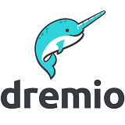

# Azure Synapse Analytics business intelligence partners

To create your data warehouse solution, you can choose from different kinds of industry-leading tools. This article highlights Microsoft partners with business intelligence (BI) solutions officially supporting Azure Synapse Analytics.

## Our business intelligence partners
| Partner | Description | Website/Product link |
| ------- | ----------- | -------------------- |
|  |**AtScale** AtScale provides a single, secured, and governed workspace for distributed data. AtScale’s Cloud OLAP, Autonomous Data Engineering™, and Universal Semantic Layer™ powers business intelligence results for faster, more accurate business decisions. |[Product page](https://www.atscale.com/partners/microsoft/)  |
|  |**Birst** Birst connects the entire organization through a network of interwoven virtualized BI instances on-top of a shared common analytical fabric|[Product page](https://www.birst.com/)  |
|  |**Dremio**  Analysts and data scientists can discover, explore and curate data using Dremio’s intuitive UI, while IT maintains governance and security. Dremio makes it easy to join ADLS with Blob Storage, Azure SQL Database, Azure Synapse SQL, HDInsight, and more. With Dremio, Power BI analysts can search for new datasets stored on ADLS, immediately access that data in Power BI with no preparation by IT, create visualizations, and iteratively refine reports in real-time. And analysts can create new reports that combine data between ADLS and other databases. |[Product page](https://www.dremio.com/azure/) [Azure Marketplace](https://azuremarketplace.microsoft.com/marketplace/apps/dremiocorporation.dremio_ce)  |
|  |**Dundas BI** Dundas Data Visualization is a leading, global provider of Business Intelligence and Data Visualization software.  Dundas dashboards, reporting, and visual data analytics provide seamless integration into business applications, enabling better decisions and faster insights.|[Product page](https://www.dundas.com/dundas-bi) [Azure Marketplace](https://azuremarketplace.microsoft.com/marketplace/apps/dundas.dundas-bi)  |
|  |**IBM Cognos Analytics** Cognos Analytics includes self-service capabilities that make it simple, clear, and easy to use, whether you're an experienced business analyst examining a vast supply chain, or a marketer optimizing a campaign. Cognos Analytics uses AI and other capabilities to guide data exploration. It makes it easier for users to get the answers they need|[Product page](https://www.ibm.com/products/cognos-analytics) |
|  |**Information Builders (WebFOCUS)** WebFOCUS business intelligence helps companies use data more strategically across and beyond the enterprise. It allows users and administrators to rapidly create dashboards that combine content from multiple data sources and formats. It also provides robust security and comprehensive governance that enables seamless and secure sharing of any BI and analytics content|[Product page](https://www.informationbuilders.com/products/bi-and-analytics-platform)  |
|  |**Jinfonet JReport** JReport is an embeddable BI solution for the enterprise. The solution offers capabilities such as report creation, dashboards, and data analysis on cloud, big data, and transactional data sources. By visualizing data, you can conduct your own reporting and data discovery for agile, on-the-fly decision making. |[Product page](https://www.jinfonet.com/product/jreport-designer)  |
|  |**Logi Analytics** Together, Logi Analytics enables your organization to collect, analyze, and immediately act on the largest and most diverse data sets in the world. |[Product page](https://www.logianalytics.com/) |
|  |**Looker BI** Looker gives everyone in your company the ability to explore and understand the data that drives your business. Looker also gives the data analyst a flexible and reusable modeling layer to control and curate that data.  Companies have fundamentally transformed their culture using Looker as the catalyst.|[Product page](https://looker.com/partners/microsoft-azure/)  [Azure Marketplace](https://azuremarketplace.microsoft.com/marketplace/apps/looker.looker-analytics-platform-6_20)  |
|  |**MicroStrategy** The MicroStrategy platform offers a complete set of business intelligence and analytics capabilities that enable organizations to get value from their business data. MicroStrategy's powerful analytical engine, comprehensive toolsets, variety of data connectors, and open architecture ensures you have everything you need to extend access to analytics across every team.|[Product page](https://www.microstrategy.com/us/product/analytics)  [Azure Marketplace](https://azuremarketplace.microsoft.com/marketplace/apps/microstrategy.microstrategy_enterprise_platform_vm)  |
|  |**Mode** Mode is a modern analytics and BI solution that helps teams make decisions through unreasonably fast and unexpectedly delightful data analysis. Data teams move faster through a preferred workflow that combines SQL, Python, R, and visual analysis, while stakeholders work alongside them exploring and sharing data on their own. With data more accessible to everyone, we shorten the distance from questions to answers and help businesses make better decisions, faster.|[Product page](https://mode.com/)  |
|  |**Qlik Sense Enterprise** Drive insight discovery with the data visualization app that anyone can use. With Qlik Sense, everyone in your organization can easily create flexible, interactive visualizations and make meaningful decisions. |[Product page](https://www.qlik.com/us/products/qlik-sense/enterprise)  [Azure Marketplace](https://azuremarketplace.microsoft.com/marketplace/apps/qlik.qlik-sense) |
|  |**SiSense** SiSense is a full-stack Business Intelligence software that comes with tools that a business needs to analyze and visualize data: a high-performance analytical database, the ability to join multiple sources, simple data extraction (ETL), and web-based data visualization. Start to analyze and visualize large data sets with SiSense BI and Analytics today. |[Product page](https://www.sisense.com/product/)  |
|  |**Tableau** Tableau's self-service analytics help anyone see and understand their data, across many kinds of data from flat files to databases. Tableau has a native, optimized connector to Synapse SQL pool that supports both live data and in-memory analytics. |[Product page](https://www.tableau.com/)  [Azure Marketplace](https://azuremarketplace.microsoft.com/marketplace/apps/tableau.tableau-server) |
|  |**Targit (Decision Suite)** Targit Decision Suite provides a BI platform that delivers real-time dashboards, self-service analytics, user-friendly reporting, stunning mobile capabilities, and simple data-discovery technology. Everything in a single, cohesive solution. Targit gives companies the courage to act. |[Product page](https://www.targit.com/targit-decision-suite/analytics)  [Azure Marketplace](https://azuremarketplace.microsoft.com/marketplace/apps/targit.targit-decision-suite)  |
|  |**ThoughtSpot** Use search to get granular insights from billions of rows, or let AI uncover insights from questions you might not have thought about. ThoughtSpot helps businesspeople find insights hidden in their company data in seconds. Use search to analyze your data and get automated insights when you need them.|[Product page](https://www.thoughtspot.com) |
|  |**Yellowfin** Yellowfin is a top rated Cloud BI vendor for _ad hoc_ Reporting and Dashboards by BARC; The BI Survey. Connect to a  a dedicated SQL pool in Azure Synapse Analytics, then create and share beautiful reports and dashboards with award winning collaborative BI and location intelligence features. |[Product page](https://www.yellowfinbi.com/)  [Azure Marketplace](https://azuremarketplace.microsoft.com/marketplace/apps/yellowfin.yellowfin-for-azure-byol) |

<!--https://img.youtube.com/vi/0b8sPW2UHrU/0.jpg-->

## Next Steps
To learn more about some of our other partners, see [Data Integration partners](sql-data-warehouse-partner-data-integration.md), [Data Management partners](sql-data-warehouse-partner-data-management.md), and [Machine Learning and AI partners](sql-data-warehouse-partner-machine-learning-ai.md).

 
