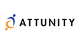
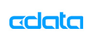
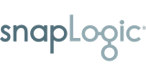

# Azure Synapse Analytics data integration partners

To create your data warehouse solution using the Synapse SQL pool feature of Azure Synapse, you can choose from a wide variety of industry-leading tools. This article highlights Microsoft partner companies with official data integration solutions that support Azure Synapse.

## Data integration partners

| Partner | Description | Website/Product link |
| ------- | ----------- | -------------------- |
|  |**Alooma**  Alooma is an Extract, Transform, and Load (ETL) solution that enables data teams to integrate, enrich, and stream data from various data silos to an Azure Synapse data warehouse all in real time. |[Product page](https://www.alooma.com/) |
|  |**Alteryx**  Alteryx Designer provides a repeatable workflow for self-service data analytics that leads to deeper insights in hours, not the weeks typical of traditional approaches! Alteryx Designer helps data analysts by combining data preparation, data blending, and analytics – predictive, statistical, and spatial – using the same intuitive user interface. |[Product page](https://www.alteryx.com/partners/microsoft/) [Azure Marketplace](https://azuremarketplace.microsoft.com/marketplace/apps/alteryx.alteryx-designer) |
|  |**Attunity (CloudBeam)** Attunity CloudBeam provides an automated solution for loading data into an Azure Synapse data warehouse. It simplifies batch loading and incremental replication of data from many sources - SQL Server, Oracle, DB2, Sybase, MySQL, and more. |[Product page](http://www.attunity.com/attunity-cloudbeam-for-azure/) [Azure Marketplace](https://azuremarketplace.microsoft.com/marketplace/apps/attunity_cloudbeam.cloudbeam-dw-byol)   |
|  |**CData Sync - Cloud Data Pipeline** Build high-performance data pipelines for Microsoft Azure Synapse in minutes. CData Sync is an easy-to-use, go-anywhere ETL/ELT pipeline that streamlines data flow from more than 200+ enterprise data sources to Azure Synapse.  With CData Sync, users can easily create automated continuous data replication between Accounting, CRM, ERP, Marketing Automation, On-Premises, and cloud data.|[Product page](https://www.cdata.com/sync/to/azuresynapse/?utm_source=azuresynapse&utm_medium=partner) [Azure Marketplace](https://azuremarketplace.microsoft.com/marketplace/apps/cdatasoftware.cdatasync?tab=Overview) |
|  |**Denodo** Denodo provide real-time access to data across an organization's diverse data sources. It uses data virtualization to bridge data across many sources without replication. Denodo offers broad access to structured and unstructured data residing in enterprise, big data, and cloud sources, in both batch and real time.|[Product page](https://www.denodo.com/en) [Azure Marketplace](https://azuremarketplace.microsoft.com/marketplace/apps/denodo.denodo-platform-7_0)  |
|  |**Dimodelo** Dimodelo Data Warehouse Studio is a data warehouse automation tool for the Azure data platform. Dimodelo enhances developer productivity through a dedicated data warehouse modeling and ETL design tool, pattern-based best practice code generation, one-click deployment, and ETL orchestration. Dimodelo enhances maintainability with change propagation, allows developers to stay focused on business outcomes, and automates portability across data platforms.|[Product page](https://www.dimodelo.com/data-warehouse-studio-for-azure-synapse/) [Azure Marketplace](https://azuremarketplace.microsoft.com/marketplace/apps/dimodelosolutions.dimodeloazurevs)  |
|  |**Fivetran** Fivetran helps you centralize data from disparate sources. It features a zero maintenance, zero configuration data pipeline product with a growing list of built-in connectors to all the popular data sources. Setup takes five minutes after authenticating to data sources and target data warehouse.|[Product page](https://fivetran.com/)  |
|  |**HVR** HVR provides a real-time cloud data replication solution that supports enterprise modernization efforts. The HVR platform is a reliable, secure, and scalable way to quickly and efficiently integrate large data volumes in complex environments, enabling real-time data updates, access, and analysis. Global market leaders in a variety of industries trust HVR to address their real-time data integration challenges and revolutionize their businesses. HVR is a privately held company based in San Francisco, with offices across North America, Europe, and Asia.|[Product page](https://www.hvr-software.com/solutions/azure-data-integration/) [Azure Marketplace](https://azuremarketplace.microsoft.com/marketplace/apps/hvr.hvr-for-azure?tab=Overview) |
|  |**1.Informatica Cloud Services for Azure**  Informatica Cloud offers a best-in-class solution for self-service data migration, integration, and management capabilities. Customers can quickly and reliably import, and export petabytes of data to Azure from different kinds of sources. Informatica Cloud Services for Azure provides native, high volume, high-performance connectivity to Azure Synapse, SQL Database, Blob Storage, Data Lake Store, and Azure Cosmos DB.    **2.Informatica PowerCenter** PowerCenter is a metadata-driven data integration platform that jumpstarts and accelerates data integration projects to deliver data to the business more quickly than manual hand coding. It serves as the foundation for your data integration investments |**Informatica Cloud services for Azure** [Product page](https://www.informatica.com/products/cloud-integration.html) [Azure Marketplace](https://azuremarketplace.microsoft.com/marketplace/apps/informatica.iics-winter)   **Informatica PowerCenter** [Product page](https://www.informatica.com/products/data-integration/powercenter.html)  [Azure Marketplace](https://azuremarketplace.microsoft.com/marketplace/apps/informatica.powercenter/) |
|  |**Information Builders (Omni-Gen Data Management)** Information Builder's Omni-Gen data management platform provides data integration, data quality, and master data management solutions. It makes it easy to access, move, and blend all data no matter the format, location, volume, or latency.|[Product page](https://www.informationbuilders.com/3i-platform)  [Azure Marketplace](https://azuremarketplace.microsoft.com/marketplace/apps/informationbuilders.omni-gen-mdm) |
|  |**Lyftron** Lyftron modern data hub combines an effortless data hub with agile access to data sources. Lyftron eliminates traditional ETL/ELT bottlenecks with automatic data pipeline and make data instantly accessible to BI user with the modern cloud compute of Azure Synapse, Spark & Snowflake. Lyftron connectors automatically convert any source into normalized, ready-to-query relational format and replication. It offers advanced security, data governance and transformation, with simple ANSI SQL along with search capability on your enterprise data catalog.| [Product page](https://lyftron.com/)  [Azure Marketplace](https://azuremarketplace.microsoft.com/marketplace/apps/lyftron.lyftronapp?tab=Overview) |
|  |**Matillion** Matillion is data transformation software for cloud data warehouses. Only Matillion is purpose-built for Azure Synapse enabling businesses to achieve new levels of simplicity, speed, scale, and savings. Matillion products are highly rated and trusted by companies of all sizes to meet their data integration and transformation needs. Learn more about how you can unlock the potential of your data with Matillion's cloud-based approach to data transformation.| [Product page](https://www.matillion.com/technology/cloud-data-warehouse/microsoft-azure-synapse/)  [Azure Marketplace](https://azuremarketplace.microsoft.com/marketplace/apps/matillion.matillion-etl-azure-synapse?tab=Overview) |
|  |**oh22 HEDDA.IO** oh22’s HEDDA.IO is a knowledge-driven data quality product built for Microsoft Azure. It enables you to build a knowledge base and use it to perform a variety of critical data quality tasks, including correction, enrichment and standardization of your data. HEDDA.IO also allows you to perform data cleansing by using cloud-based reference data services provided by reference data providers or developed and provided by you.| [Product page](https://hedda.io)  [Azure Marketplace](https://azuremarketplace.microsoft.com/marketplace/apps/oh22.hedda-io) |
|  |**Precisely** Precisely Connect ETL enables extract transfer and load (ETL) of data from multiple sources to Azure targets. Connect ETL is an easy to configure tool that does not require coding or tuning. ETL transformation can be done on the fly, eliminating the need for costly database staging areas or manual pushes, allowing you to create your own data blends with consistent sustainable performance. Import legacy data from multiple sources including mainframe DB2, VSAM, IMS, Oracle, SQL Server, Teradata, and write them to cloud targets including Azure Databricks, Azure Synapse Analytics and Azure Data Lake Storage. By leveraging the high performance Connect ETL engine, you can expect optimal performance and consistency.|[Product page](https://www.precisely.com/solution/microsoft-azure)  [Azure Marketplace](https://azuremarketplace.microsoft.com/marketplace/apps/syncsort.dmx) |
|  |**Qubole** Qubole provides a cloud-native platform that enables users to conduct ETL, analytics, and AI/ML workloads. It supports different kinds of open-source engines - Apache Spark, TensorFlow, Presto, Airflow, Hadoop, Hive, and more. It provides easy-to-use end-user tools for data processing from SQL query tools, to notebooks, and dashboards that use powerful open-source engines.|[Product page](https://www.qubole.com/company/partners/partners-microsoft-azure/)  [Azure Marketplace](https://azuremarketplace.microsoft.com/marketplace/apps/qubole-inc.qubole-data-service?tab=Overview) |
|  |**Segment** Segment is a data management and analytics solution that helps you make sense of customer data coming from various sources. It allows you to connect your data to over 200 tools to create better decisions, products, and experiences. Segment will transform and load multiple data sources into your warehouse for you using its built-in data connectors|[Product page](https://segment.com/)  |
|  |**Skyvia (data integration)** Skyvia data integration provides a wizard that automates data imports. This wizard allows you to migrate data between different kinds of sources - CRMs, application database, CSV files, and more. |[Product page](https://skyvia.com/)  |
|  |**SnapLogic** The SnapLogic Platform enables customers to quickly transfer data into and out of an Azure Synapse data warehouse. It offers the ability to integrate hundreds of applications, services, and IoT scenarios in one solution.|[Product page](https://www.snaplogic.com/) [Azure Marketplace](https://azuremarketplace.microsoft.com/marketplace/apps/snaplogic.snaplogic-elastic-integration-windows)  |
|  |**StreamSets** StreamSets provides a data integration platform for DataOps. It operationalizes the full design-deploy-operate lifecycle of integrating data into an Azure Synapse data warehouse. You can quickly ingest and integrate data to and from the warehouse, via streaming, batch, or changed data capture data delivery methods. Also, you can ensure continuous operations with smart data pipelines that provide end-to-end data flow visibility and resiliency.|[Product page](https://streamsets.com/partners/microsoft)|
|  |**Talend Cloud** Talend Cloud is an enterprise data integration platform to connect, access, and transform any data across the cloud or on-premises. It's an integration platform-as-a-service (iPaaS) that provides broad connectivity, built-in data quality, and native support for the latest big data and cloud technologies. |[Product page](https://www.talend.com/)  [Azure Marketplace](https://azuremarketplace.microsoft.com/marketplace/apps/talend.talendremoteengine?source=datamarket&tab=Overview) |
|  |**TimeXtender** TimeXtender's Discovery Hub helps companies build a modern data estate by providing an integrated data management platform that accelerates time to data insights by up to 10 times. Going beyond everyday ETL and ELT, it provides capabilities for data access, data modeling, and compliance in a single platform. Discovery Hub provides a cohesive data fabric for cloud scale analytics. It allows you to connect and integrate various data silos, catalog, model, move, and document data for analytics and AI. | [Product page](https://www.timextender.com/)  [Azure Marketplace](https://azuremarketplace.microsoft.com/marketplace/apps?search=timextender&page=1) |
|  |**Trifacta Wrangler**  Trifacta helps individuals and organizations explore, and join together diverse data for analysis. Trifacta Wrangler is designed to handle data wrangling workloads that need to support data at scale and a large number of end users.|[Product page](https://www.trifacta.com/)  [Azure Marketplace](https://azuremarketplace.microsoft.com/en-us/marketplace/apps/trifactainc1587522950142.trifactaazure?tab=Overview) |
|  |**Wherescape RED**  WhereScape RED is an IDE that provides teams with automation tools to streamline ETL workflows. The IDE provides best practice, optimized native code for popular data targets. Use WhereScape RED to cut the time to develop, deploy, and operate your data infrastructure.|[Product page](https://www.wherescape.com/)  [Azure Marketplace](https://azuremarketplace.microsoft.com/marketplace/apps/wherescapesoftware.wherescape-red?source=datamarket&tab=Overview) |

## Next steps
To learn more about other partners, see [Business Intelligence partners](sql-data-warehouse-partner-business-intelligence.md), [Data Management partners](sql-data-warehouse-partner-data-management.md), and [Machine Learning and AI partners](sql-data-warehouse-partner-machine-learning-ai.md).