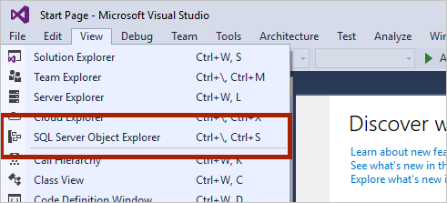
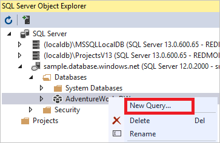

# Connect to dedicated SQL pool (formerly SQL DW) in Azure Synapse Analytics with Visual Studio and SSDT

> [!div class="op_single_selector"]
> * [Azure Data Studio](../sql/get-started-azure-data-studio.md)
> * [Power BI](/power-bi/connect-data/service-azure-sql-data-warehouse-with-direct-connect)
> * [Visual Studio](sql-data-warehouse-query-visual-studio.md)
> * [sqlcmd](../sql/get-started-connect-sqlcmd.md) 
> * [SSMS](sql-data-warehouse-query-ssms.md)
> 
> 

Use Visual Studio to query a dedicated SQL pool (formerly SQL DW) within Azure Synapse in just a few minutes. This method uses the SQL Server Data Tools (SSDT) extension in Visual Studio 2019. 

## Prerequisites
To use this tutorial, you need:

* An existing dedicated SQL pool (formerly SQL DW). To create one, see [Create a dedicated SQL pool (formerly SQL DW)](create-data-warehouse-portal.md).
* SSDT for Visual Studio. If you have Visual Studio, you probably already have SSDT for Visual Studio. For installation instructions and options, see [Installing Visual Studio and SSDT](sql-data-warehouse-install-visual-studio.md).
* The fully qualified SQL server name. To find this information, see [Connect to a dedicated SQL pool (formerly SQL DW)](sql-data-warehouse-connect-overview.md).

## 1. Connect to your dedicated SQL pool (formerly SQL DW)
1. Open Visual Studio 2019.
2. Open SQL Server Object Explorer by selecting **View** > **SQL Server Object Explorer**.
   
    
3. Click the **Add SQL Server** icon.
   
    
4. Fill in the fields in the Connect to Server window.
   
    
   
   * **Server name**. Enter the **server name** previously identified.
   * **Authentication**. Select **SQL Server Authentication** or **Active Directory Integrated Authentication**.
   * **User Name** and **Password**. Enter user name and password if SQL Server Authentication was selected above.
   * Click **Connect**.
5. To explore, expand your Azure SQL server. You can view the databases associated with the server. Expand AdventureWorksDW to see the tables in your sample database.
   
    

## 2. Run a sample query
Now that a connection has been established to your database, let's write a query.

1. Right-click your database in SQL Server Object Explorer.
2. Select **New Query**. A new query window opens.
   
    
3. Copy the following T-SQL query into the query window:
   
    ```sql
    SELECT COUNT(*) FROM dbo.FactInternetSales;
    ```
4. Run the query by clicking the green arrow or use the following shortcut: `CTRL`+`SHIFT`+`E`.
   
    
5. Look at the query results. In this example, the FactInternetSales table has 60398 rows.
   
    

## Next steps
Now that you can connect and query, try [visualizing the data with Power BI](/power-bi/connect-data/service-azure-sql-data-warehouse-with-direct-connect).

To configure your environment for Azure Active Directory authentication, see [Authenticate to dedicated SQL pool (formerly SQL DW)](sql-data-warehouse-authentication.md).