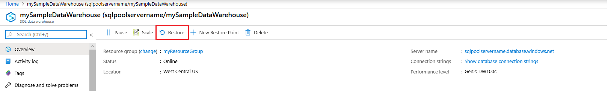

# Restore an existing SQL pool

In this article, you learn how to restore an existing SQL pool in Azure Synapse Analytics using Azure portal and PowerShell.

[!INCLUDE [updated-for-az](../../../includes/updated-for-az.md)]

**Verify your DTU capacity.** Each pool is hosted by a [logical SQL server](../../azure-sql/database/logical-servers.md) (for example, myserver.database.windows.net) which has a default DTU quota. Verify the server has enough remaining DTU quota for the database being restored. To learn how to calculate DTU needed or to request more DTU, see [Request a DTU quota change](sql-data-warehouse-get-started-create-support-ticket.md).

## Before you begin

1. Make sure to [install Azure PowerShell](/powershell/azure/overview?toc=/azure/synapse-analytics/sql-data-warehouse/toc.json&bc=/azure/synapse-analytics/sql-data-warehouse/breadcrumb/toc.json).
2. Have an existing restore point that you want to restore from. If you want to create a new restore, see [the tutorial to create a new user-defined restore point](sql-data-warehouse-restore-points.md).

## Restore an existing SQL pool through PowerShell

To restore an existing SQL pool from a restore point use the [Restore-AzSqlDatabase](/powershell/module/az.sql/restore-azsqldatabase?toc=/azure/synapse-analytics/sql-data-warehouse/toc.json&bc=/azure/synapse-analytics/sql-data-warehouse/breadcrumb/toc.json) PowerShell cmdlet.

1. Open PowerShell.

2. Connect to your Azure account and list all the subscriptions associated with your account.

3. Select the subscription that contains the database to be restored.

4. List the restore points for the SQL pool.

5. Pick the desired restore point using the RestorePointCreationDate.

6. Restore the SQL pool to the desired restore point using [Restore-AzSqlDatabase](/powershell/module/az.sql/restore-azsqldatabase?toc=/azure/synapse-analytics/sql-data-warehouse/toc.json&bc=/azure/synapse-analytics/sql-data-warehouse/breadcrumb/toc.json) PowerShell cmdlet.

    1. To restore the SQL pool to a different server, make sure to specify the other server name.  This server can also be in a different resource group and region.
    2. To restore to a different subscription, use the  'Move' button to move the server to another subscription.

7. Verify that the restored SQL pool is online.

8. After the restore has completed, you can configure your recovered SQL pool by following [configure your database after recovery](../../azure-sql/database/disaster-recovery-guidance.md?toc=/azure/synapse-analytics/sql-data-warehouse/toc.json&bc=/azure/synapse-analytics/sql-data-warehouse/breadcrumb/toc.json#configure-your-database-after-recovery).

```Powershell

$SubscriptionName="<YourSubscriptionName>"
$ResourceGroupName="<YourResourceGroupName>"
$ServerName="<YourServerNameWithoutURLSuffixSeeNote>"  # Without database.windows.net
#$TargetResourceGroupName="<YourTargetResourceGroupName>" # uncomment to restore to a different server.
#$TargetServerName="<YourtargetServerNameWithoutURLSuffixSeeNote>"  
$DatabaseName="<YourDatabaseName>"
$NewDatabaseName="<YourDatabaseName>"

Connect-AzAccount
Get-AzSubscription
Select-AzSubscription -SubscriptionName $SubscriptionName

# Or list all restore points
Get-AzSqlDatabaseRestorePoints -ResourceGroupName $ResourceGroupName -ServerName $ServerName -DatabaseName $DatabaseName

# Get the specific database to restore
$Database = Get-AzSqlDatabase -ResourceGroupName $ResourceGroupName -ServerName $ServerName -DatabaseName $DatabaseName

# Pick desired restore point using RestorePointCreationDate "xx/xx/xxxx xx:xx:xx xx"
$PointInTime="<RestorePointCreationDate>"  

# Restore database from a restore point
$RestoredDatabase = Restore-AzSqlDatabase –FromPointInTimeBackup –PointInTime $PointInTime -ResourceGroupName $Database.ResourceGroupName -ServerName $Database.ServerName -TargetDatabaseName $NewDatabaseName –ResourceId $Database.ResourceID

# Use the following command to restore to a different server
#$RestoredDatabase = Restore-AzSqlDatabase –FromPointInTimeBackup –PointInTime $PointInTime -ResourceGroupName $Database.ResourceTargetGroupName -ServerName $TargetServerName -TargetDatabaseName $NewDatabaseName –ResourceId $Database.ResourceID

# Verify the status of restored database
$RestoredDatabase.status

```

## Restore an existing SQL pool through the Azure portal

1. Sign in to the [Azure portal](https://portal.azure.com/).
2. Navigate to the SQL pool that you want to restore from.
3. At the top of the Overview blade, select **Restore**.

    

4. Select either **Automatic Restore Points** or **User-Defined Restore Points**. If the SQL pool doesn't have any automatic restore points, wait a few hours or create a user defined restore point before restoring. For User-Defined Restore Points, select an existing one or create a new one. For **Server**, you can pick a server in a different resource group and region or create a new one. After providing all the parameters, click **Review + Restore**.

    

## Next Steps

- [Restore a deleted SQL pool](sql-data-warehouse-restore-deleted-dw.md)
- [Restore from a geo-backup SQL pool](sql-data-warehouse-restore-from-geo-backup.md)
