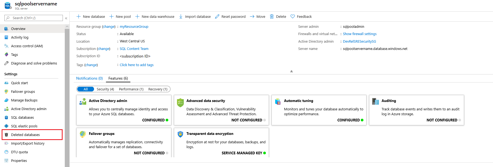
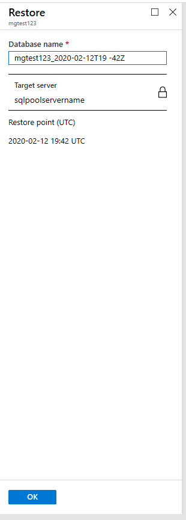

# Restore a deleted dedicated SQL pool (formerly SQL DW) in Azure Synapse Analytics

In this article, you learn to restore a dedicated SQL pool (formerly SQL DW) using either the Azure portal or PowerShell.

## Before you begin

[!INCLUDE [updated-for-az](../../../includes/updated-for-az.md)]

**Verify your DTU capacity.** Each dedicated SQL pool (formerly SQL DW) is hosted by a [logical SQL server](/azure/azure-sql/database/logical-servers) (for example, myserver.database.windows.net) which has a default DTU quota.  Verify that the server has enough remaining DTU quota for the database being restored. To learn how to calculate DTU needed or to request more DTU, see [Request a DTU quota change](sql-data-warehouse-get-started-create-support-ticket.md).

## Restore a deleted data warehouse through PowerShell

To restore a deleted dedicated SQL pool (formerly SQL DW), use the [Restore-AzSqlDatabase](/powershell/module/az.sql/restore-azsqldatabase?toc=/azure/synapse-analytics/sql-data-warehouse/toc.json&bc=/azure/synapse-analytics/sql-data-warehouse/breadcrumb/toc.json) cmdlet. If the corresponding server has been deleted as well, you can't restore that data warehouse.

1. Before you begin, make sure to [install Azure PowerShell](/powershell/azure/?toc=/azure/synapse-analytics/sql-data-warehouse/toc.json&bc=/azure/synapse-analytics/sql-data-warehouse/breadcrumb/toc.json).
2. Open PowerShell.
3. Connect to your Azure account and list all the subscriptions associated with your account.
4. Select the subscription that contains the deleted dedicated SQL pool (formerly SQL DW) to be restored.
5. Get the specific deleted data warehouse.
6. Restore the deleted dedicated SQL pool (formerly SQL DW)
    1. To restore the deleted dedicated SQL pool (formerly SQL DW) to a different server, make sure to specify the other server name.  This server can also be in a different resource group and region.
    1. To restore to a different subscription, use the [Move](../../azure-resource-manager/management/move-resource-group-and-subscription.md?toc=/azure/synapse-analytics/sql-data-warehouse/toc.json&bc=/azure/synapse-analytics/sql-data-warehouse/breadcrumb/toc.json#use-the-portal) button to move the server to another subscription.
7. Verify that the restored data warehouse is online.
8. After the restore has completed, you can configure your recovered data warehouse by following [configure your database after recovery](/azure/azure-sql/database/disaster-recovery-guidance?toc=/azure/synapse-analytics/sql-data-warehouse/toc.json&bc=/azure/synapse-analytics/sql-data-warehouse/breadcrumb/toc.json#configure-your-database-after-recovery).

```powershell
$SubscriptionName="<YourSubscriptionName>"
$ResourceGroupName="<YourResourceGroupName>"
$ServerName="<YourServerNameWithoutURLSuffixSeeNote>"  # Without database.windows.net
#$TargetResourceGroupName="<YourTargetResourceGroupName>" # uncomment to restore to a different server.
#$TargetServerName="<YourtargetServerNameWithoutURLSuffixSeeNote>"
$DatabaseName="<YourDatabaseName>"
$NewDatabaseName="<YourDatabaseName>"

Connect-AzAccount
Get-AzSubscription
Select-AzSubscription -SubscriptionName $SubscriptionName

# Get the deleted database to restore
$DeletedDatabase = Get-AzSqlDeletedDatabaseBackup -ResourceGroupName $ResourceGroupName -ServerName $ServerName -DatabaseName $DatabaseName

# Restore deleted database
$RestoredDatabase = Restore-AzSqlDatabase –FromDeletedDatabaseBackup –DeletionDate $DeletedDatabase.DeletionDate -ResourceGroupName $DeletedDatabase.ResourceGroupName -ServerName $DeletedDatabase.ServerName -TargetDatabaseName $NewDatabaseName –ResourceId $DeletedDatabase.ResourceID

# Use the following command to restore deleted data warehouse to a different server
#$RestoredDatabase = Restore-AzSqlDatabase –FromDeletedDatabaseBackup –DeletionDate $DeletedDatabase.DeletionDate -ResourceGroupName $TargetResourceGroupName -ServerName $TargetServerName -TargetDatabaseName $NewDatabaseName –ResourceId $DeletedDatabase.ResourceID

# Verify the status of restored database
$RestoredDatabase.status
```

## Restore a deleted database using the Azure portal

1. Sign in to the [Azure portal](https://portal.azure.com/).
2. Navigate to the server your deleted data warehouse was hosted on.
3. Select the **Deleted databases** icon in the table of contents.

    

4. Select the deleted Azure Synapse Analytics that you want to restore.

    

5. Specify a new **Database name** and click **OK**

    

## Next Steps

- [Restore an existing dedicated SQL pool (formerly SQL DW)](sql-data-warehouse-restore-active-paused-dw.md)
- [Restore from a geo-backup dedicated SQL pool (formerly SQL DW)](sql-data-warehouse-restore-from-geo-backup.md)
