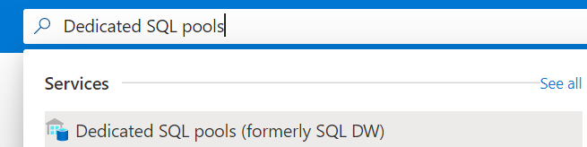
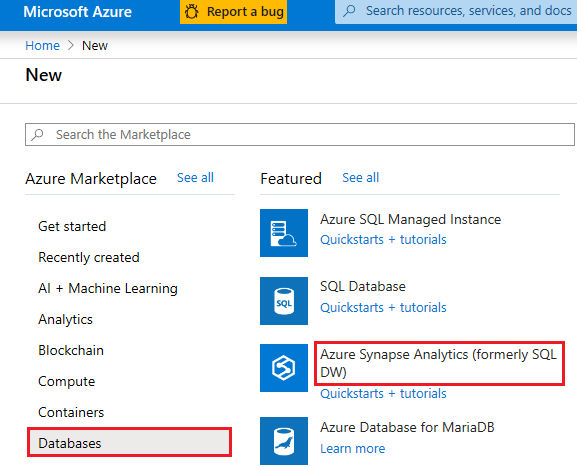
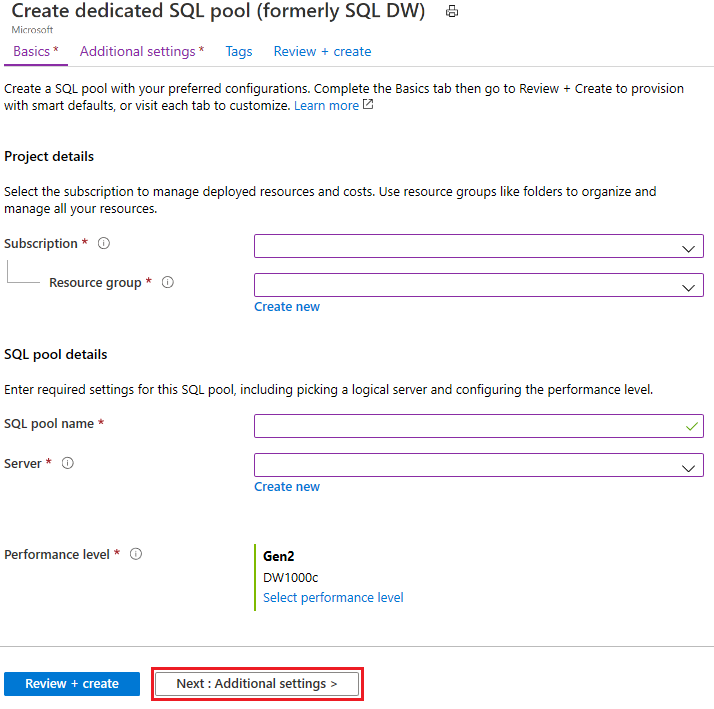
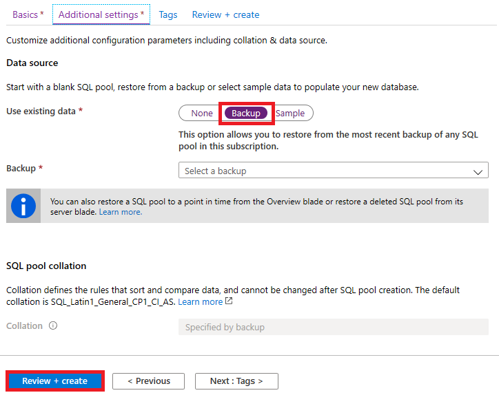

# Geo-restore for SQL pool

In this article, you learn to restore your SQL pool from a geo-backup through Azure portal and PowerShell.

## Before you begin

[!INCLUDE [updated-for-az](../../../includes/updated-for-az.md)]

**Verify your DTU capacity.** Each SQL pool is hosted by a [logical SQL server](../../azure-sql/database/logical-servers.md) (for example, myserver.database.windows.net) which has a default DTU quota. Verify that the SQL server has enough remaining DTU quota for the database being restored. To learn how to calculate DTU needed or to request more DTU, see [Request a DTU quota change](sql-data-warehouse-get-started-create-support-ticket.md).

## Restore from an Azure geographical region through PowerShell

To restore from a geo-backup, use the [Get-AzSqlDatabaseGeoBackup](/powershell/module/az.sql/get-azsqldatabasegeobackup?toc=/azure/synapse-analytics/sql-data-warehouse/toc.json&bc=/azure/synapse-analytics/sql-data-warehouse/breadcrumb/toc.json) and [Restore-AzSqlDatabase](/powershell/module/az.sql/restore-azsqldatabase?toc=/azure/synapse-analytics/sql-data-warehouse/toc.json&bc=/azure/synapse-analytics/sql-data-warehouse/breadcrumb/toc.json) cmdlet.

> [!NOTE]
> You can perform a geo-restore to Gen2! To do so, specify an Gen2 ServiceObjectiveName (e.g. DW1000**c**) as an optional parameter.
>

1. Before you begin, make sure to [install Azure PowerShell](/powershell/azure/overview?toc=/azure/synapse-analytics/sql-data-warehouse/toc.json&bc=/azure/synapse-analytics/sql-data-warehouse/breadcrumb/toc.json).
2. Open PowerShell.
3. Connect to your Azure account and list all the subscriptions associated with your account.
4. Select the subscription that contains the data warehouse to be restored.
5. Get the data warehouse you want to recover.
6. Create the recovery request for the data warehouse.
7. Verify the status of the geo-restored data warehouse.
8. To configure your data warehouse after the restore has completed, see [Configure your database after recovery]( ../../sql-database/sql-database-disaster-recovery.md?toc=/azure/synapse-analytics/sql-data-warehouse/toc.json&bc=/azure/synapse-analytics/sql-data-warehouse/breadcrumb/toc.json#configure-your-database-after-recovery).

```Powershell
$SubscriptionName="<YourSubscriptionName>"
$ResourceGroupName="<YourResourceGroupName>"
$ServerName="<YourServerNameWithoutURLSuffixSeeNote>"  # Without database.windows.net
$TargetResourceGroupName="<YourTargetResourceGroupName>" # Restore to a different server.
$TargetServerName="<YourtargetServerNameWithoutURLSuffixSeeNote>"  
$DatabaseName="<YourDatabaseName>"
$NewDatabaseName="<YourDatabaseName>"
$TargetServiceObjective="<YourTargetServiceObjective-DWXXXc>"

Connect-AzAccount
Get-AzSubscription
Select-AzSubscription -SubscriptionName $SubscriptionName
Get-AzureSqlDatabase -ServerName $ServerName

# Get the data warehouse you want to recover
$GeoBackup = Get-AzSqlDatabaseGeoBackup -ResourceGroupName $ResourceGroupName -ServerName $ServerName -DatabaseName $DatabaseName

# Recover data warehouse
$GeoRestoredDatabase = Restore-AzSqlDatabase –FromGeoBackup -ResourceGroupName $TargetResourceGroupName -ServerName $TargetServerName -TargetDatabaseName $NewDatabaseName –ResourceId $GeoBackup.ResourceID -ServiceObjectiveName $TargetServiceObjective

# Verify that the geo-restored data warehouse is online
$GeoRestoredDatabase.status
```

The recovered database will be TDE-enabled if the source database is TDE-enabled.

## Restore from an Azure geographical region through Azure portal

Follow the steps outlined below to restore a SQL pool from a geo-backup:

1. Sign in to your [Azure portal](https://portal.azure.com/) account.
2. Click **+ Create a resource**.

   

3. Click **Databases** and then **Azure Synapse Analytics (formerly SQL DW)**.

   

4. Fill out the information requested in the **Basics** tab and click **Next: Additional settings**.

   

5. For **Use existing data** parameter, select **Backup** and select the appropriate backup from the scroll down options. Click **Review + Create**.

   

6. Once the data warehouse has been restored, check that the **Status** is Online.

## Next Steps

- [Restore an existing SQL pool](sql-data-warehouse-restore-active-paused-dw.md)
- [Restore a deleted SQL pool](sql-data-warehouse-restore-deleted-dw.md)
