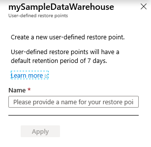

# User-defined restore points for a dedicated SQL pool (formerly SQL DW)

In this article, you'll learn to create a new user-defined restore point for a dedicated SQL pool (formerly SQL DW) in Azure Synapse Analytics by using PowerShell and the Azure portal.

## Create user-defined restore points through PowerShell

To create a user-defined restore point, use the [New-AzSqlDatabaseRestorePoint](/powershell/module/az.sql/new-azsqldatabaserestorepoint?toc=/azure/synapse-analytics/sql-data-warehouse/toc.json&bc=/azure/synapse-analytics/sql-data-warehouse/breadcrumb/toc.json) PowerShell cmdlet.

1. Before you begin, make sure to [install Azure PowerShell](/powershell/azure/?toc=/azure/synapse-analytics/sql-data-warehouse/toc.json&bc=/azure/synapse-analytics/sql-data-warehouse/breadcrumb/toc.json).
2. Open PowerShell.
3. Connect to your Azure account and list all the subscriptions associated with your account.
4. Select the subscription that contains the database to be restored.
5. Create a restore point for an immediate copy of your data warehouse.

```powershell

$SubscriptionName="<YourSubscriptionName>"
$ResourceGroupName="<YourResourceGroupName>"
$ServerName="<YourServerNameWithoutURLSuffixSeeNote>"  # Without database.windows.net
$DatabaseName="<YourDatabaseName>"
$Label = "<YourRestorePointLabel>"

Connect-AzAccount
Get-AzSubscription
Set-AzContext -SubscriptionName $SubscriptionName

# Create a restore point of the original database
New-AzSqlDatabaseRestorePoint -ResourceGroupName $ResourceGroupName -ServerName $ServerName -DatabaseName $DatabaseName -RestorePointLabel $Label
```

6. See the list of all the existing restore points.

```powershell
# List all restore points
Get-AzSqlDatabaseRestorePoint -ResourceGroupName $ResourceGroupName -ServerName $ServerName -DatabaseName $DatabaseName
```

## Create user-defined restore points through the Azure portal

User-defined restore points can also be created through Azure portal.

1. Sign in to your [Azure portal](https://portal.azure.com/) account.

2. Navigate to the dedicated SQL pool (formerly SQL DW) that you want to create a restore point for.

3. Select **Overview** from the left pane, select **+ New Restore Point**. If the New Restore Point button isn't enabled, make sure that the dedicated SQL pool (formerly SQL DW) isn't paused.

    

4. Specify a name for your user-defined restore point and click **Apply**. User-defined restore points have a default retention period of seven days.

    

## Next steps

- [Restore an existing dedicated SQL pool (formerly SQL DW)](sql-data-warehouse-restore-active-paused-dw.md)
- [Restore a deleted dedicated SQL pool (formerly SQL DW)](sql-data-warehouse-restore-deleted-dw.md)
- [Restore from a geo-backup dedicated SQL pool (formerly SQL DW)](sql-data-warehouse-restore-from-geo-backup.md)
