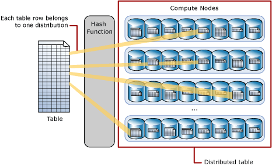

# Guidance for designing distributed tables in Synapse SQL pool

Recommendations for designing hash-distributed and round-robin distributed tables in Synapse SQL pools.

This article assumes you are familiar with data distribution and data movement concepts in Synapse SQL pool.  For more information, see [Azure Synapse Analytics massively parallel processing (MPP) architecture](massively-parallel-processing-mpp-architecture.md).

## What is a distributed table?

A distributed table appears as a single table, but the rows are actually stored across 60 distributions. The rows are distributed with a hash or round-robin algorithm.  

**Hash-distributed tables** improve query performance on large fact tables, and are the focus of this article. **Round-robin tables** are useful for improving loading speed. These design choices have a significant impact on improving query and loading performance.

Another table storage option is to replicate a small table across all the Compute nodes. For more information, see [Design guidance for replicated tables](design-guidance-for-replicated-tables.md). To quickly choose among the three options, see Distributed tables in the [tables overview](sql-data-warehouse-tables-overview.md).

As part of table design, understand as much as possible about your data and how the data is queried.  For example, consider these questions:

- How large is the table?
- How often is the table refreshed?
- Do I have fact and dimension tables in a Synapse SQL pool?

### Hash distributed

A hash-distributed table distributes table rows across the Compute nodes by using a deterministic hash function to assign each row to one [distribution](massively-parallel-processing-mpp-architecture.md#distributions).

  

Since identical values always hash to the same distribution, the data warehouse has built-in knowledge of the row locations. In Synapse SQL pool this knowledge is used to minimize data movement during queries, which improves query performance.

Hash-distributed tables work well for large fact tables in a star schema. They can have very large numbers of rows and still achieve high performance. There are, of course, some design considerations that help you to get the performance the distributed system is designed to provide. Choosing a good distribution column is one such consideration that is described in this article.

Consider using a hash-distributed table when:

- The table size on disk is more than 2 GB.
- The table has frequent insert, update, and delete operations.

### Round-robin distributed

A round-robin distributed table distributes table rows evenly across all distributions. The assignment of rows to distributions is random. Unlike hash-distributed tables, rows with equal values are not guaranteed to be assigned to the same distribution.

As a result, the system sometimes needs to invoke a data movement operation to better organize your data before it can resolve a query.  This extra step can slow down your queries. For example, joining a round-robin table usually requires reshuffling the rows, which is a performance hit.

Consider using the round-robin distribution for your table in the following scenarios:

- When getting started as a simple starting point since it is the default
- If there is no obvious joining key
- If there is no good candidate column for hash distributing the table
- If the table does not share a common join key with other tables
- If the join is less significant than other joins in the query
- When the table is a temporary staging table

The tutorial [Load New York taxicab data](load-data-from-azure-blob-storage-using-polybase.md#load-the-data-into-your-data-warehouse) gives an example of loading data into a round-robin staging table.

## Choosing a distribution column

A hash-distributed table has a distribution column that is the hash key. For example, the following code creates a hash-distributed table with ProductKey as the distribution column.

```sql
CREATE TABLE [dbo].[FactInternetSales]
(   [ProductKey]            int          NOT NULL
,   [OrderDateKey]          int          NOT NULL
,   [CustomerKey]           int          NOT NULL
,   [PromotionKey]          int          NOT NULL
,   [SalesOrderNumber]      nvarchar(20) NOT NULL
,   [OrderQuantity]         smallint     NOT NULL
,   [UnitPrice]             money        NOT NULL
,   [SalesAmount]           money        NOT NULL
)
WITH
(   CLUSTERED COLUMNSTORE INDEX
,  DISTRIBUTION = HASH([ProductKey])
)
;
```

Data stored in the distribution column can be updated. Updates to data in the distribution column could result in data shuffle operation.

Choosing a distribution column is an important design decision since the values in this column determine how the rows are distributed. The best choice depends on several factors, and usually involves tradeoffs. Once a distribution column is chosen, you cannot change it.  

If you didn't choose the best column the first time, you can use [CREATE TABLE AS SELECT (CTAS)](/sql/t-sql/statements/create-table-as-select-azure-sql-data-warehouse?toc=/azure/synapse-analytics/sql-data-warehouse/toc.json&bc=/azure/synapse-analytics/sql-data-warehouse/breadcrumb/toc.json&view=azure-sqldw-latest) to re-create the table with a different distribution column.

### Choose a distribution column with data that distributes evenly

For best performance, all of the distributions should have approximately the same number of rows. When one or more distributions have a disproportionate number of rows, some distributions finish their portion of a parallel query before others. Since the query can't complete until all distributions have finished processing, each query is only as fast as the slowest distribution.

- Data skew means the data is not distributed evenly across the distributions
- Processing skew means that some distributions take longer than others when running parallel queries. This can happen when the data is skewed.
  
To balance the parallel processing, select a distribution column that:

- **Has many unique values.** The column can have some duplicate values. However, all rows with the same value are assigned to the same distribution. Since there are 60 distributions, the column should have at least 60 unique values.  Usually the number of unique values is much greater.
- **Does not have NULLs, or has only a few NULLs.** For an extreme example, if all values in the column are NULL, all the rows are assigned to the same distribution. As a result, query processing is skewed to one distribution, and does not benefit from parallel processing.
- **Is not a date column**. All data for the same date lands in the same distribution. If several users are all filtering on the same date, then only 1 of the 60 distributions do all the processing work.

### Choose a distribution column that minimizes data movement

To get the correct query result queries might move data from one Compute node to another. Data movement commonly happens when queries have joins and aggregations on distributed tables. Choosing a distribution column that helps minimize data movement is one of the most important strategies for optimizing performance of your Synapse SQL pool.

To minimize data movement, select a distribution column that:

- Is used in `JOIN`, `GROUP BY`, `DISTINCT`, `OVER`, and `HAVING` clauses. When two large fact tables have frequent joins, query performance improves when you distribute both tables on one of the join columns.  When a table is not used in joins, consider distributing the table on a column that is frequently in the `GROUP BY` clause.
- Is *not* used in `WHERE` clauses. This could narrow the query to not run on all the distributions.
- Is *not* a date column. WHERE clauses often filter by date.  When this happens, all the processing could run on only a few distributions.

### What to do when none of the columns are a good distribution column

If none of your columns have enough distinct values for a distribution column, you can create a new column as a composite of one or more values. To avoid data movement during query execution, use the composite distribution column as a join column in queries.

Once you design a hash-distributed table, the next step is to load data into the table.  For loading guidance, see [Loading overview](design-elt-data-loading.md).

## How to tell if your distribution column is a good choice

After data is loaded into a hash-distributed table, check to see how evenly the rows are distributed across the 60 distributions. The rows per distribution can vary up to 10% without a noticeable impact on performance.

### Determine if the table has data skew

A quick way to check for data skew is to use [DBCC PDW_SHOWSPACEUSED](/sql/t-sql/database-console-commands/dbcc-pdw-showspaceused-transact-sql?toc=/azure/synapse-analytics/sql-data-warehouse/toc.json&bc=/azure/synapse-analytics/sql-data-warehouse/breadcrumb/toc.json&view=azure-sqldw-latest). The following SQL code returns the number of table rows that are stored in each of the 60 distributions. For balanced performance, the rows in your distributed table should be spread evenly across all the distributions.

```sql
-- Find data skew for a distributed table
DBCC PDW_SHOWSPACEUSED('dbo.FactInternetSales');
```

To identify which tables have more than 10% data skew:

1. Create the view dbo.vTableSizes that is shown in the [Tables overview](sql-data-warehouse-tables-overview.md#table-size-queries) article.  
2. Run the following query:

```sql
select *
from dbo.vTableSizes
where two_part_name in
    (
    select two_part_name
    from dbo.vTableSizes
    where row_count > 0
    group by two_part_name
    having (max(row_count * 1.000) - min(row_count * 1.000))/max(row_count * 1.000) >= .10
    )
order by two_part_name, row_count
;
```

### Check query plans for data movement

A good distribution column enables joins and aggregations to have minimal data movement. This affects the way joins should be written. To get minimal data movement for a join on two hash-distributed tables, one of the join columns needs to be the distribution column.  When two hash-distributed tables join on a distribution column of the same data type, the join does not require data movement. Joins can use additional columns without incurring data movement.

To avoid data movement during a join:

- The tables involved in the join must be hash distributed on **one** of the columns participating in the join.
- The data types of the join columns must match between both tables.
- The columns must be joined with an equals operator.
- The join type may not be a `CROSS JOIN`.

To see if queries are experiencing data movement, you can look at the query plan.  

## Resolve a distribution column problem

It is not necessary to resolve all cases of data skew. Distributing data is a matter of finding the right balance between minimizing data skew and data movement. It is not always possible to minimize both data skew and data movement. Sometimes the benefit of having the minimal data movement might outweigh the impact of having data skew.

To decide if you should resolve data skew in a table, you should understand as much as possible about the data volumes and queries in your workload. You can use the steps in the [Query monitoring](sql-data-warehouse-manage-monitor.md) article to monitor the impact of skew on query performance. Specifically, look for how long it takes large queries to complete on individual distributions.

Since you cannot change the distribution column on an existing table, the typical way to resolve data skew is to re-create the table with a different distribution column.  

### Re-create the table with a new distribution column

This example uses [CREATE TABLE AS SELECT](/sql/t-sql/statements/create-table-as-select-azure-sql-data-warehouse?toc=/azure/synapse-analytics/sql-data-warehouse/toc.json&bc=/azure/synapse-analytics/sql-data-warehouse/breadcrumb/toc.json&view=azure-sqldw-latest) to re-create a table with a different hash distribution column.

```sql
CREATE TABLE [dbo].[FactInternetSales_CustomerKey]
WITH (  CLUSTERED COLUMNSTORE INDEX
     ,  DISTRIBUTION =  HASH([CustomerKey])
     ,  PARTITION       ( [OrderDateKey] RANGE RIGHT FOR VALUES (   20000101, 20010101, 20020101, 20030101
                                                                ,   20040101, 20050101, 20060101, 20070101
                                                                ,   20080101, 20090101, 20100101, 20110101
                                                                ,   20120101, 20130101, 20140101, 20150101
                                                                ,   20160101, 20170101, 20180101, 20190101
                                                                ,   20200101, 20210101, 20220101, 20230101
                                                                ,   20240101, 20250101, 20260101, 20270101
                                                                ,   20280101, 20290101
                                                                )
                        )
    )
AS
SELECT  *
FROM    [dbo].[FactInternetSales]
OPTION  (LABEL  = 'CTAS : FactInternetSales_CustomerKey')
;

--Create statistics on new table
CREATE STATISTICS [ProductKey] ON [FactInternetSales_CustomerKey] ([ProductKey]);
CREATE STATISTICS [OrderDateKey] ON [FactInternetSales_CustomerKey] ([OrderDateKey]);
CREATE STATISTICS [CustomerKey] ON [FactInternetSales_CustomerKey] ([CustomerKey]);
CREATE STATISTICS [PromotionKey] ON [FactInternetSales_CustomerKey] ([PromotionKey]);
CREATE STATISTICS [SalesOrderNumber] ON [FactInternetSales_CustomerKey] ([SalesOrderNumber]);
CREATE STATISTICS [OrderQuantity] ON [FactInternetSales_CustomerKey] ([OrderQuantity]);
CREATE STATISTICS [UnitPrice] ON [FactInternetSales_CustomerKey] ([UnitPrice]);
CREATE STATISTICS [SalesAmount] ON [FactInternetSales_CustomerKey] ([SalesAmount]);

--Rename the tables
RENAME OBJECT [dbo].[FactInternetSales] TO [FactInternetSales_ProductKey];
RENAME OBJECT [dbo].[FactInternetSales_CustomerKey] TO [FactInternetSales];
```

## Next steps

To create a distributed table, use one of these statements:

- [CREATE TABLE (Synapse SQL pool)](/sql/t-sql/statements/create-table-azure-sql-data-warehouse?toc=/azure/synapse-analytics/sql-data-warehouse/toc.json&bc=/azure/synapse-analytics/sql-data-warehouse/breadcrumb/toc.json&view=azure-sqldw-latest)
- [CREATE TABLE AS SELECT (Synapse SQL pool)](/sql/t-sql/statements/create-table-as-select-azure-sql-data-warehouse?toc=/azure/synapse-analytics/sql-data-warehouse/toc.json&bc=/azure/synapse-analytics/sql-data-warehouse/breadcrumb/toc.json&view=azure-sqldw-latest)
