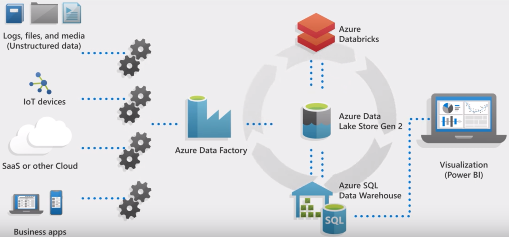

# Azure Synapse Analytics - dedicated SQL pool  (formerly SQL DW) Videos

Watch the latest dedicated SQL pool (formerly SQL DW) videos to learn about new capabilities and performance improvements. 

To get started, select the overview video below to learn about the new updates to dedicated SQL pool. Also, learn how modern data warehouse patterns can be used to tackle real world scenarios such as cybercrime.
 

<a href="https://www.youtube.com/watch?v=7MDCWgxPnVY&list=PLXtHYVsvn_b_v4EKljH6dGo9qJ7JjItWL&index=2">
  
        
      
  

</a>

Additional videos describing specific functionalities can be viewed on: 
- [YouTube: Advanced Analytics with Azure](https://www.youtube.com/playlist?list=PLLasX02E8BPClOvjNV9bXk3LUuf3nQiS2)
- [Azure Videos](https://azure.microsoft.com/resources/videos/index/?services=sql-data-warehouse)

