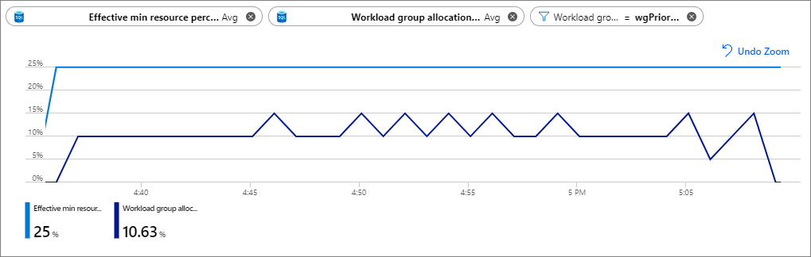

# Azure Synapse Analytics – Workload Management Portal Monitoring

This article explains how to monitor [workload group](sql-data-warehouse-workload-isolation.md#workload-groups) resource utilization and query activity.
For details on how to configure the Azure Metrics Explorer see the [Getting started with Azure Metrics Explorer](../../azure-monitor/essentials/metrics-getting-started.md?toc=/azure/synapse-analytics/sql-data-warehouse/toc.json&bc=/azure/synapse-analytics/sql-data-warehouse/breadcrumb/toc.json) article.  See the [Resource utilization](sql-data-warehouse-concept-resource-utilization-query-activity.md#resource-utilization) section in Azure Synapse Analytics Monitoring documentation for details on how to monitor system resource consumption.
There are two different categories of workload group metrics provided for monitoring workload management: resource allocation and query activity.  These metrics can be split and filtered by workload group.  The metrics can be split and filtered based on if they are system defined (resource class workload groups) or user-defined (created by user with [CREATE WORKLOAD GROUP](/sql/t-sql/statements/create-workload-group-transact-sql?toc=/azure/synapse-analytics/sql-data-warehouse/toc.json&bc=/azure/synapse-analytics/sql-data-warehouse/breadcrumb/toc.json&view=azure-sqldw-latest&preserve-view=true) syntax).

## Workload management metric definitions

|Metric Name                    |Description  |Aggregation Type |
|-------------------------------|-------------|-----------------|
|Effective cap resource percent | *Effective cap resource percent* is a hard limit on the percentage of resources accessible by the workload group, taking into account *Effective min resource percentage* allocated for other workload groups. The *Effective cap resource percent* metric is configured using the `CAP_PERCENTAGE_RESOURCE` parameter in the [CREATE WORKLOAD GROUP](/sql/t-sql/statements/create-workload-group-transact-sql?toc=/azure/synapse-analytics/sql-data-warehouse/toc.json&bc=/azure/synapse-analytics/sql-data-warehouse/breadcrumb/toc.json&view=azure-sqldw-latest&preserve-view=true) syntax.  The effective value is described here.<br><br>For example if a workload group `DataLoads` is created with `CAP_PERCENTAGE_RESOURCE` = 100 and another workload group is created with an Effective min resource percentage of 25%, the *Effective cap resource percent* for the `DataLoads` workload group is 75%.<br><br>The *Effective cap resource percent* determines the upper bound of concurrency (and thus potential throughput) a workload group can achieve.  If additional throughput is needed beyond what is currently reported by the *Effective cap resource percent* metric, either increase the `CAP_PERCENTAGE_RESOURCE`, decrease the `MIN_PERCENTAGE_RESOURCE` of other workload groups or scale up the instance to add more resources.  Decreasing the `REQUEST_MIN_RESOURCE_GRANT_PERCENT` can increase concurrency, but may not increase overall throughput.| Min, Avg, Max |
|Effective min resource percent |*Effective min resource percent* is the minimum percentage of resources reserved and isolated for the workload group taking into account the service level minimum.  The Effective min resource percent metric is configured using the `MIN_PERCENTAGE_RESOURCE` parameter in the [CREATE WORKLOAD GROUP](/sql/t-sql/statements/create-workload-group-transact-sql?toc=/azure/synapse-analytics/sql-data-warehouse/toc.json&bc=/azure/synapse-analytics/sql-data-warehouse/breadcrumb/toc.json&view=azure-sqldw-latest&preserve-view=true) syntax.  The effective value is described [here](/sql/t-sql/statements/create-workload-group-transact-sql?toc=/azure/synapse-analytics/sql-data-warehouse/toc.json&bc=/azure/synapse-analytics/sql-data-warehouse/breadcrumb/toc.json?view=azure-sqldw-latest&preserve-view=true#effective-values).<br><br>Use the Sum aggregation type when this metric is unfiltered and unsplit to monitor the total workload isolation configured on the system.<br><br>The *Effective min resource percent* determines the lower bound of guaranteed concurrency (and thus guaranteed throughput) a workload group can achieve.  If additional guaranteed resources are needed beyond what is currently reported by the *Effective min resource percent* metric, increase the `MIN_PERCENTAGE_RESOURCE` parameter configured for the workload group.  Decreasing the `REQUEST_MIN_RESOURCE_GRANT_PERCENT` can increase concurrency, but may not increase overall throughput. |Min, Avg, Max|
|Workload group active queries  |This metric reports the active queries within the workload group.  Using this metric unfiltered and unsplit displays all active queries running on the system.|Sum         |
|Workload group allocation by cap resource percent |This metric displays the percentage allocation of resources relative to the *Effective cap resource percent* per workload group.  This metric provides the effective utilization of the workload group.<br><br>Consider a workload group `DataLoads` with an *Effective cap resource percent* of 75% and a `REQUEST_MIN_RESOURCE_GRANT_PERCENT` configured at 25%.  The *Workload group allocation by cap resource percent* value filtered to `DataLoads` would be 33% (25% / 75%) if a single query were running in this workload group.<br><br>Use this metric to identify a workload group's utilization.  A value close to 100% indicates all resources available to the workload group are being used.  Additionally, the *Workload group queued queries metric* for the same workload group showing a value greater than zero would indicate the workload group would utilize additional resources if allocated.  Conversely, if this metric is consistently low and the *Workload group active queries* is low the workload group is not being utilized.  This situation is especially problematic if *Effective cap resource percent* is greater than zero as that would indicate [underutilized workload isolation](#underutilized-workload-isolation).|Min, Avg, Max |
|Workload group allocation by system percent | This metric displays the percentage allocation of resources relative to the entire system.<br><br>Consider a workload group `DataLoads` with a `REQUEST_MIN_RESOURCE_GRANT_PERCENT` configured at 25%.  *Workload group allocation by system percent* value filtered to `DataLoads` would be 25% (25% / 100%) if a single query were running in this workload group.|Min, Avg, Max |
|Workload group query timeouts |Queries for the workload group that have timed out.  Query timeouts reported by this metric are only once the query has started executing (it does not include wait time due to locking or resource waits).<br><br>Query timeout is configured using the `QUERY_EXECUTION_TIMEOUT_SEC` parameter in the [CREATE WORKLOAD GROUP](/sql/t-sql/statements/create-workload-group-transact-sql?toc=/azure/synapse-analytics/sql-data-warehouse/toc.json&bc=/azure/synapse-analytics/sql-data-warehouse/breadcrumb/toc.json&view=azure-sqldw-latest&preserve-view=true) syntax.  Increasing the value could reduce the number of query timeouts.<br><br>Consider increasing the `REQUEST_MIN_RESOURCE_GRANT_PERCENT` parameter for the workload group to reduce the amount of timeouts and allocate more resources per query.  Note, increasing `REQUEST_MIN_RESOURCE_GRANT_PERCENT` reduces the amount of concurrency for the workload group. |Sum |
|Workload group queued queries | Queries for the workload group that are currently queued waiting to start execution.  Queries can be queue because they are waiting for resources or locks.<br><br>Queries could be waiting for numerous reasons.  If the system is overloaded and the concurrency demand is greater than what is available, queries will queue.<br><br>Consider adding more resources to the workload group by increasing the `CAP_PERCENTAGE_RESOURCE` parameter in the [CREATE WORKLOAD GROUP](/sql/t-sql/statements/create-workload-group-transact-sql?toc=/azure/synapse-analytics/sql-data-warehouse/toc.json&bc=/azure/synapse-analytics/sql-data-warehouse/breadcrumb/toc.json&view=azure-sqldw-latest&preserve-view=true) statement.  If `CAP_PERCENTAGE_RESOURCE` is greater than the *Effective cap resource percent* metric, the configured workload isolation for other workload group is impacting the resources allocated to this workload group.  Consider lowering `MIN_PERCENTAGE_RESOURCE` of other workload groups or scale up the instance to add more resources. |Sum |

## Monitoring scenarios and actions

Below are a series of chart configurations to highlight workload management metric usage for troubleshooting along with associated actions to address the issue.

### Underutilized workload isolation

Consider the following workload group and classifier configuration where a workload group named `wgPriority` is created and *TheCEO* `membername` is mapped to it using the `wcCEOPriority` workload classifier.  The `wgPriority` workload group has 25% workload isolation configured for it (`MIN_PERCENTAGE_RESOURCE` = 25).  Each query submitted by *TheCEO* is given 5% of system resources (`REQUEST_MIN_RESOURCE_GRANT_PERCENT` = 5).

```sql
CREATE WORKLOAD GROUP wgPriority
WITH ( MIN_PERCENTAGE_RESOURCE = 25
      ,CAP_PERCENTAGE_RESOURCE = 50
      ,REQUEST_MIN_RESOURCE_GRANT_PERCENT = 5);

CREATE WORKLOAD CLASSIFIER wcCEOPriority
WITH ( WORKLOAD_GROUP = 'wgPriority'
      ,MEMBERNAME = 'TheCEO');
```

The below chart is configured as follows:<br>
Metric 1: *Effective min resource percent* (Avg aggregation, `blue line`)<br>
Metric 2: *Workload group allocation by system percent* (Avg aggregation, `purple line`)<br>
Filter: [Workload Group] = `wgPriority`<br>

The chart shows that with 25% workload isolation, only 10% is being used on average.  In this case, the `MIN_PERCENTAGE_RESOURCE` parameter value could be lowered to between 10 or 15 and allow for other workloads on the system to consume the resources.

### Workload group bottleneck

Consider the following workload group and classifier configuration where a workload group named `wgDataAnalyst` is created and the *DataAnalyst* `membername` is mapped to it using the `wcDataAnalyst` workload classifier.  The `wgDataAnalyst` workload group has 6% workload isolation configured for it (`MIN_PERCENTAGE_RESOURCE` = 6) and a resource limit of 9% (`CAP_PERCENTAGE_RESOURCE` = 9).  Each query submitted by the *DataAnalyst* is given 3% of system resources (`REQUEST_MIN_RESOURCE_GRANT_PERCENT` = 3).

```sql
CREATE WORKLOAD GROUP wgDataAnalyst  
WITH ( MIN_PERCENTAGE_RESOURCE = 6
      ,CAP_PERCENTAGE_RESOURCE = 9
      ,REQUEST_MIN_RESOURCE_GRANT_PERCENT = 3);

CREATE WORKLOAD CLASSIFIER wcDataAnalyst
WITH ( WORKLOAD_GROUP = 'wgDataAnalyst'
      ,MEMBERNAME = 'DataAnalyst');
```

The below chart is configured as follows:<br>
Metric 1: *Effective cap resource percent* (Avg aggregation, `blue line`)<br>
Metric 2: *Workload group allocation by cap resource percent* (Avg aggregation, `purple line`)<br>
Metric 3: *Workload group queued queries* (Sum aggregation, `turquoise line`)<br>
Filter: [Workload Group] = `wgDataAnalyst`<br>

The chart shows that with a 9% cap on resources, the workload group is 90%+ utilized (from the *Workload group allocation by cap resource percent metric*).  There is a steady queuing of queries as shown from the *Workload group queued queries metric*.  In this case, increasing the `CAP_PERCENTAGE_RESOURCE` to a value higher than 9% will allow more queries to execute concurrently.  Increasing the `CAP_PERCENTAGE_RESOURCE` assumes that there are enough resources available and not isolated by other workload groups.  Verify the cap increased by checking the *Effective cap resource percent metric*.  If more throughput is desired, also consider increasing the `REQUEST_MIN_RESOURCE_GRANT_PERCENT` to a value greater than 3.  Increasing the `REQUEST_MIN_RESOURCE_GRANT_PERCENT` could allow queries to run faster.

## Next steps

- [Quickstart: Configure workload isolation using T-SQL](quickstart-configure-workload-isolation-tsql.md)<br>
- [CREATE WORKLOAD GROUP (Transact-SQL)](/sql/t-sql/statements/create-workload-group-transact-sql?toc=/azure/synapse-analytics/sql-data-warehouse/toc.json&bc=/azure/synapse-analytics/sql-data-warehouse/breadcrumb/toc.json&view=azure-sqldw-latest&preserve-view=true)<br>
- [CREATE WORKLOAD CLASSIFIER (Transact-SQL)](/sql/t-sql/statements/create-workload-classifier-transact-sql?toc=/azure/synapse-analytics/sql-data-warehouse/toc.json&bc=/azure/synapse-analytics/sql-data-warehouse/breadcrumb/toc.json&view=azure-sqldw-latest&preserve-view=true)<br>
- [Monitoring resource utilization](sql-data-warehouse-concept-resource-utilization-query-activity.md)
