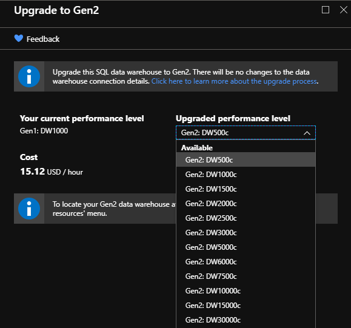
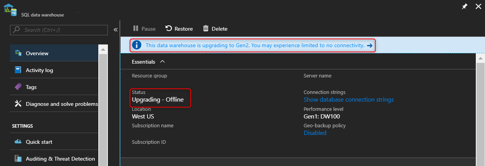
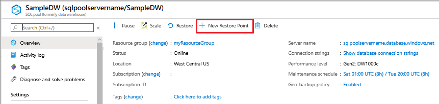
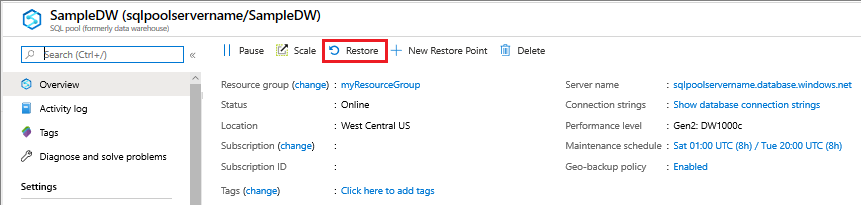
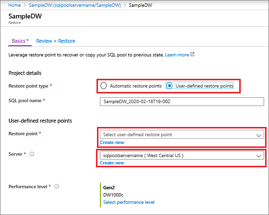

# Optimize performance by upgrading Azure Synapse Analytics SQL pool

Upgrade SQL pool to the latest generation of Azure hardware and storage architecture.

## Why upgrade?

You can now seamlessly upgrade to the SQL pool Compute Optimized Gen2 tier in the Azure portal for [supported regions](gen2-migration-schedule.md#automated-schedule-and-region-availability-table). If your region does not support self-upgrade, you can upgrade to a supported region or wait for self-upgrade to be available in your region. Upgrade now to take advantage of the latest generation of Azure hardware and enhanced storage architecture including faster performance, higher scalability, and unlimited columnar storage.

> [!VIDEO https://www.youtube.com/embed/9B2F0gLoyss]

> [!IMPORTANT]
> This upgrade applies to Compute Optimized Gen1 tier SQL pools in [supported regions](gen2-migration-schedule.md#automated-schedule-and-region-availability-table).

## Before you begin

1. Check if your [region](gen2-migration-schedule.md#automated-schedule-and-region-availability-table) is supported for GEN1 to GEN2 migration. Note the automatic migration dates. To avoid conflicts with the automated process, plan your manual migration prior to the automated process start date.
2. If you are in a region that is not yet supported, continue to check for your region to be added or [upgrade using restore](#upgrade-from-an-azure-geographical-region-using-restore-through-the-azure-portal) to a supported region.
3. If your region is supported, [upgrade through the Azure portal](#upgrade-in-a-supported-region-using-the-azure-portal)
4. **Select the suggested performance level** for SQL pool based on your current performance level on Compute Optimized Gen1 tier by using the mapping below:

   | Compute Optimized Gen1 tier | Compute Optimized Gen2 tier |
   | :-------------------------: | :-------------------------: |
   |            DW100            |           DW100c            |
   |            DW200            |           DW200c            |
   |            DW300            |           DW300c            |
   |            DW400            |           DW400c            |
   |            DW500            |           DW500c            |
   |            DW600            |           DW500c            |
   |           DW1000            |           DW1000c           |
   |           DW1200            |           DW1000c           |
   |           DW1500            |           DW1500c           |
   |           DW2000            |           DW2000c           |
   |           DW3000            |           DW3000c           |
   |           DW6000            |           DW6000c           |

> [!NOTE]
> Suggested performance levels are not a direct conversion. For example, we recommend going from DW600 to DW500c.

## Upgrade in a supported region using the Azure portal

- Migration from Gen1 to Gen2 through the Azure portal is permanent. There is not a process for returning to Gen1.
- SQL pool must be running to migrate to Gen2

### Before you begin

[!INCLUDE [updated-for-az](../../../includes/updated-for-az.md)]

- Sign in to the [Azure portal](https://portal.azure.com/).
- Ensure that SQL pool is running - it must be to migrate to Gen2

### PowerShell upgrade commands

1. If the Compute Optimized Gen1 tier SQL pool to be upgraded is paused, [resume SQL pool](pause-and-resume-compute-portal.md).

2. Be prepared for a few minutes of downtime.

3. Identify any code references to Compute Optimized Gen1 performance levels and modify them to their equivalent Compute Optimized Gen2 performance level. Below are two examples of where you should update code references before upgrading:

   Original Gen1 PowerShell command:

   ```powershell
   Set-AzSqlDatabase -ResourceGroupName "myResourceGroup" -DatabaseName "mySampleDataWarehouse" -ServerName "mynewserver-20171113" -RequestedServiceObjectiveName "DW300"
   ```

   Modified to:

   ```powershell
   Set-AzSqlDatabase -ResourceGroupName "myResourceGroup" -DatabaseName "mySampleDataWarehouse" -ServerName "mynewserver-20171113" -RequestedServiceObjectiveName "DW300c"
   ```

   > [!NOTE]
   > -RequestedServiceObjectiveName "DW300" is changed to - RequestedServiceObjectiveName "DW300**c**"
   >

   Original Gen1 T-SQL command:

   ```SQL
   ALTER DATABASE mySampleDataWarehouse MODIFY (SERVICE_OBJECTIVE = 'DW300') ;
   ```

   Modified to:

   ```sql
   ALTER DATABASE mySampleDataWarehouse MODIFY (SERVICE_OBJECTIVE = 'DW300c') ;
   ```

   > [!NOTE]
   > SERVICE_OBJECTIVE = 'DW300' is changed to SERVICE_OBJECTIVE = 'DW300**c**'

## Start the upgrade

1. Go to your Compute Optimized Gen1 SQL pool in the Azure portal. If the Compute Optimized Gen1 tier SQL pool to be upgraded is paused, [resume SQL pool](pause-and-resume-compute-portal.md).
2. Select **Upgrade to Gen2** card under the Tasks tab:
   

   > [!NOTE]
   > If you do not see the **Upgrade to Gen2** card under the Tasks tab, your subscription type is limited in the current region.
   > [Submit a support ticket](sql-data-warehouse-get-started-create-support-ticket.md) to get your subscription whitelisted.

3. Ensure your workload has completed running and quiesced before upgrading. You'll experience downtime for a few minutes before your SQL pool is back online as a Compute Optimized Gen2 tier SQL pool. **Select Upgrade**:

   

4. **Monitor your upgrade** by checking the status in the Azure portal:

   

   The first step of the upgrade process goes through the scale operation ("Upgrading - Offline") where all sessions will be killed, and connections will be dropped.

   The second step of the upgrade process is data migration ("Upgrading - Online"). Data migration is an online trickle background process. This process slowly moves columnar data from the old storage architecture to the new storage architecture using a local SSD cache. During this time, your SQL pool will be online for querying and loading. Your data will be available to query regardless of whether it has been migrated or not. The data migration happens at varying rates depending on your data size, your performance level, and the number of your columnstore segments.

5. **Optional Recommendation:**
  Once the scaling operation is complete, you can speed up the data migration background process. You can force data movement by running [Alter Index rebuild](sql-data-warehouse-tables-index.md) on all primary columnstore tables you'd be querying at a larger SLO and resource class. This operation is **offline** compared to the trickle background process, which can take hours to complete depending on the number and sizes of your tables. However, once complete, data migration will be much quicker due to the new enhanced storage architecture with high-quality rowgroups.

> [!NOTE]
> Alter Index rebuild is an offline operation and the tables will not be available until the rebuild completes.

The following query generates the required Alter Index Rebuild commands to expedite data migration:

```sql
SELECT 'ALTER INDEX [' + idx.NAME + '] ON ['
       + Schema_name(tbl.schema_id) + '].['
       + Object_name(idx.object_id) + '] REBUILD ' + ( CASE
                                                         WHEN (
                                                     (SELECT Count(*)
                                                      FROM   sys.partitions
                                                             part2
                                                      WHERE  part2.index_id
                                                             = idx.index_id
                                                             AND
                                                     idx.object_id =
                                                     part2.object_id)
                                                     > 1 ) THEN
              ' PARTITION = '
              + Cast(part.partition_number AS NVARCHAR(256))
              ELSE ''
                                                       END ) + '; SELECT ''[' +
              idx.NAME + '] ON [' + Schema_name(tbl.schema_id) + '].[' +
              Object_name(idx.object_id) + '] ' + (
              CASE
                WHEN ( (SELECT Count(*)
                        FROM   sys.partitions
                               part2
                        WHERE
                     part2.index_id =
                     idx.index_id
                     AND idx.object_id
                         = part2.object_id) > 1 ) THEN
              ' PARTITION = '
              + Cast(part.partition_number AS NVARCHAR(256))
              + ' completed'';'
              ELSE ' completed'';'
                                                    END )
FROM   sys.indexes idx
       INNER JOIN sys.tables tbl
               ON idx.object_id = tbl.object_id
       LEFT OUTER JOIN sys.partitions part
                    ON idx.index_id = part.index_id
                       AND idx.object_id = part.object_id
WHERE  idx.type_desc = 'CLUSTERED COLUMNSTORE';
```

## Upgrade from an Azure geographical region using restore through the Azure portal

## Create a user-defined restore point using the Azure portal

1. Sign in to the [Azure portal](https://portal.azure.com/).

2. Navigate to the SQL pool that you want to create a restore point for.

3. At the top of the Overview section, select **+New Restore Point**.

    

4. Specify a name for your restore point.

    

## Restore an active or paused database using the Azure portal

1. Sign in to the [Azure portal](https://portal.azure.com/).
2. Navigate to the SQL pool that you want to restore from.
3. At the top of the Overview section, select **Restore**.

    

4. Select either **Automatic restore points** or **user-defined restore points**. For user-defined restore points, **select a user-defined restore point** or **Create a new user-defined restore point**. For the server, select **Create new** and choose a server in a Gen2 supported geographic region.

    

## Restore from an Azure geographical region using PowerShell

[!INCLUDE [updated-for-az](../../../includes/updated-for-az.md)]

To recover a database, use the [Restore-AzSqlDatabase](/powershell/module/az.sql/restore-azsqldatabase?toc=/azure/synapse-analytics/sql-data-warehouse/toc.json&bc=/azure/synapse-analytics/sql-data-warehouse/breadcrumb/toc.json) cmdlet.

> [!NOTE]
> You can perform a geo-restore to Gen2! To do so, specify an Gen2 ServiceObjectiveName (e.g. DW1000**c**) as an optional parameter.

1. Open Windows PowerShell.
2. Connect to your Azure account and list all the subscriptions associated with your account.
3. Select the subscription that contains the database to be restored.
4. Get the database you want to recover.
5. Create the recovery request for the database, specifying a Gen2 ServiceObjectiveName.
6. Verify the status of the geo-restored database.

```Powershell
Connect-AzAccount
Get-AzSubscription
Select-AzSubscription -SubscriptionName "<Subscription_name>"

# Get the database you want to recover
$GeoBackup = Get-AzSqlDatabaseGeoBackup -ResourceGroupName "<YourResourceGroupName>" -ServerName "<YourServerName>" -DatabaseName "<YourDatabaseName>"

# Recover database
$GeoRestoredDatabase = Restore-AzSqlDatabase –FromGeoBackup -ResourceGroupName "<YourResourceGroupName>" -ServerName "<YourTargetServer>" -TargetDatabaseName "<NewDatabaseName>" –ResourceId $GeoBackup.ResourceID -ServiceObjectiveName "<YourTargetServiceLevel>" -RequestedServiceObjectiveName "DW300c"

# Verify that the geo-restored database is online
$GeoRestoredDatabase.status
```

> [!NOTE]
> To configure your database after the restore has completed, see [Configure your database after recovery](../../azure-sql/database/disaster-recovery-guidance.md?toc=/azure/synapse-analytics/sql-data-warehouse/toc.json&bc=/azure/synapse-analytics/sql-data-warehouse/breadcrumb/toc.json#configure-your-database-after-recovery).

The recovered database will be TDE-enabled if the source database is TDE-enabled.

If you experience any issues with your SQL pool, create a [support request](sql-data-warehouse-get-started-create-support-ticket.md) and reference "Gen2 upgrade" as the possible cause.

## Next steps

Your upgraded SQL pool is online. To take advantage of the enhanced architecture, see [Resource classes for Workload Management](resource-classes-for-workload-management.md).
