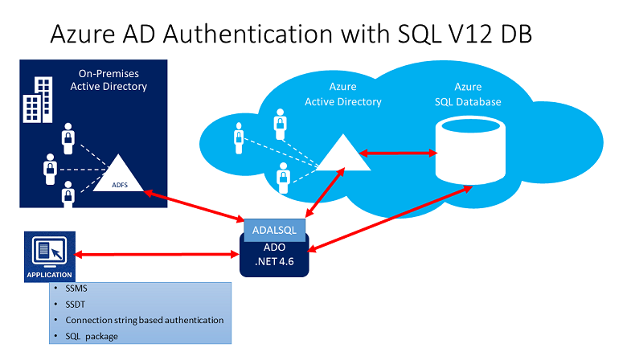
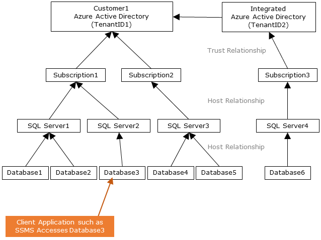
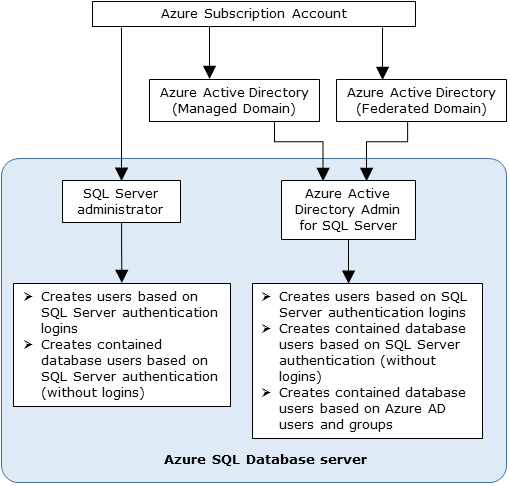
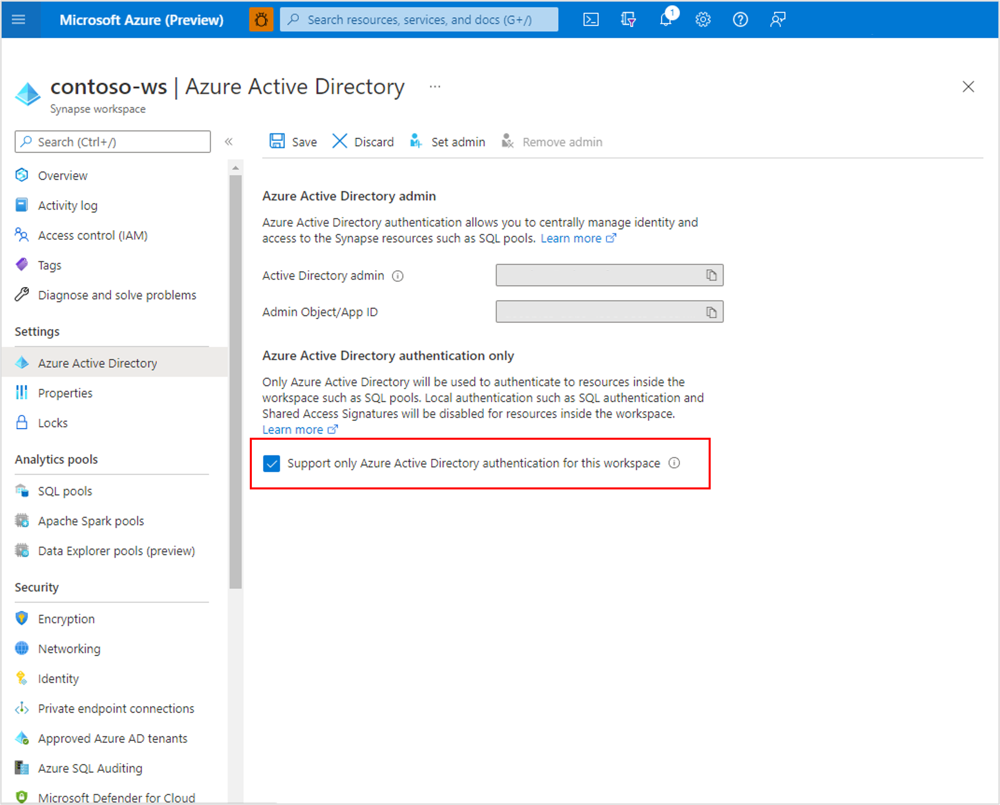

# Use Microsoft Entra authentication for authentication with Synapse SQL

Microsoft Entra authentication is a mechanism that connects to [Azure Synapse Analytics](../overview-faq.yml) by using identities in Microsoft Entra ID.

With Microsoft Entra authentication, you can centrally manage user identities that have access to Azure Synapse to simplify permission management. Benefits include the following:

- It provides an alternative to regular username and password authentication.
- Helps stop the proliferation of user identities across servers.
- Allows password rotation in a single place.
- Customers can manage permissions using external (Microsoft Entra ID) groups.
- It can eliminate storing passwords by enabling integrated Windows authentication and other forms of authentication supported by Microsoft Entra ID.
- Microsoft Entra ID supports token-based authentication for applications connecting to Azure Synapse.
- Microsoft Entra authentication supports ADFS (domain federation) or native user/password authentication for a local Microsoft Entra ID without domain synchronization.
- Microsoft Entra ID supports connections from SQL Server Management Studio that use Active Directory Universal Authentication, which includes multifactor authentication (MFA).  MFA includes strong authentication with a range of easy verification options, including phone call, text message, smart cards with pin, or mobile app notification. For more information, see [SSMS support for Microsoft Entra multifactor authentication with Synapse SQL](mfa-authentication.md).
- Microsoft Entra ID supports similar connections from SQL Server Data Tools (SSDT) that use Active Directory Interactive Authentication. For more information, see
[Microsoft Entra ID support in SQL Server Data Tools (SSDT)](/sql/ssdt/azure-active-directory?view=azure-sqldw-latest&preserve-view=true).

The configuration steps include the following procedures to configure and use Microsoft Entra authentication.

1. Create and populate Microsoft Entra ID.
2. Create a Microsoft Entra identity
3. Assign role to created Microsoft Entra identity in Synapse workspace
4. Connect to Synapse Studio by using Microsoft Entra identities.

## Microsoft Entra pass-through in Azure Synapse Analytics

Azure Synapse Analytics enables you to access the data in the data lake using your Microsoft Entra identity.

Defining access rights on the files and data that is respected in different data engines enables you to simplify your data lake solutions by having a single place where the permissions are defined instead of having to define them in multiple places.

## Trust architecture

The following high-level diagram summarizes the solution architecture of using Microsoft Entra authentication with Synapse SQL. To support Microsoft Entra native user password, only the Cloud portion and Azure AD/Synapse Synapse SQL is considered. To support Federated authentication (or user/password for Windows credentials), the communication with ADFS block is required. The arrows indicate communication pathways.

The following diagram indicates the federation, trust, and hosting relationships that allow a client to connect to a database by submitting a token. The token is authenticated by a Microsoft Entra ID, and is trusted by the database. 

Customer 1 can represent a Microsoft Entra ID with native users or a Microsoft Entra ID with federated users. Customer 2 represents a possible solution including imported users; in this example coming from a federated Microsoft Entra ID with ADFS being synchronized with Microsoft Entra ID. 

It's important to understand that access to a database using Microsoft Entra authentication requires that the hosting subscription is associated to the Microsoft Entra ID. The same subscription must be used to create the SQL Server hosting the Azure SQL Database or dedicated SQL pool.

## Administrator structure

When using Microsoft Entra authentication, there are two Administrator accounts for the Synapse SQL; the original SQL administrator (using SQL authentication) and the Microsoft Entra administrator. Only the administrator based on a Microsoft Entra account can create the first Microsoft Entra ID contained database user in a user database. 

The Microsoft Entra administrator login can be a Microsoft Entra user or a Microsoft Entra group. When the administrator is a group account, it can be used by any group member, enabling multiple Microsoft Entra administrators for the Synapse SQL instance. 

Using group account as an administrator enhances manageability by allowing you to centrally add and remove group members in Microsoft Entra ID without changing the users or permissions in Azure Synapse Analytics workspace. Only one Microsoft Entra administrator (a user or group) can be configured at any time.

## Permissions

To create new users, you must have the `ALTER ANY USER` permission in the database. The `ALTER ANY USER` permission can be granted to any database user. The `ALTER ANY USER` permission is also held by the SQL administrator and Microsoft Entra administrator accounts, and database users with the `CONTROL ON DATABASE` or `ALTER ON DATABASE` permission for that database, and by members of the `db_owner` database role.

To create a contained database user in Synapse SQL, you must connect to the database or instance using a Microsoft Entra identity. To create the first contained database user, you must connect to the database by using a Microsoft Entra administrator (who is the owner of the database). 

Any Microsoft Entra authentication is only possible if the Microsoft Entra admin was created for Synapse SQL. If the Microsoft Entra admin was removed from the server, existing Microsoft Entra users created previously inside Synapse SQL can no longer connect to the database using their Microsoft Entra credentials.

## Disable local authentication

By allowing only Microsoft Entra authentication, centrally manage access to Azure Synapse resources, such as SQL pools. To disable local authentication in Synapse during workspace creation, select **Use only Microsoft Entra authentication** as the authentication method. A SQL Administrator login will still be created but it will be disabled. Local authentication can be enabled later by an Azure Owner or Contributor of the Synapse workspace. 

You can also disable local authentication after a workspace is created through the Azure portal. Local authentication cannot be disabled until a Microsoft Entra admin is created for the Azure Synapse workspace. 

 

## Microsoft Entra features and limitations

- The following members of Microsoft Entra ID can be provisioned in Synapse SQL:

  - Native members: A member created in Microsoft Entra ID in the managed domain or in a customer domain. For more information, see [Add your own domain name to Microsoft Entra ID](../../active-directory/fundamentals/add-custom-domain.md).
  - Federated domain members: A member created in Microsoft Entra ID with a federated domain. For more information, see [Deploying Active Directory Federation Services in Azure](/windows-server/identity/ad-fs/deployment/how-to-connect-fed-azure-adfs).
  - Imported members from other Azure ADs who are native or federated domain members.
  - Active Directory groups created as security groups.

- Microsoft Entra users that are part of a group that has `db_owner` server role can't use the **[CREATE DATABASE SCOPED CREDENTIAL](/sql/t-sql/statements/create-database-scoped-credential-transact-sql?view=azure-sqldw-latest&preserve-view=true)** syntax in Synapse SQL. You will see the following error:

    `SQL Error [2760] [S0001]: The specified schema name 'user@mydomain.com' either does not exist or you do not have permission to use it.`

    Grant the `db_owner` role directly to the individual Microsoft Entra user to mitigate the **CREATE DATABASE SCOPED CREDENTIAL** issue.

- These system functions return NULL values when executed under Microsoft Entra principals:

  - `SUSER_ID()`
  - `SUSER_NAME(<admin ID>)`
  - `SUSER_SNAME(<admin SID>)`
  - `SUSER_ID(<admin name>)`
  - `SUSER_SID(<admin name>)`

## Connect using Microsoft Entra identities

Microsoft Entra authentication supports the following methods of connecting to a database using Microsoft Entra identities:

- Microsoft Entra Password
- Microsoft Entra integrated
- Microsoft Entra Universal with MFA
- Using Application token authentication

The following authentication methods are supported for Microsoft Entra server principals (logins):

- Microsoft Entra Password
- Microsoft Entra integrated
- Microsoft Entra Universal with MFA

### Additional considerations

- To enhance manageability, we recommend you provision a dedicated Microsoft Entra group as an administrator.
- Only one Microsoft Entra administrator (a user or group) can be configured for Synapse SQL pools at any time.
  - The addition of Microsoft Entra server principals (logins) for Synapse SQL allows the possibility of creating multiple Microsoft Entra server principals (logins) that can be added to the `sysadmin` role.
- Only a Microsoft Entra administrator for Synapse SQL can initially connect to Synapse SQL using a Microsoft Entra account. The Active Directory administrator can configure subsequent Microsoft Entra database users.
- We recommend setting the connection timeout to 30 seconds.
- SQL Server 2016 Management Studio and SQL Server Data Tools for Visual Studio 2015 (version 14.0.60311.1April 2016 or later) support Microsoft Entra authentication. (Microsoft Entra authentication is supported by the **.NET Framework Data Provider for SqlServer**; at least version .NET Framework 4.6). So, the newest versions of these tools and data-tier applications (DAC and .BACPAC) can use Microsoft Entra authentication.
- Beginning with version 15.0.1, [sqlcmd utility](/sql/tools/sqlcmd-utility?view=azure-sqldw-latest&preserve-view=true) and [bcp utility](/sql/tools/bcp-utility?view=azure-sqldw-latest&preserve-view=true) support Active Directory Interactive authentication with MFA.
- SQL Server Data Tools for Visual Studio 2015 requires at least the April 2016 version of the Data Tools (version 14.0.60311.1). Currently, Microsoft Entra users aren't shown in SSDT Object Explorer. As a workaround, view the users in [sys.database_principals](/sql/relational-databases/system-catalog-views/sys-database-principals-transact-sql?view=azure-sqldw-latest&preserve-view=true).
- [Microsoft JDBC Driver 6.0 for SQL Server](https://www.microsoft.com/download/details.aspx?id=11774) supports Microsoft Entra authentication. Also, see [Setting the Connection Properties](/sql/connect/jdbc/setting-the-connection-properties?view=azure-sqldw-latest&preserve-view=true).
- The Microsoft Entra admin account controls access to dedicated pools, while Synapse RBAC roles are used to control access to serverless pools, for example, with the **Synapse Administrator** and **Synapse SQL Administrator** role. Configure Synapse RBAC roles via Synapse Studio, for more information, see [How to manage Synapse RBAC role assignments in Synapse Studio](../security/how-to-manage-synapse-rbac-role-assignments.md).
- If a user is configured as a Microsoft Entra administrator and Synapse Administrator, and then removed from the Microsoft Entra administrator role, then the user will lose access to the dedicated SQL pools in Synapse. They must be removed and then added to the Synapse Administrator role to regain access to dedicated SQL pools.

## Next steps

- For an overview of access and control in Synapse SQL, see [Synapse SQL access control](../security/synapse-workspace-access-control-overview.md).
- For more information about database principals, see [Principals](/sql/relational-databases/security/authentication-access/principals-database-engine?view=azure-sqldw-latest&preserve-view=true).
- For more information about database roles, see [Database roles](/sql/relational-databases/security/authentication-access/database-level-roles?view=azure-sqldw-latest&preserve-view=true).
