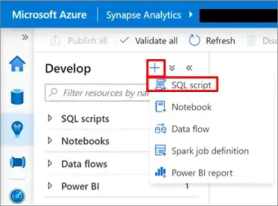
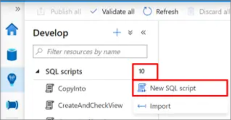
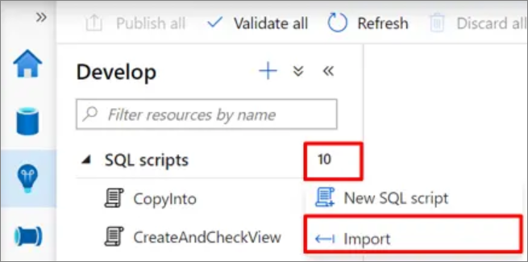
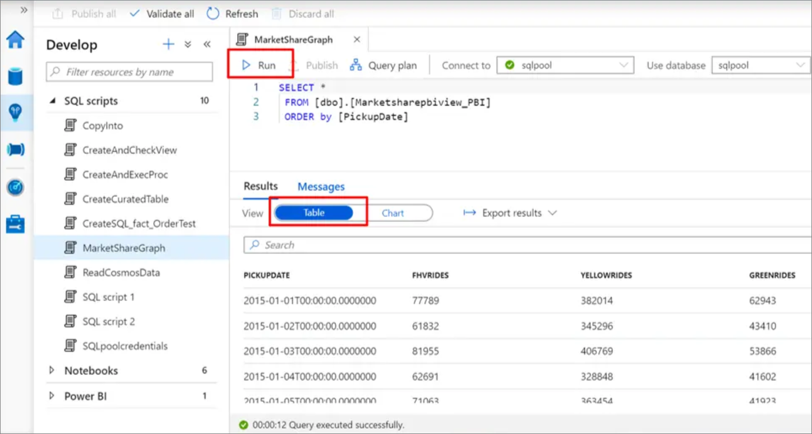
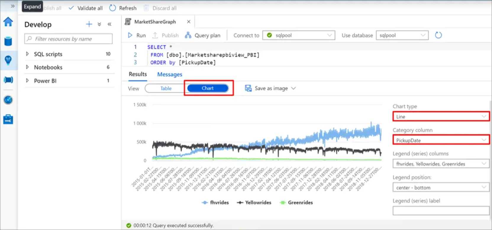
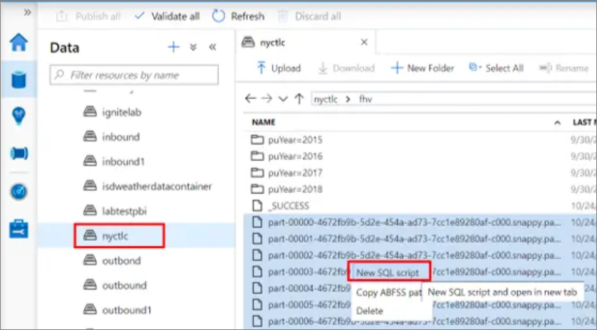
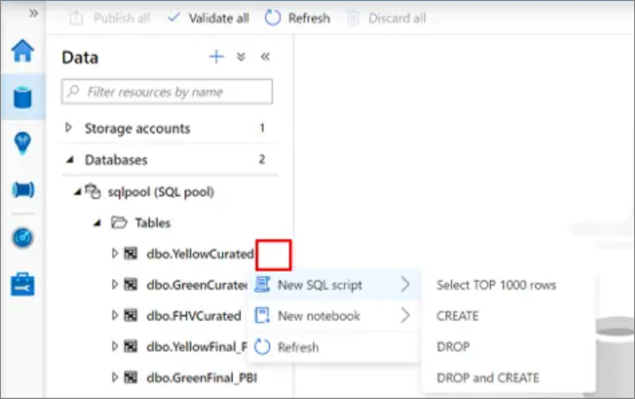

# Using SQL script in Azure Synapse Studio (preview)

Azure Synapse Studio (preview) provides a SQL script web interface for you to author SQL queries. You can connect to SQL pool (preview) or SQL on-demand (preview). 

## Begin authoring in SQL script 

There are several ways to start the authoring experience in SQL script. You can create a new SQL script through one of the following methods.

1. Select the "+" icon and choose SQL script.

    > [!div class="mx-imgBorder"] 
    >

2. From the Actions menu under Develop SQL scripts Choose "New SQL script" from the "Actions" menu under Develop SQL scripts. 

    > [!div class="mx-imgBorder"] 
    > 

or 

3. Choose "Import" from the "Actions" menu under Develop SQL scripts and select an existing SQL script from your local storage.

    > [!div class="mx-imgBorder"] 
    > 

## Create your SQL script

1. Choose a name for your SQL script by selecting the "Property" button and replacing the default name assigned to the SQL script.

    > [!div class="mx-imgBorder"] 
    > 

1. Choose the specific SQL pool or the SQL on-demand from the "Connect to" drop-down menu. Or if necessary, choose the database from "Use database".

    > [!div class="mx-imgBorder"] 
    > 

1. Start authoring your SQL script using the intellisense feature.

    > [!div class="mx-imgBorder"] 
    > 

## Run your SQL script

Select the "Run" button to execute your SQL script. The results are displayed by default in a table.

> [!div class="mx-imgBorder"] 
> 

## Export your results

You can export the results to your local storage in different formats (including CSV, Excel, JSON, XML) by selecting "Export results" and choosing the extension.

You can also visualize the SQL script results in a chart by selecting the "Chart" button. Select the "Chart type" and "Category column". You can export the chart into a picture by selecting "Save as image". 

> [!div class="mx-imgBorder"] 
> 

## Explore data from a Parquet file.

You can explore Parquet files in a storage account using SQL script to preview the file contents. 

> [!div class="mx-imgBorder"] 
> 

## SQL Tables, external tables, views

By selecting the "Actions" menu under data, you can select several actions like: "New SQL script", "Select TOP 1000 rows", "CREATE", "DROP and CREATE". Explore the available gesture by right-clicking the nodes of SQL pool and SQL on-demand.

> [!div class="mx-imgBorder"] 
> 

## Next steps

For more information about authoring a SQL script, see
[Azure Synapse Analytics](https://docs.microsoft.com/azure/synapse-analytics).