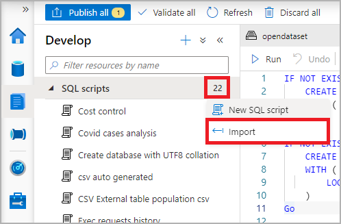
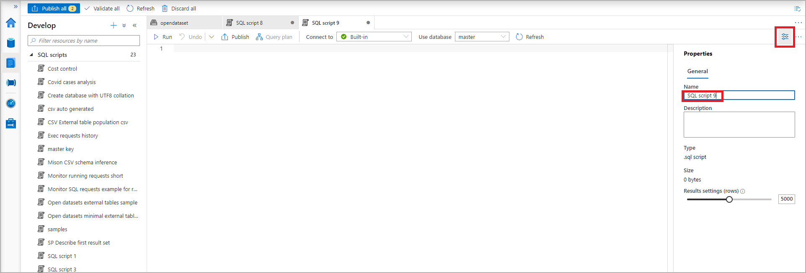
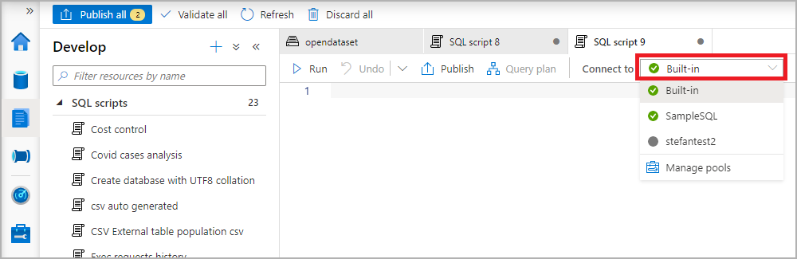
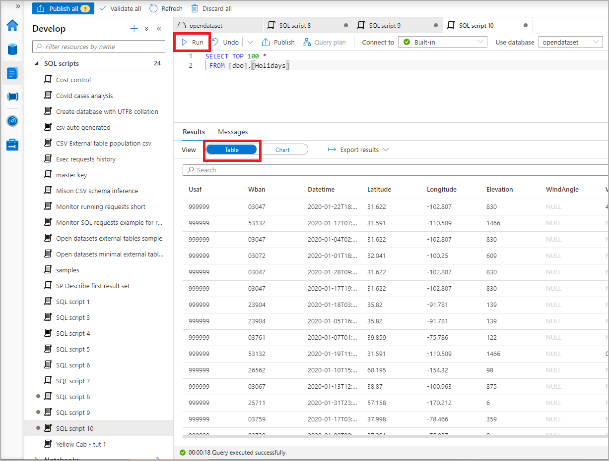
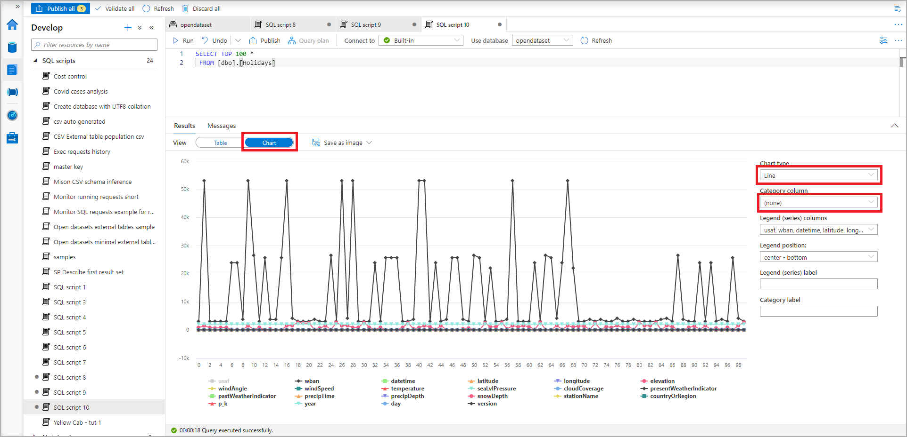
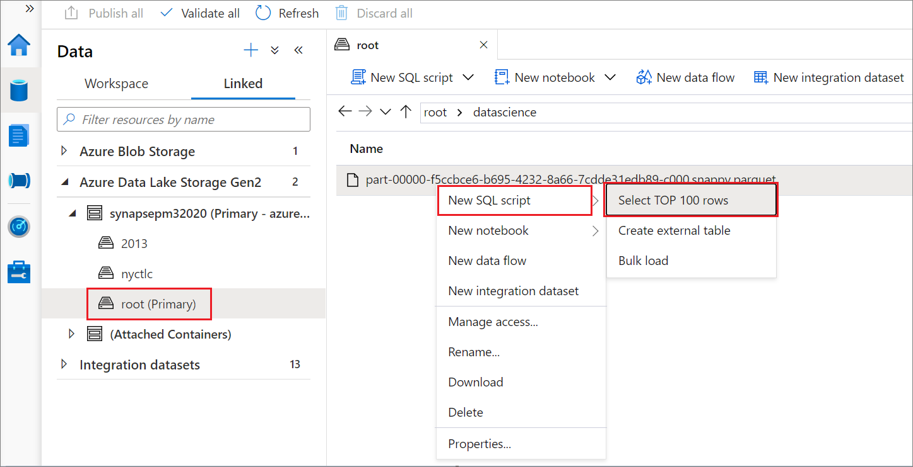
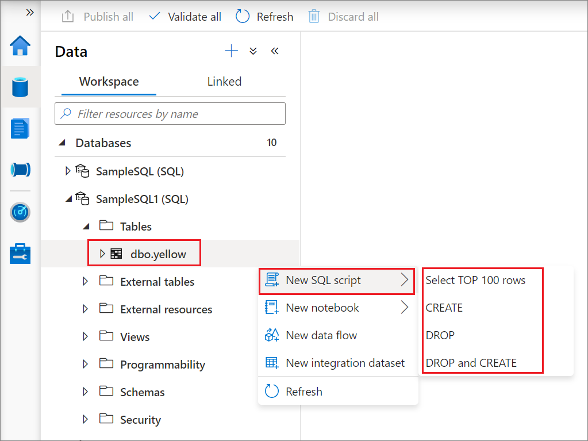
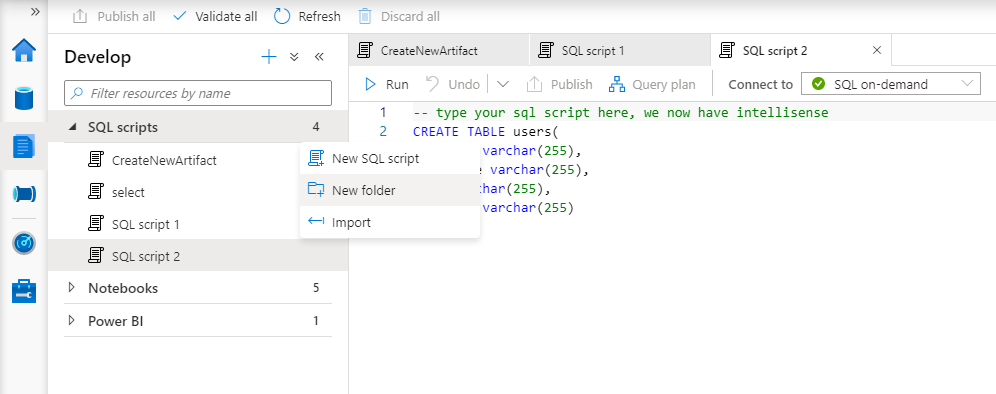
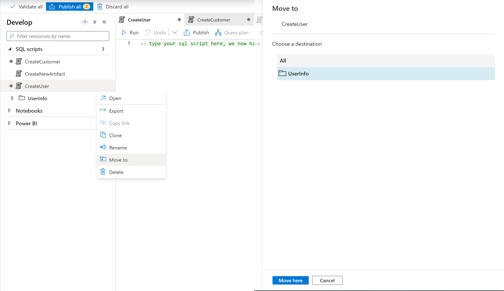

# Synapse Studio SQL scripts in Azure Synapse Analytics 

Synapse Studio provides a SQL script web interface for you to author SQL queries. 

## Begin authoring in SQL script 

There are several ways to start the authoring experience in SQL script. You can create a new SQL script through one of the following methods.

1. From the Develop menu, select the **"+"** icon and choose **SQL script**.

2. From the **Actions** menu, choose **New SQL script**.

3. Choose **Import** from the **Actions** menu under Develop SQL scripts. Select an existing SQL script from your local storage.

## Create your SQL script

1. Choose a name for your SQL script by selecting the **Property** button and replacing the default name assigned to the SQL script. 

2. Choose the specific dedicated SQL pool or serverless SQL pool from the **Connect to** drop-down menu. Or if necessary, choose the database from **Use database**. 

3. Start authoring your SQL script using the intellisense feature.

## Run your SQL script

Select the **Run** button to execute your SQL script. The results are displayed by default in a table.

Synapse Studio creates a new session for each SQL script execution. Once a SQL script execution completes, the session is automatically closed.

Temporary tables are only visible to the session in which they were created and are automatically dropped when the session closes.

## Export your results

You can export the results to your local storage in different formats (including CSV, Excel, JSON, XML) by selecting "Export results" and choosing the extension.

You can also visualize the SQL script results in a chart by selecting the **Chart** button. Select the "Chart type" and **Category column**. You can export the chart into a picture by selecting **Save as image**. 

## Explore data from a Parquet file

You can explore Parquet files in a storage account using SQL script to preview the file contents.

## SQL Tables, external tables, views

By selecting the **Actions** menu under data, you can select several actions such as:

- New SQL script
- Select TOP 1000 rows
- CREATE
- DROP and CREATE 
 
Explore the available gesture by right-clicking the nodes of SQL databases.
 

## Create folders and move SQL scripts into a folder

From the Actions menu under Develop SQL scripts Choose "New folder" from the "Actions" menu under Develop SQL scripts. And type in the name of the new folder in the pop-up window. 

> [!div class="mx-imgBorder"] 
> 

To move a SQL script into a folder, you can select the sql script and choose "Move To" from the Actions menu. Then find the destination folder in the new window and move the sql script into selected folder.You can also quickly drag the sql script and drop it into a folder.  

> [!div class="mx-imgBorder"] 
> 

## Next steps

For more information about authoring a SQL script, see
[Azure Synapse Analytics](../index.yml).