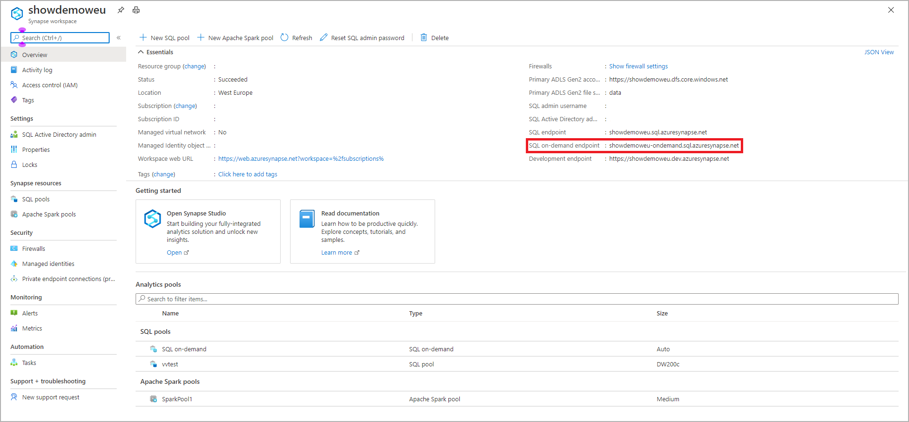

# Connect to Synapse SQL
Get connected to the Synapse SQL capability in Azure Synapse Analytics.

## Supported tools for serverless SQL pool

[Azure Data Studio](/sql/azure-data-studio/download-azure-data-studio) is fully supported starting from version 1.18.0. SSMS is partially supported starting from version 18.5, you can use it to connect and query only.

> [!NOTE]
> If an AAD login has a connection open for more than 1 hour at time of query execution, any query that relies on AAD will fail. This includes querying storage using AAD pass-through and statements that interact with AAD (like CREATE EXTERNAL PROVIDER). This affects every tool that keeps connections open, like in query editor in SSMS and ADS. Tools that open new connections to execute a query, like Synapse Studio, are not affected.

> You can restart SSMS or connect and disconnect in ADS to mitigate this issue. 

## Find your server name

The server name for the dedicated SQL pool in the following example is: showdemoweu.sql.azuresynapse.net.
The server name for the serverless SQL pool in the following example is: showdemoweu-ondemand.sql.azuresynapse.net.

To find the fully qualified server name:

1. Go to the [Azure portal](https://portal.azure.com).
2. Select on **Synapse workspaces**.
3. Select on the workspace you want to connect to.
4. Go to overview.
5. Locate the full server name.

## **SQL pool**


## **serverless SQL pool**



## Supported drivers and connection strings
Synapse SQL supports [ADO.NET](/dotnet/framework/data/adonet/), [ODBC](/sql/connect/odbc/windows/microsoft-odbc-driver-for-sql-server-on-windows), [PHP](/sql/connect/php/overview-of-the-php-sql-driver?f=255&MSPPError=-2147217396), and [JDBC](/sql/connect/jdbc/microsoft-jdbc-driver-for-sql-server). To find the latest version and documentation, select one of the preceding drivers. To automatically generate the connection string for the driver that you're using from the Azure portal, select **Show database connection strings** from the preceding example. Following are also some examples of what a connection string looks like for each driver.

> [!NOTE]
> Consider setting the connection timeout to 300 seconds to allow your connection to survive short periods of unavailability.

### ADO.NET connection string example

```csharp
Server=tcp:{your_server}.sql.azuresynapse.net,1433;Database={your_database};User ID={your_user_name};Password={your_password_here};Encrypt=True;TrustServerCertificate=False;Connection Timeout=30;
```

### ODBC connection string example

```csharp
Driver={SQL Server Native Client 11.0};Server=tcp:{your_server}.sql.azuresynapse.net,1433;Database={your_database};Uid={your_user_name};Pwd={your_password_here};Encrypt=yes;TrustServerCertificate=no;Connection Timeout=30;
```

### PHP connection string example

```PHP
Server: {your_server}.sql.azuresynapse.net,1433 \r\nSQL Database: {your_database}\r\nUser Name: {your_user_name}\r\n\r\nPHP Data Objects(PDO) Sample Code:\r\n\r\ntry {\r\n   $conn = new PDO ( \"sqlsrv:server = tcp:{your_server}.sql.azuresynapse.net,1433; Database = {your_database}\", \"{your_user_name}\", \"{your_password_here}\");\r\n    $conn->setAttribute( PDO::ATTR_ERRMODE, PDO::ERRMODE_EXCEPTION );\r\n}\r\ncatch ( PDOException $e ) {\r\n   print( \"Error connecting to SQL Server.\" );\r\n   die(print_r($e));\r\n}\r\n\rSQL Server Extension Sample Code:\r\n\r\n$connectionInfo = array(\"UID\" => \"{your_user_name}\", \"pwd\" => \"{your_password_here}\", \"Database\" => \"{your_database}\", \"LoginTimeout\" => 30, \"Encrypt\" => 1, \"TrustServerCertificate\" => 0);\r\n$serverName = \"tcp:{your_server}.sql.azuresynapse.net,1433\";\r\n$conn = sqlsrv_connect($serverName, $connectionInfo);
```

### JDBC connection string example

```Java
jdbc:sqlserver://yourserver.sql.azuresynapse.net:1433;database=yourdatabase;user={your_user_name};password={your_password_here};encrypt=true;trustServerCertificate=false;hostNameInCertificate=*.sql.azuresynapse.net;loginTimeout=30;
```

## Connection settings
Synapse SQL standardizes some settings during connection and object creation. These settings can't be overridden and include:

| Database Setting | Value |
|:--- |:--- |
| [ANSI_NULLS](/sql/t-sql/statements/set-ansi-nulls-transact-sql?view=azure-sqldw-latest&preserve-view=true) |ON |
| [QUOTED_IDENTIFIERS](/sql/t-sql/statements/set-quoted-identifier-transact-sql?view=azure-sqldw-latest&preserve-view=true) |ON |
| [DATEFORMAT](/sql/t-sql/statements/set-dateformat-transact-sql?view=azure-sqldw-latest&preserve-view=true) |mdy |
| [DATEFIRST](/sql/t-sql/statements/set-datefirst-transact-sql?view=azure-sqldw-latest&preserve-view=true) |7 |

## Recommendations

For executing **serverless SQL pool** queries, recommended tools are [Azure Data Studio](get-started-azure-data-studio.md) and Azure Synapse Studio.

## Next steps
To connect and query with Visual Studio, see [Query with Visual Studio](../sql-data-warehouse/sql-data-warehouse-query-visual-studio.md?toc=/azure/synapse-analytics/toc.json&bc=/azure/synapse-analytics/breadcrumb/toc.json). To learn more about authentication options, see [Authentication to Synapse SQL](../sql-data-warehouse/sql-data-warehouse-authentication.md?toc=/azure/synapse-analytics/toc.json&bc=/azure/synapse-analytics/breadcrumb/toc.json).