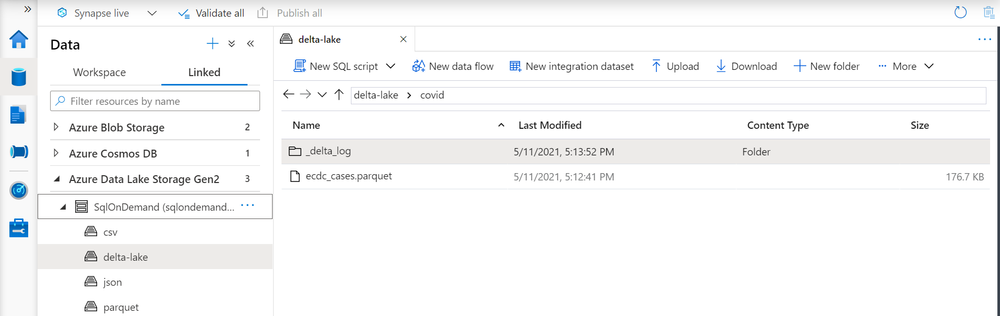
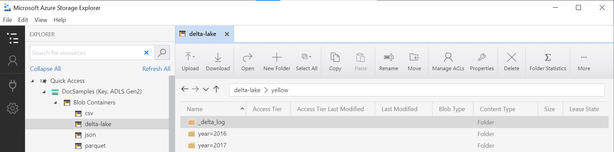

# Create and use views using serverless SQL pool in Azure Synapse Analytics

In this section, you'll learn how to create and use views to wrap serverless SQL pool queries. Views will allow you to reuse those queries. Views are also needed if you want to use tools, such as Power BI, in conjunction with serverless SQL pool.

## Prerequisites

Your first step is to create a database where the view will be created and initialize the objects needed to authenticate on Azure storage by executing [setup script](https://github.com/Azure-Samples/Synapse/blob/master/SQL/Samples/LdwSample/SampleDB.sql) on that database. All queries in this article will be executed on your sample database.

## Views over external data

You can create views the same way you create regular SQL Server views. The following query creates view that reads *population.csv* file.

> [!NOTE]
> Change the first line in the query, i.e., [mydbname], so you're using the database you created.

```sql
USE [mydbname];
GO

DROP VIEW IF EXISTS populationView;
GO

CREATE VIEW populationView AS
SELECT * 
FROM OPENROWSET(
        BULK 'csv/population/population.csv',
        DATA_SOURCE = 'SqlOnDemandDemo',
        FORMAT = 'CSV', 
        FIELDTERMINATOR =',', 
        ROWTERMINATOR = '\n'
    )
WITH (
    [country_code] VARCHAR (5) COLLATE Latin1_General_BIN2,
    [country_name] VARCHAR (100) COLLATE Latin1_General_BIN2,
    [year] smallint,
    [population] bigint
) AS [r];
```

The view uses an `EXTERNAL DATA SOURCE` with a root URL of your storage, as a `DATA_SOURCE` and adds a relative file path to the files.

### Delta Lake views

If you are creating the views on top of Delta Lake folder, you need to specify the location to the root folder after the `BULK` option instead of specifying the file path.

> [!div class="mx-imgBorder"]
>

The `OPENROWSET` function that reads data from the Delta Lake folder will examine the folder structure and automatically identify the file locations.

```sql
create or alter view CovidDeltaLake
as
select *
from openrowset(
           bulk 'covid',
           data_source = 'DeltaLakeStorage',
           format = 'delta'
    ) with (
           date_rep date,
           cases int,
           geo_id varchar(6)
           ) as rows
```

For more information, review [Synapse serverless SQL pool self-help page](resources-self-help-sql-on-demand.md#delta-lake) and [Azure Synapse Analytics known issues](../known-issues.md).

## Partitioned views

If you have a set of files that is partitioned in the hierarchical folder structure, you can describe the partition pattern using the wildcards in the file path. Use the  `FILEPATH` function to expose parts of the folder path as partitioning columns.

```sql
CREATE VIEW TaxiView
AS SELECT *, nyc.filepath(1) AS [year], nyc.filepath(2) AS [month]
FROM
    OPENROWSET(
        BULK 'parquet/taxi/year=*/month=*/*.parquet',
        DATA_SOURCE = 'sqlondemanddemo',
        FORMAT='PARQUET'
    ) AS nyc
```

Partitioned views can improve the performance of your queries by performing partition elimination when you query them with filters on the partitioning columns. However, not all queries support partition elimination, so it's important to follow some best practices.

To ensure partition elimination, avoid using subqueries in filters, since they can interfere with the ability to eliminate partitions. Instead, pass the result of the subquery as a variable to the filter.

When using JOINs in SQL queries, declare the filter predicate as NVARCHAR to reduce the complexity of the query plan and increase the probability of correct partition elimination. Partition columns are typically inferred as NVARCHAR(1024), so using the same type for the predicate avoids the need for an implicit cast, which can increase query plan complexity.

### Delta Lake partitioned views

If you are creating the partitioned views on top of Delta Lake storage, you can specify just a root Delta Lake folder and don't need to explicitly expose the partitioning columns using the `FILEPATH` function:

```sql
CREATE OR ALTER VIEW YellowTaxiView
AS SELECT *
FROM  
    OPENROWSET(
        BULK 'yellow',
        DATA_SOURCE = 'DeltaLakeStorage',
        FORMAT='DELTA'
    ) nyc
```

The `OPENROWSET` function will examine the structure of the underlying Delta Lake folder and automatically identify and expose the partitioning columns. The partition elimination will be done automatically if you put the partitioning column in the `WHERE` clause of a query.

The folder name in the `OPENROWSET` function (`yellow` in this example) that is concatenated with the `LOCATION` URI defined in `DeltaLakeStorage` data source must reference the root Delta Lake folder that contains a subfolder called `_delta_log`.

> [!div class="mx-imgBorder"]
>

For more information, review [Synapse serverless SQL pool self-help page](resources-self-help-sql-on-demand.md#delta-lake) and [Azure Synapse Analytics known issues](../known-issues.md).

## JSON views

The views are the good choice if you need to do some additional processing on top of the result set that is fetched from the files. One example might be parsing JSON files where we need to apply the JSON functions to extract the values from the JSON documents:

```sql
CREATE OR ALTER VIEW CovidCases
AS 
select
    *
from openrowset(
        bulk 'latest/ecdc_cases.jsonl',
        data_source = 'covid',
        format = 'csv',
        fieldterminator ='0x0b',
        fieldquote = '0x0b'
    ) with (doc nvarchar(max)) as rows
    cross apply openjson (doc)
        with (  date_rep datetime2,
                cases int,
                fatal int '$.deaths',
                country varchar(100) '$.countries_and_territories')
```

The `OPENJSON` function parses each line from the JSONL file containing one JSON document per line in textual format.

## <a id="cosmosdb-view"></a> Azure Cosmos DB views on containers

The views can be created on top of the Azure Cosmos DB containers if the Azure Cosmos DB analytical storage is enabled on the container. The Azure Cosmos DB account name, database name, and container name should be added as a part of the view, and the read-only access key should be placed in the database scoped credential that the view references.

```sql
CREATE DATABASE SCOPED CREDENTIAL MyCosmosDbAccountCredential
WITH IDENTITY = 'SHARED ACCESS SIGNATURE', SECRET = 's5zarR2pT0JWH9k8roipnWxUYBegOuFGjJpSjGlR36y86cW0GQ6RaaG8kGjsRAQoWMw1QKTkkX8HQtFpJjC8Hg==';
GO
CREATE OR ALTER VIEW Ecdc
AS SELECT *
FROM OPENROWSET(
      PROVIDER = 'CosmosDB',
      CONNECTION = 'Account=synapselink-cosmosdb-sqlsample;Database=covid',
      OBJECT = 'Ecdc',
      CREDENTIAL = 'MyCosmosDbAccountCredential'
    ) with ( date_rep varchar(20), cases bigint, geo_id varchar(6) ) as rows
```

For more information, see [Query Azure Cosmos DB data with a serverless SQL pool in Azure Synapse Link](query-cosmos-db-analytical-store.md).

## Use a view

You can use views in your queries the same way you use views in SQL Server queries.

The following query demonstrates using the *population_csv* view we created in [Create a view](#views-over-external-data). It returns country/region names with their population in 2019 in descending order.

> [!NOTE]
> Change the first line in the query, i.e., [mydbname], so you're using the database you created.

```sql
USE [mydbname];
GO

SELECT
    country_name, population
FROM populationView
WHERE
    [year] = 2019
ORDER BY
    [population] DESC;
```

When you query the view, you may encounter errors or unexpected results. This probably means that the view references columns or objects that were modified or no longer exist. You need to manually adjust the view definition to align with the underlying schema changes.

## Next steps

For information on how to query different file types, refer to the [Query single CSV file](query-single-csv-file.md), [Query Parquet files](query-parquet-files.md), and [Query JSON files](query-json-files.md) articles.

- [What's new in Azure Synapse Analytics?](../whats-new.md). 
- [Best practices for serverless SQL pool in Azure Synapse Analytics](best-practices-serverless-sql-pool.md)
- [Troubleshoot serverless SQL pool in Azure Synapse Analytics](resources-self-help-sql-on-demand.md)
- [Troubleshoot a slow query on a dedicated SQL Pool](/troubleshoot/azure/synapse-analytics/dedicated-sql/troubleshoot-dsql-perf-slow-query)
- [Synapse Studio troubleshooting](../troubleshoot/troubleshoot-synapse-studio.md)
