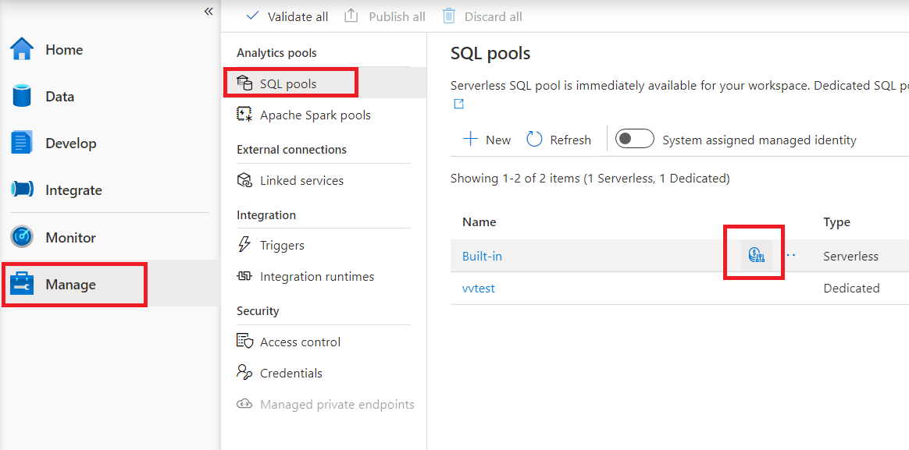
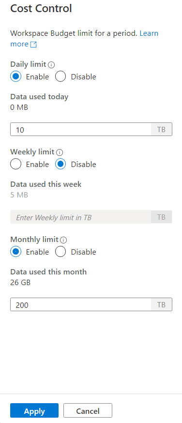

# Cost management for serverless SQL pool in Azure Synapse Analytics

This article explains how you can estimate and manage costs for serverless SQL pool in Azure Synapse Analytics:
- Estimate amount of data processed before issuing a query
- Use cost control feature to set the budget

Understand that the costs for serverless SQL pool in Azure Synapse Analytics are only a portion of the monthly costs in your Azure bill. If you are using other Azure services, you’re billed for all the Azure services and resources used in your Azure subscription, including the third-party services. This article explains how to plan for and manage costs for serverless SQL pool in Azure Synapse Analytics.

## Data processed

*Data processed* is the amount of data that the system temporarily stores while a query is run. Data processed consists of the following quantities:

- Amount of data read from storage. This amount includes:
  - Data read while reading data.
  - Data read while reading metadata (for file formats that contain metadata, like Parquet).
- Amount of data in intermediate results. This data is transferred among nodes while the query runs. It includes the data transfer to your endpoint, in an uncompressed format. 
- Amount of data written to storage. If you use CETAS to export your result set to storage, then the amount of data written out is added to the amount of data processed for the SELECT part of CETAS.

Reading files from storage is highly optimized. The process uses:

- Prefetching, which might add some overhead to the amount of data read. If a query reads a whole file, then there's no overhead. If a file is read partially, like in TOP N queries, then a bit more data is read by using prefetching.
- An optimized comma-separated value (CSV) parser. If you use PARSER_VERSION='2.0' to read CSV files, then the amounts of data read from storage slightly increase. An optimized CSV parser reads files in parallel, in chunks of equal size. Chunks don't necessarily contain whole rows. To ensure all rows are parsed, the optimized CSV parser also reads small fragments of adjacent chunks. This process adds a small amount of overhead.

## Statistics

The serverless SQL pool query optimizer relies on statistics to generate optimal query execution plans. You can create statistics manually. Otherwise, serverless SQL pool creates them automatically. Either way, statistics are created by running a separate query that returns a specific column at a provided sample rate. This query has an associated amount of data processed.

If you run the same or any other query that would benefit from created statistics, then statistics are reused if possible. There's no additional data processed for statistics creation.

When statistics are created for a Parquet column, only the relevant column is read from files. When statistics are created for a CSV column, whole files are read and parsed.

## Rounding

The amount of data processed is rounded up to the nearest MB per query. Each query has a minimum of 10 MB of data processed.

## What data processed doesn't include

- Server-level metadata (like logins, roles, and server-level credentials).
- Databases you create in your endpoint. Those databases contain only metadata (like users, roles, schemas, views, inline table-valued functions [TVFs], stored procedures, database-scoped credentials, external data sources, external file formats, and external tables).
  - If you use schema inference, then file fragments are read to infer column names and data types, and the amount of data read is added to the amount of data processed.
- Data definition language (DDL) statements, except for the CREATE STATISTICS statement because it processes data from storage based on the specified sample percentage.
- Metadata-only queries.

## Reducing the amount of data processed

You can optimize your per-query amount of data processed and improve performance by partitioning and converting your data to a compressed column-based format like Parquet.

## Examples

Imagine three tables.

- The population_csv table is backed by 5 TB of CSV files. The files are organized in five equally sized columns.
- The population_parquet table has the same data as the population_csv table. It's backed by 1 TB of Parquet files. This table is smaller than the previous one because data is compressed in Parquet format.
- The very_small_csv table is backed by 100 KB of CSV files.

**Query 1**: SELECT SUM(population) FROM population_csv

This query reads and parses whole files to get values for the population column. Nodes process fragments of this table, and the population sum for each fragment is transferred among nodes. The final sum is transferred to your endpoint. 

This query processes 5 TB of data plus a small amount overhead for transferring sums of fragments.

**Query 2**: SELECT SUM(population) FROM population_parquet

When you query compressed and column-based formats like Parquet, less data is read than in query 1. You see this result because serverless SQL pool reads a single compressed column instead of the whole file. In this case, 0.2 TB is read. (Five equally sized columns are 0.2 TB each.) Nodes process fragments of this table, and the population sum for each fragment is transferred among nodes. The final sum is transferred to your endpoint. 

This query processes 0.2 TB plus a small amount of overhead for transferring sums of fragments.

**Query 3**: SELECT * FROM population_parquet

This query reads all columns and transfers all data in an uncompressed format. If the compression format is 5:1, then the query processes 6 TB because it reads 1 TB and transfers 5 TB of uncompressed data.

**Query 4**: SELECT COUNT(*) FROM very_small_csv

This query reads whole files. The total size of files in storage for this table is 100 KB. Nodes process fragments of this table, and the sum for each fragment is transferred among nodes. The final sum is transferred to your endpoint. 

This query processes slightly more than 100 KB of data. The amount of data processed for this query is rounded up to 10 MB, as specified in the [Rounding](#rounding) section of this article.

## Cost control

Cost control feature in serverless SQL pool enables you to set the budget for amount of data processed. You can set the budget in TB of data processed for a day, week, and month. At the same time you can have one or more budgets set. To configure cost control for serverless SQL pool, you can use Synapse Studio or T-SQL.

## Configure cost control for serverless SQL pool in Synapse Studio
 
To configure cost control for serverless SQL pool in Synapse Studio navigate to Manage item in the menu on the left, than select SQL pool item under Analytics pools. As you hover of serverless SQL pool, you will notice an icon for cost control - click on this icon.



Once you click on the cost control icon, a side bar will appear:



To set one or more budgets, first click on Enable radio button for a budget you want to set, than enter the integer value in the text box. Unit for the value is TBs. Once you have configured the budgets you wanted click on apply button at the bottom of the side bar. That's it, you budget is now set.

## Configure cost control for serverless SQL pool in T-SQL

To configure cost control for serverless SQL pool in T-SQL, you need to execute one or more of the following stored procedures.

```sql
sp_set_data_processed_limit
	@type = N'daily',
	@limit_tb = 1

sp_set_data_processed_limit
	@type= N'weekly',
	@limit_tb = 2

sp_set_data_processed_limit
	@type= N'monthly',
	@limit_tb = 3334
```

To see the current configuration execute the following T-SQL statement:

```sql
SELECT * FROM sys.configurations
WHERE name like 'Data processed %';
```

To see how much data was processed during the current day, week, or month, execute the following T-SQL statement:

```sql
SELECT * FROM sys.dm_external_data_processed
```

## Exceeding the limits defined in the cost control

In case any limit is exceeded during the query execution, query won't be terminated.  

When limit is exceeded, new query will be rejected with the error message which contains details regarding the period, defined limit for that period and data processed for that period. For example, in case new query is executed, where weekly limit is set to 1 TB and it was exceeded, the error message will be: 

```Query is rejected because SQL Serverless budget limit for a period is exceeded. (Period = Weekly: Limit = 1 TB, Data processed = 1 TB))```

## Next steps

To learn how to optimize your queries for performance, see [Best practices for serverless SQL pool](./best-practices-serverless-sql-pool.md).