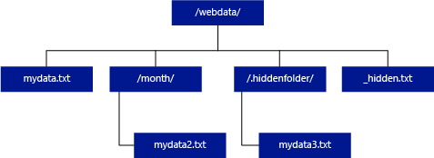
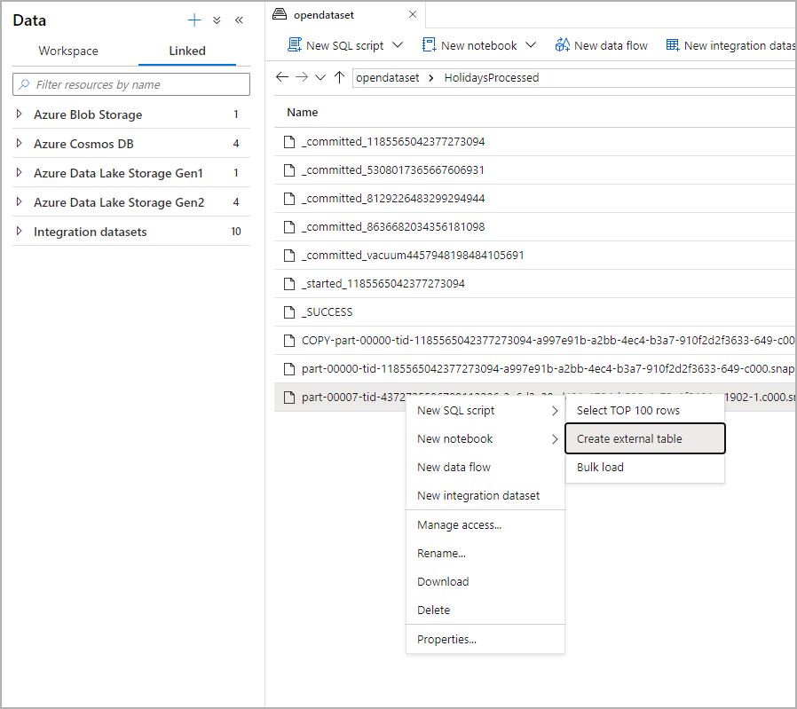
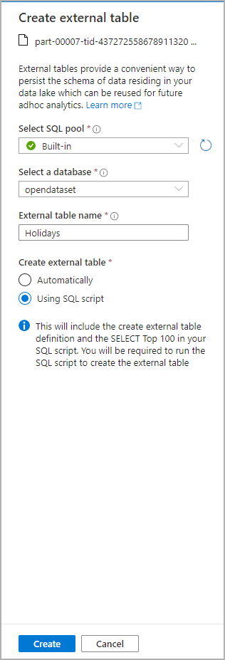
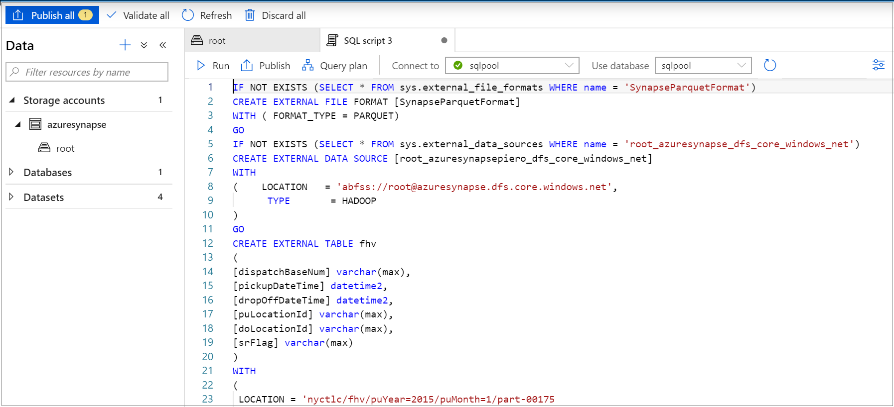
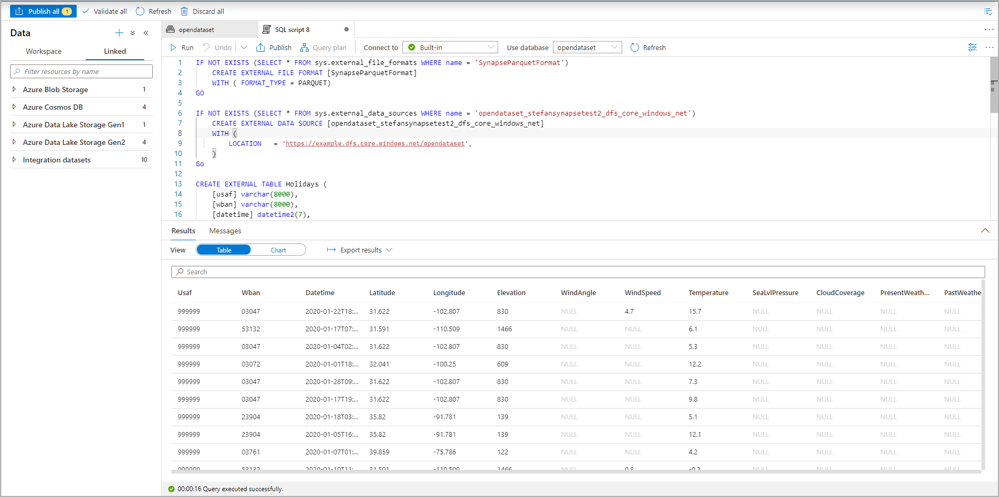
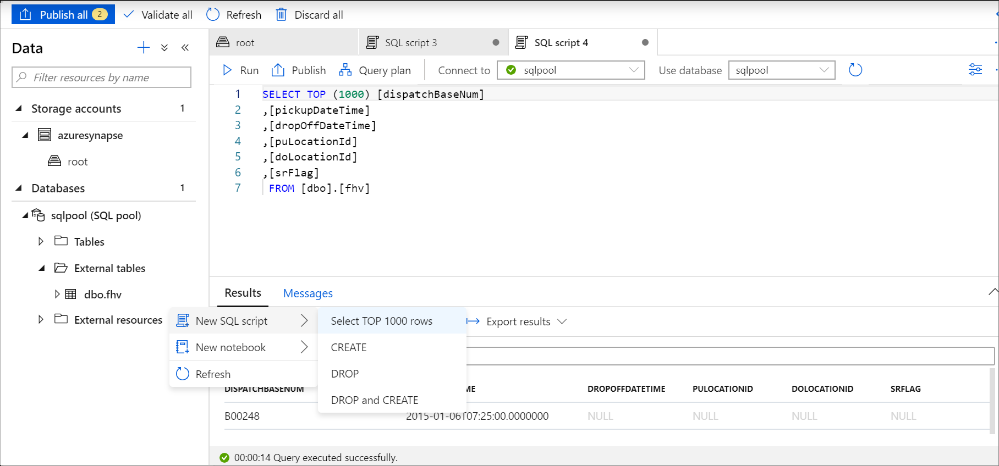

# Use external tables with Synapse SQL

An external table points to data located in Hadoop, Azure Storage blob, or Azure Data Lake Storage. External tables are used to read data from files or write data to files in Azure Storage. With Synapse SQL, you can use external tables to read and write data to dedicated SQL pool or serverless SQL pool.

## External tables in dedicated SQL pool and serverless SQL pool

### [Dedicated SQL pool](#tab/sql-pool) 

In dedicated SQL pool, you can use an external table to:

- Query Azure Blob Storage and Azure Data Lake Gen2 with Transact-SQL statements.
- Import and store data from Azure Blob Storage and Azure Data Lake Storage into dedicated SQL pool.

When used in conjunction with the [CREATE TABLE AS SELECT](../sql-data-warehouse/sql-data-warehouse-develop-ctas.md?toc=/azure/synapse-analytics/toc.json&bc=/azure/synapse-analytics/breadcrumb/toc.json) statement, selecting from an external table imports data into a table within the SQL pool. In addition to the [COPY statement](/sql/t-sql/statements/copy-into-transact-sql?view=azure-sqldw-latest&preserve-view=true), external tables are useful for loading data. 

For a loading tutorial, see [Use PolyBase to load data from Azure Blob Storage](../sql-data-warehouse/load-data-from-azure-blob-storage-using-copy.md?bc=%2fazure%2fsynapse-analytics%2fbreadcrumb%2ftoc.json&toc=%2fazure%2fsynapse-analytics%2ftoc.json).

### [Serverless SQL pool](#tab/sql-on-demand)

For serverless SQL pool, you'll use an external table to:

- Query data in Azure Blob Storage or Azure Data Lake Storage with Transact-SQL statements
- Store serverless SQL pool query results to files in Azure Blob Storage or Azure Data Lake Storage using [CETAS](develop-tables-cetas.md)

You can create external tables using serverless SQL pool via the following steps:

1. CREATE EXTERNAL DATA SOURCE
2. CREATE EXTERNAL FILE FORMAT
3. CREATE EXTERNAL TABLE

---

### Security

User must have `SELECT` permission on external table to read the data.
External table access underlying Azure storage using the database scoped credential defined in data source using the following rules:
- Data source without credential enables external tables to access publicly available files on Azure storage.
- Data source can have credential that enables external tables to access only the files on Azure storage using SAS token or workspace Managed Identity - For examples, see [the Develop storage files storage access control](develop-storage-files-storage-access-control.md#examples) article.

> [!IMPORTANT]
> In dedicated SQL pool, a data source created without a credential enables Azure AD users to access storage files using their Azure AD identity. In serverless SQL pool, you need to create a data source with a database-scoped credential that has `IDENTITY='User Identity'` property - see [examples here](develop-storage-files-storage-access-control.md#examples).

## CREATE EXTERNAL DATA SOURCE

External data sources are used to connect to storage accounts. The complete documentation is outlined [here](/sql/t-sql/statements/create-external-data-source-transact-sql?view=azure-sqldw-latest&preserve-view=true).

### Syntax for CREATE EXTERNAL DATA SOURCE

#### [Dedicated SQL pool](#tab/sql-pool)

```syntaxsql
CREATE EXTERNAL DATA SOURCE <data_source_name>
WITH
(    LOCATION         = '<prefix>://<path>'
     [, CREDENTIAL = <database scoped credential> ]
     , TYPE = HADOOP
)
[;]
```

#### [Serverless SQL pool](#tab/sql-on-demand)

```syntaxsql
CREATE EXTERNAL DATA SOURCE <data_source_name>
WITH
(    LOCATION         = '<prefix>://<path>'
     [, CREDENTIAL = <database scoped credential> ]
)
[;]
```

---

### Arguments for CREATE EXTERNAL DATA SOURCE

data_source_name

Specifies the user-defined name for the data source. The name must be unique within the database.

#### Location
LOCATION = `'<prefix>://<path>'`   - Provides the connectivity protocol and path to the external data source. The following patterns can be used in location:

| External Data Source        | Location prefix | Location path                                         |
| --------------------------- | --------------- | ----------------------------------------------------- |
| Azure Blob Storage          | `wasb[s]`       | `<container>@<storage_account>.blob.core.windows.net` |
| Azure Blob Storage          | `http[s]`       | `<storage_account>.blob.core.windows.net/<container>/subfolders` |
| Azure Data Lake Store Gen 1 | `http[s]`       | `<storage_account>.azuredatalakestore.net/webhdfs/v1` |
| Azure Data Lake Store Gen 2 | `http[s]`       | `<storage_account>.dfs.core.windows.net/<container>/subfolders`  |

`https:` prefix enables you to use subfolder in the path.

#### Credential
CREDENTIAL = `<database scoped credential>` is optional credential that will be used to authenticate on Azure storage. External data source without credential can access public storage account. 

External data sources without a credential in dedicated SQL pool will use caller's Azure AD identity to access files on storage. An external data source for serverless SQL pool with credential  `IDENTITY='User Identity'` will use caller's Azure AD identity to access files.
- In dedicated SQL pool, database scoped credential can specify custom application identity, workspace Managed Identity, or SAK key. 
- In serverless SQL pool, database scoped credential can specify caller's Azure AD identity, workspace Managed Identity, or SAS key. 

#### TYPE
TYPE = `HADOOP` is the mandatory option in dedicated SQL pool and specifies that Polybase technology is used to access underlying files. This parameter can't be used in serverless SQL pool that uses built-in native reader.

### Example for CREATE EXTERNAL DATA SOURCE

#### [Dedicated SQL pool](#tab/sql-pool)

The following example creates an external data source for Azure Data Lake Gen2 pointing to the New York data set:

```sql
CREATE EXTERNAL DATA SOURCE AzureDataLakeStore
WITH
  -- Please note the abfss endpoint when your account has secure transfer enabled
  ( LOCATION = 'abfss://data@newyorktaxidataset.dfs.core.windows.net' ,
    CREDENTIAL = ADLS_credential ,
    TYPE = HADOOP
  ) ;
```

#### [Serverless SQL pool](#tab/sql-on-demand)

The following example creates an external data source for Azure Data Lake Gen2 that can be accessed using SAS credential:

```sql
CREATE DATABASE SCOPED CREDENTIAL [sqlondemand]
WITH IDENTITY='SHARED ACCESS SIGNATURE',  
SECRET = 'sv=2018-03-28&ss=bf&srt=sco&sp=rl&st=2019-10-14T12%3A10%3A25Z&se=2061-12-31T12%3A10%3A00Z&sig=KlSU2ullCscyTS0An0nozEpo4tO5JAgGBvw%2FJX2lguw%3D'
GO

CREATE EXTERNAL DATA SOURCE SqlOnDemandDemo WITH (
    LOCATION = 'https://sqlondemandstorage.blob.core.windows.net',
    CREDENTIAL = sqlondemand
);
```

The following example creates an external data source for Azure Data Lake Gen2 pointing to the publicly available New York data set:

```sql
CREATE EXTERNAL DATA SOURCE YellowTaxi
WITH ( LOCATION = 'https://azureopendatastorage.blob.core.windows.net/nyctlc/yellow/')
```
---

## CREATE EXTERNAL FILE FORMAT

Creates an external file format object that defines external data stored in Azure Blob Storage or Azure Data Lake Storage. Creating an external file format is a prerequisite for creating an external table. The complete documentation is [here](/sql/t-sql/statements/create-external-file-format-transact-sql?view=azure-sqldw-latest&preserve-view=true).

By creating an external file format, you specify the actual layout of the data referenced by an external table.

### Syntax for CREATE EXTERNAL FILE FORMAT

#### [SQL pool](#tab/sql-pool)

```syntaxsql
-- Create an external file format for PARQUET files.  
CREATE EXTERNAL FILE FORMAT file_format_name  
WITH (  
    FORMAT_TYPE = PARQUET  
    [ , DATA_COMPRESSION = {  
        'org.apache.hadoop.io.compress.SnappyCodec'  
      | 'org.apache.hadoop.io.compress.GzipCodec'      }  
    ]);  

--Create an external file format for DELIMITED TEXT files
CREATE EXTERNAL FILE FORMAT file_format_name  
WITH (  
    FORMAT_TYPE = DELIMITEDTEXT  
    [ , DATA_COMPRESSION = 'org.apache.hadoop.io.compress.GzipCodec' ]
    [ , FORMAT_OPTIONS ( <format_options> [ ,...n  ] ) ]  
    );  

<format_options> ::=  
{  
    FIELD_TERMINATOR = field_terminator  
    | STRING_DELIMITER = string_delimiter
    | First_Row = integer
    | USE_TYPE_DEFAULT = { TRUE | FALSE }
    | Encoding = {'UTF8' | 'UTF16'}
}
```

#### [Serverless SQL pool](#tab/sql-on-demand)

```syntaxsql
-- Create an external file format for PARQUET files.  
CREATE EXTERNAL FILE FORMAT file_format_name  
WITH (  
    FORMAT_TYPE = PARQUET  
    [ , DATA_COMPRESSION = {  
        'org.apache.hadoop.io.compress.SnappyCodec'  
      | 'org.apache.hadoop.io.compress.GzipCodec'      }  
    ]);  

--Create an external file format for DELIMITED TEXT files
CREATE EXTERNAL FILE FORMAT file_format_name  
WITH (  
    FORMAT_TYPE = DELIMITEDTEXT  
    [ , DATA_COMPRESSION = 'org.apache.hadoop.io.compress.GzipCodec' ]
    [ , FORMAT_OPTIONS ( <format_options> [ ,...n  ] ) ]  
    );  

<format_options> ::=  
{  
    FIELD_TERMINATOR = field_terminator  
    | STRING_DELIMITER = string_delimiter
    | First_Row = integer
    | USE_TYPE_DEFAULT = { TRUE | FALSE }
    | Encoding = {'UTF8' | 'UTF16'}
    | PARSER_VERSION = {'parser_version'}
}
```

---


### Arguments for CREATE EXTERNAL FILE FORMAT

file_format_name- Specifies a name for the external file format.

FORMAT_TYPE = [ PARQUET | DELIMITEDTEXT]- Specifies the format of the external data.

- PARQUET - Specifies a Parquet format.
- DELIMITEDTEXT - Specifies a text format with column delimiters, also called field terminators.

FIELD_TERMINATOR = *field_terminator* -
Applies only to delimited text files. The field terminator specifies one or more characters that mark the end of each field (column) in the text-delimited file. The default is the pipe character (ꞌ|ꞌ).

Examples:

- FIELD_TERMINATOR = '|'
- FIELD_TERMINATOR = ' '
- FIELD_TERMINATOR = ꞌ\tꞌ

STRING_DELIMITER = *string_delimiter* -
Specifies the field terminator for data of type string in the text-delimited file. The string delimiter is one or more characters in length and is enclosed with single quotes. The default is the empty string ("").

Examples:

- STRING_DELIMITER = '"'
- STRING_DELIMITER = '*'
- STRING_DELIMITER = ꞌ,ꞌ

FIRST_ROW = *First_row_int* -
Specifies the row number that is read first and applies to all files. Setting the value to two causes the first row in every file (header row) to be skipped when the data is loaded. Rows are skipped based on the existence of row terminators (/r/n, /r, /n).

USE_TYPE_DEFAULT = { TRUE | **FALSE** } -
Specifies how to handle missing values in delimited text files when retrieving data from the text file.

TRUE -
If you're retrieving data from the text file, store each missing value by using the default value's data type for the corresponding column in the external table definition. For example, replace a missing value with:

- 0 if the column is defined as a numeric column. Decimal columns aren't supported and will cause an error.
- Empty string ("") if the column is a string column.
- 1900-01-01 if the column is a date column.

FALSE -
Store all missing values as NULL. Any NULL values that are stored by using the word NULL in the delimited text file are imported as the string 'NULL'.

Encoding = {'UTF8' | 'UTF16'} -
Serverless SQL pool can read UTF8 and UTF16 encoded delimited text files.

DATA_COMPRESSION = *data_compression_method* -
This argument specifies the data compression method for the external data. 

The PARQUET file format type supports the following compression methods:

- DATA_COMPRESSION = 'org.apache.hadoop.io.compress.GzipCodec'
- DATA_COMPRESSION = 'org.apache.hadoop.io.compress.SnappyCodec'

When reading from PARQUET external tables, this argument is ignored, but is used when writing to external tables using [CETAS](develop-tables-cetas.md).

The DELIMITEDTEXT file format type supports the following compression method:

- DATA_COMPRESSION = 'org.apache.hadoop.io.compress.GzipCodec'

PARSER_VERSION = 'parser_version'
Specifies parser version to be used when reading files. Check PARSER_VERSION argument in [OPENROWSET arguments](develop-openrowset.md#arguments) for details.

### Example for CREATE EXTERNAL FILE FORMAT

The following example creates an external file format for census files:

```sql
CREATE EXTERNAL FILE FORMAT census_file_format
WITH
(  
    FORMAT_TYPE = PARQUET,
    DATA_COMPRESSION = 'org.apache.hadoop.io.compress.SnappyCodec'
)
```

## CREATE EXTERNAL TABLE

The CREATE EXTERNAL TABLE command creates an external table for Synapse SQL to access data stored in Azure Blob Storage or Azure Data Lake Storage. 

### Syntax for CREATE EXTERNAL TABLE

```sql
CREATE EXTERNAL TABLE { database_name.schema_name.table_name | schema_name.table_name | table_name }
    ( <column_definition> [ ,...n ] )  
    WITH (
        LOCATION = 'folder_or_filepath',  
        DATA_SOURCE = external_data_source_name,  
        FILE_FORMAT = external_file_format_name
    )  
[;]  

<column_definition> ::=
column_name <data_type>
    [ COLLATE collation_name ]
```

### Arguments CREATE EXTERNAL TABLE

*{ database_name.schema_name.table_name | schema_name.table_name | table_name }*

The one to three-part name of the table to create. For an external table, serverless SQL pool stores only the table metadata. No actual data is moved or stored in serverless SQL pool.

<column_definition>, ...*n* ]

CREATE EXTERNAL TABLE supports the ability to configure column name, data type, and collation. You can't use the DEFAULT CONSTRAINT on external tables.

>[!IMPORTANT]
>The column definitions, including the data types and number of columns, must match the data in the external files. If there's a mismatch, the file rows will be rejected when querying the actual data.

When reading from Parquet files, you can specify only the columns you want to read and skip the rest.

LOCATION = '*folder_or_filepath*'

Specifies the folder or the file path and file name for the actual data in Azure Blob Storage. The location starts from the root folder. The root folder is the data location specified in the external data source.

If you specify a folder LOCATION, a serverless SQL pool query will select from the external table and retrieve files from the folder.

> [!NOTE]
> Unlike Hadoop and PolyBase, serverless SQL pool doesn't return subfolders unless you specify /** at the end of path. Just like Hadoop and PolyBase, it doesn't return files for which the file name begins with an underline (_) or a period (.).

In this example, if LOCATION='/webdata/', a serverless SQL pool query, will return rows from mydata.txt. It won't return mydata2.txt and mydata3.txt because they're located in a subfolder.



DATA_SOURCE = *external_data_source_name* - Specifies the name of the external data source that contains the location of the external data. To create an external data source, use [CREATE EXTERNAL DATA SOURCE](#create-external-data-source).

FILE_FORMAT = *external_file_format_name* - Specifies the name of the external file format object that stores the file type and compression method for the external data. To create an external file format, use [CREATE EXTERNAL FILE FORMAT](#create-external-file-format).

### Permissions CREATE EXTERNAL TABLE

To select from an external table, you need proper credentials with list and read permissions.

### Example CREATE EXTERNAL TABLE

The following example creates an external table. It returns the first row:

```sql
CREATE EXTERNAL TABLE census_external_table
(
    decennialTime varchar(20),
    stateName varchar(100),
    countyName varchar(100),
    population int,
    race varchar(50),
    sex    varchar(10),
    minAge int,
    maxAge int
)  
WITH (
    LOCATION = '/parquet/',
    DATA_SOURCE = population_ds,  
    FILE_FORMAT = census_file_format
)
GO

SELECT TOP 1 * FROM census_external_table
```

## Create and query external tables from a file in Azure Data Lake

Using Data Lake exploration capabilities you can now create and query an external table using dedicated SQL pool or serverless SQL pool with a simple right-click on the file. The one-click gesture to create external tables from the ADLS Gen2 storage account is only supported for Parquet files. 

### Prerequisites

- You must have access to the workspace with at least the Storage Blob Data Contributor ARM Access role to the ADLS Gen2 Account

- You must have at least [permissions to create](/sql/t-sql/statements/create-external-table-transact-sql?view=azure-sqldw-latest#permissions-2&preserve-view=true) and query external tables on the SQL pool or SQL OD

From the Data panel, select the file that you would like to create the external table from:
> [!div class="mx-imgBorder"]
>

A dialog window will open. Select dedicated SQL pool or serverless SQL pool, give a name to the table and select open script:

> [!div class="mx-imgBorder"]
>

The SQL Script is autogenerated inferring the schema from the file:
> [!div class="mx-imgBorder"]
>

Run the script. The script will automatically run a Select Top 100 *.:
> [!div class="mx-imgBorder"]
>

The external table is now created, for future exploration of the content of this external table the user can query it directly from the Data pane:
> [!div class="mx-imgBorder"]
>

## Next steps

Check the [CETAS](develop-tables-cetas.md) article for how to save the query results to an external table in Azure Storage. Or you can start querying [Apache Spark for Azure Synapse external tables](develop-storage-files-spark-tables.md).
